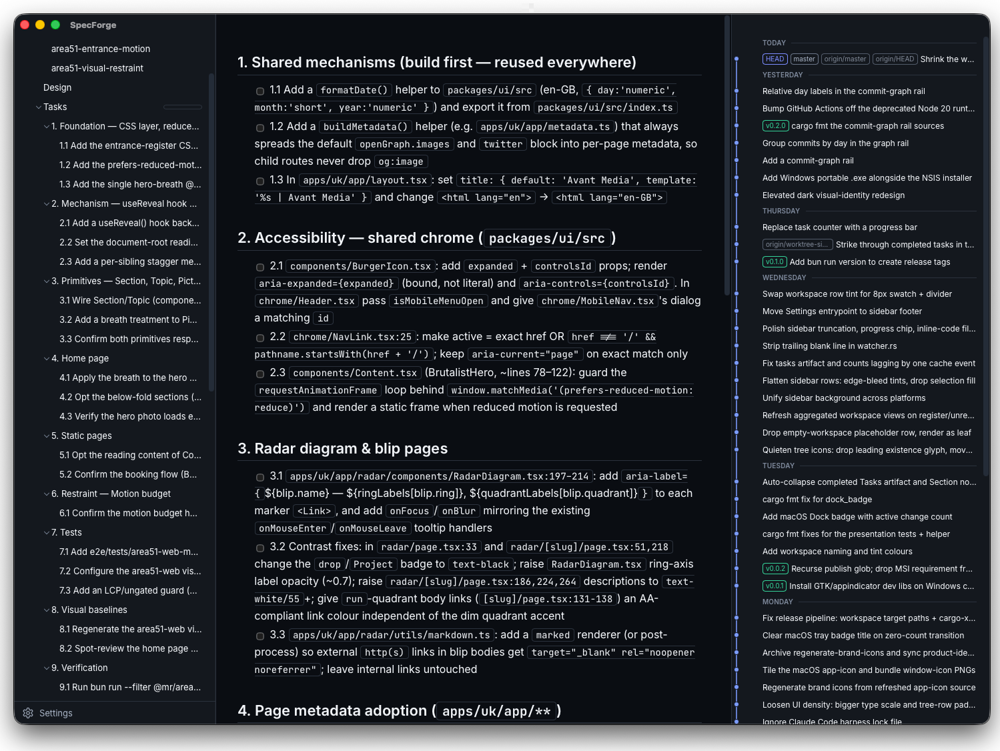

<div align="center">


# SpecForge

**A menu-bar viewer for OpenSpec changes across all your workspaces.**

[](https://github.com/avantmedialtd/specforge/actions/workflows/ci.yml)
[](https://github.com/avantmedialtd/specforge/releases/latest)
[](LICENSE)
[](https://tauri.app)

</div>

---

SpecForge is a small desktop app that lives in your menu bar (macOS), system tray (Windows), or status area (Linux) and keeps an eye on your [OpenSpec](#the-openspec-format-it-reads) workspaces. A badge shows how many changes are in flight across all your projects at a glance; click it to open a full window and browse every proposal, design, spec, and task — without leaving your editor.

> SpecForge is in early, active development (`v0.x`) — expect rough edges. Grab the newest build from the [latest release](https://github.com/avantmedialtd/specforge/releases/latest).

<div align="center">



</div>

## Why

Peeking at OpenSpec state across multiple workspaces today means opening your editor and navigating away from the version-control view to a separate panel. That context switch is heavy enough that the state goes unchecked between deliberate visits — which defeats the whole point of *ambient* awareness.

A dedicated menu-bar app surfaces the active-change count at a glance and lets you drill into any registered workspace's change tree without bouncing through an IDE. SpecForge is **read-only** in v1: it observes and renders, but never edits specs, toggles checkboxes, or touches git.

## SpecForge vs. OpenSpec

Two names that are easy to conflate but mean different things:

- **SpecForge** is the **product** — this desktop app.
- **OpenSpec** is the **format** the app reads — an on-disk layout of proposals, designs, tasks, and capability specs that lives under an `openspec/` directory in a project.

SpecForge reads OpenSpec; it doesn't define it. This repository [dogfoods](openspec/) the format on itself.

## Features

- **One badge for every project.** The tray/menu-bar badge counts non-archived *logical* changes across all tracked workspaces. A change being worked on in several git worktrees counts once, not N times. Hidden at zero.
- **Three-pane browser.** A resizable workspace tree (left) → artifact/markdown view (center) → git commit-graph rail (right).
- **Full workspace tree.** Git repositories group their worktrees automatically; a change open in multiple branches expands to one instance per worktree, each with its branch name, a task-progress meter, a relative "modified" time, and `[diverged]` / `[stale]` labels when a branch's copy drifts from the default branch.
- **Rich markdown.** Proposals, designs, specs, and `tasks.md` render with GitHub-Flavored Markdown and syntax-highlighted code blocks. Click a section or task to jump straight to it. Task checkboxes render but are inert — this is a viewer.
- **Live commit graph.** A faithful `git log --all` DAG with lanes, branch/merge topology, ref decorations, and commits grouped into day bands (*Today*, *Yesterday*, weekday names, then absolute dates). Click a commit to see its changed files and diffs.
- **Always live.** Badges, tree, detail pane, and commit graph update automatically as files change on disk — there's no refresh button.
- **Desktop notifications.** Fire only when a change first appears or is archived — never on ordinary file edits. Toggleable.
- **macOS Dock badge** mirroring the tray count, visible in the Dock and ⌘-Tab switcher.
- **Per-workspace personalization.** Inline display-name rename and a curated tint-color swatch per workspace, persisted across restarts — along with your expand/collapse state and window geometry.
- **Native feel.** Automatic light/dark theme following the OS, an indigo accent system, vendored Inter + JetBrains Mono fonts (no network), and a hidden-inset macOS title bar.

## Download & install

Grab a prebuilt bundle for your platform from the [**latest release**](https://github.com/avantmedialtd/specforge/releases/latest):

| Platform | Download |
|---|---|
| **macOS** (11.0+, Apple Silicon & Intel) | Universal `.dmg` |
| **Windows** (x64) | NSIS installer `.exe`, or a single-file portable `.exe` |
| **Linux** (x64) | `.deb` or `.AppImage` |

A few caveats, because releases are **unsigned**:

- **macOS** — Gatekeeper will warn on first launch. Right-click the app → **Open**, then confirm.
- **Windows** — SmartScreen may warn; choose **More info → Run anyway**. The **portable** `.exe` relies on the system **WebView2 runtime** (preinstalled on current Windows; install it manually on older machines). The installer handles this for you.
- **Linux** — install the `.deb` with your package manager, or `chmod +x` the `.AppImage` and run it.

## Getting started

1. Launch SpecForge. It appears in your menu bar / system tray — there's no Dock-only window to hunt for.
2. Click the tray icon to open the main window.
3. Open **Settings** (the gear in the sidebar footer) and choose **+ Add workspace**.
4. Pick any folder that contains an `openspec/` directory. Folders without one are rejected as *"not a valid OpenSpec workspace."*

That's it — the badge starts counting, and the tree fills in. If the workspace is a git repository, SpecForge also discovers its sibling worktrees automatically. Closing the window only hides it; the app keeps running in the tray. Quit from the **Quit SpecForge** tray item or ⌘-Q.

## The OpenSpec format it reads

SpecForge browses the OpenSpec on-disk layout. For each workspace, in-flight work lives under `openspec/changes/<change-id>/`, archived work moves to `openspec/changes/archive/`, and reusable capability specs live at `openspec/specs/<capability>/spec.md`.

Each active change directory may hold up to **four artifacts**, which is exactly what the tree exposes per change:

```
openspec/
├── changes/
│   ├── <change-id>/
│   │   ├── proposal.md          # what & why
│   │   ├── design.md            # how
│   │   ├── tasks.md             # checklist (## sections + - [ ] / - [x] tasks)
│   │   └── specs/
│   │       └── <capability>/
│   │           └── spec.md      # capability delta
│   └── archive/
│       └── <change-id>/ ...     # completed work
└── specs/
    └── <capability>/
        └── spec.md              # the current, merged capability spec
```

This repository is itself a live example — see [`openspec/`](openspec/).

## Architecture

A two-layer split keeps all the logic testable without a GUI:

```
┌─────────────────────────────────────────────────────────┐
│  React + TypeScript frontend (src/)                      │  pure consumer:
│  three-pane UI · markdown · commit graph · settings      │  invoke() + listen()
└───────────────────────────┬─────────────────────────────┘
                            │  Tauri commands / events (camelCase IPC)
┌───────────────────────────┴─────────────────────────────┐
│  specforge — Tauri 2 shell (crates/specforge/)           │  tray · dock badge ·
│  commands · events · tray · notifications · settings     │  notifications · window
└───────────────────────────┬─────────────────────────────┘
                            │
┌───────────────────────────┴─────────────────────────────┐
│  openspec-core — headless Rust core (crates/openspec-…)  │  no Tauri dependency,
│  registry · parser · cache · watcher · git · graph · …   │  fully unit-testable
└──────────────────────────────────────────────────────────┘
```

- **`openspec-core`** owns all state and filesystem logic — the workspace registry (with git-worktree auto-discovery), the OpenSpec parser, an in-memory cache, a debounced filesystem watcher, git/commit-graph reading, and the aggregation that turns raw changes into the repo-grouped, logical-change view the UI renders. It has no Tauri dependency and is exercised entirely from `cargo test`.
- **`specforge`** is the thin Tauri shell: the system tray and badge, desktop notifications, settings, autostart, the window lifecycle, and the `#[tauri::command]` handlers and events that bridge the core to the frontend.
- The **React frontend** holds no domain state of its own — every byte of data arrives over Tauri commands and events.

Types crossing the IPC boundary use `#[serde(rename_all = "camelCase")]` on the Rust side and are mirrored by hand in `src/types.ts` — there's no codegen, so the two sides are kept in sync deliberately.

## Project layout

```
.
├── crates/
│   ├── openspec-core/        # headless core: registry, parser, cache, watcher,
│   │   ├── src/              #   git, graph, repo_view, presentation, types
│   │   └── tests/            # integration suites + a shared fixture workspace
│   └── specforge/            # Tauri 2 shell
│       ├── src/             #   lib, commands, events, tray, notifications, settings
│       ├── icons/           #   app icon (app-icon.png) + tray glyph SVGs
│       ├── capabilities/    #   Tauri capability grants
│       └── tauri.conf.json
├── src/                      # React + TypeScript frontend
│   ├── components/           #   SplitPane, WorkspaceTree, DetailPane, GraphRail, …
│   ├── hooks/                #   useWorkspaces, useCommitGraph
│   ├── api.ts                #   wrapped Tauri commands + events
│   └── types.ts              #   hand-maintained mirrors of the Rust IPC types
├── openspec/                 # this project's own OpenSpec workspace (dogfooded)
├── scripts/                  # bump-version.ts
└── .github/workflows/        # ci.yml + release.yml
```

## Building from source

### Prerequisites

- **[Bun](https://bun.sh)** — the package manager and task runner (CI uses the latest release; no version is pinned).
- **Rust** (stable toolchain) with `rustfmt` and `clippy`.
- **Tauri 2** tooling is pulled in via `bun install` (`@tauri-apps/cli`); no global install needed.
- **Linux only** — the usual Tauri system libraries:

  ```bash
  sudo apt install libwebkit2gtk-4.1-dev libgtk-3-dev libsoup-3.0-dev \
                   libayatana-appindicator3-dev librsvg2-dev
  ```

Then install JavaScript dependencies:

```bash
bun install
```

### Run it

```bash
bun tauri dev
```

The frontend-only `bun run dev` (plain Vite) also works for CSS/markup tweaks, but Tauri commands won't function without the Rust shell — use `bun tauri dev` for anything real.

## Development

| Action | Command |
|---|---|
| Run the desktop app in dev mode | `bun tauri dev` |
| Run dev with WebView devtools auto-opened | `bun run tauri:devtools` (or set `SPECFORGE_OPEN_DEVTOOLS=1`) |
| Type-check + build the frontend bundle | `bun run build` |
| Build the production app bundle | `bun tauri build` |
| Fast Rust smoke build (no bundle) | `bun tauri build --debug --no-bundle` |
| Run all Rust tests | `cargo test` |
| Run one integration suite | `cargo test -p openspec-core --test parser` (also: `cache`, `registry`, `watcher`, `self_write`, …) |
| Run a single test by name | `cargo test -p openspec-core <name_substring>` |
| Format check | `cargo fmt --all -- --check` |
| Lint (warnings as errors) | `cargo clippy --workspace --all-targets -- -D warnings` |

A few things worth knowing:

- TypeScript is **strict** with `noUnusedLocals` / `noUnusedParameters`. `bun run build` runs `tsc --noEmit` first, so type errors block the bundle.
- Some Rust tests shell out to the real `git` binary (`git init`, `git worktree add`, …), so **git must be on `PATH`**.
- Any Rust job that compiles the `specforge` crate needs the frontend built first — Tauri 2's `generate_context!` validates `frontendDist` at compile time. CI runs `bun run build` before `cargo`.

### Continuous integration

`.github/workflows/ci.yml` runs on every push and pull request, with four parallel jobs on `ubuntu-latest`:

| Job | What it does |
|---|---|
| **lint** | `cargo fmt --all -- --check` + `cargo clippy --workspace --all-targets -- -D warnings` |
| **test** | `cargo test --workspace` |
| **frontend** | `bun install --frozen-lockfile` + `bun run build` (typecheck + bundle) |
| **smoke** | `bun tauri build --debug --no-bundle` |

## Releases

Releases are tag-driven: pushing a `v*` tag runs `.github/workflows/release.yml`, which builds the macOS, Windows, and Linux bundles and publishes them to [Releases](https://github.com/avantmedialtd/specforge/releases). To cut one:

```bash
bun run version <patch|minor|major|x.y.z>   # create an annotated v<x.y.z> tag
git push origin v<x.y.z>                     # CI builds and publishes the release
```

## Contributing

The codebase has a couple of load-bearing conventions, captured in [`CLAUDE.md`](CLAUDE.md):

- **Keep the layers separate.** Watchers, registries, and parsers belong in `openspec-core` (so they stay testable from `cargo test`), not in the Tauri crate.
- **Keep IPC types in sync by hand.** Rust types crossing the boundary use `#[serde(rename_all = "camelCase")]`; their mirrors live in `src/types.ts`. There's no codegen — update both sides together.
- **Mind the two names.** Use *SpecForge* for product-facing copy and *OpenSpec* for the format and on-disk paths. The `product-identity` spec is the source of truth.
- **Run `cargo fmt` and `clippy -D warnings` before pushing** — CI fails on either.

## License

[MIT](LICENSE) © 2026 Avant Media LTD
