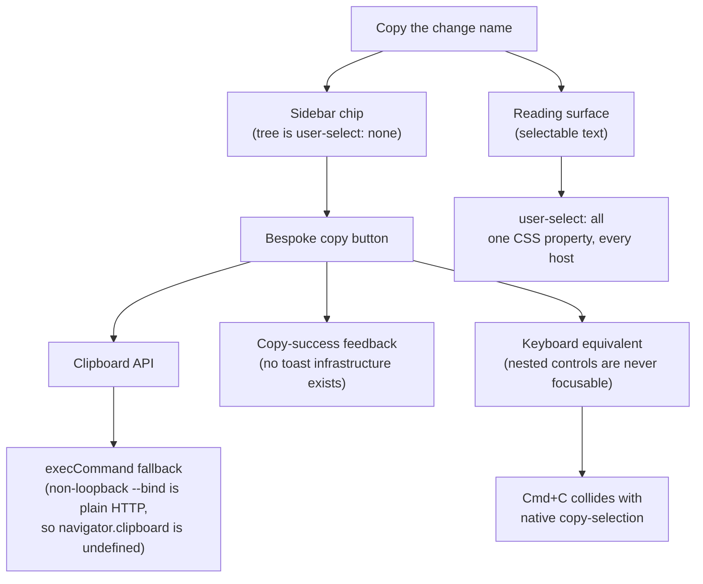

# Change Identity Headers in the Reading Surfaces

## Why

A change's **directory name** — `consolidate-e2e-session-and-token-acquisition` — is the token you hand to a coding agent. It is the argument to `/opsx:apply`, the folder an agent has to open, the thing you type when you want work done on a change. It is the change's address.

It is currently displayed **nowhere you can copy it from**.

The sidebar shows the *proposal title*, not the folder name. The folder name survives only in the row's hover `title` attribute (`src/components/WorkspaceTree.tsx:1415`), and a tooltip cannot be selected. Even if it could, the tree is deliberately unselectable:

```css
/* src/App.css:553 */
.tree-row {
    user-select: none;
}
```

That is correct for a navigation tree — selection would fight row selection on every drag — but it means the sidebar is structurally the wrong place to *read a value out of* the application.

The center pane ought to be the right place, and it is worse. `DetailPane` renders `<MarkdownView>` bare (`src/components/DetailPane.tsx:263-270`), making it the **only** center-pane view with no header of any kind:

| View | Header |
|---|---|
| `CommitDetailView` | `.commit-detail-breadcrumb` + `.commit-detail-header` |
| `ArchiveView` (reading) | `.archive-header` + `.archive-reading-title` |
| `DashboardView` | `.dashboard-header` |
| `FileBrowserView` | `.file-browser-header` |
| `SettingsView` | `.settings-header` |
| **`DetailPane`** | **— none —** |

So while reading `proposal.md`, the only thing on screen naming the change is the markdown's own `# H1` — which is the *proposal title*, not the folder name. Nothing identifies which change, which worktree, or which file you are looking at. This is an orientation gap independent of copying: a user who scrolls a long design document has no on-screen answer to "which change is this?"

The same gap repeats one level down. `FileBrowserView` holds the selected file's root-relative path in `selectedPath` — a string that *contains* the change name — and renders the preview without ever showing it (`src/components/FileBrowserView.tsx:325`). And `ArchiveView`'s reading header names the change by title with an id fallback (`src/components/ArchiveView.tsx:186`), so the archive directory name is likewise unavailable.

Meanwhile the space argument is decisive. Line 2 of a sidebar change row has roughly 45 characters at the default 340px sidebar and ~21 at the 180px minimum, and the branch chip plus status cluster already consume a third of it; a 44-character slug cannot fit there at any usable width. The center pane is `minRightWidth = 320` and typically 600–900px. The identity fits at full length, unellipsized, with room to spare.

## What Changes

- **The detail pane gains a change-identity header.** Above the rendered artifact, aligned to the same prose column, the pane names the change it is showing: the change directory name, followed by the owning worktree's branch as an outlined chip. A flat (non-git) workspace has no branch and renders no chip.

- **The archive reading header gains the archive directory name.** It keeps its existing title line and adds the on-disk directory name — the dated `YYYY-MM-DD-<id>` folder — with the `archive/` path prefix stripped, so what is displayed is exactly what exists on disk.

- **The file-browser preview gains the selected file's path.** The root-relative path already held in `selectedPath` is displayed above the preview. It is strictly more informative than a change name would be here, and it contains the change name whenever the file lives under `openspec/changes/`.

- **Every identity string is selectable atomically.** Each carries `user-select: all`, so a single click selects the whole token and the platform's own copy gesture takes it. No clipboard API is involved.

That last point is the load-bearing simplification. The obvious alternative — a copy button in the sidebar — pulls in a chain of obligations that `user-select: all` removes entirely:



## Capabilities

### Modified Capabilities

- `spec-browser`: A new *Change Identity Header in the Detail Pane* requirement — while the pane's target is an artifact, it SHALL name the change that artifact belongs to, by directory name, selectable and copyable by the platform's own copy gesture, with the owning worktree's branch as a chip. This closes the gap left by the *Two-Line Sole-Change-Row Layout* requirement, whose line 1 deliberately shows the proposal title and keeps the directory name only in a hover tooltip that no user can copy from. That requirement is itself untouched, as is *Section and Task Scroll Anchors*, whose anchoring behaviour the new requirement constrains rather than redefines.
- `archive-browser`: The *Read-Only Artifact Navigation* requirement gains the archived change's on-disk directory name in the reading header, alongside the title it already shows, with the same selection treatment.
- `workspace-file-browser`: The *File Browser Surface* requirement gains the selected file's root-relative path above the preview column, with the same selection treatment.

## Impact

**Frontend only.** Affected files:

- `src/components/DetailPane.tsx` — wrap the rendered `MarkdownView` in a container carrying the new header; the branch is derived from the workspace views by worktree path, not added to `ArtifactRenderTarget`.
- `src/App.tsx` — pass the workspace views (already in hand) to `DetailPane` so it can resolve the branch for its target.
- `src/components/ArchiveView.tsx` — add the directory name to the existing `.archive-header`.
- `src/components/FileBrowserView.tsx` — add the selected path above the preview column.
- `src/App.css` — the new header rules, the `user-select: all` treatment, and the sticky-offset variable the scroll anchor reads.

**Deliberately unchanged:**

- **No Rust changes.** No crate is touched: `openspec-core`, `openspec-app`, `specforge`, `specforge-tui`, and `specforge-web` are all untouched, and `specforge-web` serves the same bundle from the same routes. The mutation gate therefore short-circuits; the new logic is covered by frontend tests instead.
- **No IPC, command, or event changes.** Nothing is added to `src/api.ts`, `crates/specforge/src/commands.rs`, the `generate_handler!` list, or `crates/specforge-web/src/dispatch.rs`. No `src/types.ts` mirror changes shape — in particular `ArtifactRenderTarget` is **not** extended with a branch field, because targets also arrive from URL address resolution and not only from tree clicks, so a field populated at one origin would be absent at the other.
- **No clipboard permission, plugin, or dependency.** `tauri-plugin-clipboard-manager` is not added; no `navigator.clipboard` call is introduced; nothing changes in `package.json` or `Cargo.toml`. The copy path is the platform's own, so it behaves identically in the Tauri WebView, on `localhost`, and over a non-loopback `--bind` where `navigator.clipboard` is unavailable.
- **No keyboard binding changes.** No chord is claimed, so `Cmd+C` keeps its native copy-selection meaning everywhere, and the tree's roving-focus / single-Tab-stop model is untouched.
- **The sidebar is not changed at all.** No row layout, chip, truncation rule, or `user-select` value in the tree pane is altered. The *Two-Line Sole-Change-Row Layout* requirement is not modified.
- **The terminal frontend is out of scope.** `specforge-tui` renders its own surfaces and is governed by `terminal-ui`; copying from a terminal is an OSC 52 / host-selection concern with no shared implementation, and is left for a follow-up.
- **Not in scope:** a full breadcrumb (workspace › change › artifact) in the detail pane. The header names the change and its worktree; naming the workspace and the artifact file as well is a larger navigational design and is left for a follow-up change.
