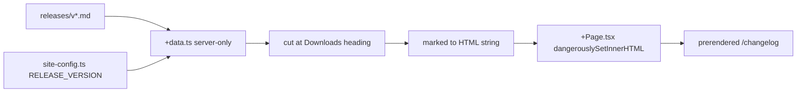

## Context

The site is a fully prerendered Vike + React static build with five runtime dependencies and no markdown pipeline of any kind — every page today is hand-authored TSX. It is deliberately isolated: its own `package.json` and `bun.lock`, outside every workspace glob, resolving its own React and Vite.

The content this page needs already exists. Thirty release notes plus one prerelease sit in `releases/`, authored by `/release` and consumed verbatim as GitHub Release bodies. They are far more regular than release prose usually is, but they were written for GitHub, and that shows in two ways the site has to handle: they carry a Downloads footer that duplicates the site's own download block, and they carry no `#` heading anywhere, so the version line is a bare paragraph.

An investigation of all 31 files established the corpus's actual shape:

| Property | Whole file | Above the Downloads cut |
|---|---|---|
| Words | 17,305 | 12,605 |
| Code fences | 8 (4 files) | 0 |
| Bare URLs | 31 | 0 |
| Markdown links | 0 | 0 |
| Raw HTML | 0 | 0 |
| Tables, images, blockquotes, task lists | 0 | 0 |
| Distinct section headings | — | 5 |
| Bullets | — | 172 (0 nested) |

Every fence and every URL lives in the footer. The cut is what reduces the rendering problem to headings, bullets, bold and inline code.

## Goals / Non-Goals

**Goals:**

- Render the current release's notes on the site as markdown, without duplicating their content into the site or changing their format.
- Add no runtime dependency and no client-side markdown parsing.
- Ship a page whose tests do not need editing when a release happens.
- Fail the build loudly when an assumption about the notes stops holding, rather than publish a wrong page.

**Non-Goals:**

- Changing `releases/*.md` or the `/release` note template. The files are a shared contract with `release.yml`'s `body_path`.
- A per-release route, an in-app "what's new" surface, or a feed. The site publishes no feed by existing requirement.
- Rendering the full history. That is deliberately excluded, not deferred for effort reasons — see the scope decision below.
- Client-side search over release contents. The site's search index carries titles and descriptions only, and no search UI is wired.

## Decisions

### Render the markdown; do not parse the notes into a structure

The notes are a strict enough template that parsing them into typed sections and entries looked attractive — five known section headings, and bullets that mostly open with a bold lead-in. Measuring killed it. Only 125 of 172 bullets carry a lead-in; only 82 of those 125 end with a period; two span multiple source lines; and hard-wrapping is not universal, with `releases/v0.13.0.md:11` a single 1,411-character line.

More decisively, the failure modes differ in kind. A renderer degrades — an unexpected construct renders plainly. A parser fails hard, and it would couple the site build to the shape of prose written by a command whose job is to write prose. That is the wrong dependency direction for a page nothing's correctness rests on.

**Rejected:** parse to `{version, tagline, sections[]}` and render with bespoke components. Better-looking output, but it makes every future release note a potential build break.

### Convert at build time with `marked`, as a development dependency

The site hydrates the whole tree with no islands, so anything `+Page.tsx` imports executes in every visitor's browser. Converting in a server-only hook keeps the parser out of the client graph entirely. `marked` carries no runtime dependencies of its own and ships its own types.

**Rejected:** `react-markdown` + `remark-gfm`, as the desktop app uses. It is a React component, so it necessarily runs at hydration; it is the one option that cannot be a development dependency; and its remark/micromark closure is very large. The site cannot import the desktop app's copy in any case.

**Rejected:** `@tailwindcss/typography`. The *Site carries its own visual identity* requirement in `marketing-site` says the site imports no external component library or theme.

### Read the notes with `node:fs`, not a raw-query import

Vite's `server.fs.allow` resolves to `site/`, not the repository root — the root has no workspaces key and there is no pnpm or lerna marker anywhere above it — so importing `../releases/*.md` through Vite's module graph would be denied under `vike dev`. That guard applies to Vite's own module graph. A plain `node:fs` read is not subject to it and behaves identically in dev, build and CI, where the workflow checks out the whole repository and only sets the working directory to `site/`.

**Rejected:** widening `server.fs.allow` to the parent directory. It loosens a dev-server guard for the whole site to solve a problem one `readFileSync` avoids.

**Rejected:** a Vite plugin exposing a virtual module. It works and matches `site-kit/build/searchIndex.ts`'s shape, but it is more machinery than a server-only hook needs, and it would still ship the same payload. Worth revisiting only if the page later renders the full history.

### Cut at the Downloads heading, and assert the cut

The cut is exact across all 31 files: every Downloads heading, every fourth-level sub-heading and every Full Changelog link sits after the single thematic-break rule. It removes 27% of the corpus, and with it every construct that would otherwise need handling.

It is nonetheless a textual contract with a file format another tool authors, and nothing enforces it. The build asserts the heading is present in each note it renders and fails naming the file if not — otherwise a reworded footer silently publishes install instructions and stale filenames as changelog copy.

**Rejected:** moving the Downloads footer out of the authored notes and injecting it from a template in `release.yml`. This is the better end state — the footer is identical every release but for the version, it is duplicated 31 times, and in several releases it is longer than the changelog itself. It would make this page need no cut at all. It is rejected *here* because it changes the release pipeline, which is the one path least worth destabilising for a marketing page. Worth proposing separately.

### Heading levels and identifiers

The page owns its top-level heading. Each release's version line becomes a second-level heading, and the note's own second-level sections are demoted one level so document order stays correct:

$$h_{page} = h_{note} + 1$$

Five distinct section headings across many releases means a naive slugger emits many elements sharing one id. Ids are namespaced by version, and the emoji is stripped from the slug while remaining visible in the heading — a slugger that drops non-word characters would otherwise produce a leading hyphen. The site's base layer already applies `scroll-margin-top` to every element carrying an id, so generated anchors clear the sticky header for free.

### Scope: the current release in full, earlier ones condensed

The full corpus is 12,605 words — roughly a 57-minute read — and because the page hydrates, its content ships twice: once as DOM, once as serialized page data. Rendering everything would be both unreadable and wasteful.

Condensing earlier releases to version, date and standfirst preserves what the page is actually for. Twenty-one releases since June is a liveness signal for a young product, and the standfirst is the one line of each note written to summarise it.

**Rejected:** the current release alone. It answers "what's new" but discards the cadence signal, which is the stronger argument for the page existing.

**Rejected:** everything in full, with older entries behind a disclosure element. The payload ships whether or not it is displayed.

### Tests assert structure, never wording

The suite is already free of hardcoded versions — every version-bearing assertion derives from `site-config.ts`, so a release bump propagates automatically. This change preserves that property rather than repairing it.

The changelog page is asserted for shape only: it responds 200, carries one top-level heading, contains the version read from `site-config.ts`, and renders at least one section. It is added to `seo.spec.ts`'s route list, which asserts exact set-equality against the derived sitemap and is therefore the one mandatory edit. It is deliberately **not** added to the route loop that scans page bodies for pinned install commands: that guard exists for site-authored copy, and pointing it at prose the site does not author creates a permanent per-release tripwire.

## Risks / Trade-offs

- **The cut contract is a convention between two independent tools.** → The build asserts it per note and fails naming the file. A future note with a reworded footer breaks the build rather than publishing install instructions to the site.
- **The changelog page's authored date goes stale after every release.** The site build requires a `modified` date, never derives it, and `/release` does not currently touch the page. → `/release` step 8 gains it as a third file, specified in the `release-command` delta. The build also rejects a future date compared in UTC, so the date must not be taken from a local calendar running ahead of UTC.
- **Release-note prose bypasses the British-English gate,** which walks only TypeScript sources under `pages/` and `src/`. The corpus passes the current banned list, but it does contain an American spelling of "utilisation" in two older notes — a form the site's own copy standard exists to prevent. → Accepted and recorded rather than fixed: extending the gate to the notes would fail the build on already-published history, and the notes' real authoring gate is `/release`'s approval step. Revisit if the page ever renders older notes in full.
- **The content ships twice** — as rendered DOM and as serialized page data — because the page hydrates fully and page data is passed to the client. → Bounded by scope: one full release plus condensed entries is a few kilobytes, not 78. Do not attempt to withhold the string from the client; that converts a non-issue into a hydration mismatch.
- **Publishing is live.** Deploy mode is set to live and the role is configured, so merging to master publishes immediately. The project's own documentation still describes the pipeline as inert. → Build and inspect the page locally before merging; the site's post-deploy check verifies every sitemap URL afterwards.
- **The release-time behaviour is untested end to end.** The site landed in this repository the day after the last release, so no release has yet moved `site-config.ts` in CI. The date bump added here inherits that. → The first release after this change should be watched rather than assumed; the site build fails loudly on a missing or future date, so the failure mode is visible rather than silent.
- **Adding a route touches a spec that pins the route set.** → Handled as a `marketing-site` delta rather than as an incidental test edit, so the sitemap assertion and the requirement move together.
