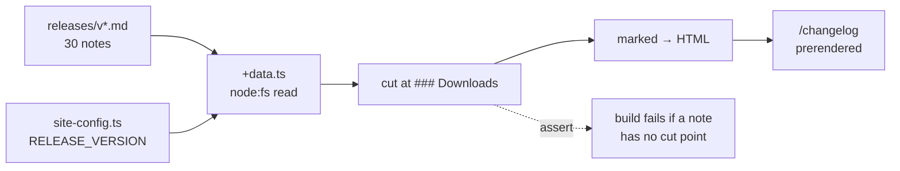

# Add a Changelog Page to the Marketing Site

## Why

The marketing site names the version it advertises but never says what is in it. Thirty releases of carefully authored notes already exist in `releases/`, and they are published in exactly one place: as GitHub Release bodies. A prospect evaluating a young product cannot see its release cadence without leaving the site, and an existing user has no on-site answer to "what changed".

The two things that usually make a changelog page expensive are already solved here. The content is authored on every release by `/release`, and the deploy trigger works by construction — `/release` writes `site/src/site-config.ts` into the same commit as `releases/<tag>.md`, so the release push already matches the site workflow's path filter and redeploys the site.

## What Changes

- **A new `/changelog` route** rendering the release named by `RELEASE_VERSION` in full, followed by a condensed list of earlier releases (version, date, tagline) linking to their GitHub Release pages.
- **A build-time render pipeline.** The notes are read with `node:fs`, cut at their `### Downloads` footer, converted to HTML with `marked`, and inlined into the prerendered page. `marked` is a **devDependency** — the site's five runtime dependencies do not change and no markdown library reaches the client bundle.
- **The Downloads footer is cut, not rendered.** It is 27% of the corpus, it duplicates the site's own download block, and it carries version-pinned filenames that would go stale on the site. Every fenced code block, every bare URL, and the one string that trips the e2e pinned-install guard live in that footer, so the cut is what makes the remaining markdown trivially safe to render.
- **A `.prose-notes` style block** in `@layer components`, sibling to `.prose-docs`. Tailwind preflight zeroes headings and `.prose-docs` deliberately styles none, so generated `<h2>`/`<h3>` need their own rules.
- **A header nav link** beside `Docs`.
- **`releases/**` joins the site workflow's path filter**, so a corrected or backfilled note redeploys the site on its own.
- **`/release` gains a third file to touch**: the changelog page's authored `modified` date, which otherwise lies in `sitemap.xml` after every subsequent release.
- **The notes' own format does not change.** `releases/*.md` remains a shared contract with `release.yml`'s `body_path`; every adaptation happens at render time.

## Capabilities

### New Capabilities

- `changelog-page`: what the changelog route renders, how release notes are adapted for the web at build time, the cut contract with the notes format, and the failure modes that must break the build rather than publish a wrong page.

### Modified Capabilities

- `marketing-site`: the *Product routes* requirement enumerates nine routes and asserts the sitemap contains those "and nothing else"; it becomes ten. The *Publishing is path-filtered, gated and explicitly armed* requirement gains `releases/` as a trigger path, since the site now renders content from outside `site/`.
- `release-command`: the *Commit, Tag, And Push On Approval* requirement gains the changelog page's `modified` date as a third file written into the release commit, alongside the notes file and the site version constant.

## Impact

**Added** — `site/pages/changelog/{+Page.tsx,+documentProps.ts,+data.ts}`, `site/build/releaseNotes.ts` (a new first-party build directory), a `.prose-notes` block in `site/src/styles.css`.

**Modified** — `site/src/Layout.tsx` (header link), `site/package.json` + `site/bun.lock` (`marked` as a devDependency; `--frozen-lockfile` means both move in one commit), `site/e2e/tests/seo.spec.ts` (its hardcoded route list is asserted set-equal to the derived sitemap, so it is the one mandatory test edit), `.github/workflows/site.yml` (path filter), `.claude/commands/release.md` (step 8).

**Deliberately unchanged** — `releases/*.md` and their authoring template, since the files are consumed verbatim as GitHub Release bodies. `site/site-kit/`, which is a vendored fork under a `diff -r` drift check; the new build code goes in `site/build/` instead. The desktop app's `react-markdown` pipeline, which the site cannot import and should not mirror. The site's runtime dependency list. No Rust, no IPC, no `src/` changes — this change does not touch the desktop app, the TUI, or the web frontend.

**Not adopted** — `@tailwindcss/typography`, which would contradict the *Site carries its own visual identity* requirement that the site "import no external component library or theme". `react-markdown`, the only rendering option that cannot be devDependency-only, because the site hydrates the full page with no islands.

**Publishing is live.** `SITE_DEPLOY_MODE` is `live` and the deploy role is configured, so merging this to master publishes to `specforge.avantmedia.uk` immediately.
