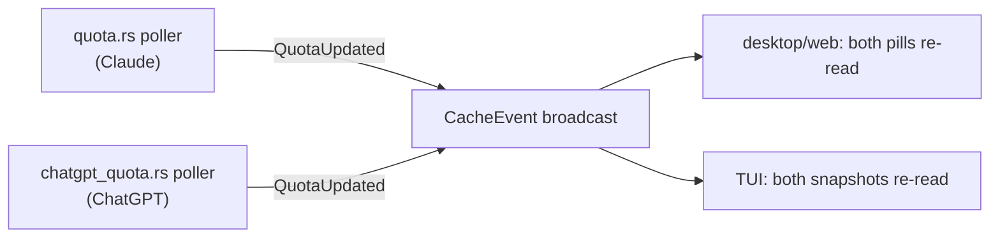

# Design: ChatGPT Quota Status Line

## Context

The `claude-quota` capability established the whole pipeline this change needs: an opt-in poller in `openspec-app` that resolves a local OAuth token read-only, polls a vendor usage endpoint with caching/backoff on a `std::thread`, publishes over the existing `CacheEvent` broadcast, and renders as a status-line gauge in the desktop/web sidebar footer and the TUI title bar. This change adds the same feature for the user's ChatGPT plan, fed by the Codex CLI's on-disk credentials.

The ChatGPT side was verified against the Codex CLI's own source (`codex-rs/backend-client`): the CLI fetches rate limits from `{base}/wham/usage` when its base URL is `https://chatgpt.com/backend-api` (the ChatGPT-login path style), sending `Authorization: Bearer <access_token>` plus a `ChatGPT-Account-Id` header, both sourced from `~/.codex/auth.json`. The payload is `plan_type`, `rate_limit.primary_window` / `secondary_window` (each `used_percent`, `limit_window_seconds`, `reset_after_seconds`, `reset_at`), optional `credits`, and optional `additional_rate_limits`.

Constraints carried over unchanged: the Tauri crate stays thin; `openspec-app` is runtime-agnostic (consumed by Tauri, the TUI, and `specforge-web`); tokens are read-only and never logged.

## Goals / Non-Goals

**Goals:**
- A second, independent poller in `openspec-app` feeding all frontends through the existing broadcast channel.
- Opt-in and default-off, exactly like the Claude gauge: no file read, no network until enabled.
- A "ChatGPT" gauge row group rendered beside the Claude one in every frontend, reusing the existing meter components, thresholds, countdown, and stale treatment.
- A time axis driven by the server-provided window length instead of hardcoded durations.

**Non-Goals:**
- A provider abstraction over the two quota modules (see Decision 1).
- Surfacing `credits`, `additional_rate_limits`, or `plan_type` — follow-up material.
- Refreshing or rewriting `auth.json` in any way; multi-account support.
- Any change to the `claude-quota` module, spec, or gauge behavior.

## Decisions

**1. Twin module, not a provider framework.**
`chatgpt_quota.rs` is a deliberate structural sibling of `quota.rs`: its own state/handle/poller, sharing only the app's existing plumbing (settings store, broadcast channel) and the frontends' presentational components. *Alternative — a generic `QuotaProvider` trait with two implementations:* rejected. The two providers differ exactly where an abstraction would have to be widest — credential resolution (Keychain fallback vs. JWT file), expiry semantics (`expiresAt` millis vs. JWT `exp`), payload shape (`five_hour`/`seven_day`/`limits[]` vs. `rate_limit.*_window`/`additional_rate_limits`), and header sets — leaving only the poll loop genuinely shared, and that loop is ~50 lines. Two readable copies beat one abstraction with two escape hatches; generalize if a third provider ever lands.

**2. Reuse `CacheEvent::QuotaUpdated` — zero `openspec-core` changes.**
The event carries no payload; every consumer re-reads the snapshot it cares about. The ChatGPT poller emits the same variant, and each gauge re-reads its own provider's snapshot on every firing. *Alternative — a new `ChatGptQuotaUpdated` variant:* rejected — it would touch `openspec-core` plus every forwarder/`select!` arm in three frontends to avoid a handful of redundant in-process reads of a mutex-guarded struct. The spurious re-read is harmless by construction.

**3. Credentials: `$CODEX_HOME/auth.json` only, JWT `exp` checked locally, no keyring.**
The Codex CLI's `cli_auth_credentials_store` setting selects among `AuthCredentialsStoreMode::{File, Keyring, Auto, Ephemeral}`; **`File` is the default**, writing `auth.json` under `CODEX_HOME` (default `~/.codex`). We support the default mode only: one file read on every platform, simpler than Claude's file-plus-Keychain resolver. A user who has opted into `keyring`/`auto`/`ephemeral` storage has no tokens in `auth.json`, so the gauge shows the unauthenticated state despite a live Codex login — a deliberate v1 scope limit, not an oversight (a keyring backend is the natural follow-up if it proves common). Expiry: the access token is a JWT; decode the payload segment (base64url, no signature verification — we are the client, not a verifier) and reject when `exp` ≤ now, mirroring the Claude module's strict local expiry check. An `auth.json` holding only an `OPENAI_API_KEY` (API-key login, no `tokens` object) resolves to unauthenticated — the usage endpoint answers for ChatGPT-plan accounts. *Alternative — shell out to the `codex` binary for limits:* rejected: requires `codex` on PATH, spawns a process per refresh, and its output format is not a stable interface. *Alternative — parse `~/.codex/sessions/*.jsonl` rollout files for the rate-limit snapshots Codex records:* rejected: only updates while Codex runs, so the gauge would silently freeze between sessions.

**4. Endpoint: direct `GET https://chatgpt.com/backend-api/wham/usage`.**
Headers: `Authorization: Bearer <tokens.access_token>`, a SpecForge `User-Agent`, and — **only when an account id resolves** — `ChatGPT-Account-Id`. The account id is optional in the Codex CLI's own model (`TokenData.account_id: Option<String>`, with a `chatgpt_account_id` claim inside the id-token JWT as a secondary source), and the CLI omits the header rather than failing when it is absent; we match that exactly, resolving `tokens.account_id` first and falling back to the JWT claim. This is the same request the Codex CLI issues for its `/status` screen, reissued read-only with the user's own credentials — the identical posture `claude-quota` takes toward `/api/oauth/usage`. Parse defensively: missing windows tolerated, at least one window required for an `Ok` snapshot, anything else → `Unavailable`. `reset_at` is epoch seconds and maps straight onto the snapshot's `resets_at_unix`.

**5. Snapshot carries the server-provided window length.**
`ChatGptQuotaState` windows include `window_secs` from `limit_window_seconds`. Frontends derive the time axis from it — segment count = window length in hours when ≤ 24h, else in days ($n = \mathrm{round}(secs/3600)$ or $\mathrm{round}(secs/86400)$), with 5h/7d fallbacks when the field is absent — instead of the Claude gauge's hardcoded constants. The Claude gauge is untouched. *Alternative — hardcode 5h/7d:* rejected; the server states the truth and plan tiers may differ.

**6. Desktop/web frontend: share the presentational row, keep the pills separate.**
The meter row in `QuotaPill.tsx` (`WindowRow` + countdown/elapsed helpers) is already provider-agnostic — extract it into a shared module and add a `ChatGptQuotaPill` beside `QuotaPill`, each owning its own fetch/event lifecycle. The `quota-*` CSS classes are already provider-neutral and are reused as-is. The sidebar footer stacks vertically, so a second strip costs height, not width — no contention.

**7. TUI: the title bar needs a real width budget before a second group fits.**
Today's title bar renders the gauge **all-or-nothing**: `ui.rs` measures the assembled spans and only splits the row `if area.width >= gauge_w + 16`, otherwise dropping the *entire* gauge and rendering just the screen title. (The in-code comment claiming scoped windows are "the first content clipped" does not match that guard — there is no per-group truncation.) Naively appending a ChatGPT group therefore inflates `gauge_w` and, at moderate terminal widths, makes **both** providers' gauges vanish — enabling ChatGPT would silently remove a working Claude gauge, contradicting the spec's side-by-side scenario.

So this change introduces group-level degradation: build the gauge as an ordered list of groups (Claude first, ChatGPT second), then drop trailing groups until the remainder satisfies the same `width >= gauge_w + 16` guard, rendering nothing only when even the first group cannot fit.

$$\text{rendered groups} = \max\{\, k \le n \;:\; \mathit{width}(g_1 \mathbin\Vert \cdots \mathbin\Vert g_k) + 16 \le \mathit{area.width} \,\}$$

Degraded states stay terse and provider-prefixed ("ChatGPT: sign in" / "ChatGPT: quota n/a"). *Alternative — leave the all-or-nothing guard and just shorten the label to "GPT":* rejected, it shrinks the constant but keeps the cliff, so a narrow terminal still loses the Claude gauge as a side effect of enabling ChatGPT.

**8. Settings: twin fields, same pattern.**
`chatgpt_quota_enabled` (default `false`) and `chatgpt_quota_refresh_secs` (default `60`), both `#[serde(default)]` — no migration. Desktop Settings gains a toggle row beside the Claude quota one. The TUI settings list is index-derived from `SETTINGS_TOGGLE_COUNT` (currently `2`, with index 2 mapping to the Appearance row), so adding a third toggle means **bumping that constant to 3** — which shifts Appearance / AddWorkspace / Workspace indices down automatically in both `settings_row_at` and `ui.rs`. The refresh interval stays a `settings.json`-only knob, as resolved for `claude-quota` v1.

## Risks / Trade-offs

- [Undocumented endpoint] `/wham/usage` is internal to the Codex CLI and may change or grow variants (`/api/codex/usage` path style). → Parse defensively in one isolated module; degrade to "unavailable"; a shape change is a one-file fix.
- [Non-default credential storage] A user with `cli_auth_credentials_store = keyring`/`auto`/`ephemeral` has no tokens in `auth.json`, so the gauge reads "sign in" while Codex works fine. → Accept for v1 (`file` is the default mode); the unauthenticated copy names the Codex CLI, and a keyring backend is an isolated follow-up in the same module.
- [Expired token while Codex is idle] SpecForge never refreshes `auth.json`, so if the Codex CLI hasn't run recently the JWT may lapse and the gauge degrades to "sign in" even though the user *could* re-auth. → Accept: read-only is the safety property that guarantees SpecForge can never log the user out of Codex; the sign-in state names the Codex CLI so the fix is obvious.
- [Cloudflare fronting chatgpt.com] The Codex client maintains Cloudflare cookies; a bare `ureq` GET could occasionally be challenged. → Send a proper User-Agent, treat challenge responses as transient (keep the stale snapshot), and reassess only if it proves common in practice — third-party usage widgets issue the same bare request successfully today.
- [Two pollers, two endpoints] Independent failure modes could confuse ("Claude fine, ChatGPT stale"). → Each strip carries its own status/stale treatment, already designed to stand alone.
- [Shared event fan-out] Reusing `QuotaUpdated` makes each provider's update trigger the other gauge's re-read. → Harmless: local mutex read, no network, no render churn when the snapshot is unchanged (state compare before emit happens in the poller).

## Migration Plan

Additive and opt-in; no data migration. The two settings fields default (off / 60s) via serde, so existing `settings.json` files load unchanged. Rollback: disabling the setting fully dormants the feature; removing the module removes the gauge with no residual state beyond two ignored settings fields.

## Open Questions

- Whether the secondary (weekly) window is present on every plan tier (free-plan responses may omit it) — the parser tolerates any subset, so this only affects what renders.
- Clock-skew leeway on the JWT `exp` check (leaning: none — strict, matching the Claude module; a false "sign in" self-heals on the next Codex run).
- The exact TUI group label ("ChatGPT" vs. a shorter "GPT") — now a pure legibility choice rather than a width-safety one, since Decision 7 removes the cliff; decide at implementation against real terminal widths.
