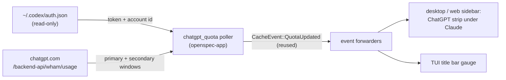

# Add a ChatGPT Quota Status Line

## Why

The sidebar's opt-in Claude quota gauge answers "how much budget is left?" for Claude Code, but developers who split their day between Claude Code and the Codex CLI have no equivalent view of their ChatGPT plan — the 5-hour and weekly Codex windows are invisible until Codex starts refusing work mid-session. The exact pattern that powers the Claude gauge transfers: a local OAuth token already on disk (`~/.codex/auth.json`) can answer the same question against ChatGPT's usage endpoint, so SpecForge can render a second, opt-in gauge right beside the first.

## What Changes

- Add an **opt-in** "ChatGPT quota" feature (default **off**) as a **twin module** of the existing `claude-quota` one — deliberately a parallel sibling of `quota.rs`, not a refactor into a provider abstraction (two providers with different auth quirks and payload shapes don't justify one; see `design.md`).
- New **background poller** in the headless app layer (`chatgpt_quota.rs`, mirroring `quota.rs`): resolves the Codex CLI auth file **read-only** (honoring `CODEX_HOME`, default `~/.codex/auth.json`), rejects expired tokens locally by decoding the JWT `exp` claim, queries ChatGPT's usage endpoint (`https://chatgpt.com/backend-api/wham/usage`, with the `ChatGPT-Account-Id` header), and exposes the **primary (5-hour)** and **secondary (weekly)** window utilization plus reset times.
- Unlike Anthropic's payload, the response carries each window's length (`limit_window_seconds`), so the new gauge's **time axis is data-driven** — segment count and the "now" marker derive from the server-provided window length, with 5h/7d fallbacks only when it is absent.
- New **status-line gauge rows** labeled "ChatGPT" in every frontend: a second strip in the desktop/web sidebar footer (reusing the existing quota meter components and CSS), and a second title-bar gauge in the TUI — same green / orange (≥70%) / red (≥90%) thresholds, exhausted-window reset countdown, and stale de-emphasis.
- New **settings**: `chatgpt_quota_enabled` (bool, default `false`) and `chatgpt_quota_refresh_secs` (default `60`), surfaced as a toggle row in the desktop Settings panel beside the Claude quota row.
- **No `openspec-core` changes**: the twin reuses the existing `CacheEvent::QuotaUpdated` broadcast and the `quota-updated` frontend event — both gauges simply re-read their own snapshots when it fires.

Nothing is **BREAKING** — the feature is purely additive and ships disabled.

## Capabilities

### New Capabilities
- `chatgpt-quota`: resolving the local Codex CLI OAuth token read-only, polling ChatGPT's usage endpoint on an interval with caching and backoff, and rendering the primary (5-hour) + secondary (weekly) window utilization as an opt-in status-line gauge in the desktop, web, and terminal frontends — with quiet degradation when disabled, unauthenticated, or offline.

### Modified Capabilities
_None._ The `claude-quota` capability is untouched — the twin lives beside it, and the shared `quota-updated` event already carries no payload, so re-using it changes no existing contract.

## Impact

- **`openspec-app` (net-new module)**: `chatgpt_quota.rs` — auth-file resolver + JWT expiry check, usage fetch/parse (`rate_limit.primary_window` / `secondary_window` → windows with utilization, reset, and window length), poll loop with caching, 429 backoff, and stale degradation; a `ChatGptQuotaState` snapshot + handle on `AppService` with a `chatgpt_quota()` accessor and `spawn_chatgpt_quota_poller()`. Two new `#[serde(default)]` fields on `AppSettings` (no migration).
- **`openspec-core`**: **unchanged** — no new event variants, watchers, or parsers.
- **`specforge` (Tauri)**: three thin commands (`get_chatgpt_quota`, `get_chatgpt_quota_enabled`, `set_chatgpt_quota_enabled`), their registration in `lib.rs`, and one `spawn_chatgpt_quota_poller()` call beside the existing spawn.
- **`specforge-web`**: three matching dispatch arms in `dispatch.rs` and the poller spawn in `main.rs`.
- **`specforge-tui`**: ChatGPT snapshot + enabled flag on the model, a second title-bar gauge, and toggle wiring mirroring the existing quota toggle.
- **Frontend (`src/`)**: `ChatGptQuotaState` mirror in `types.ts`, `api.ts` wrappers, a "ChatGPT" strip in the sidebar footer reusing the existing meter row component and `quota-*` CSS, and a Settings toggle row.
- **Dependencies**: none new — reuses `ureq` (rustls), already in the tree for the Claude poller.
- **Risk**: the usage endpoint is internal to the Codex CLI and undocumented — same posture as `claude-quota`: parse defensively, degrade to a quiet "unavailable". Auth is strictly read-only: `auth.json` is never refreshed or rewritten (so SpecForge can never log the user out of Codex); the flip side is that when the Codex CLI hasn't run recently the stored token may have expired, and the gauge shows a "sign in" state instead of silently refreshing.
- **Deliberately out of scope**: no provider abstraction over the two quota modules; no surfacing of `credits`, `additional_rate_limits`, or `plan_type` from the payload (candidate follow-ups, exactly as scoped per-model windows were for `claude-quota`); no changes to the `claude-quota` module, spec, or gauge.
