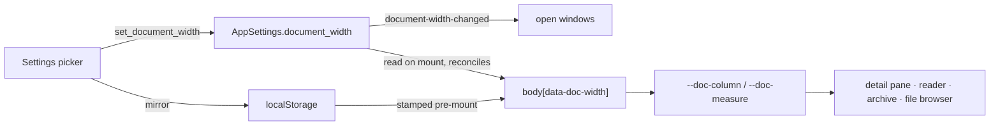

# Reading-Width Presets for the Document Column

## Why

The markdown reading surface has a well-reasoned column and no way to change it.
`.markdown-view` is capped at `880px` and prose is additionally held to `74ch`, a
two-tier arrangement the `visual-identity` capability defends at length: objects
(tables, fenced code, diagrams, display mathematics) get the column, prose gets a
readable measure, and a `:has()` guard stops a nested object from inheriting the
narrowing. The reasoning is sound. The numbers are literals.

That fixity costs something at both ends of the range.

**At the wide end**, the detail pane is drag-resizable and the sidebar and commit
rail both collapse, so on a 4K display the pane can exceed 2000px while the column
stays 944px painted. Everything past that is margin. The cost is not only empty
space: `figureFloor.ts` records that a ten-node flowchart is ~2580px naturally and
that fitting it into the 880px column scales it to 0.34, rendering its 15px labels
at about 5px — "present, but not reading material". The floor then stops the
shrink and hands the reader a diagram that scrolls inside its own block. On a pane
with 2000px available, that is a diagram scrolled to protect a column that had no
need to be narrow.

**At the narrow end**, a reader window opens at `default_reader_width()` = 720px,
which is 656px of content once the column's padding is removed — under the 880px
cap and within a few percent of the 74ch measure. Neither tier is doing anything
there; the window is the width. A reader who prefers a tighter measure has no way
to ask for one, and a reader who wants the classic ~66-character line has no way
to get it.

**And nothing in the app is adjustable here at all.** Reader windows remember one
shared geometry; figures have a per-figure zoom. Reading width, the setting most
document applications expose first, is the one that cannot be touched.

A fourth reason is hygiene: `880px` is written twice — once on `.markdown-view`
and once on `.detail-identity-inner`, whose comment states it is aligned to the
prose column "so the identity heads the document rather than floating left of it".
Two literals encoding one relationship can drift, and only a person looking at
both at once would notice.

## What Changes

- **The column becomes a four-rung preset ladder**, selectable in Settings and
  persisted as one global preference. Both tiers move at every rung, so the prose
  measure is never stranded inside a column it no longer relates to — though not
  in lockstep; see the note under the table.

  | Preset | `--doc-measure` | `--doc-column` | Prose chars | Code chars @ `--text-md` |
  |---|---|---|---|---|
  | Compact | `50ch` (505px) | `720px` | ~65 | ~76 |
  | **Default** | `74ch` (747px) | **`880px`** | ~97 | ~94 |
  | Wide | `86ch` (868px) | `1040px` | ~113 | ~112 |
  | Full | `96ch` (969px) | `none` — fills the pane | ~125 | pane |

  Default is today's rendering exactly, so an existing install sees no change.
  Every figure above is **measured** off rendered line boxes in Inter Variable
  at `--text-lg` and JetBrains Mono Variable at `--text-md`, not derived: `ch`
  is the advance of the digit zero (10.09px), while an average prose character
  is ~7.6px, so a `ch` measure buys about a quarter more characters than its
  number suggests. The declarations are in `ch` and `px` as tabulated.

  The measure does **not** step evenly with the column, and Compact is the
  reason. A reader reaches for it because the *text* feels wide; a rung that
  narrowed both in step (`62ch`) would still have delivered ~83 characters,
  outside the range conventionally called comfortable, and would not have done
  the job it exists for. At `50ch` it lands at ~65 — proportionally 70% of its
  column against ~85% at the other bounded rungs.

- **`Full` fills the pane for objects and caps prose.** It is the rung that
  answers the diagram case: a 2580px flowchart on a wide pane renders at or near
  natural size instead of at 0.34. Prose is still bounded, at `96ch` (~125
  characters), so it never runs to the several hundred an unbounded column would
  produce on a 4K display.

- **A pre-existing claim is corrected.** `visual-identity` says the 74ch measure
  makes prose wrap "near the typographic comfort range", and `App.css` says it
  yields ~78 characters. Measured, it is **~97** — above the 60–90 the same
  requirement cites. The unit is why: `ch` counts digit advances, not average
  characters. The requirement and the comment are corrected to state the
  measured figure; the **rendering is not touched**, because that line length is
  what every existing install already has and changing it silently would be a
  visual-identity decision wearing this change's clothes. `Compact` is what
  gives a reader who wants a comfortable measure one.

- **The literals become two custom properties**, `--doc-column` and
  `--doc-measure`, resolved from a `body[data-doc-width]` attribute. The four
  existing rules — `.markdown-view`, `.detail-identity-inner`, `p`, and the
  `:has()`-guarded `li`/`blockquote` — consume the properties instead of literals,
  which retires the duplicated `880px` as a side effect. Every declaration carries
  an explicit fallback (`var(--doc-column, 880px)`), because an unresolvable
  custom property is invalid at computed-value time and would silently drop the
  cap rather than fail loudly.

- **The preference is stored in `AppSettings`** as a `document_width` enum, reached
  by a `get_document_width`/`set_document_width` pair through the four-place
  registration (`src/api.ts`, `crates/specforge/src/commands.rs`,
  `crates/specforge/src/lib.rs`, `crates/specforge-web/src/dispatch.rs`). One
  global value for every surface and every window, matching the shape
  `reader-window` already chose for *Shared Reader Window Geometry*.

- **The preset is in effect on the first paint.** `src/main.tsx` already stamps
  `data-platform` and `data-surface` before React mounts, precisely so CSS keyed
  off them is right from the first frame; an IPC round-trip cannot meet that bar.
  The preset is therefore mirrored into `localStorage` on every write and stamped
  synchronously at bootstrap, with `AppSettings` remaining the source of truth and
  reconciled once the fetch resolves. Reader windows share the Tauri webview
  origin, so a newly opened reader reads the same mirror.

- **A width change reaches windows that are already open.** A new
  `document-width-changed` event is emitted directly by the setter, following
  `EVENT_WORKSPACE_PRESENTATION_UPDATED` — not derived from a `CacheEvent`, so no
  existing consumer in three frontends grows an arm that ignores it. The SSE
  bridge carries generic `(name, Value)` frames, so the web transport needs no new
  machinery.

- **Settings gains a `Reading width` section** with the four-way picker and a
  small live sample — a paragraph and a code well rendered at the selected rung.
  The sample is not decoration: Settings is a routed view that *replaces* the
  document, so without it the only way to judge a rung is to close Settings and
  look.

- **The preset ladder is a pure module**, `src/docWidth.ts`, mapping preset to
  `{ column, measure }` and folding any unrecognised value to Default. It is unit
  tested, for the reason `figureFloor.ts` and `figureZoom.ts` both record in their
  own headers: a `src/`-only diff short-circuits the mutation gate, so these tests
  are the frontend's only automated coverage.

- **The setting is not desktop-only.** `web-ui`'s *Desktop-Only Settings Are
  Hidden in the Web UI* governs affordances the browser cannot honour; reading
  width is pure CSS and works identically in both hosts. The new requirement says
  so explicitly, so nobody hides it by reflex alongside the notifications toggle.

## Capabilities

### New Capabilities

- `document-width`: the reading-width preference itself — the preset ladder and
  its rungs, one global persisted value, application to every reading surface in
  both hosts, presence on the first paint, propagation to open windows, and
  degradation of an unrecognised stored value.

### Modified Capabilities

- `visual-identity`: *Markdown Body Adopts the Type System* currently pins the
  column at "880px at maximum" and prose "between 70ch and 80ch". Those become the
  **default** rung of a bounded ladder, with the two-tier structure, the
  object-tier-wins rule and the headings exemption all unchanged. The scenario
  asserting the literal `880px` and the 70–80ch band is rewritten against the
  default rung.

## Impact

Affected files:

- `src/App.css` — define `--doc-column`/`--doc-measure` on `:root` and the three
  `body[data-doc-width]` blocks; convert `.markdown-view` (the `880px` cap),
  `.detail-identity-inner` (the second `880px`), `.markdown-view p`, and the
  `:has()`-guarded `li`/`blockquote` rules to `var()` with fallbacks; add the
  `Reading width` control and sample styles.
- `src/docWidth.ts` + `src/docWidth.test.ts` — new: the preset table, the
  fallback, and the `localStorage` read/write helpers as pure functions.
- `src/main.tsx` — stamp `data-doc-width` from the mirror before `createRoot`,
  beside the existing `data-platform`/`data-surface` stamps.
- `src/App.tsx`, `src/components/ReaderRoot.tsx` — fetch the authoritative value
  on mount, reconcile the stamp, and subscribe to `document-width-changed`.
- `src/components/SettingsView.tsx` — the new section and its picker.
- `src/api.ts`, `src/types.ts` — the two command wrappers, the `DocumentWidth`
  union, and the event-name literal.
- `crates/openspec-app/src/settings.rs` — the `DocumentWidth` enum and the
  `AppSettings` field.
- `crates/openspec-app/src/events.rs` — `EVENT_DOCUMENT_WIDTH_CHANGED`.
- `crates/specforge/src/commands.rs`, `crates/specforge/src/lib.rs`,
  `crates/specforge-web/src/dispatch.rs` — the getter/setter pair and the emit.
- `src/components/figureFloor.ts` — its doc comment cites the 880px column as
  fixed; the arithmetic is column-agnostic and unchanged, but the prose is not.
- `openspec/specs/visual-identity/spec.md`, `openspec/specs/document-width/spec.md`
  — via this change's deltas.

Deliberately unchanged:

- **The two-tier model itself.** Objects keep the column, prose keeps a measure,
  headings keep the column so the `h1`/`h2` hairline rules bound the reading
  surface, and the `:has()` guard still lifts the measure from any prose block
  containing an object. The ladder moves the numbers; it does not restructure the
  relationship.
- **The terminal frontend.** `ui.rs` renders the detail pane with
  `Wrap { trim: false }` at full pane width and has no measure of any kind today.
  Giving it one is a defensible change and a separate one; `specforge-tui` will
  read a settings file carrying a `documentWidth` it ignores, which is stated in
  the delta rather than left to be discovered.
- **`figureFloor`'s arithmetic.** `floorWidth` is a function of natural width and
  label size, not of the column, so a wider column simply means less fitting is
  demanded of it. Only the comment changes.
- **Font size.** The measure is expressed in `ch` of the prose font, so it tracks
  any future type-scale setting for free. This change does not add one, and does
  not turn the width picker into a zoom control.
- **Per-document and per-window width.** One global value, for the reason
  `reader-window` gives for its shared geometry: per-document memory accrues an
  unbounded set of entries keyed by opaque identifiers, with nothing to prune it.
- **The reader window's default geometry.** 720×820 is unchanged; `Compact`'s
  720px column resembling it is a coincidence worth noting, not a coupling.
- **`box-sizing`.** There is no global reset, so `max-width` on `.markdown-view`
  remains content-box and the tabulated columns are content widths with the
  existing padding outside them.
