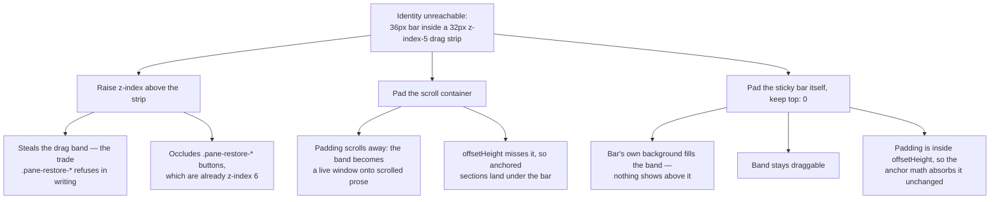

# Copy the Identity on Click, and Clear the macOS Titlebar Strip

## Why

The change-identity header shipped in `add-change-identity-headers` is **unusable in the desktop app**, and the way it fails is worse than not working: clicking the change name drags the window, and double-clicking it — which is what a user tries when the first click appears dead — zooms the window.

The cause is a collision with the macOS hidden-inset titlebar. `.titlebar-drag-region` (`src/App.css:281-293`) spans the full window width across the top 32px at `z-index: 5`, and is `pointer-events: auto` whenever `body[data-platform="mac"]` is set — which `src/main.tsx` does only inside the Tauri window. The identity header is `position: sticky; top: 0; z-index: 2` and measures 36px, so **the entire change name sits inside that band**:

```
elementFromPoint(name centre)  →  "titlebar-drag-region"     not .identity-name
name rect                          y = 9 … 26                 inside the strip's 0 … 32
handleTitlebarMouseDown            click → startDragging()
                                   detail === 2 → toggleMaximize()
```

This was the one thing the previous change shipped unverified, recorded there as task 10.1. It was invisible in every check that was run because `main.tsx` sets the platform flag only inside Tauri, so under `specforge-serve` the strip stays `pointer-events: none` and the bug cannot reproduce. It is not an isolated slip either: an audit of the top 32px found the same occluder breaking the file browser's filter input and Refresh button, the commit breadcrumb, both split-pane dividers, and — once scrolled — Settings' form controls and every markdown link.

Separately, the copy mechanism itself is worth revisiting now that the identity lives in the detail pane. The previous change deliberately used `user-select: all` and no clipboard write, because the sidebar's constraints made a copy control expensive: nested row controls are never focusable, so it would have needed a keyboard chord, and `Cmd+C` collides with native copy-selection. **None of those constraints apply here.** The detail pane is not the tree, so the identity is free to be a real tab stop with Enter/Space activation, and no chord is involved. The identity exists to be pasted into a coding-agent prompt, so requiring a second gesture to finish an action the user already committed to is friction with no upside.

## What Changes

- **The identity copies itself when clicked.** One click on the change name, the archive directory name, or the file-browser path places exactly that value on the clipboard.
- **It stays selectable.** `user-select: all` is kept, so the same click also selects the value. The highlight is free, immediate confirmation of exactly what was copied — and when a clipboard write is refused, the value is already selected for the platform's own copy shortcut, so the failure degrades to one keystroke rather than to nothing.
- **It is keyboard-operable.** The identity becomes a real tab stop with `role="button"`, an accessible name, Enter/Space activation, and the house `:focus-visible` ring. This is possible only because it is in the detail pane; the tree's roving-focus, single-Tab-stop model is untouched.
- **Confirmation without reflow.** Success flashes the ink to `--ok` and announces through a polite live region; failure flashes `--warn` and says the value is selected. No label swap, no added glyph — the identity shares a flex row with the branch chip and may wrap, so anything that changed its width would jump the row on every copy.
- **On macOS the header clears the titlebar strip.** The bar takes 32px of top padding in the native window, so the identity sits below the drag region and a click reaches it.

The clearance is deliberately *padding on the sticky bar*, not padding on the scroll container and not a raised `z-index`:



## Capabilities

### Modified Capabilities

- `spec-browser`: The *Change Identity Header in the Detail Pane* requirement is rewritten where this change contradicts it. Its ban on an application clipboard write and a keyboard binding is **retracted** — copy-on-click is exactly such a write — and replaced with the copy contract, its confirmation, and its behaviour where the asynchronous Clipboard API is not exposed. Three scenarios change from asserting a selection to asserting clipboard contents. The requirement also gains the macOS drag-strip clearance, which it owns because it owns the header's placement, and that clearance is required to hold at every scroll position, not only at scroll top.
- `archive-browser`: The *Read-Only Artifact Navigation* requirement restates the old select-only contract verbatim rather than delegating, including the banned-clipboard-write clause, so updating `spec-browser` alone would leave this capability asserting the opposite. Rewritten to the copy contract.
- `workspace-file-browser`: The *File Browser Surface* requirement duplicates the same clause for the preview path, and changes the same way.

`visual-identity` is deliberately **not** modified: its *Window draggable from the titlebar strip on macOS* scenario requires a press anywhere in the top 32px to enter drag mode, and the chosen fix preserves that — the band still hit-tests to the drag region. A `z-index` fix would have carved an exception out of it and forced an amendment.

## Impact

**Frontend only.** Affected files:

- `src/clipboard.ts` — new. The copy helper and its strategy choice.
- `src/components/CopyableIdentity.tsx` — new. The shared copyable identity, used by all three surfaces.
- `src/components/DetailPane.tsx`, `src/components/FileBrowserView.tsx` — render it instead of a bare span.
- `src/App.css` — the interactive states, and the macOS clearance.
- `src/clipboard.test.ts` — new.

**Deliberately unchanged:**

- **No Rust changes**, no IPC, no command, no event, no `src/types.ts` shape. The mutation gate short-circuits on a frontend-only diff; coverage is ordinary frontend tests.
- **No dependency and no Tauri plugin.** `tauri-plugin-clipboard-manager` is not added. The Clipboard API is used where the origin exposes it and a synchronous `document.execCommand("copy")` over the live selection where it does not — `specforge-serve --bind <non-loopback>` serves a plain-HTTP, non-secure origin where `navigator.clipboard` is `undefined`, verified in a browser against such a bind.
- **No keyboard chord.** `Cmd+C` keeps its native meaning; activation is Enter/Space on a focused control, so nothing competes with the tree's bindings.
- **The sidebar is untouched.**
- **The drag region is untouched** — same element, same 32px, same full width, same `pointer-events` gating.
- **Not in scope: the other titlebar-strip collisions.** The audit found the same occluder degrading `.file-browser-header` and its filter input and Refresh button, `.commit-detail-breadcrumb`, both `.split-pane-divider`s, and — once scrolled — Dashboard rows, Settings form controls, and markdown links. `.split-pane-right` gets no macOS top inset in the default sidebar-visible layout, which is the structural cause. Two details make that fix subtler than it looks, and both argue for giving it its own change: the strip is **fully transparent**, so every one of these is a silent hit-test theft rather than a visible occlusion — nothing looks wrong, controls simply do not respond; and the one mitigation that does exist (`body[data-platform="mac"] [data-sidebar-hidden] .split-pane-right`, `src/App.css:432`) puts its 32px *inside* the scrollport, so it protects only at scroll top, exactly the flaw that disqualified the container-padding option here. The side panes avoid it by padding the pane while scrolling an inner child.
