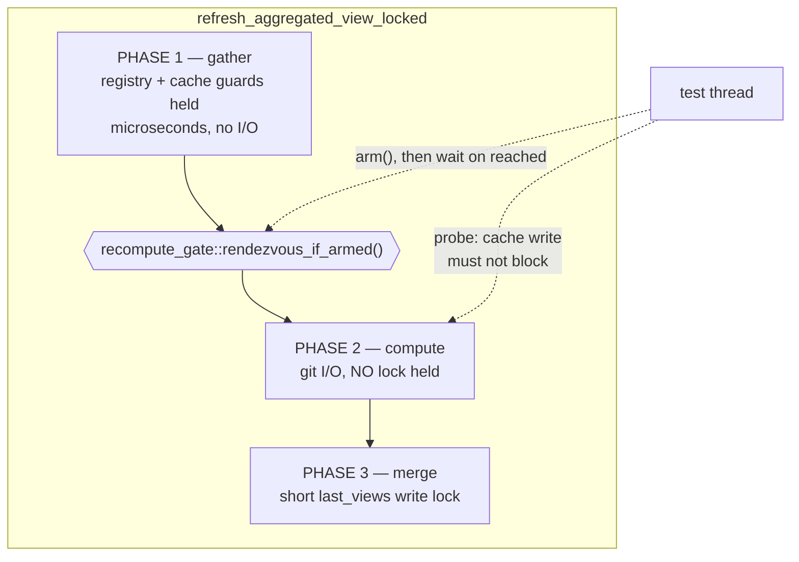

# Design: Add Mutation Testing to the Headless Crates

## Context

The workspace is five crates, but only two are plausible mutation-testing
targets. `crates/specforge` (Tauri shell) and `crates/specforge-web` both
depend on the built frontend at compile time — Tauri 2's `generate_context!`
validates `frontendDist` (`../../dist`), and `specforge-web/src/assets.rs:19`
carries `#[derive(RustEmbed)] #[folder = "../../dist"]`. `dist/` is gitignored,
and cargo-mutants' scratch-tree copy honours gitignore, so a copied tree can
never contain it: every mutant in those crates would fail to build.
`crates/specforge-tui` builds fine but `src/app.rs` alone is 1,263 production
lines with no direct tests.

That leaves `openspec-core` (~8,900 production lines, 234 unit tests, 10
integration targets) and `openspec-app` (~2,650, 60 unit tests, 2 integration
targets) — which is also where the architecture already concentrates its
testable logic.

Two facts shaped the cost model. First, `cargo test --workspace` was **red on
macOS** before this change, and cargo-mutants exits 4 rather than run against a
failing baseline. Second, the failing test was also the single most expensive
one in the suite: at 23.9s it *was* `tests/repo_monitor.rs`'s entire wall-clock.
Under mutation testing every second of baseline cost is multiplied by the mutant
count, so fixing it was both a prerequisite and the largest available
optimisation.

## Goals / Non-Goals

**Goals**

- Measure test quality where the invariants actually live, with a signal-to-noise
  ratio high enough that people read the report.
- Stop *new* untested logic from landing, without demanding a big-bang cleanup.
- Keep the local command and the CI command identical, so "what CI will say" is
  reproducible before pushing.
- Leave `ci.yml` — green in under two minutes — untouched.

**Non-Goals**

- Frontend mutation testing. `src/` has zero tests; mutation testing measures
  test quality, so there is nothing to measure. (`scripts/worktree-slot.test.ts`
  exists and is wired to nothing; adopting it is separate work.)
- A mutation score target or badge. The number is diagnostic, not a KPI.
- Remediating the existing survivor backlog.
- Any scheduled CI sweep. The full picture is a documented manual command.

## Decisions

**1. Scope by configuration, not by command line.**
`.cargo/mutants.toml` carries `examine_globs` for the two in-scope crates, so a
bare `cargo mutants` from the repo root is already correct. From cargo-mutants
27.0.0 onward CLI filters *combine* with config filters rather than replacing
them, so `cargo mutants -f crates/openspec-core/src/git.rs` narrows within the
scope instead of escaping it.

*Alternative — `additional_cargo_args = ["--package", …]`:* rejected. It widens
every mutant's *test* scope, so an `openspec-app` mutant would also pay
`openspec-core`'s suite, and it risks colliding with cargo-mutants' own `-p`.
*Alternative — `--workspace --exclude specforge …`:* rejected as the primary
mechanism for the same latency reason; retained as a written fallback in the
config's comments in case `test_workspace = false` ever stops scoping the build.

**2. `test_workspace = false`, verified rather than assumed.**
Each mutant is tested with `-p <its own package>`, and the baseline covers only
packages that own mutants — so the Tauri graph is never handed to cargo. This
was the design's riskiest inference, and it was checked empirically: a
single-mutant shard run built its baseline in a scratch tree with **no `dist/`
present**. Had the shells been in the build set, that baseline could not have
compiled at all.

*Alternative — trust the documented default:* rejected. The failure mode is
cheap to check and expensive to discover later, and the key is now pinned
explicitly with the fallback written beside it.

**3. Test every target per mutant; do not restrict to `--lib`.**
`additional_cargo_test_args` is deliberately empty. Six `openspec-core` files
have no in-file `#[cfg(test)]` module and are covered *only* by integration
targets — `watcher.rs` (1,024 production lines), `parser.rs` (426), plus
`types.rs`, `cache.rs`, `self_write.rs`, `paths.rs`. Restricting to `--lib`
would turn roughly 15% of the surface into guaranteed survivors, including the
most concurrency-critical file in the codebase.

*Alternative — `--lib` only, for roughly half the wall-clock:* rejected; it buys
speed by deleting the coverage the exercise exists to measure.
*Alternative — enumerate `--test <name>` to skip the slow targets:* rejected
twice over. The `repo_monitor` fix already removed the cost that motivated it,
and cargo has no "exclude one target" flag, so it would mean a hand-maintained
list that silently breaks when someone adds a target.

**4. Prove the concurrency invariant with a rendezvous, not a race.**
The invariant — a concurrent cache writer is never blocked for the duration of a
recompute's git I/O — is a thread-ordering property. Proving it by racing is
inherently machine-speed dependent: a probe cheap enough to win reliably is one
whose cost you can no longer reason about, and a realistic probe can lose on
fast hardware. `recompute_gate` parks the recompute *inside* the lock-free
window instead, so the assertion has no timing component. The replacement needs
one worktree rather than sixty and runs in 0.11s.

*Alternative — raise `WORKTREES` from 60 to 120:* rejected. It buys perhaps
another hardware generation, doubles an already-8-second setup, and leaves the
test failing for the same reason later.
*Alternative — swap in a cheaper probe and keep the race:* rejected as the
primary fix. It would work — the margin becomes roughly $10^3$ rather than
$10^0$ — but it is still a race, and it forgoes the ~24s of baseline cost that
mutation testing multiplies by 1,453.
*Alternative — `#[ignore]` the test:* rejected; it deletes the coverage.
*Alternative — `cargo mutants --baseline=skip`:* rejected emphatically, and
called out in the spec. With a permanently failing test in the baseline, every
mutant's test run also fails, so **every** mutant would be reported CAUGHT and
the tool would show a perfect score forever.

**5. Test-only code in production, following existing precedent.**
`recompute_gate` is a `#[doc(hidden)] pub mod`, not `#[cfg(test)]`, because
integration tests under `tests/` link the crate as an ordinary dependency and
cannot see `#[cfg(test)]` items. `openspec_core::git::invocation_log` already
establishes exactly this pattern in the same crate for the same reason. Disarmed
— every real build — the cost is one relaxed atomic load per recompute, against
work measured in whole git subprocess spawns. It is excluded from mutation via
`exclude_re`, since mutating it would measure the instrumentation rather than
the product.

*Alternative — expose the seam through a `#[cfg(feature = "test-hooks")]`
feature:* rejected. It adds a feature flag to the workspace's only
feature-free headless crate, and every test invocation would have to remember
it.

**6. Gate the diff; never gate the backlog.**
The gate resolves its base by branch:

$$\mathit{base} = \begin{cases}
\texttt{merge-base(origin/master, HEAD)} & \text{branch push} \\
\texttt{push.before} & \text{master push, resolvable} \\
\texttt{merge-base(origin/master, HEAD)} & \text{first / force push}
\end{cases}$$

Merge-base gives three-dot semantics — only what the branch *added* — so a
branch never inherits blame for commits that landed on master since it diverged.
On master, work arrives by fast-forward, so `push.before..HEAD` is exactly the
batch that just landed. All four cases were exercised, including a dangling
`before` after a force-push.

*Alternative — key the job on `pull_request`:* rejected outright. This repo
lands work by fast-forwarding master onto a worktree branch; a PR-keyed job
would almost never fire.
*Alternative — two-dot `git diff origin/master HEAD`:* rejected; it flags lines
the branch never touched whenever master moves ahead.

**7. Separate workflow, separate concurrency policy.**
`ci.yml` cancels in-progress runs, which is right for two-minute jobs and wrong
for a fifteen-minute one on a repo that fast-forwards master several times an
hour. `mutants.yml` cancels on feature branches (only the tip matters) but gives
each master SHA its own concurrency group so runs proceed in parallel.

*Alternative — a fifth job in `ci.yml`:* rejected. It would be cancelled
constantly, and it would drag the Tauri system-dependency install and frontend
build into a job that needs neither.

## Risks / Trade-offs

- [Test-only code ships in the production library] `recompute_gate` is public
  API surface that exists solely for a test. → Precedent already exists in the
  same crate (`git::invocation_log`); it is `#[doc(hidden)]`, costs one relaxed
  atomic load when disarmed, and is excluded from mutation. The alternative — a
  test that fails on fast hardware — was strictly worse.
- [A single-shot, process-global gate could be consumed by the wrong test] Any
  other test in the same binary that triggers a recompute could take the gate.
  → Its only consumer lives in a dedicated integration target with exactly one
  test, and `rendezvous_if_armed` disarms *before* parking, so a second
  recompute runs straight through instead of deadlocking. Documented on the
  module.
- [The gate becomes noisy and gets routed around] Surviving mutants on changed
  lines can feel like busywork on a refactor. → Scope is the diff, not the
  backlog, so volume tracks what you actually touched; exclusions are legitimate
  but must carry a written reason in `.cargo/mutants.toml`. If exclusions start
  accumulating without reasons, the bet has failed and the gate should be
  demoted to advisory rather than silently neutered.
- [Per-mutant timeouts misreport CAUGHT as TIMEOUT] Twelve tokio tests carry
  their own 5s deadlines; a mutant that stalls all of them takes far longer than
  the ~6s baseline. → `minimum_test_timeout = 90` floors the auto-set timeout
  above that worst case, verified against a real run's `Auto-set test timeout to
  90s`. `timeout-minutes: 45` on the job is the independent backstop.
- [No scheduled sweep means the backlog goes unobserved] Nothing forces anyone
  to look at the full picture. → The sweep is a single documented command with a
  dated results table in `README.md`, so drift is visible in review. Accepted
  deliberately: a multi-hour scheduled job that nobody reads has a worse cost
  profile than a command someone runs on purpose.
- [Windows/WSL backends are never mutated] They are `#[cfg(target_os =
  "windows")]`-gated and not compiled on macOS or the Linux runner. → Accepted
  and pre-existing; those paths already require a real Windows+WSL2 box to
  verify at all. `wsl.rs` itself is pure path logic, compiled and mutated
  everywhere.
