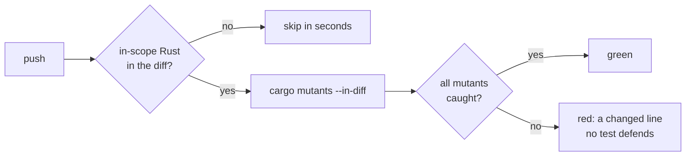

# Add Mutation Testing to the Headless Crates

## Why

SpecForge's merge gate — `cargo fmt`, `cargo clippy -D warnings`,
`cargo test --workspace`, `bun run build` — proves that 472 tests *run* and
pass. It says nothing about whether those tests would *notice* a bug. Coverage
has the same blind spot: a line can be executed by a test that asserts nothing
about it, and the report still shows it green.

That gap is where silent regressions live. `openspec-core` is where it matters
most: it owns the parsers, the registry, the git porcelain reader, and the
watcher's three-phase recompute — logic with real invariants, consumed by three
separate frontends, and refactored often.

Mutation testing measures the gap directly. `cargo-mutants` injects small
behavioural bugs — flip a comparison, drop a `!`, return `Default::default()` —
and reports which ones no test catches. Each survivor is a line that can be
broken with the whole gate still green.

Introducing it also forced a real defect into the open. `cargo mutants` refuses
to run when the unmutated baseline fails, and the baseline *did* fail:
`concurrent_cache_write_is_not_blocked_by_an_in_flight_recompute` proved its
invariant by racing a 60-worktree recompute against an `add_workspace` and
asserting the latter finished first. On Apple Silicon that ordering inverted —
`add_workspace` stands up a real FSEvents watcher, which is slow and highly
variable, while the recompute's git spawns are fast — so `cargo test --workspace`
had been red on macOS while passing on CI's slower Linux runner.

## What Changes

- **Adopt `cargo-mutants`, scoped to `openspec-core` and `openspec-app`.**
  Configuration lives in `.cargo/mutants.toml`, so a bare `cargo mutants` from
  the repo root is already correctly scoped. The three shell crates are out of
  scope: `specforge` and `specforge-web` *cannot build* in a mutants scratch
  tree (both need the gitignored `dist/`, which the tree copy cannot contain),
  and `specforge-tui` would report ~1,300 untested lines as survivors.
- **Gate on changed lines, not on the whole surface.** A new `mutants.yml`
  workflow runs `cargo mutants --in-diff` against the diff each push
  introduced. Existing survivors are a backlog; new ones fail the build.
- **Replace the racing concurrency test with a deterministic one.** A
  `recompute_gate` rendezvous in `watcher.rs` parks the recompute at the
  phase-1/phase-2 seam so the assertion has no timing component at all.
- **Add a `[profile.mutants]` cargo profile** (`inherits = "test"`,
  `debug = "none"`) to cut per-mutant link time.

Nothing is **BREAKING**: no runtime behaviour, IPC shape, setting, or persisted
format changes. The only production-code edit is a disarmed test hook costing
one relaxed atomic load per recompute.

## Capabilities

### New Capabilities

- `mutation-testing`: mutation-testing scope and exclusion policy, the
  changed-lines CI gate and how it resolves its diff base, timeout policy, the
  local developer commands, and the obligation to record a periodic full-sweep
  baseline.

### Modified Capabilities

_None._ The `continuous-integration` capability is deliberately untouched: its
requirements enumerate `ci.yml`'s five jobs and pin them to `ubuntu-latest`, and
a mutation run belongs in a separate workflow with its own concurrency and
timeout policy rather than as a sixth job in a pipeline that finishes in under
two minutes. This mirrors the existing `release-pipeline` / `release-command`
split.

## Impact

- **`openspec-core`**: `watcher.rs` gains a `#[doc(hidden)] pub mod
  recompute_gate` and one call at the existing phase boundary;
  `tests/repo_monitor.rs` loses the racing test; `tests/recompute_concurrency.rs`
  is new.
- **Repo root**: `.cargo/mutants.toml` (new), `[profile.mutants]` appended to
  `Cargo.toml`, `mutants.out` entries in `.gitignore`.
- **CI**: `.github/workflows/mutants.yml` (new). `ci.yml` is **not** modified.
- **Docs**: command-table rows in `README.md` and `CLAUDE.md`, plus a dated
  baseline-sweep table.
- **Deliberately unchanged**: no frontend mutation testing — `src/` has zero
  tests, so there is nothing to measure; no scheduled CI sweep, so the full
  picture is a manual, documented command; no remediation of existing survivors,
  which are follow-up work.
- **Risk**: the gate could become noisy enough to be routed around. See
  `design.md` for why the diff scope and the written-reason exclusion rule are
  the mitigations, and what would falsify that bet.
