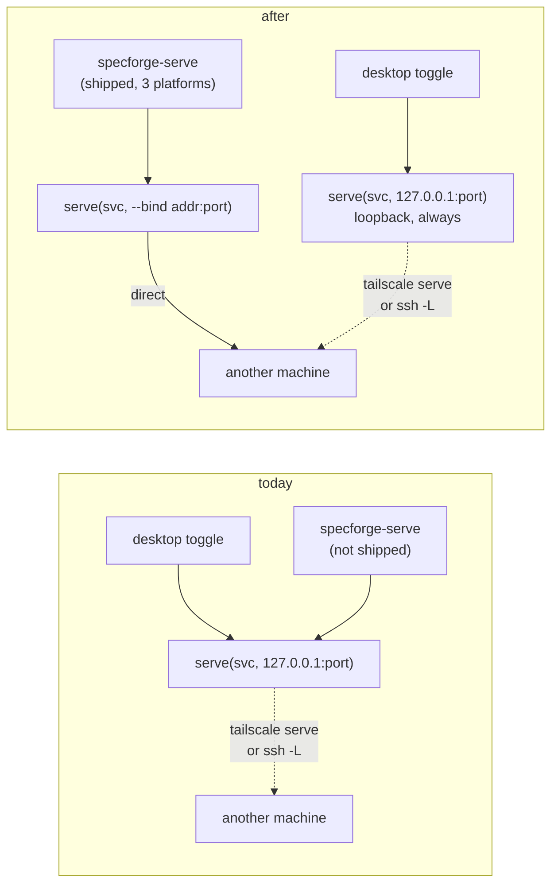

# Serve the Web UI on a Network Interface

## Why

`specforge-serve` — the standalone headless web server — already renders the full browser skin from its own `AppService`. Two things stop it from being usable on the machine where you'd actually want it, a remote dev box or homelab server reached over SSH:

1. **It isn't shipped.** `release.yml` builds and uploads the desktop bundles plus `specforge-tui` for macOS/Linux/Windows. `specforge-serve` is never built in CI, so the only SpecForge you can download onto a headless box is the TUI. The server exists but is unobtainable without a Rust toolchain and a source checkout.
2. **It binds loopback only.** Today the two supported ways to reach it from another machine are `tailscale serve` (requires Tailscale on the host, added by `2026-06-21-add-tailscale-serve`) and an SSH tunnel. On a LAN the operator already trusts, both are ceremony around what should be one flag.

The ask is a direct one: `specforge-serve --bind 0.0.0.0 --port 4317`, and a binary on the releases page to run it with.

## What Changes

- **Ship `specforge-serve` as a release asset** for macOS (universal), Linux x64, and Windows x64, mirroring the five existing `specforge-tui` requirements in `release-pipeline` — built inside the same per-platform job, with the plain `cargo` / `cargo-xwin` toolchain, packaged as `.tar.gz` / `.zip`, unsigned, version-stamped from the tag. No new jobs, no new runners, no new toolchain: every job already runs `bun tauri build`, which runs `bun run build` first, so the `dist/` that rust-embed compiles in is guaranteed present.
- **Add `--bind <addr>` to `specforge-serve`**, defaulting to `127.0.0.1`. Accepted as a bare address (`--bind 0.0.0.0`) combined with the existing `--port`, with `SPECFORGE_WEB_BIND` as the environment fallback mirroring `SPECFORGE_WEB_PORT`.
- **Binding a non-loopback interface disables the request-authority allowlist** — `Host` and `Origin` are accepted unconditionally. This is deliberate and is the point of the flag: a bound LAN interface with a loopback-only allowlist would `403` every request, which is a worse outcome than either alternative. The operator asking for `--bind 0.0.0.0` has declared the network trusted; the server takes them at their word. `design.md` records precisely what that admits.
- **Refuse to start** when a non-loopback bind is combined with a configured Tailscale login allow-list. That control's entire basis is the loopback bind (`web-ui/spec.md:152`), so a network bind silently voids it. A loud refusal beats a security control that quietly stopped working.
- **`--help` / `--version`, and an honest startup banner** that names the exposure instead of printing `http://0.0.0.0:4317` as though it were a URL.
- **The embedded desktop server is untouched.** `--bind` is a CLI flag on the standalone binary only, never a persisted `WebServerConfig` field, so no settings edit can push the desktop app's toggle off loopback.

Nothing is **BREAKING**: the default bind is unchanged, the embedded path is unchanged, and a `specforge-serve` invoked exactly as today behaves exactly as today.

## Capabilities

### Modified Capabilities

- `web-ui`: the loopback-only bind becomes a property of the *embedded* server and the *default* for the standalone one, rather than an absolute; the request-authority allowlist gains a defined behaviour under an explicit network bind; the Tailscale requirement records how its login gate interacts with one.
- `release-pipeline`: the standalone `specforge-serve` binary joins `specforge-tui` as a per-platform release asset, under a parallel set of requirements.

### New Capabilities

_None._ This is reach and distribution for the existing `web-ui` capability, not new behaviour — the command surface, event stream, and bundle are untouched.

## Impact

- **`specforge-web/src/main.rs`**: `--bind` parsing beside the existing `resolve_port`, `SPECFORGE_WEB_BIND` fallback, `--help` / `--version`, the startup banner, and the fail-loud check against a configured Tailscale login allow-list.
- **`specforge-web/src/lib.rs`**: `GuardConfig` gains a trust mode so `authority_guard` can bypass the `Host`/`Origin` checks under an explicit network bind. `build_guard_config` learns the bind address. `serve()` no longer documents "must be loopback".
- **`.github/workflows/release.yml`**: per job — build `specforge-serve`, package it, add it to the upload glob (macOS additionally builds both arches and `lipo`s them, exactly as the TUI does).
- **`openspec-app`**: unchanged. Deliberately no new `WebServerConfig` field — see `design.md`.
- **`openspec-core`, `specforge` (Tauri), `specforge-tui`, frontend (`src/`)**: unchanged.
- **Dependencies**: none new. `--bind` parses into the `std::net::IpAddr` already reachable via `SocketAddr`.
- **Risk, stated plainly**: `--bind 0.0.0.0` publishes an unauthenticated read API — every `.md` under every registered workspace, `list_markdown_files`, the commit graph and full commit diffs, plus the `set_*` settings arms — to anyone who can open a socket to the port. Because the authority allowlist is disabled in this mode, that also includes a DNS-rebinding path, so a malicious site visited by *any* browser on that network can read the same data without being on the network itself. This is the accepted trade for the flag existing; the mitigation is that it is opt-in, off by default, absent from the embedded server, unavailable from any UI, and announced at startup.
- **Deliberately out of scope**: no authentication (token, basic auth, TLS) — if that is wanted it is a separate change layering *onto* this flag; no `--read-only` mode; no reverse-proxy/TLS guidance; no change to the TUI binary; no `--bind` on the desktop app's embedded toggle.
