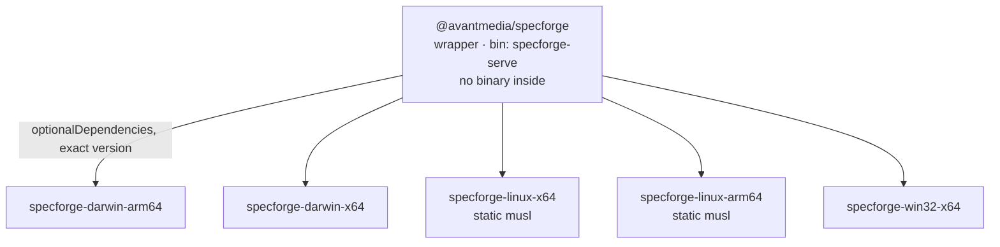
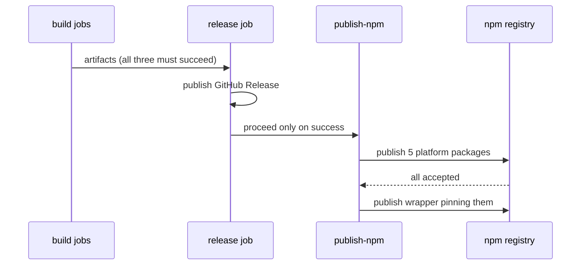

## Context

Today the release pipeline has exactly one distribution channel: a GitHub Release carrying the GUI bundles plus standalone `specforge-tui` and `specforge-serve` archives. Getting the headless server means finding the release page, choosing an archive, extracting it, and — on macOS — clearing the quarantine attribute, because a terminal binary has no Gatekeeper "Open anyway" dialog.

Three facts about the current state shape this design:

- **The audience already runs npm.** SpecForge browses OpenSpec workspaces, and the OpenSpec CLI is itself published to npm. Anyone with a workspace to browse already has a JavaScript package manager and the `npx` habit.
- **crates.io is not available as an alternative.** `specforge-web` embeds the gitignored `dist/` at compile time via `rust-embed`. Publishing the crate would require either committing build output or driving a frontend build from a `build.rs`. Shipping prebuilt binaries avoids the problem entirely.
- **The Linux binary already has a latent defect.** It is built on `ubuntu-latest` and dynamically linked, so it fails to start on distributions with an older C library. Today that affects a small number of archive downloaders; an npm channel would multiply the exposure, since npm users frequently run inside arbitrary container images.

The pipeline's existing invariants constrain the solution: artifacts are unsigned, build jobs are per-platform with no extra runners for the headless binaries, publication depends on every build job succeeding, and the version is stamped from the tag rather than read from a committed file.

## Goals / Non-Goals

**Goals:**

- Make `npx @avantmedia/specforge` a complete path to a running server on macOS, Linux, and Windows.
- Cover the platforms a headless server actually runs on, including Linux `arm64` and musl-based distributions.
- Reuse the binaries the pipeline already builds; add no compilation to the publish path.
- Keep publication safe against the irreversibility of npm — a failure must never leave a wrapper resolving to a version that does not exist.
- Fix the Linux C-library floor for both channels while we are in here.

**Non-Goals:**

- Publishing `specforge-tui` to npm. The umbrella package name leaves room for a second bin later, but that is a separate change.
- Publishing the desktop application through npm; the GUI keeps its installers.
- Code signing or notarization. The unsigned posture is unchanged.
- Changing any Rust source, the serve binary's flags and defaults, the frontend, or the IPC surface.
- Backfilling npm packages for releases already published.

## Decisions

### Package graph: a scoped umbrella wrapper over five platform packages

One wrapper, `@avantmedia/specforge`, exposing a `specforge-serve` bin, with five platform packages selected by npm's `os`/`cpu` fields.

The scope is forced, not stylistic: the unscoped `specforge` name on the public registry belongs to an unrelated project, as does `@specforge/cli`. Scoping is what lets the published identity keep the product name.

*Rejected — a per-binary wrapper named `@avantmedia/specforge-serve`.* More literal, and it would keep a future TUI's payload separate. But it forecloses the cheaper future: with an umbrella, adding the terminal UI later is one more `bin` entry over the same five platform packages, not a second wrapper with its own five-package graph to keep in version lockstep. The cost is that a future TUI-only user also downloads the embedded web bundle — acceptable against maintaining twice the package surface.

*Rejected — the unscoped `specforge` name.* Unavailable.

### Selection by `os`/`cpu`, never by a `postinstall` downloader

The package manager picks the platform package from manifest metadata, so exactly one binary is fetched and no install-time code runs.

*Rejected — one package with a `postinstall` that downloads from GitHub Releases.* Fewer packages to publish, but it breaks under `--ignore-scripts` (a common organizational default), breaks on offline and mirrored registries, breaks behind proxies, and makes the releases host a hard dependency of `npm install` complete with its rate limits. *Rejected — fetching on first run*, which moves the same failures to a worse moment.

### Both Linux targets ship statically linked against musl, in both channels

The Linux binaries become static musl builds, and the GitHub Release archive changes with them rather than keeping a separate glibc build.

This is viable without touching code: git, Tailscale, and WSL are invoked as subprocesses, and the HTTPS client uses rustls rather than OpenSSL, so nothing in the graph resists static linking. One static binary runs on Alpine, on current distributions, and on older long-term-support ones — which retires the existing C-library floor defect for archive downloaders too.

*Rejected — musl for npm, glibc for the archive.* Two Linux builds instead of one, and the two channels would ship different bytes for the same release, giving up a property worth having. *Rejected — keeping glibc but building on an older runner image.* It raises the floor without reaching musl distributions, and the floor rises again whenever the pinned image is retired.

### Cross-compilation happens inside the existing Linux job

Both musl targets are cross-compiled in the job that already builds the Linux bundles.

*Rejected — a dedicated `build-linux-musl` job, or a native `arm64` runner.* Either would keep wall-clock flatter by running in parallel. Both were rejected because the `release-pipeline` capability guarantees that no additional runner is introduced for the headless binaries, and a separate job would also duplicate the Rust cache. The accepted cost is that two additional target compilations sit on the Linux job's critical path; the dependency graph cannot be reused across targets, so this is real time rather than a cache miss.

### Linux platform packages declare no `libc` field

A static musl binary runs on glibc systems, so the packages must not be constrained to musl hosts.

*Rejected — declaring `libc: ["musl"]`.* It reads as obviously correct and is exactly backwards: it would exclude every glibc-based distribution, which is most of the audience, from the package that serves them best. Recorded here because this is the kind of mistake that gets "fixed" into existence later.

### macOS publishes thin slices; the release keeps the universal archive

The macOS job already compiles both architectures separately before merging them, so the single-architecture binaries exist on disk before `lipo` runs. npm takes those; the GitHub Release keeps the universal archive.

*Rejected — one `darwin` package carrying the universal binary with no `cpu` constraint.* Simpler, one fewer package, but it makes every macOS user download an architecture slice they cannot execute. The split costs no compilation at all, so simplicity is not worth paying a doubled download for.

### Publication is ordered, and generated rather than committed

Publication runs after the GitHub Release succeeds; within it, all five platform packages publish before the wrapper that pins them.

npm publications cannot be reliably retracted, so ordering is the whole mitigation. Release-first means a failed release costs nothing on the registry; platform-packages-first means a partial failure leaves unreferenced orphans rather than a wrapper pointing at versions that were never published. The job must be re-runnable for an already-pushed tag so a registry blip does not consume a version number.

All six manifests are generated at publish time from the tag, never committed, preserving the invariant:

$$v_{\text{wrapper}} \;=\; v_{\text{platform}_i} \;=\; \operatorname{strip}_v(\text{tag}) \qquad \forall\, i \in \{1 \dots 5\}$$

*Rejected — committing six manifests and stamping them like `tauri.conf.json`.* That creates six files that can drift from one another and from the tag, and the stamping action today deliberately declines to touch `package.json` at all. Generating removes the drift rather than policing it.

### Authentication by OIDC trusted publishing, with provenance

Publication authenticates through the workflow's OIDC identity and attaches build provenance.

*Rejected — a long-lived automation token in repository secrets.* Simpler to set up once, but it is a durable credential to store and rotate, and it produces no provenance. Since everything else this project ships is unsigned, a registry-verifiable statement of where the artifact was built is worth the per-package trusted-publisher configuration. Note that provenance attests the build, not the binary's authorship — it is not a substitute for code signing and must not be described as one.

## Risks / Trade-offs

- **An npm publication cannot be undone; a bad publish burns a version number permanently.** → Publish only after the GitHub Release succeeds, platform packages before the wrapper, so no failure mode produces a resolvable-but-broken wrapper. Make the job re-runnable for the same tag so transient failures cost nothing.
- **Two extra target compilations lengthen the Linux job.** → Accepted deliberately to preserve the no-additional-runner guarantee. The per-target Rust cache absorbs the cost on repeat runs; only the first build after a dependency change pays in full.
- **Switching the Linux archive to static musl changes an artifact people already download.** → It strictly widens compatibility: a static binary runs everywhere the dynamic one did, plus the distributions where it previously failed. The behaviour change is a fix, and the release notes should say so rather than let it pass silently.
- **A package manager can resolve `optionalDependencies` to nothing, a known and recurring npm defect.** → The shim must detect the empty case and exit with a message naming the detected platform and pointing at the release downloads, rather than surfacing a module-resolution stack trace.
- **A prerelease tag published to the default dist-tag would hand every `npx` user a release candidate.** → Any version carrying a prerelease suffix publishes under `next`; only stable tags move `latest`.
- **`npx` re-resolves the package on every invocation, which is wrong for a long-running server on a remote box.** → Documentation should present `npx` as the try-it path and a global install as the way to run it persistently.
- **A zero-install path could make an unauthenticated network bind easier to reach carelessly.** → No new mitigation is introduced: the default remains loopback, the startup warning remains loud, and the refusal behaviour for unsafe binds is unchanged. Flagged because the channel lowers the effort of reaching the flag, not because the flag's safety changed.
- **Six packages mean six trusted-publisher configurations before the first release can publish.** → One-time setup, but it must be completed before a tag is pushed, or the first publish fails after the release is already public.

## Open Questions

- The `@avantmedia` npm organization must exist and own the scope before the first publish. The scope has no published packages today, but registry metadata cannot confirm ownership — it has to be claimed to be certain.
- Whether to also claim the currently-free unscoped `specforge-serve` and `specforge-tui` names defensively, pointing at the scoped packages. Not required by this change; cheap now and unavailable later if someone else takes them.
- Whether the README should lead with the npm channel for the headless server, or keep the desktop bundle as the headline and place npm first only within the server section.
