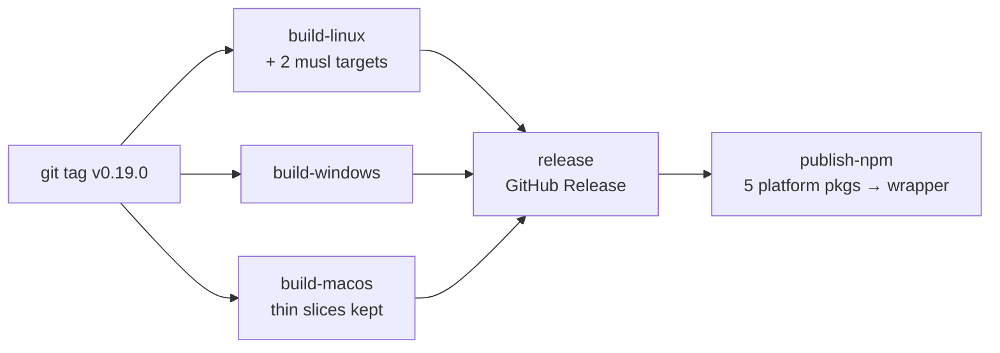

# Add npm as a Distribution Channel for the Headless Web Server

## Why

`specforge-serve` is the lowest-friction way to see SpecForge at all — one binary, embedded UI, `127.0.0.1:4317` — but the only way to get it is a GitHub Release: find the page, pick the right archive, extract it, then clear the macOS quarantine flag because a terminal binary has no right-click ▸ Open dialog. That is six steps and one scary one.

Every SpecForge user is, by definition, an OpenSpec user — and the OpenSpec CLI itself ships as `@fission-ai/openspec` on npm. The audience already has a JavaScript package manager installed and already has the `npx` reflex. Publishing the serve binary there collapses the funnel to `npx @avantmedia/specforge`, and because files extracted by npm never receive the macOS `com.apple.quarantine` xattr or the Windows Mark-of-the-Web, the channel *removes* the trust ceremony rather than merely shortening it.

It is also the cheapest channel available. `crates.io` is effectively closed to `specforge-web`: `assets.rs` embeds the gitignored `dist/` via `rust-embed` at compile time, so `cargo install specforge-serve` cannot work without committing build output or shelling out to bun from a `build.rs`. npm's ship-prebuilt-binaries model sidesteps compilation entirely.

## What Changes

- **New npm channel** — one wrapper package `@avantmedia/specforge` exposing a `specforge-serve` bin, backed by five platform packages selected by npm's `os`/`cpu` fields via `optionalDependencies`. Exactly one platform package is downloaded per install. No `postinstall`, no network fetch, so the channel survives `--ignore-scripts`, offline installs, and private registry mirrors.
- **Platform matrix expands** — `linux-arm64` is added (the true audience for a headless server), and both Linux headless binaries become **statically linked musl** builds. That retires an existing latent defect: `ubuntu-latest` is glibc 2.39, so today's Linux tarball already fails to start on Debian 12, Ubuntu 22.04, and RHEL 8. One static build fixes both channels at once and makes Alpine work.
- **macOS splits at no build cost** — the macOS job already compiles `x86_64-apple-darwin` and `aarch64-apple-darwin` separately before `lipo` merges them. npm takes the thin slices that already exist on disk; the GitHub Release keeps its universal tarball. Zero additional compilation for two of five platforms.
- **Publishing is ordered, not parallel** — npm publish runs *after* the GitHub Release succeeds, and within it the five platform packages publish before the wrapper that pins them. npm publishes are effectively irreversible, so ordering is the mitigation: a failure leaves unreferenced orphan packages, never a wrapper pointing at versions that do not exist.
- **Prerelease tags publish under `next`** — the pipeline already supports `v0.2.0-rc.1`; without this an RC would become the default `npx` result.
- **Release notes and README** gain the npm channel, and the README leads with it.

**Not in scope:** the `specforge-tui` binary keeps its GitHub-Release-only distribution. The umbrella package name leaves room to add a `specforge-tui` bin later without a second package graph, but shipping it is a separate change.

## Capabilities

### New Capabilities

- `npm-distribution`: the npm channel itself — the wrapper/platform package graph, `os`/`cpu`/`libc` selection rules, the bin shim's resolution and failure behaviour, publish ordering and atomicity, dist-tag selection for prereleases, and build provenance.

### Modified Capabilities

- `release-pipeline`: adds a `linux-arm64` headless asset, makes the Linux `specforge-serve` binary statically linked against musl rather than dynamically against the runner's glibc, and adds a publish job that depends on the release job. The existing "no new runner for the serve binary" guarantee is preserved — the musl targets cross-compile inside the existing Linux job.
- `release-command`: the Downloads footer requirement currently enumerates only the macOS/Windows/Linux archive artifacts. It must also document the npm channel, and must state that the macOS quarantine caveat does **not** apply to an npm install.
- `product-identity`: the existing requirement fixes the npm package name as `specforge`, written when nothing was ever published. The unscoped `specforge` name on the public registry belongs to an unrelated project, so the published identity is `@avantmedia/specforge` — the product name preserved inside a scope we own — while the private root `package.json` keeps its unpublished `specforge` name.

## Impact

**Changed:**

- `.github/workflows/release.yml` — two musl cross-compile targets and a `linux-arm64` archive in `build-linux`; retention of the pre-`lipo` darwin slices in `build-macos`; a new `publish-npm` job gated on `release`.
- `npm/` (new) — wrapper and platform package templates plus the generator that stamps the version and the exact-pinned `optionalDependencies` at publish time. Generated, not committed, so the six versions cannot drift.
- `README.md` — npm becomes the lead install path for the headless server.
- `openspec/specs/{release-pipeline,release-command,product-identity}/spec.md` — via the delta specs above.

**Deliberately unchanged:**

- **No Rust source changes.** The serve binary's behaviour, flags, bind defaults, and embedded assets are untouched; this is a packaging and pipeline change. The workspace is pure Rust at the link level — `git`, `tailscale`, and `wsl.exe` are subprocesses, and TLS is rustls rather than OpenSSL — so static musl needs no code or dependency change.
- **No frontend, IPC, or `src/types.ts` changes.**
- **No desktop-app changes.** The `.dmg`, `.deb`, `.AppImage`, and both Windows `.exe` artifacts keep their current toolchains and dynamic linking; only the headless binary goes static.
- **No `specforge-tui` npm package**, and no change to its existing archives.
- **No code signing.** The pipeline's unsigned-artifacts posture is unchanged; npm provenance is a registry attestation, not a code signature.
