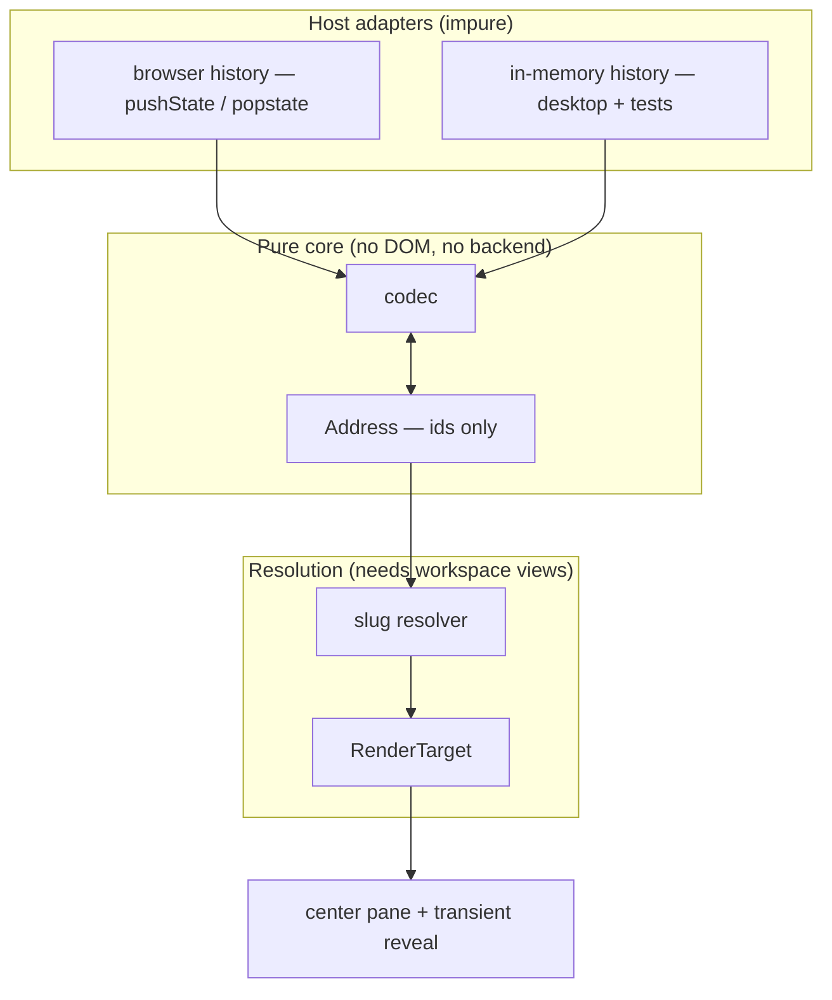

## Context

All of SpecForge's viewing state lives in `App.tsx` component state. There is no value that names "what am I looking at", so it cannot be serialized, restored, or shared. Over the `web-ui` transport this is a functional gap: reload lands on the Dashboard, Back leaves the application, and the sharing machinery the `web-ui` capability already built (Tailscale Serve, MagicDNS authority allowlist, per-user login allow-list) has nothing to share.

Three properties of the existing code shape this design:

- **Every identity is an absolute host path.** `workspaceUri` is a filesystem path, `RepoId` is `PathBuf` (the git common dir), and a repo-hosted artifact's `workspace` field is the *worktree* path. Nothing in the model is safe to publish as-is.
- **The mapping is already centralized.** One `handleSelect` switch and one `RenderTarget` union describe every renderable state, so the surface to route is small and already enumerated.
- **Tree expansion is persisted server-side.** `collapsedTreeNodeIds` / `expandedTreeNodeIds` are settings-backed, and `spec-browser` forbids seeding effects that mutate them. Any reveal mechanism must work above them, not through them.



## Goals / Non-Goals

**Goals:**

- Give every renderable view a serializable, identifier-only Address.
- Make addresses safe to publish: no host filesystem paths, and no ability to name an unregistered location.
- Keep navigation semantics identical between the desktop shell and the served web UI.
- Keep the change frontend-only — no Rust, no IPC surface, and nothing added to the shipped bundle.
- Never let following a link mutate the recipient's persisted tree preferences.

**Non-Goals:**

- Commit permalinks. Resolving a sha outside the loaded graph window needs a by-sha metadata read that `openspec-core` does not expose; adding it would pull Rust into scope.
- Fragment-based scroll anchors. `MarkdownView` currently classifies `#`-prefixed hrefs as inert; claiming the fragment namespace is a separate behavioural change.
- File-browser subpaths, which would require `FileBrowserView` to accept an initial expansion path.
- Native macOS menu items for back/forward, which need Rust and an `application-menu` delta.
- Any change to what the UI can read or write. This is a naming layer over existing read paths.

## Decisions

### Registry slugs, not filesystem paths

An Address names a workspace by a slug derived from its stable registered name, resolved against the loaded workspace list. The display-name override is explicitly *not* the slug source, because it is user-editable and would make renaming a row silently break every link to it.

The security argument is the decisive one. A URL carrying a raw path invites the next contributor to hand it to `read_artifact`; a slug cannot name anything that is not already registered, so the resolver is a closed set lookup rather than an attacker-influenced path.

- **Rejected — percent-encoded absolute paths.** Zero new machinery and synchronous resolution, but it publishes the host's directory layout into other people's history and bookmarks, makes `%2F` segments travel through the `tailscale serve` proxy that is the intended sharing path, and models the URL as a filesystem path.
- **Rejected — opaque short hashes.** Stable and leak-free, but unreadable and untypeable. The point of the change is links people send each other; `/w/a3f2c918/...` tells the recipient nothing.

### Shortest unambiguous address, with ambiguity surfaced rather than guessed

Generation emits the shortest form unique against the current registry: a bare slug when nothing collides, an instance segment only when a logical change has more than one instance. Resolution is forgiving — an address that has *become* ambiguous presents the candidates instead of choosing.

For an address $a$ over registered candidates $W$, generation guarantees $\lvert \{\, w \in W : \mathrm{matches}(a, w) \,\} \rvert = 1$ at the time of emission; resolution handles the case where that count later exceeds one.

One rule covers two structurally identical problems — colliding workspace slugs, and a logical change growing a second worktree instance — which is why it is stated once rather than twice.

- **Rejected — always suffix every slug.** Permanently stable, but permanently ugly for the overwhelmingly common case where nothing ever collides.
- **Rejected — stable tie-break, first sorter keeps the bare slug.** Deterministic, but registering a new workspace could silently transfer ownership of an existing link, which is worse than the honest "two things match, pick one".

### A hand-rolled codec, not a router library

The Address ↔ URL codec is pure: no DOM, no history object, no workspace data, no backend. Its invariant is $\mathrm{decode}(\mathrm{encode}(a)) = a$ for every valid Address $a$, which makes it exhaustively unit-testable with no mocking — the same instinct as the `openspec-core` / Tauri split.

```text
/                                        home surface
/settings                                settings pane
/archive                                 archive browser
/archive/<workspace>/<archive-dir>       archive browser, pre-selected
/w/<workspace>                           file browser at a flat workspace
/w/<workspace>/<change>/<artifact>       proposal | design | tasks
/w/<workspace>/<change>/specs/<cap>      a capability spec
/r/<repo>                                file browser at a repo's main worktree
/r/<repo>/<change>/<artifact>            single-instance change
/r/<repo>/<change>/<instance>/<artifact> multi-instance change
```

- **Rejected — react-router.** Roughly 20KB plus a Provider, and its value (nested routes, loaders, outlets) addresses problems this single-screen app does not have. The mapping already funnels through one union and one handler, and the codebase's precedent is hand-rolled infrastructure (tree store, split pane, virtualisation).

### Frontend tests run on Bun's built-in runner

The repository has no frontend test infrastructure today — no runner, no test files, no `test` script; `bun run build` (strict `tsc` then bundle) is the only frontend gate. A codec whose value rests on being exhaustively testable needs somewhere to be tested, so this change introduces the repository's first frontend tests using `bun test`, which the existing package manager provides natively.

The runner itself is a script, not a package, but typechecking `bun:test` imports under the strict `tsc` gate does require the `@types/bun` devDependency. That is a types-only addition with no runtime code and no bundle impact — the shipped bundle gains nothing — but it is a dependency, so it is stated rather than glossed.

The suite's scope is the pure layer: the codec's round-trip invariant, slug derivation, shortest-unambiguous emission, and the in-memory history adapter. This leaves a known hole — nothing renders — so a defect that only manifests during React's render cycle passes every automated gate. The manual smoke is therefore load-bearing, not ceremonial, and any invariant React enforces at a hook boundary should be pushed down into a pure, testable seam rather than left to the smoke alone.

Note that the mutation-testing gate does not reach any of this: `.cargo/mutants.toml` scopes `cargo mutants` to the Rust crates, so a frontend-only change has a vacuous mutation score. The `bun test` suite is the substantive automated gate for this change.

- **Rejected — adding Vitest or Jest.** More familiar and richer in features, but both are new dependency trees for a codebase that currently ships none for testing, and neither buys anything for pure functions with no DOM and no module mocking.
- **Rejected — shipping the codec untested.** The codec is the one piece whose correctness every address depends on, and it is the cheapest thing in the change to test.

### One codec, two history adapters

Navigation goes through a single `History` interface with a browser implementation (`pushState` / `popstate`) and an in-memory implementation (an array plus an index). The desktop shell uses the in-memory one and reaches it through a frontend keyboard handler; the served UI uses the browser one and inherits native Back/Forward. The web UI does not handle those gestures itself, so a single gesture never navigates twice.

The in-memory adapter is also what makes the whole navigation layer testable without `window.history`.

- **Rejected — routing only when `isWeb()`.** Smallest surface and it rhymes with the spec's host-detected transport, but it creates two navigation code paths that will drift, and leaves the desktop losing its selection on every Vite HMR full reload during development.
- **Rejected — `pushState` in the Tauri webview too.** Simplest mental model, but the desktop shell loads from the asset protocol, which is not expected to fall back to the app shell for unknown paths; a production reload on a deep route risks a blank window. The in-memory adapter sidesteps the question entirely rather than betting on it.

### Reveal is a transient overlay above the persisted sets

Revealing an addressed node uses a separate, non-persisted forced-open set layered above `collapsed` / `expanded`. It is cleared when the user navigates elsewhere.

Writing the persisted sets instead would mean that opening a link someone sent you rewrites *and durably saves* your tree preferences — a genuinely bad side effect — and would sit awkwardly against the `spec-browser` prohibition on seeding effects. The overlay keeps the persisted sets exclusively user-authored, which is what that requirement is really protecting.

- **Rejected — reuse the existing override sets.** Less state to carry, but it makes navigation indistinguishable from user intent and triggers a settings write per link followed.

### Normalize `FilesRenderTarget` now, leave `CommitRenderTarget` alone

Routable render targets must be identifier-only. `FilesRenderTarget.label` is trivially re-derivable from the workspace views, so it goes. `CommitRenderTarget` deliberately carries its whole `LaidOutCommit` because the rail has already loaded it — and since commit permalinks are out of scope, there is nothing yet that can present a sha the rail has not loaded.

- **Rejected — normalize both now.** Consistent, but a cold-loaded sha can fall outside the paged graph window, so it requires a new by-sha metadata read in `openspec-core`. That would trade a frontend-only change for speculative backend work supporting a deferred feature.

### Resolution is asynchronous with three outcomes

Decoding is synchronous; resolution waits for the workspace views. The pending state is explicit, and the home surface is not rendered while resolution is outstanding.

- **Rejected — render the home surface while pending.** Simpler, but a deep link would visibly flash the Dashboard and then jump, which reads as a bug and is why the `dashboard` delta states the behaviour explicitly.

## Risks / Trade-offs

- **Tree reveal is the fiddliest part of the implementation.** `WorkspaceTree` is ~1700 lines with two override sets of opposite polarity, a keyboard focus store, and compositional node ids. → Node ids are built deterministically (`repoId`, `logicalChangeId`, `instanceId`, `artifactNodeId`), so Address → nodeId is a pure function; build and test that mapping before wiring reveal, and expose reveal as one imperative entry point rather than scattering effects.

- **History spam would make Back useless.** A tree that pushed an entry per row would bury the previous view. → Verified that arrow keys call `focusRow` only and never `onSelect`, so focus traversal is already separate from activation; the discipline is codified as a requirement so it stays that way.

- **Slug collisions are rare enough to go untested in real use.** The disambiguation path may only ever run for someone with two identically-named workspaces. → It shares a code path with multi-instance disambiguation, which is common in this repo's own worktree-heavy workflow, so the mechanism gets exercised routinely even when slug collisions do not.

- **Addresses become a compatibility surface.** Once links are shared, changing the grammar breaks them. → The identity decision is made up front rather than shipped as raw paths and migrated later; the grammar's extension points (instance segment, capability segment) are additive.

- **Desktop back/forward via a key handler is less discoverable than a menu item** and cannot show enabled/disabled state. → Accepted for this pass to keep the change frontend-only; promoting it to real menu items is a scoped follow-on against `application-menu`.

- **Non-loopback serving publishes addresses into other people's browsers.** → Slugs mean those addresses carry no host paths, and external links in rendered markdown already use `rel="noopener noreferrer"`, so addresses do not leak through referrers either.

## Migration Plan

No persisted data changes and no stored addresses, so there is nothing to migrate. Existing persisted tree state is untouched by design. Rollback is a straight revert: nothing outside the frontend bundle is modified, and any address a user has bookmarked simply stops resolving — the pre-change behaviour of opening on the Dashboard.

## Open Questions

- Slug suffix form for collisions — a short hash of the canonical path versus a disambiguating parent-directory segment. The latter is more readable but variable-length and can itself collide.
- Whether a repository's main worktree should have an implicit instance name in multi-instance addresses, or always be spelled out for symmetry with its sibling worktrees.
- Whether the settings and archive panes should be addressable independently of the center-pane target they overlay, so that closing them restores the underlying view rather than a sibling address.
