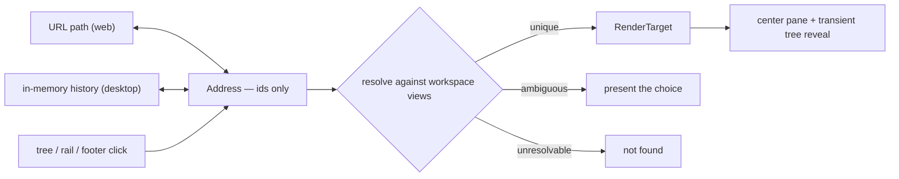

# Addressable View Routing

## Why

SpecForge's viewing state lives entirely in `App.tsx` component state, so it has no name. Served over the web that is a functional gap rather than a cosmetic one: a browser reload drops the user back on the Dashboard, the Back button leaves the application entirely, and there is no way to send anyone a link to a specific change — even though the `web-ui` capability has already built the machinery for other people to reach this UI (Tailscale Serve, a MagicDNS authority allowlist, a per-user login allow-list).

The underlying problem is not "there is no router". It is that "what am I looking at" is not a value the application can name, serialize, or restore.

## What Changes

- Introduce an **Address**: a serializable, identifier-only description of the current view (home, settings, archive, file browser, artifact). It carries ids and never carries resolved payloads or derived labels.
- Add a **pure codec** between an Address and a URL path. It has no dependency on the DOM, the workspace list, or the backend, so it is unit-testable in isolation.
- Add **two history adapters** behind one interface: a browser adapter over `pushState`/`popstate`, and an in-memory adapter used by the desktop shell and by tests. Both drive the same codec, so navigation semantics cannot drift between hosts.
- Identify workspaces and repositories by **registry slugs derived from their stable names**, never by absolute filesystem path and never by the mutable `displayName` override. A slug that does not resolve against the registered workspaces cannot name anything, so a URL can never introduce a path the user has not registered.
- Apply one rule to every ambiguity — colliding workspace slugs and multi-instance changes alike: **emit the shortest unambiguous address; when an address has since become ambiguous, present the choice rather than guessing.**
- Restore a deep address on cold load by resolving it once the workspace list arrives, then revealing the corresponding tree node through a **transient reveal overlay** that never writes the persisted collapse/expand override sets.
- Normalize `RenderTarget` so routable variants are identifier-only: `FilesRenderTarget` drops its derived `label`, which the shell re-derives from the workspace views.
- Bind back/forward to the desktop shell via a frontend key handler, so the in-memory adapter is driven by the user and not merely by tests. Browsers already provide these gestures natively, so the handler is desktop-only.
- Address only states that actually render. Change rows and the Specs artifact node remain pure disclosure rows per the existing *Deferred Interaction Nodes* requirement, so they get no address of their own.

## Capabilities

### New Capabilities

- `view-routing`: The address layer itself — the Address grammar, the pure Address-to-URL codec, slug identity and its stable derivation, the shortest-unambiguous-address rule and its disambiguation behaviour, the two history adapters, cold-load resolution states, transient reveal, and which navigations create history entries.

### Modified Capabilities

- `dashboard`: The *Dashboard Home Surface* requirement currently states the Dashboard is shown at startup unconditionally. It becomes the default for an absent or empty address, while an explicit address opens what it names — without weakening the "no nothing-selected placeholder" guarantee.
- `spec-browser`: The *Tree Expansion Has No First-Sight Auto-Expansion Effect* requirement forbids seeding effects that mutate the override sets. Clarify that a user-initiated navigation reveal is permitted precisely because it is transient — it must not write `collapsedTreeNodeIds` or `expandedTreeNodeIds` — so that following a shared link never rewrites and persists the recipient's tree preferences.
- `web-ui`: Pin the already-implemented static-asset SPA fallback as a requirement. Deep-link durability depends on unknown paths answering with the application shell; today that behaviour exists in code but no requirement protects it from being removed as dead weight.

## Impact

Frontend only. No Rust and no IPC surface. The codec and adapters are hand-rolled rather than adopting a router library, matching the existing hand-rolled tree store and split pane, so nothing is added to the shipped bundle.

One devDependency is added: `@types/bun`, required to typecheck `bun:test` imports under the strict `tsc` gate. It is types-only — no runtime code, no bundle impact — and it accompanies the repository's first frontend test suite (see design.md).

Touched:

- `src/routing/` (new) — Address types, the pure codec, slug derivation and resolution, and the two history adapters.
- `src/App.tsx` — viewing state becomes address-derived; `handleSelect`, `selectDashboard`, and the settings/archive toggles publish addresses. The existing `handleOpenShip` deep-link is subsumed by the archive address.
- `src/types.ts` — `FilesRenderTarget` loses its derived `label`.
- `src/components/WorkspaceTree.tsx` — an imperative reveal entry point plus a transient forced-open overlay, layered above the persisted override sets without touching them.

Deliberately unchanged:

- `crates/specforge-web/src/assets.rs` — the SPA fallback already behaves correctly; this change specifies it rather than altering it.
- The persisted collapse/expand override sets and their settings-backed write path.
- Markdown link handling. Fragment-based scroll anchors are out of scope, so the classification of `#`-prefixed hrefs as inert is untouched.
- `CommitRenderTarget` keeps its preloaded commit payload and gets no address. A commit permalink must resolve a sha outside the loaded graph window, which needs a by-sha metadata read that `openspec-core` does not currently expose; deferring it keeps this change free of Rust.
- File-browser subpaths, which would require `FileBrowserView` to accept an initial expansion path.
- The macOS application menu. Promoting back/forward to menu items with proper enablement is a follow-on that touches `application-menu` and the Tauri shell.
