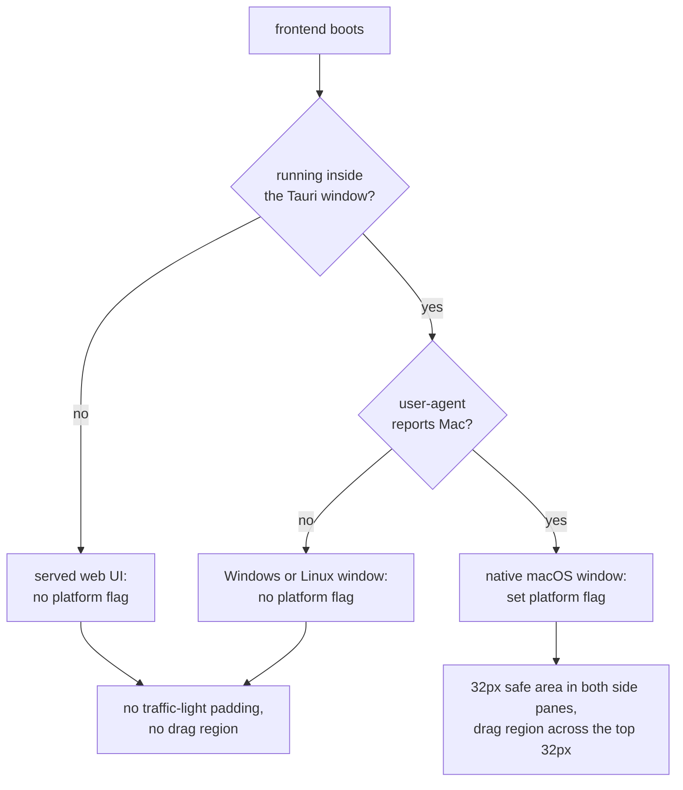
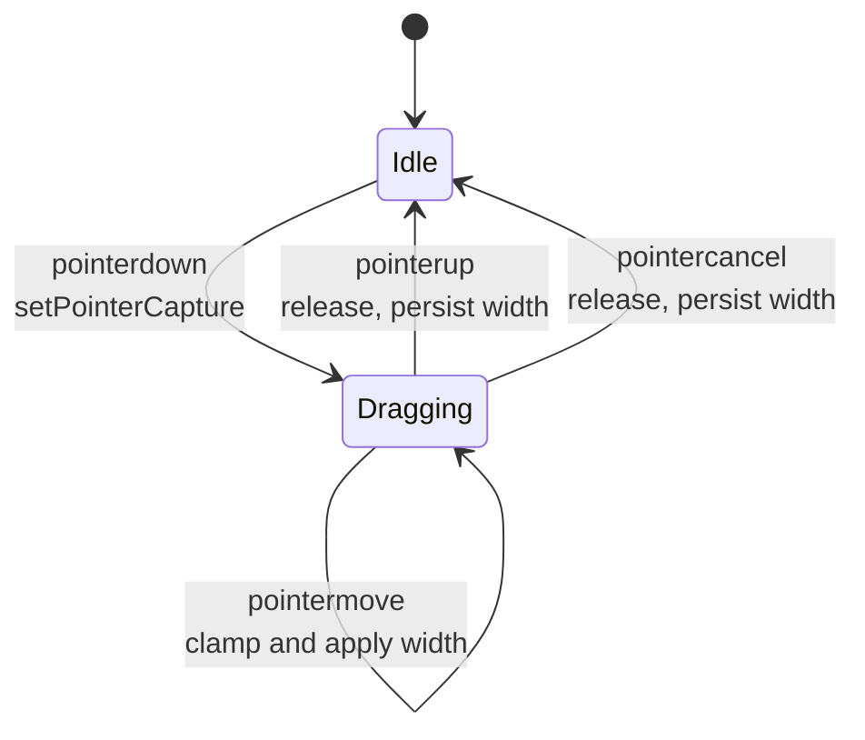

## Context

`src/` is a single frontend bundle served to two very different hosts: the Tauri desktop window, and any browser that reaches `specforge-web`. Every assumption the bundle makes about its host is therefore a claim about *both*. Three of those claims are currently false in a browser, and all three happen to be invisible on a developer's Mac because a Mac browser and a Mac desktop window look alike to the code.

Current state, measured on the real bundle at iPad Pro 11" geometry:

| Claim in the code | True in the Tauri window | True in a browser |
|---|---|---|
| `100vh` is the height I can paint into | yes | **no** — it is the *large* viewport, which retractable chrome never yields while the page cannot scroll |
| a `Mac` user-agent token means a macOS window with inset traffic lights | n/a | **no** — every iPad and iPhone UA carries the token |
| a drag is a sequence of mouse events | yes | **no** — touch produces pointer events; iOS synthesises mouse events for taps only |

The binding constraint is that `html`, `body`, and `#root` are all `overflow: hidden`. That is deliberate — the shell owns its own scroll regions — but it means *overflow is not recoverable*. There is no scrollbar with which a user can reach anything the shell pushes past the viewport edge. The layout must fit, or the content is simply gone.

Let $h_{shell}$ be the shell's laid-out height and $h_{visible}$ the viewport the browser actually exposes. The invariant this change must establish is:

$$h_{shell} \le h_{visible}$$

Today `.app-shell` and `.split-pane` declare `height: 100vh`, which on iOS resolves to the large viewport, giving $h_{shell} > h_{visible}$ by the height of the browser chrome.

## Goals / Non-Goals

**Goals:**

- Establish $h_{shell} \le h_{visible}$ on every host, so bottom-anchored sidebar chrome stays reachable.
- Make the platform flag mean what its name says — *native macOS window* — rather than *user-agent mentions Mac*.
- Give divider dragging a single input path that mouse, touch, and pen all drive.
- Ensure no control that is the only route to an action is hidden behind a hover that a touch device cannot produce.
- Change nothing about how the desktop app looks or behaves.

**Non-Goals:**

- **Responsive layout.** Side-pane widths stay fixed, so a portrait tablet still yields a narrow detail pane ($w_{detail} = w_{viewport} - 602$). Restoring touch dragging gives the user a manual remedy; a reflowed single-pane layout for narrow viewports is deliberately a later change.
- **Mobile-phone support.** The target is a tablet-class viewport. Phone layouts would need the responsive work above.
- **PWA affordances** — no manifest, no home-screen install, no offline handling.
- **Virtual-keyboard handling.** The UI is read-only apart from a workspace-name field; the interactive-widget viewport story is out of scope.
- **Any Rust, IPC, transport, or dependency change.**

## Decisions

### Decision 1: Size the shell with `height: 100%` plus a `100dvh` override

`.app-shell` and `.split-pane` will declare both, in this order:

```
height: 100%;
height: 100dvh;
```

`html`, `body`, and `#root` are already `height: 100%`, so the first declaration completes an existing definite-height chain down from the initial containing block — which is sized to the *small* viewport, and is therefore never larger than what the user can see. The second declaration states the intent unambiguously in browsers that support dynamic viewport units, and is ignored by those that do not. Since the document never scrolls, `dvh` never changes underfoot, so the usual objection to `dvh` (reflow as chrome retracts mid-scroll) does not apply here.

**Rejected — keep `100vh` and add a JS-measured `--vh` custom property.** This is the classic pre-`dvh` workaround: measure `window.innerHeight`, write it to a custom property, recompute on `resize` and `orientationchange`. Rejected because it reintroduces in JavaScript a value CSS already knows, fires layout work on every orientation change, and leaves a wrong first paint before the first measurement lands.

**Rejected — `100svh` alone.** Correct, but it pins the shell to the *small* viewport permanently. `dvh` is the honest expression of "as much as I actually have", and with a non-scrolling document the two coincide anyway; `dvh` costs nothing and is right if the page ever gains a scroll.

**Rejected — drop the height declarations entirely and let flex fill.** `.app-shell` would collapse to content height; the panes rely on a definite height to give `.sidebar-tree` something to be `flex: 1` inside of.

### Decision 2: Gate the platform flag on the host, not the user-agent

`src/main.tsx` becomes `isTauri() && /Mac/i.test(navigator.userAgent)`. `isTauri()` is a synchronous check for `__TAURI_INTERNALS__` / `__TAURI__` on `window`, so it is answerable at module scope before React mounts — preserving the existing guarantee that the attribute is set before first paint.



This turns off, in the browser, both consequences of the flag: the `--space-6` padding in `.split-pane-left` / `.split-pane-far`, and `pointer-events: auto` on `.titlebar-drag-region`. The second matters more than the vertical saving — the drag region spans the full window width at `z-index: 5`, and only the side panes pad clear of it, so in a browser it silently intercepts input across the top of the detail pane.

**Rejected — detect iPadOS specifically via `navigator.maxTouchPoints > 1 && /Mac/`.** This is the standard iPad-desktop-UA sniff, and it would fix the iPad case. Rejected because it answers the wrong question: the flag governs *native window chrome*, so the guard should ask whether there is a native window. The sniff also leaves a browser on a real Mac still reserving traffic-light space it does not have, and adds a heuristic that future touch-capable Macs would falsify.

**Rejected — a build-time flag.** One bundle is served to both hosts by design (see the `web-ui` capability); the answer has to be discovered at runtime.

### Decision 3: One pointer-event drag path, replacing the mouse-event path

`SplitPane`'s two drag handlers migrate from `onMouseDown` + `document.addEventListener("mousemove"/"mouseup")` to `onPointerDown` + `setPointerCapture` on the divider itself, with `pointermove` / `pointerup` / `pointercancel` handled on the captured element. `.split-pane-divider` gains `touch-action: none` so the browser does not claim the gesture as a pan.



Pointer capture is what routes the gesture: once captured, events for that pointer reach the divider even when the contact travels outside it, so the move and end handlers can live on the divider itself. `pointercancel` gives the interrupted-gesture path the mouse implementation never had.

**Amended during implementation: capture is the mechanism, not the guarantee.** Review found two ways the drag could outlive the gesture, both of which strand a shell-wide `col-resize` cursor and `user-select: none` for the rest of the session:

- `setPointerCapture` can throw. If the drag starts anyway, the matching `pointerup` may land on some other element and never reach the divider — leaving the drag live, so every later pointer *move* across the divider resizes the pane with no button held.
- Hiding a pane mid-drag (Cmd/Ctrl+B, or the collapse chevron) unmounts its divider, and the browser fires neither `pointerup` nor `pointercancel` on a removed node.

So the divider handlers are backed by a window-level `pointerup`/`pointercancel` safety net registered per gesture and removed when it settles, plus an effect that settles a drag whose pane has been hidden. Settling is idempotent — whichever path arrives first wins. The old `document`-listener design had the first property by accident and the second not at all.

The clamp helpers (`maxLeftWidth`, `maxFarWidth`) and the keyboard handlers are untouched, so only the event plumbing changes and both input paths keep resolving through identical bounds.

**Rejected — add touch handlers alongside the existing mouse handlers.** Two state machines for one gesture, and on iOS the synthetic mouse events that follow a tap would drive both. Pointer Events exist precisely to collapse this.

**Rejected — a drag library.** A dependency for roughly forty lines of arithmetic that already exists and already has its clamping tested.

### Decision 4: Query the primary pointer, not any pointer

At-rest visibility keys off `@media (hover: none)`; hit-target sizing keys off `@media (pointer: coarse)`. Both describe the *primary* input, not the union of available inputs.

Two separate queries because they answer genuinely different questions: "can this user reveal something by hovering?" and "how precisely can this user aim?" A device can be coarse-but-hovering (a TV remote) or fine-but-hoverless in principle, and the two remedies are independent.

**Rejected — `any-hover: none` / `any-pointer: coarse`.** These are true on any hybrid device — a touchscreen laptop, an iPad with a trackpad — and would push the touch treatment onto users who have a mouse, regressing the desktop appearance the `visual-identity` census fixes. Keying off the primary input means the desktop is provably unaffected: on a mouse-primary machine neither query matches and every rule in this change is inert.

### Decision 5: Enlarge hit areas with overlays, never with layout

Touch targets grow via a transparent absolutely-positioned `::after` pseudo-element, centred on the control and sized to at least $44 \times 44$ CSS pixels, rather than via padding or width changes.

This matters most for `.split-pane-divider`, which is 4px wide with `margin: 0 -2px` so that it contributes zero width to the flex row. Widening it to a touch-usable size would displace both panes by 40px. An overlay leaves the flex geometry and the rendered hairline exactly as they are and only changes what the browser hit-tests, which is why the specs can require the enlarged target *and* require that nothing moves.

**Rejected — padding plus compensating negative margins.** Achievable, but it makes each control's box model depend on a second declaration staying in sync, and negative margins on a flex item interact with the sizing math the dividers already do.

**Amended during implementation: a flat 44px is not always reachable.** Overlays intercept input over whatever they cover, so neighbours bound three of these targets:

- **The divider band is asymmetric, not centred.** A band centred on the sidebar's edge reaches ~12px into it, where it does three unwanted things: it paints above the collapse chevron (the divider has `z-index: 1`, the chevron only `auto`, so a transparent overlay wins the hit test over a *visible* control), it covers the outer edge of the favorite star, and it sits on the strip of `.sidebar-tree` a thumb reaches for when scrolling — where `touch-action: none` turns the swipe into a resize. The band is therefore 26px growing into the **detail pane**, which carries no controls at its edges: rightward for the sidebar divider, leftward for the rail divider. Intrusion goes to the one side with nothing to lose.
- **The star is bounded by its row.** A `.tree-row` is $5 + 18 + 5 = 28$px tall, so a 44px-tall target would overhang the adjacent rows by 8px each and steal their taps. It grows to the row height instead. Its 44px width is also a request rather than a delivery: `.tree-row` is `overflow: hidden`, clipping ~5px, for an effective target near $39 \times 28$.
- **Toggle overlays are corner-anchored, not centred.** Each toggle sits `--space-1` (4px) from its container corner, so a centred 44px overlay spills 6px past two edges — clipped by `.app-shell` / `.split-pane-far`'s `overflow: hidden`, or simply off-screen for the `position: fixed` restore buttons, delivering ~38px. Anchoring at `-4px` and growing inward keeps all 44.

The `touch-input` spec was updated to state this as a bound rather than an exception: free-standing controls get $44 \times 44$; a bounded control gets the largest area that overlays no neighbouring target, floored at $24 \times 24$.

## Risks / Trade-offs

- **`dvh` is not universal.** → Support begins at Safari 15.4 / Chrome 108 / Firefox 101, and an iPad Pro 11" 4th generation runs iPadOS 16 or later. The preceding `height: 100%` declaration is a correct fallback in anything older, so the worst case is the conservative small-viewport height rather than a broken layout.

- **Migrating the divider changes the desktop drag path too.** A regression here would break resizing for every existing user, on a code path no automated test exercises. → The clamp functions and keyboard handlers are deliberately untouched, confining the change to event plumbing; verification includes a mouse-drag smoke test in the desktop app, not only touch.

- **Gating on `isTauri()` could silently drop the macOS safe area** if the guard were ever evaluated before the Tauri globals exist, leaving traffic lights over the first sidebar row. → `isTauri()` reads a property that the Tauri runtime injects before any application script runs, and the call site stays where it is today (module scope, pre-mount). The macOS scenarios in the `visual-identity` delta exist to catch a regression here.

- **Hybrid devices keep the desktop treatment.** A touchscreen laptop reports `hover: hover` / `pointer: fine`, so its touch users still meet hover-revealed stars and 24px chevrons. → Accepted deliberately: those users have a mouse or trackpad available, and the alternative regresses every desktop user. Revisit if reported.

- **A portrait tablet still gets a 232px detail pane.** The viewport fix makes the shell fit but does not make the layout comfortable. → Touch dragging, restored by this change, is the manual remedy; the responsive follow-up is named as a non-goal rather than left implicit.

- **The repository's mutation gate does not cover this change.** `cargo mutants` is scoped to the Rust crates, and this change is entirely frontend, so a green mutation run says nothing about it. → Verification leans on the delta specs' scenarios exercised against a served build at tablet geometry, plus `bun run build` for type safety. Note that `bun run build` requires `bun install` to have provided `@types/bun`, or `tsc` fails on the test files and the bundle is never rebuilt.
