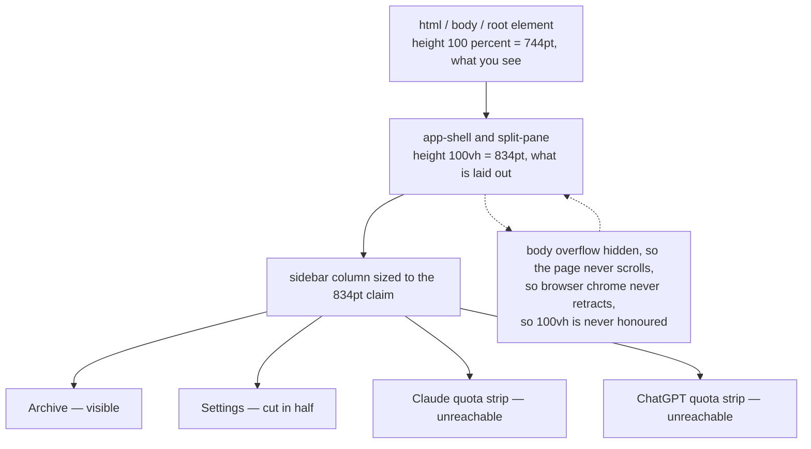

# Touch and Viewport Support for the Served Web UI

## Why

The served web UI is a browser skin over the same state the desktop app shows, and a tablet is an obvious client for it. But the frontend was written for a desktop window driven by a mouse, and three of those assumptions fail on a touch device.

Measured against the real bundle at iPad Pro 11" geometry (1194×834 landscape, and again in portrait):

- The **Settings** entrypoint is cut in half and both usage-quota strips sit entirely below an unscrollable fold — the shell sizes itself to `100vh` (the *large* viewport, as if browser chrome were retracted) while `overflow: hidden` guarantees the page never scrolls, so the chrome never retracts and the promised height is never granted.
- The **pane dividers cannot be dragged at all**: they bind `mousedown` + `document.addEventListener("mousemove")`, and iOS synthesises mouse events for a tap but not for a drag.
- The **pane-visibility chevrons are invisible in practice** — 24px, fully transparent, revealed only on `:hover`, which never fires on touch. Their documented keyboard alternative (Cmd/Ctrl+B) is unavailable on a tablet without a keyboard.

Compounding all three, every iPad and iPhone user-agent matches the frontend's `/Mac/i` platform test — the desktop-class default (`Macintosh; Intel Mac OS X`), "Request Mobile Website" (`iPad; CPU OS … like Mac OS X`), and iPhone alike. A browser on a touch device therefore switches on macOS-native window chrome: 32pt of traffic-light padding in both side panes, and a full-width invisible drag strip that swallows taps across the top of the detail pane.

There is no `hover`/`pointer` media query anywhere in the stylesheet and only one width breakpoint (720px), so a touch client has never been on the design's map.

## What Changes

- **The shell fits the viewport it can actually see.** `.app-shell` and `.split-pane` stop sizing to `100vh` and instead track the visible viewport, so bottom-anchored sidebar chrome — Archive, Settings, and the quota strips — stays reachable in every orientation. No new scroll behaviour is introduced; the fix is that the shell stops overflowing in the first place.
- **Platform chrome keys off the native shell, not the user-agent.** The `data-platform="mac"` flag is set only when running inside the Tauri window, so the served web UI never reserves traffic-light space and never renders the tap-eating drag region — on a Mac browser as much as on an iPad.
- **Dividers accept pointer input.** Divider dragging migrates from mouse-only events to Pointer Events with pointer capture, so mouse, touch, and pen all resize the panes through the existing clamps. Keyboard resize is unchanged.
- **Nothing essential is hover-only.** Where the device has no hover, the pane-visibility chevrons and the change-row favorite star are persistently visible with legible chrome and touch-sized hit targets, instead of being revealed by a hover that cannot occur.

## Capabilities

### New Capabilities

- `touch-input`: Establishes that the served web UI is operable by touch — drag interactions accept pointer input rather than mouse events alone, controls essential to navigation are discoverable without hover, and interactive targets meet a minimum touch size on coarse-pointer devices.

### Modified Capabilities

- `spec-browser`: The *Master-Detail Layout* requirement gains a viewport-fit constraint — the shell SHALL size itself to the viewport actually visible to the user, so the sidebar footer entrypoints covered by the *Settings Entrypoint in Sidebar Footer* and *Archive Entrypoint in Sidebar Footer* requirements remain reachable; and its resizable dividers SHALL be draggable by touch, not by mouse only. The *Side-Pane Visibility Toggles* and *Change-Row Favorite Toggle* requirements each gain a discoverability constraint for devices with no hover and no keyboard — both currently specify their affordance as hidden at rest and revealed on hover, which on a touch device means never revealed.
- `visual-identity`: The *macOS Hidden Inset Titlebar Layout* requirement is scoped explicitly to the native macOS application window. The traffic-light safe-area padding and the top-of-window drag region SHALL NOT be applied by the served web UI on any platform, and platform detection SHALL NOT be inferred from the browser user-agent.

## Impact

**Frontend only.** Affected files:

- `src/main.tsx` — the `/Mac/i` user-agent test that sets `body[data-platform="mac"]`, to be gated on running inside the Tauri shell.
- `src/components/SplitPane.tsx` — divider drag handlers migrate from mouse events to Pointer Events with pointer capture.
- `src/App.css` — the `100vh` declarations on `.app-shell` / `.split-pane`; `touch-action` on `.split-pane-divider`; new coarse-pointer / no-hover rules for `.pane-toggle` and `.row-favorite`.
- `openspec/specs/spec-browser/spec.md` and `openspec/specs/visual-identity/spec.md` — via the delta specs above; plus a new `openspec/specs/touch-input/spec.md`.

**Deliberately unchanged:**

- **No Rust changes.** No crate in the workspace is touched: `openspec-core`, `openspec-app`, `specforge`, `specforge-tui`, and `specforge-web` are all untouched, and `specforge-web` serves the same bundle from the same routes.
- **No IPC or type changes.** No command, event, payload, or `src/types.ts` mirror is added or altered.
- **No dependency changes.** Pointer Events and viewport units are platform features; nothing is added to `package.json` or `Cargo.toml`.
- **No transport or trust-boundary changes.** The `web-ui` capability's requirements are untouched — the loopback allowlist, the `--bind` contract, and the SSE stream all behave exactly as before. This change is presentation-only.
- **Desktop and terminal frontends keep their current behaviour.** Inside the Tauri window the platform flag still resolves to `mac` on macOS, so the traffic-light safe area and drag region are preserved; `specforge-tui` is unaffected.
- **Not in scope:** responsive breakpoints or a reflowed single-pane layout for narrow viewports. The fixed side-pane widths mean a portrait tablet still yields a narrow detail pane; restoring touch dragging gives the user a way to widen it, and a genuine responsive layout is left for a follow-up change.
