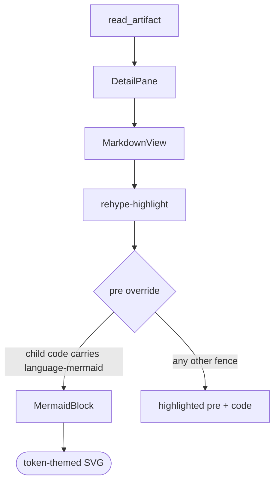

# Design — Render Mermaid Diagrams from `mermaid` Code Fences

## Context

The detail pane renders artifact markdown through a single component, `src/components/MarkdownView.tsx`, using `react-markdown` v9 + `remark-gfm` + `rehype-highlight`. It already overrides two element renderers (`li` for task-line anchoring, `input` for read-only checkboxes). Artifact text arrives as a raw markdown string from the Rust `read_artifact` command and is rendered entirely client-side. The WebView, `index.html`, and the `web-ui` HTTP server all set **no** Content-Security-Policy. There is no existing `mermaid` dependency.

The resulting pipeline — drawn, of course, with the feature this change adds:

## Decisions

### Intercept at the `pre` component, not with a plugin

`mermaid` fences are caught by overriding a renderer in `MarkdownView`'s existing `components` map — the same seam already used for `li` and `input`. The override is on **`pre`**, which inspects its child `code` node for the `language-mermaid` class and, on a match, renders `MermaidBlock` in place of the whole `<pre>`.

- **Why `pre` and not `code`:** react-markdown wraps every fenced block in `<pre><code>`. Returning a diagram from the `code` override would nest an `<svg>` inside a `<pre>` — semantically wrong, and it would inherit the fenced-code well styling (surface fill, border, shadow, mono font) that a diagram must not have. Overriding `pre` replaces the wrapper outright, so the diagram is a plain canvas and no `:has()`-style CSS clawback is needed.
- **Why an override at all:** it mirrors the established pattern in this file, needs no new remark/rehype plugin, and keeps the diagram concern local to the one component that owns markdown rendering.
- **Alternative rejected:** a custom remark/rehype plugin that rewrites `mermaid` nodes into a bespoke element. More moving parts for no benefit at this scale.

### Keep the diagram source out of `rehype-highlight`

`rehype-highlight` runs as a rehype plugin — *before* the component overrides render — and would tokenise the fence body into `.hljs-*` spans, destroying the clean source the diagram needs.

- **Approach:** pass `plainText: ['mermaid']` to `rehype-highlight`. It short-circuits on that language, leaving the `code` node's children as a single raw text node and its class list as just `language-mermaid` (no `hljs` class added).
- **Consequence:** raw-source extraction is a plain text read of the hast node, not a fragile reconstruction from highlighted spans.

### Theme from design tokens, re-render on scheme flip

Mermaid runs on `theme: 'base'` with `themeVariables` populated at runtime from the app's CSS custom properties (read via `getComputedStyle(document.documentElement)`): background from `--surface`, primary/line from the accent + `--border-strong` family, text from `--text`, font from `--font-mono`, and so on.

- **Why:** `visual-identity` makes "every surface consumes the same tokens" the house rule and carves out only the syntax-highlight palette as a literal-colour exception. Token-mapped diagrams honour that ethos — a diagram looks native rather than like a pasted-in Mermaid island — and this was the explicitly chosen option during exploration over a plain built-in `dark`/`default` swap.
- **The catch:** Mermaid bakes colours into the SVG *at render time*; unlike CSS, a rendered diagram does not recolour itself when the OS scheme flips. So `MermaidBlock` subscribes to a `matchMedia('(prefers-color-scheme: dark)')` change and re-renders. No literal colours enter the stylesheet — the tokens are read at runtime — so `visual-identity`'s "no literal colours outside tokens / syntax palette" invariant is preserved.

### Async render, guarded lifecycle, unique ids

`mermaid.render(id, source)` is async and returns an SVG string injected via `dangerouslySetInnerHTML` (strict-mode DOMPurify has already sanitised it).

- Each block derives its id from `useId()`, stripped to alphanumerics — `useId` yields `:r1:`, and the colons are invalid in the `#id` selectors Mermaid builds internally. A per-attempt counter is appended, because React StrictMode double-invokes effects and Mermaid keys its scratch DOM node off that id.
- The render runs in `useEffect`, keyed on `[source, isDark, baseId]`, with an `ignore` guard so an unmount or a fast content switch cannot commit a stale SVG.
- The memoised `import('mermaid')` promise is cleared if it rejects, so one failed chunk fetch cannot poison every diagram for the rest of the session.
- **The dynamic import is module-guarded; `initialize` is not.** `mermaid.initialize` is what carries `themeVariables`, so it must run again whenever the scheme flips. Only the `import('mermaid')` promise is memoised at module scope, so concurrent blocks share one load. `initialize` is idempotent and cheap, so calling it per render is the simpler correct choice than a separate re-theme path.

### Fail closed to source, never to Mermaid's error graphic

On a parse/render failure Mermaid will, by default, inject a visible broken-diagram graphic into the document body.

- **Approach:** validate with `mermaid.parse(source, { suppressErrors: true })` and/or set `suppressErrorRendering: true`, catch the failure in the component, and render the raw fence in a `<pre>` with a quiet inline note ("couldn't render diagram"). The rest of the artifact is untouched.
- **Why:** a spec author mid-edit will frequently have half-written diagram source; a broken pane or a Mermaid "bomb" graphic would be hostile. Showing their source back is the least-surprise fallback.

### Strict security level

Diagrams render with `securityLevel: 'strict'` — DOMPurify sanitises the SVG, and click bindings / embedded scripts are disabled.

- **Why:** there is no CSP backstop in this app, and while registered workspaces are the user's own local folders (low threat), strict mode is free and closes the "malicious diagram source runs script in the WebView" path outright.

### Lazy load

Mermaid (~2.8 MB with d3/dagre) is loaded via `await import('mermaid')` the first time a diagram is encountered, so Vite code-splits it into its own chunk and the initial bundle is unaffected for artifacts with no diagrams.

## Open / deferred

- **Pan/zoom & click-to-expand** for large diagrams — deferred; v1 scales a wide diagram down to fit the pane width (Mermaid's `useMaxWidth` sizing plus a `max-width: 100%` clamp). A very large diagram therefore becomes small rather than scrollable, which is the main argument for adding zoom later.
- **Copy-source affordance** on a rendered diagram — deferred.
- **terminal-ui rendering** — out of scope; that frontend cannot paint SVG and shows the fence as code text.
- **Tighter theme mapping** (covering the full Mermaid `themeVariables` surface, per-diagram-type tuning) can follow once the base mapping is in use.
