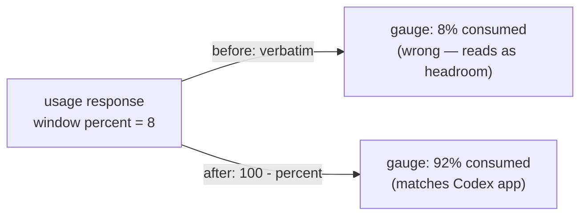

# Fix the Inverted ChatGPT Quota Reading

## Why

The shipped ChatGPT gauge displays the opposite of the user's real consumption. With the Codex desktop app reporting **92% used** for the window, SpecForge's strip showed **8%** — it renders the usage response's `used_percent` field verbatim, but that field carries the *remaining* share of the window, not the consumed share. A quota gauge that reads 8% when 92% of the budget is gone is worse than no gauge: it signals "plenty of room" at the exact moment the user is about to be cut off.

The same strip also labels its weekly row `7d`, derived mechanically from the window length, where the neighbouring Claude gauge says `wk`. Two rows describing the same seven-day period under different names in one sidebar is needless friction.

## What Changes

- **Invert the reading.** Treat the usage response's window percentage as *remaining* and derive consumption as $utilization = 100 - remaining$ at the parse boundary, so every downstream surface (desktop, web, TUI) shows consumed budget without further change. Colour thresholds, the exhausted-window countdown, and the time axis all keep working off `utilization` exactly as before — they simply now receive the true figure.
- **Name the field for what it holds.** The parsed struct field and its documentation record the empirical finding, so a future reader is not misled by the endpoint's `used_percent` key.
- **Label weekly windows `wk`.** A window whose length is a week renders as `wk` and a five-hour window as `5h`, matching the Claude gauge's vocabulary; other lengths keep the derived `Nh`/`Nd` form.

Nothing is **BREAKING** for stored data — no settings, formats, or persisted state change; only the rendered number and one label.

## Capabilities

### New Capabilities
_None._

### Modified Capabilities
- `chatgpt-quota`: the *Quota status-line gauge* requirement changes the meaning of the window percentage it consumes (the response reports remaining, so the gauge derives consumption from it) and pins the `wk` / `5h` labels for the two standard window lengths.

## Impact

- **`openspec-app`**: `chatgpt_quota.rs` — the window parser inverts the percentage and the struct field is renamed to reflect that the endpoint reports remaining; its unit tests are updated and extended to lock the inversion in both directions.
- **`specforge-tui`**: `ui.rs` — `chatgpt_window_axis` returns `wk` for week-length windows and `5h` for five-hour ones.
- **Frontend (`src/`)**: `ChatGptQuotaPill.tsx` — the same label rule in `axisFor`.
- **Deliberately unchanged**: the `claude-quota` module, spec, and gauge (Anthropic's endpoint genuinely reports utilization, so its reading was never inverted); the IPC shape (`utilization` still crosses the boundary as consumed percent, so `src/types.ts` needs no edit); settings; the poller, backoff, credential resolution, and TUI group-degradation logic.
- **Risk**: the inversion is an empirical finding from one account rather than documented API semantics. It is isolated to one function and covered by tests, so reverting is a one-line change if a payload sample later shows the field is account-dependent. See `design.md` for the competing hypothesis that was considered and how to falsify it.
