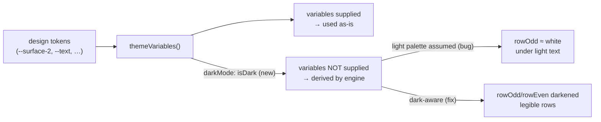

# Mermaid Dark-Mode Theming

## Why

In the dark colour scheme, mermaid `erDiagram` blocks render their attribute rows near-white while the row text stays near-white too — alternating rows are unreadable. The root cause is that `MermaidBlock.tsx` maps design tokens onto mermaid's `base` theme but never sets the theme's `darkMode` flag, so every variable the map does not supply is *derived assuming a light palette* (ER rows become `lighten(mainBkg, 75)` ≈ white). Any diagram type that leans on a derived variable is silently mis-coloured in dark mode; the ER rows are just the most visible casualty.

## What Changes

- Pass `darkMode` to mermaid's `base` theme, matching the active colour scheme, so every variable mermaid derives (rather than receives) is derived in the correct direction — darkened against a dark palette instead of lightened toward white.
- Explicitly map the ER row fills (`rowOdd` / `rowEven`) onto design tokens instead of trusting the engine's `darken()`/`lighten()` math, keeping row contrast a deliberate choice consistent with the "no literal colours, read live off `:root`" principle already in the file.
- No change to the relationship-label overlap seen in the same screenshot: label placement is a diagram-engine layout concern with no theming hook; correct row/label backgrounds make the failure degrade legibly.

## Capabilities

### New Capabilities
_None._

### Modified Capabilities
- `spec-browser`: the *Mermaid Diagram Rendering* requirement is strengthened — beyond the colours the app maps explicitly, colours the diagram engine derives on its own SHALL be derived in the direction of the active scheme, and diagram text SHALL remain legible against every filled surface the engine draws (the ER attribute rows being the canonical case).

## Impact

- **Affected code**: `src/components/MermaidBlock.tsx` only — the `themeVariables()` map and the `mermaid.initialize` call it feeds. The component already tracks the active scheme via `useDarkScheme()`; the flag is threaded into the theme map rather than newly computed.
- **Deliberately unchanged**: no Rust, no IPC surface, no new dependencies, no change to `src/theme.ts` tokens or `App.css`; the mermaid version stays at 11.16.0. The `terminal-ui` frontend (which renders mermaid fences as code text) is untouched. Relationship-label overlap in dense ER graphs is out of scope (upstream layout behaviour, no theming hook).
