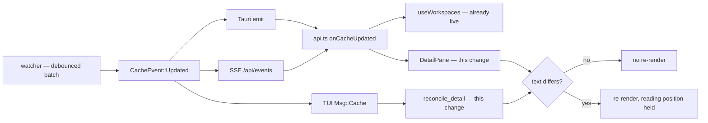

# Live Artifact Refresh in the Detail Pane

## Why

The `spec-browser` capability already requires this. Its *Reactive Updates from Filesystem* requirement states that the tree pane **and the detail pane** SHALL reflect on-disk changes within the watcher's debounce window without requiring user action, and carries an explicit scenario:

> **WHEN** the detail pane is currently rendering an artifact's markdown
> **AND** that markdown file is modified on disk
> **THEN** the detail pane re-renders with the updated content

Neither frontend implements it.

In the desktop app, `DetailPane`'s fetch effect is keyed on the artifact's *identity* — workspace, change id, artifact kind, capability — and the component subscribes to no cache event. Its content is frozen at the moment of selection until the user clicks away and back. In the terminal frontend, `reconcile_detail` returns early precisely when the selected change has not moved, so a `CacheEvent` that alters an open artifact's bytes never triggers a re-read.

So the tree updates live while the pane the user is actually reading does not. For an application whose purpose is watching OpenSpec work happen — an agent ticking checkboxes down `tasks.md`, a spec being filled in — the stale surface is the one that matters most.

There is a tell that this was intended and simply never wired: `DetailPane` already carries a `loading && content == null` guard, whose whole purpose is to keep showing existing content while a refetch is in flight. That branch is unreachable today, because loading only ever begins on a target change, which has already nulled the content.

This change closes the gap on both frontends and strengthens the requirement to cover the two things that decide whether a live pane is pleasant or hostile: the reader's position, and what a failed background read is allowed to destroy.

## What Changes

- **Subscribe the desktop detail pane to `cache-updated`**, refetching the open artifact through the existing `useCoalescedRefetch` scheduler so one debounced backend batch produces one read.

- **Do not filter the subscription on the event's `workspace` field.** The obvious implementation — refetch only when `payload.workspace` matches the open artifact's workspace — is wrong. The main watcher path emits `Updated` with the workspace that actually changed, but `refresh_status_and_notify` and `refresh_status_for` emit it with whatever workspace happens to be first in the cached views, as a carrier for a "refetch everything" nudge:

  > One nudge is enough: `cache-updated` consumers refetch *all* views, so any tracked workspace path serves as the carrier.

  A pane that filters on that field silently drops legitimate refreshes whenever the nudge is carried by a different repo — a defect invisible with one workspace registered and routine in a multi-worktree setup. The subscription is therefore unconditional, and the cost of the resulting false positives is removed at the other end instead.

- **Make a no-op refresh cost nothing.** The fetched text is compared against the current content and the state is left untouched when equal, so a refresh triggered by an unrelated edit produces no re-render, no reflow, and no visible event. This is what makes an unfiltered subscription affordable.

- **Preserve the reader's position across a background refresh.** Today `DetailPane`'s scroll-anchor effect depends on `content`, and `App.tsx` sets a section/task anchor on tree selection and never clears it. Left alone, the pane's new liveness would re-fire that effect on every batch and smooth-scroll the reader back to the node they clicked minutes ago — with the worst case being the primary use case, watching `tasks.md` change while parked on a task. The anchor must act on anchor identity, not on content arrival. The terminal frontend has the mirror-image hazard: its `Msg::Artifact` handler zeroes `detail_scroll` unconditionally, so removing `reconcile_detail`'s early return without touching the handler trades a stale pane for one that snaps to the top on every batch.

- **Make a failed background read non-destructive.** A read error currently nulls the content and replaces the pane with an error state. That is correct when the user just selected something and wrong when an event they did not cause arrives — an artifact that becomes unreadable underneath a reader (its change archived, its file removed) should not blank the text they were reading. Failure handling becomes conditional on what triggered the read: selection keeps today's behaviour, a watch-triggered refresh keeps the last good content.

- **Suppress the loading state on background refreshes**, so a live pane never flashes a spinner at a reader who did not ask for anything.

- **Close the same gap in the terminal frontend**, re-reading the open artifact on a cache event even when the selection has not moved, reusing the existing `artifact_gen` generation counter to discard replies the user has already navigated past.

- **Strengthen the specifications** so both frontends are held to one contract, including the reading-position and failure guarantees that the current single scenario does not mention.

## Capabilities

### Modified Capabilities

- `spec-browser`: The *Reactive Updates from Filesystem* requirement already mandates a live detail pane but says only that it "re-renders with the updated content" — silent on the reader's position and on what a failed background read may destroy, which are the two properties that decide whether the behaviour is usable. Add scenarios pinning both, and a scenario pinning that a refresh whose content is unchanged is not observable.

- `terminal-ui`: Has no detail-refresh requirement at all. Add one so the terminal frontend's open artifact is held to the same freshness, reading-position, and failure contract as the desktop pane, rather than the two surfaces drifting.

## Impact

Frontend and terminal frontend only. No changes to `openspec-core`, no new or altered `CacheEvent` variant, no change to any event name or payload shape, and no new IPC command. Both the desktop shell and `specforge-web` receive the fix from the same React bundle, since they share `src/` and differ only in event transport.

The decision not to enrich `CacheEvent::Updated` with changed paths is deliberate. Precise invalidation would let the pane refetch only when its own file moved, but it would mean an unbounded payload crossing two transports and both frontends, to buy an optimisation the content-equality guard already provides for a single small markdown read. It stays available for a later change that genuinely needs path granularity — changed-row highlighting in the tree, for instance.

Touched:

- `src/components/DetailPane.tsx` — the cache-event subscription, the equality guard, the trigger-dependent failure and loading policy, and the scroll-anchor dependency correction.
- `crates/specforge-tui/src/app.rs` — `reconcile_detail`'s content path and the `detail_scroll` reset in the `Msg::Artifact` handler.

Deliberately unchanged:

- `crates/openspec-core/src/watcher.rs`. The carrier-workspace behaviour of `refresh_status_and_notify` is correct for its own purpose — it exists to nudge consumers that refetch everything. This change adapts to it rather than narrowing it, since narrowing would make those paths emit one event per workspace to serve a single consumer that does not need the distinction.
- `FileBrowserView` and the `workspace-file-browser` capability. Its staleness is a decision, not a gap: that capability explicitly specifies manual refresh and forbids registering any watcher beyond the existing `openspec/`-scoped one. Live artifact refresh is available here precisely because artifacts already sit inside the watched subtree.
- `SelfWriteTracker`. The application remains read-only, so there are no self-writes to suppress; the tracker stays idle as designed.
- Visibility gating. A refresh while the window is hidden to the tray is a single small file read, and `useCoalescedRefetch` already documents why its scheduler must not depend on a frame ever being scheduled. Adding a `document.hidden` gate would trade that guarantee for nothing measurable.
- Any change-highlighting affordance. Showing the reader *what* changed — a pulse on a task line that just flipped — is a separate feature with its own design surface, and is not required to satisfy the existing requirement.

Discovered while verifying, and deliberately left alone: **selecting a Section or Task node in the tree does not scroll the detail pane to it.** Clicking a Task row navigates to the artifact but the pane's scroll offset does not move. This was confirmed to behave identically on the pre-change bundle, so it is a pre-existing defect rather than a regression, and it is out of this change's scope. It does mean the consumed-anchor guard added here currently protects a dormant path: correct, and required the moment section/task anchoring works again, but not observable today. Observed through the `specforge-web` transport; the Tauri transport was not separately checked, so a host-specific cause is not ruled out. Worth its own change.

Testing needs a deliberate decision, because no automated gate will force it. `cargo mutants` excludes `crates/specforge-tui/**` outright (`.cargo/mutants.toml` records that `app.rs` has no tests today, so every mutant there would be noise), and the mutation gate does not reach TypeScript at all. The repository's `bun test` suite exists but covers only `src/routing/`, and carries no DOM environment — component-level coverage of `DetailPane` would be the first of its kind here. The alternative is to test the refresh policy as an extracted pure unit, leaving the component as a thin binding. Which of those to adopt belongs in `design.md`.
