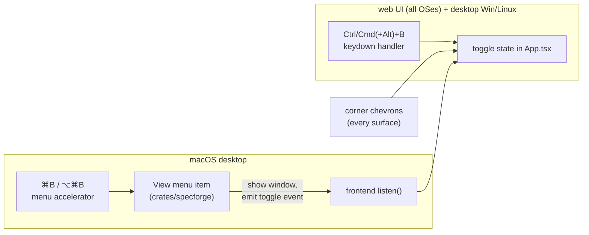

# Hide Side Panels — Design

## Context

The main window is a three-pane `SplitPane` (`src/components/SplitPane.tsx`): the sidebar (Dashboard button, `WorkspaceTree`, Archive/Settings buttons, quota pills), the center content pane, and the commit-graph rail. Both side panes are permanently visible today; the `commit-graph` spec even mandated it before this change. `App.tsx` owns pane composition, the rail's repo targeting (`useCommitGraph`), and two global keyboard handlers (Escape, `Cmd+[`/`Cmd+]`). The rail width persists via `localStorage` (`specforge.railWidth`); the sidebar width does not persist. The served web UI (`specforge-web`) ships the identical bundle, so every frontend-level decision applies to both surfaces. The macOS custom menu is built in Rust (`crates/specforge`) and is the only menu anywhere — Windows/Linux and the browser have none.

## Goals / Non-Goals

**Goals:**

- Independent hide/restore for sidebar and rail on desktop and web, any combination, per the `spec-browser` delta.
- Exactly one toggle per keypress on every surface (menu accelerator vs. webview key handling must never stack).
- A hidden rail causes zero commit-graph git work.
- Visibility persists across sessions; widths survive hide/restore.

**Non-Goals:**

- No TUI changes, no `openspec-core` changes, no `AppSettings` entry, no Address/`view-routing` involvement (visibility is ambient view state).
- No dynamic "Show/Hide …" menu labels (would need webview→Rust state sync; static "Toggle …" labels suffice).
- No animated collapse transitions in v1.

## Decisions

### D1: Visibility state lives in `App.tsx`, persisted to `localStorage`

Two booleans in `App.tsx`, initialised from and written to `localStorage` keys `specforge.sidebarHidden` / `specforge.railHidden`, exactly like `initialRailWidth()` / `RAIL_WIDTH_KEY` today. The web UI gets per-origin persistence for free.

- **Rejected — `AppSettings` (`settings.rs`)**: visibility is per-frontend view state, not app configuration; storing it in the shared settings file would leak one surface's layout into another (desktop vs. served web) and add IPC for no benefit.
- **Rejected — Address/URL**: the `view-routing` doctrine reserves the Address for navigable places; the specs explicitly make visibility non-addressable.

### D2: `SplitPane` gets controlled `leftHidden` / `farHidden` props; hidden panes unmount

`App.tsx` passes visibility down; `SplitPane` conditionally renders each hidden pane *and its divider* as nothing (unmount, not `display:none`). Width state stays inside `SplitPane`, which remains mounted throughout, so a restored pane returns at its remembered width run through the existing clamps.

- **Rejected — App conditionally omitting the `left`/`far` children**: `SplitPane` couldn't distinguish "pane hidden" from "pane doesn't exist", muddying width bookkeeping, ARIA, and where restore chevrons render.
- **Rejected — CSS `display:none` keeping panes mounted**: a mounted-but-invisible rail keeps subscriptions and rendering alive, contradicting the no-work-while-hidden requirement; unmounting makes it structural. Trade-off: the tree's scroll position resets on restore (disclosure state is already persisted and survives; the reveal effect re-derives position on the next navigation).

### D3: Rail fetch gating happens at the `useCommitGraph` call site

`App.tsx` passes `railHidden ? null : graphRepoId` into `useCommitGraph` — the hook already treats `null` as "render placeholder, fetch nothing". `applyGraphRepoId` keeps tracking selection while hidden (cheap state writes), so restoring feeds the *current* repo straight back into the hook, satisfying the restore-fetches-current-repo scenario.

- **Rejected — keep fetching while hidden for instant restore**: directly violates the `commit-graph` delta and pays git subprocess churn on every selection change for a pane nobody can see.

### D4: One input source per surface — the menu owns the shortcut on macOS desktop, the webview everywhere else

The View submenu items carry the accelerators and emit named Tauri events (constants in `events.rs`, mirrored in `src/types.ts`, same pattern as the cache-event bridge); the menu handler shows the main window first if hidden. The webview `keydown` handler for these combos registers **only when not (Tauri ∧ macOS)** — so on macOS desktop the menu is the sole handler, and on every other surface the keydown handler is. Single-fire holds by construction: each surface has exactly one registered handler.

- **Rejected — both handlers active with dedupe/debounce**: racing two input paths and suppressing the second fire is fragile and untestable; picking one handler per surface is deterministic.
- **Rejected — menu items without accelerators, webview handles keys everywhere**: shortcut-less menu items are un-idiomatic on macOS and hide the discoverable binding.

### D5: Chevrons — collapse controls in the pane headers, restore controls floating in the center pane's corners

Each visible side pane renders a small chevron at its top (sidebar: beside the Dashboard button; rail: in the rail header). When a pane is hidden, `SplitPane` renders a floating restore chevron overlaying the center pane's matching top corner (left for sidebar, right for rail), z-ordered above content, marked non-draggable so the macOS titlebar drag strip doesn't swallow its clicks, and offset below the traffic lights on macOS.

- **Rejected — collapsing to a slim permanent gutter (VS Code activity-bar style)**: keeps permanent chrome on screen, defeating the purpose of hiding; also a bigger visual redesign than this change warrants.

### D6: Traffic-light clearance via a shell-level state class

When the sidebar is hidden, the split-pane root carries a modifier (e.g. `data-sidebar-hidden`), and `body[data-platform="mac"]` CSS gives the center pane the same `padding-top: var(--space-6)` clearance the sidebar and rail already use, keeping content out from under the traffic lights and the drag strip.

- **Rejected — letting content run under the window controls**: the top strip is also the drag region on macOS, so content there is both visually obscured and un-clickable.

## Risks / Trade-offs

- **[Native accelerator swallowed or duplicated on macOS]** Tauri's menu accelerators consume key equivalents at the AppKit layer; if a future in-webview `Cmd+B` handler were added unconditionally it would double-fire. → The platform gate in D4 is the invariant; the accelerator scenario in the `application-menu` delta is the manual smoke check (`bun tauri dev`).
- **[`Ctrl+Alt+B` collides with AltGr on some Windows/Linux layouts]** AltGr registers as Ctrl+Alt, so the rail toggle could fire from an AltGr chord — or be untypeable. → Low severity: chevrons remain the universal affordance; revisit the binding if it bites.
- **[Tree scroll resets when the sidebar remounts]** Accepted (D2): disclosure state is persisted independently, and the next navigation re-reveals the selection; no extra state machinery for v1.
- **[Restore into a too-narrow window]** A remembered width may exceed what the window can host. → Restored widths pass through `SplitPane`'s existing min/max clamps, which already handle narrow windows.
- **[Both panes hidden leaves no visible navigation]** The tree, Dashboard, Archive, and Settings entry points all live in the sidebar. → Restore chevrons are always rendered while a pane is hidden (spec scenario), and shortcuts/menu remain live; Escape/overlay behaviour is untouched.
