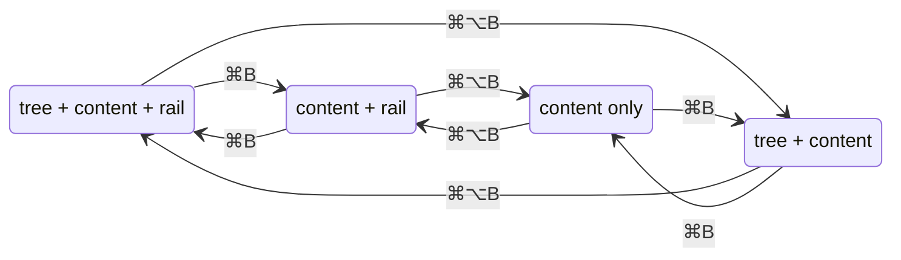

# Hide Side Panels

## Why

The reading surface — artifact markdown, the Dashboard, commit detail — permanently shares the window with the workspace tree on the left and the commit rail on the right, and neither side pane can be dismissed. On a laptop screen or a narrow browser tab the content column gets squeezed below comfortable reading width even though the user often only wants to read one artifact. Both the desktop app and the served web UI need a way to hide either side pane and reclaim the full window for content.

## What Changes

- The sidebar (workspace tree pane) and the commit rail each gain an **independent visibility toggle**. Any combination of hidden/shown is reachable; hiding both yields a full-width content view.

- **Keyboard shortcuts**: `Cmd/Ctrl+B` toggles the sidebar, `Cmd/Ctrl+Alt+B` toggles the commit rail — in the desktop app and the served web UI alike.
- **Corner chevrons**: each side pane carries a small collapse chevron at its top; when a pane is hidden, a mirrored restore chevron appears in the corresponding top corner of the center pane. This is the discoverable affordance on surfaces with no menu (web, Windows, Linux).
- **macOS View menu**: the custom application menu grows a View submenu with both toggle items and their accelerators.
- **Persistence**: each pane's visibility persists across sessions the same way the rail width already does (frontend view-state storage, not `AppSettings`). Pane widths are remembered independently of visibility, so restoring a pane brings back its previous width.
- **Hidden rail does no work**: with the rail hidden, the commit graph is not fetched at all — re-targeting the rail's repository while hidden costs nothing; the fetch happens on restore.
- **macOS chrome**: with the sidebar hidden, the center pane takes over the traffic-light top clearance so content clears the window controls and the titlebar drag strip.
- Panel visibility is **ambient view state** — it never enters the Address, the URL, or navigation history, the same doctrine as commit selection and scroll anchors.

## Capabilities

### New Capabilities

_None._

### Modified Capabilities

- `spec-browser`: the master-detail layout requirement gains independent hide/show for the tree pane and the rail — shortcuts, chevron affordances, persistence, and the rule that visibility is non-addressable view state.
- `commit-graph`: the Commit-Graph Rail Pane requirement's "always visible (not a mode the user toggles into)" clause is replaced by the toggleable-rail contract, including the no-fetch-while-hidden behaviour.
- `application-menu`: the custom macOS menu gains a View submenu carrying the two pane-toggle items with their accelerators.

## Impact

- **Frontend** (`src/`): `components/SplitPane.tsx` (visibility props, conditional pane+divider rendering, chevrons), `App.tsx` (toggle state, persistence keys alongside `specforge.railWidth`, keyboard handler, gating `useCommitGraph` on rail visibility), `App.css` (chevron styling, conditional traffic-light padding on the center pane). The served web UI picks all of this up automatically — it is the same bundle.
- **Tauri shell** (`crates/specforge/`): the macOS menu builder gains the View submenu; its items reach the webview via emitted events (a new event name constant mirrored in `src/types.ts`). Care needed so a native menu accelerator and the webview keydown handler don't both fire on one keypress — resolved in design.
- **Deliberately unchanged**: `openspec-core` (no core logic involved); `settings.rs` / `AppSettings` (visibility is frontend view state, not a setting); the `view-routing` capability and Address grammar (visibility is never addressable); the terminal UI (`specforge-tui`) — this change is scoped to the desktop and web views; no new dependencies.
