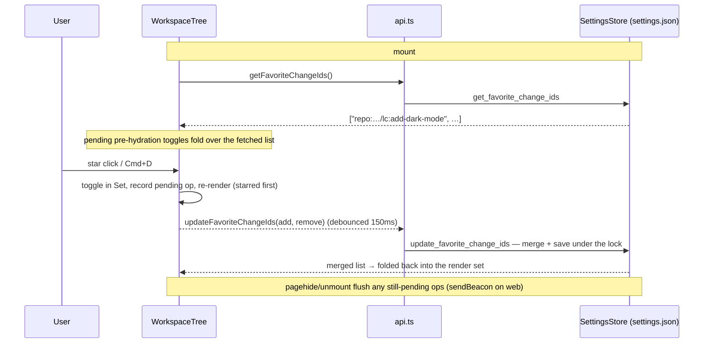

# Design: Favorite Changes in the Workspace Tree

## Context

Active logical changes render under their repo group (or flat workspace) in alphabetical order. That order is produced once, in core — `build_repo_view` collects logical changes into a `BTreeMap` keyed by name (`crates/openspec-core/src/repo_view.rs`), and flat-workspace change ids are sorted in `parser.rs` — and every frontend renders the resulting arrays verbatim. No frontend re-sorts anything today, and no spec contracts change-row order.

The codebase already has two proven homes for app-side, per-node user preference, both in the config dir and never inside a workspace's `openspec/` tree:

- **Settings id-lists** — `collapsed_tree_node_ids` / `expanded_tree_node_ids` on `AppSettings` (`crates/openspec-app/src/settings.rs`): flat `Vec<String>` of tree-node IDs, whole-list setter with immediate save, a get/set command pair in `crates/specforge/src/commands.rs` mirrored in the web dispatch table (`crates/specforge-web/src/dispatch.rs`), TS wrappers in `src/api.ts`, and a hydrate-then-debounced-write-back cycle in `WorkspaceTree.tsx`.
- **Presentation store** — `WorkspacePresentationStore` (`crates/openspec-core/src/presentation.rs`): a keyed store joined into view output at the service layer, with its own updated event.

The tree has exactly one nested interactive element per row today (the disclosure chevron, with a `stopPropagation` contract), a roving-focus keyboard model with typeahead (any printable single key jumps to a matching row), and an exported node-ID grammar (`WorkspaceTree.tsx`, reused verbatim by `src/routing/nodeId.ts`).

## Goals / Non-Goals

**Goals:**

- Let the user star/unstar any logical-change row and have starred changes render first within their top-level group, persisting across restarts.
- Zero behavioural change for users who never star anything — including byte-identical settings handling for existing settings files.
- Smallest coherent mechanism: reuse the collapse-state persistence pattern and the existing node-ID grammar end to end.

**Non-Goals:**

- No arbitrary manual reordering (drag-and-drop); the only order control is the boolean star.
- No favorites in the TUI, Dashboard, Archive view, tray, or notifications.
- No cross-client live re-sort events; a second connected web client picks up the new order the next time it loads the tree (favorites hydrate at mount, not per views fetch).
- No changes to `crates/openspec-core` — core view output stays a pure function of disk state.
- No writes into any workspace (read-only contract preserved).

## Decisions

### D1: Persist favorites as a settings id-list, mutated by delta, ordered in the frontend

A new `favorite_change_ids: Vec<String>` field (`#[serde(default)]`) on `AppSettings`, read by `get_favorite_change_ids` and mutated only through `update_favorite_change_ids(add, remove)` — a **delta** command that merges under the settings lock (saving before the lock is released, so two concurrent updates cannot reach disk out of order) and returns the merged list. Both commands get desktop handlers and web dispatch arms (the exhaustive match rejects unknown commands, so the web UI needs them to function), plus TS wrappers. `WorkspaceTree` hydrates a `Set<string>` on mount for rendering, records each toggle in a pending-ops map, and flushes the pending delta on a 150ms debounce, folding the backend's merged response (plus any ops recorded mid-flight) back into the render set; a `pagehide`/unmount flush (sendBeacon on the web, fire-and-forget invoke natively) covers toggles made just before dismissal. Ordering is applied at render time in the frontend; core continues to emit alphabetical arrays.

The delta shape is load-bearing, not a nicety: a whole-list setter would let a transient hydration failure echo-write an empty list over stored favorites, let a stale client erase favorites another client persisted since it hydrated, and revert toggles made before hydration landed. Deltas make all three impossible by construction — the backend only ever adds or removes the ids the user actually touched.

**Rejected — whole-list `set_favorite_change_ids` (the collapse-state clone):** the smallest diff, but it carries the three data-loss modes above; collapse state tolerates them because it is cheap, reconstructible preference, while favorites are user-curated.

**Rejected — service-layer join (presentation-store pattern):** joining an `isFavorite` flag onto view rows would reach the TUI too and comes with an updated-event precedent, but it touches core view types plus their hand-maintained TS mirrors, and buys parity for a surface (TUI) that deliberately ignores per-node view preference already (it has no collapse state). Disproportionate for one boolean per change.

**Rejected — core re-sorts starred-first:** every frontend would inherit the order for free, but core's output would stop being a pure function of disk state, entangling the parser/aggregation layer with app settings. This inverts the crate layering (`openspec-core` must not know about `AppSettings`).

**Rejected — persisting in the workspace's `openspec/` tree:** would sync favorites with the repo, but the app is rigorously read-only toward workspaces (the `SelfWriteTracker` is deliberately idle in v1); favorites are viewer preference, not workspace truth.

### D2: Favorite keys reuse the exported node-ID builders at the logical-change level

A favorite is keyed by the existing exported builders: `logicalChangeId(repoId, changeName)` → `repo:<rid>/lc:<name>` for repo-group changes, and `changeRowId(flatWorkspaceId(uri), changeId)` → `flat:<uri>/change:<id>` for flat-workspace changes. These IDs are position-independent at the change level — the `lc:` form embeds no worktree, so a star survives singleton↔multi-instance promotion, worktree churn, and archive round-trips. Both forms already round-trip through settings today as collapse-set entries.

**Rejected — a new dedicated key grammar** (e.g. `repo:<rid>|<name>`): a second identity scheme for the same entities that `nodeId.ts` and the collapse sets already name, with nothing gained — the lc-level IDs are already stable — and one more mapping to keep in sync.

**Rejected — keying by instance:** stars would multiply per worktree and vanish when a worktree is deleted; the user's mental object is the change, not its checkouts.

### D3: Quiet-float partition at render time, stable within partitions

Where the tree maps a group's logical-change array (repo group) or change array (flat workspace), a stable partition puts starred entries first; within each partition the backend's alphabetical order is preserved. No divider, section header, or count is rendered — the filled star on each floated row is the only group indicator, matching the tree's no-section-chrome minimalism (the Active/Archive sections were deliberately removed; the inter-workspace hairline is the only structural line).

**Rejected — pinned section with divider:** visually unmissable, but adds structural chrome inside a group where none exists, and the filled star already carries the explanation.

**Rejected — partitioning in `useWorkspaces`:** mutating the shared view state would bake presentation into data that other consumers (Dashboard routing, selection) treat as canonical, and would have to be re-applied on every cache event. Render-time partition keeps the data layer untouched.

### D4: Star affordance — trailing, hover-revealed, chevron-contract button

Each change row (flattened singleton, multi-instance disclosure parent, flat-workspace change row) renders a star toggle in a *reserved* slot at the extreme trailing edge of its primary line — after any existing trailing meta such as the multi-instance parent's instance-count badge, and reserved so that revealing the star shifts no other content. It is invisible until the row is hovered or holds the tree's roving focus when unstarred (outline glyph in `--text-faint`), always visible when starred (solid glyph in `--accent`, glow-free — sanctioned by this change's `visual-identity` delta, which grows the accent-fill census to four and the row-grammar filled-element census to three; the rejected alternative, a new gold/amber token, would add a token family for one glyph and step outside the app's indigo identity). Instance child rows carry no star — the star belongs to the logical change. The button follows the chevron's contract: `stopPropagation` on click so toggling never selects the row or changes the detail pane, and it is not in the tab order (the tree keeps its roving-focus, single-Tab-stop model). It carries `aria-pressed` and an accessible label, and because screen readers often flatten nested-control state when announcing a treeitem, the favorite state is also folded into the row's accessible name/description at the treeitem level.

**Rejected — leading-slot star:** the leading slot is doctrinally reserved for identity affordances (see the *Artifact Row Presence Treatment* requirement), and a leading glyph would collide with the swatch/selection-bar composition rules.

**Rejected — context menu:** no context-menu infrastructure exists anywhere in the tree; building it for one action is disproportionate.

**Rejected — always-visible outline stars on every row:** a column of hollow stars on a minimalist tree is noise; hover-reveal keeps the resting state clean.

### D5: Keyboard toggle is Cmd/Ctrl+D on the focused row

The tree's typeahead consumes every printable single key, so a bare letter binding (`f`, `s`) would collide. Cmd+D (macOS) / Ctrl+D (Windows/Linux) — the platform-wide "bookmark this" idiom — toggles the favorite state of the focused change row; on a non-change row it does nothing. Verified unbound in the app today. The chord matches on `e.code === "KeyD"` (the physical key), not `e.key`, so it works on layouts where that key types another character, and it ignores `e.repeat` so holding the chord cannot flip-flop the state. Typeahead already ignores modifier chords (its guard checks `metaKey`/`ctrlKey`/`altKey` on master), so the chord and typeahead compose without changes to the typeahead branch. In the served web UI the handler calls `preventDefault`, intercepting the browser's native bookmark shortcut while the tree has focus — the same trade the Cmd/Ctrl+B pane toggles already make.

**Rejected — bare letter key:** collides with typeahead. **Rejected — no keyboard path:** the star button is deliberately out of the tab order, so without a chord the feature would be pointer-only.

### D6: No new events; no animation in v1

Toggling writes settings and re-renders locally. No Tauri/SSE event is added — settings setters emit none today, and the collapse-state precedent (a second web client converges the next time it loads the tree, since favorites hydrate once at mount) is acceptable for a personal preference. The reordering row jump is not animated in v1; FLIP-style motion is deliberate future polish, not scope.

**Rejected — `favorites-updated` event mirroring `workspace-presentation-updated`:** real precedent exists, but it exists because presentation is joined server-side into views; favorites are frontend-applied, so the only beneficiary would be a second concurrent web client — a marginal case that self-heals.

## Risks / Trade-offs

- **Row jumps out from under the pointer on toggle** → accepted for v1: groups are short, the common gesture (star the change you're working on) moves the row to the top where the eye expects it, and un-starring from the floated position drops it back into a nearby alphabetical slot. Animation noted as future polish (D6).
- **Machine-global favorites over the web** → every browser client and the desktop app share one settings file, so stars are per-machine, not per-viewer. This is exactly how collapse state behaves today; the spec records it as intended (see the persistence requirement's web scenario). Because mutation is a delta merge, concurrent clients compose rather than clobber: each client's toggles land regardless of how stale its view is.
- **Stale favorite entries accumulate** (change archived or never recreated, workspace unregistered) → entries are inert and ignored; the collapse-state precedent explicitly declines garbage collection, and favorites inherit it. List size is bounded by deliberate user action, not by workspace size.
- **Concurrent writers to `settings.json`** (desktop app + standalone web server as separate processes) → cross-process, the whole-file save remains last-writer-wins for the file as a whole (unchanged, existing exposure); within a process the favorites updater saves before releasing the settings lock, so two concurrent favorites deltas cannot persist out of order.
- **A dismissal flush can still be lost** → the `pagehide` flush uses sendBeacon on the web (survives page teardown) but a native quit racing the fire-and-forget invoke can still drop a toggle made in the final ~150ms; the exposure window is the debounce interval, accepted as the residual trade for coalesced writes.
- **The mutation gate does not see this change's Rust lines as configured today** → `.cargo/mutants.toml` excludes `crates/openspec-app/src/settings.rs` (its comment says to delete the line the day the file gets a test) and excludes `crates/specforge/**` / `crates/specforge-web/**` wholesale (they cannot build in a mutants scratch tree). Mitigation: this change adds the *first* settings tests — a round-trip (set → save → reload → get) and a pre-feature-file load — and lifts the `settings.rs` exclusion so those lines are genuinely gated; the command arms remain permanently outside mutants scope by design, covered instead by `cargo test` and the manual smoke.
