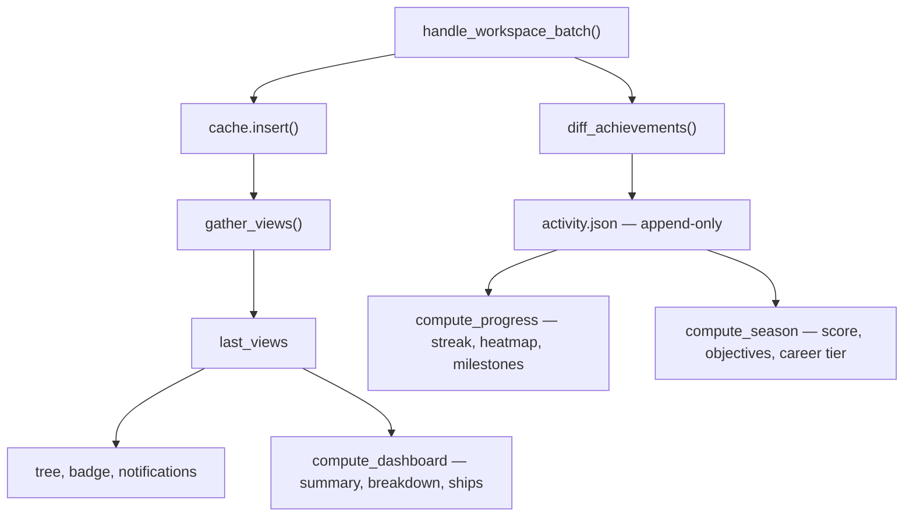

# Design — Temporarily Disable Workspaces

## Context

Two facts about the existing architecture drive every decision below.

**The aggregated snapshot is a chokepoint.** `WatcherManager::workspace_views()`
returns the `last_views` snapshot, and it feeds the tree in all three frontends,
the tray badge (`total_active_logical_count`), the notification dispatcher (via
the logical diff events `diff_views` produces), and `compute_dashboard`. One
well-placed cut reaches everything.

**Achievement recording sits upstream of that chokepoint.** In
`Inner::handle_workspace_batch`, `diff_achievements` runs and writes to the
activity log *before* the cache insert, which in turn precedes the view refresh:

Anything that filters at or below `gather_views` therefore leaves streaks and
season standing untouched with no special-casing. Anything that filters *above*
it — by removing the workspace from the watcher — punches unrecoverable holes in
the history instead.

The user's stated intent is that disabling is an **attention** control, not an
**existence** control: the sidebar and tray go quiet, the record stays whole.

## Goals / Non-Goals

**Goals**

- Reversibly silence a top-level row in the tree pane, the tray badge, and
  desktop notifications, without unregistering it.
- Eliminate the per-recompute git subprocess cost of a parked repository.
- Preserve every historical surface exactly: streaks, heatmap, season score,
  career tier, activity chart, lifecycle throughput, ships.
- Survive restarts, and clean up automatically when the workspace is
  unregistered.
- Reach all three frontends from a single implementation.

**Non-Goals**

- Per-worktree disabling. Granularity is the top-level row.
- Time-boxed or auto-expiring disable. The flag is indefinite until toggled
  back.
- Any ambient in-tree or in-chrome indicator that rows are hidden (see
  *Decision 7*).
- Tearing down watchers, dropping cache entries, or pausing achievement
  recording.
- Any change to `workspaces.json` or the registry's persistence format.

## Decisions

### 1. Aggregate disabled rows *cold* rather than dropping them

A disabled row stays in `last_views`, but its `RepoGatherInput` is marked cold
and `compute_repo_rows_pooled` skips its git jobs. The split inside `RepoView`
makes this exact and safe:

| Field group | Source | Cold-row state |
|---|---|---|
| `active`, `archived`, task rollups, spec counts | parsed cache + one `read_dir` for archived stubs | accurate |
| `name`, `repo_id` | main-worktree basename via the existing no-subprocess fallback heuristic | accurate |
| `default_branch`, `dirty`, `dirty_worktrees`, `has_uncommitted_specs` | `git worktree list`, `git branch`, `git status` | defaulted |
| per-instance `branch`, `is_default_branch`, `spec_commit_state` | `git branch`, `git status` | defaulted |

`summary_metrics`, `repo_breakdowns`, and `todays_ships` read exclusively from
the first two groups. `resolve_main_worktree` already documents a fallback for
when git is unavailable ("path matching the parent of the common dir"), so the
cold path reuses it rather than inventing one.

*Rejected: drop disabled rows at `gather_views`.* This is the obvious
implementation and it is what the first sketch of this change proposed. It
breaks the goal directly — with no view, `compute_dashboard` loses the
workspace's summary metrics, its breakdown row, and its ships, which is exactly
the "erasure" the user ruled out.

*Rejected: keep `last_views` fully warm and filter only at consumers.* Correct
Dashboard behaviour, zero resource win — every parked repository keeps paying
its `git status` sweep on every recompute. This forfeits half the motivation.

### 2. Store the flag in the presentation store

`presentation.json` is keyed by `PresentationKey::{Flat(path), Repo(common_dir)}`
— precisely the top-level-row identity this feature needs. It already survives
restarts and is already cascade-cleaned when the last user-registered workspace
for a key is unregistered, so a disabled flag inherits correct cleanup with no
new code.

Two adjustments are required and are easy to get wrong:

- `PresentationEntry::is_empty()` currently returns true when both
  `display_name` and `color` are `None`, and empty entries are pruned on save.
  Left unamended, an entry that carries *only* `disabled: true` is silently
  discarded and the flag vanishes on restart.
- `WorkspacePresentationStore::set` replaces the whole entry. Disabling must
  therefore be a dedicated read-modify-write setter, not an extra parameter on
  `set`, so toggling disable cannot clobber a display name or tint.

*Rejected: a `disabled` field in `workspaces.json`.* The `workspace-registry`
spec commits to the file remaining "a plain ordered array of user-registered
workspaces, with no schema-version field, so that any application version reads
and writes the same format". An older binary that loads and re-saves would
silently drop an unknown field, quietly re-enabling every parked workspace. That
cross-version guarantee was written down deliberately and is not worth eroding
for one boolean.

*Rejected: a `disabledWorkspaceIds` set in `settings.json`.* There is precedent
(`collapsedTreeNodeIds`, favorites), but settings has no cascade-clean on
unregister, so every removed workspace would leave a dead identifier behind
permanently.

### 3. Filter inside `get_workspace_views`, not in each frontend

The tree exclusion happens in the shared Tauri command, which already joins
presentation overrides into the views. The desktop React tree, `specforge-web`,
and `specforge-tui` consume that same path and inherit the behaviour.

*Rejected: expose `disabled` on the wire and let each frontend filter.* Three
independent implementations of one predicate, three opportunities to drift, and
three places to fix a bug. The only argument for it — a frontend that wants to
render parked rows differently — is explicitly a non-goal here.

### 4. Keep the watcher, the cache, and the activity log running

Disabling changes no watcher lifecycle. This is what makes the flag cheap in
both directions and, more importantly, what keeps history intact.

*Rejected: tear down the watcher and drop the cache entry while disabled.* This
was the original framing of the "resource" motivation and it is a trap.
`remove_workspace` drops the cache entry, and `add_workspace` re-populates by
parsing fresh and inserting **without** running `diff_achievements` — so every
task tick, artifact advance, and change creation that happened while parked is
silently absorbed on re-enable. No spurious burst, but a real hole in
`activity.json`: park a repository for a month and lose a month of streak days.
The marginal saving is small anyway (idle `notify` handles are nearly free; the
cost is the git subprocesses, which *Decision 1* already eliminates).

Worth recording for any future reconsideration: `ActivityLog::reconcile_lifecycle`
is documented as safe to call repeatedly, deduplicating by `(kind, change_id)`,
so change creations and archivals *would* be recoverable from git on re-enable.
Task-tick granularity that never reached a commit would not be.

### 5. Top-level-row granularity

The disable key is a repository group or a flat workspace, matching
`PresentationKey`. Two user-registered worktrees of one repository share a
single `repo:` key and therefore a single toggle — their Settings rows move
together.

*Rejected: per-worktree disabling, including discovered worktrees.* Discovered
worktree paths are re-derived from `git worktree list` on every launch and
reconciled at runtime. A flag keyed on `.claude/worktrees/foo` becomes a
tombstone the moment that worktree is pruned, and is resurrected if a later
worktree reuses the path. That needs a garbage-collection story the top-level
key does not, for a use case that has not yet been felt.

### 6. Name the flag `disabled`

The user's own vocabulary throughout. `muted` reads as notification-only and
undersells the tree and badge exclusion; `paused` and `parked` imply the
watcher stops, which *Decision 4* explicitly rejects; `snoozed` implies
auto-expiry, which is a non-goal. `disabled` overstates permanence slightly,
which the Settings-only surface and the one-click toggle mitigate.

### 7. No ambient cue — the Dashboard is the cue

The toggle lives in Settings, and nothing in the tree or window chrome
advertises that rows are hidden. This looks risky in isolation: a filtered badge
that silently under-reports is a lie of omission, and "temporarily" has a way of
becoming "permanently, and I forgot".

*Decision 1 defuses it.* Because a disabled workspace remains fully present on
the Dashboard — its breakdown row, its contribution to active-change totals, its
ships in today's haul, its commits in the activity chart, its achievements in
the streak — the user cannot lose track of it. The record surface *is* the
ambient cue, and it is a far better one than a `⊘ 3` marker would have been,
because it shows the parked work rather than merely counting it.

*Rejected: greyed disabled rows sunk to the bottom of the tree.* Reintroduces
into the sidebar exactly the visual weight the feature exists to remove.

*Rejected: a time-boxed snooze with auto-expiry.* The strongest answer to
"temporarily" in the abstract, but it needs a clock, an expiry sweep, and a
decision about what a re-enable at expiry emits — significant machinery to
solve a problem the Dashboard already solves for free.

## Risks / Trade-offs

**The Dashboard's active-change count will not match the tree.** Park two
repositories holding five changes between them and the sidebar shows 9 while the
Dashboard shows 14. This is the design working as specified — the difference
between an attention surface and a record — but it will read as a bug on first
encounter. *Mitigation:* the asymmetry is pinned down as a normative requirement
(*Dashboard Unaffected by Workspace Disable*) so it is not "fixed" later, and
the Dashboard carries a line of copy noting that its totals include disabled
workspaces.

**Cold rows carry defaulted git fields inside `last_views`.** Any future
consumer that reads `workspace_views()` directly, without applying the disabled
filter, would see a parked repository as clean and branchless.
*Mitigation:* filtering happens in `get_workspace_views` so no frontend ever
receives a cold row; the only in-process consumers are the badge and the
notification dispatcher, both of which filter, and `compute_dashboard`, which
provably reads none of the defaulted fields. The `disabled` flag is carried on
the view itself so the predicate is available at every consumer rather than
having to be re-derived.

**An edit inside a disabled workspace still emits `CacheEvent::Updated`,** so
all three frontends refetch views for a row they will not display. *Mitigation:*
accepted for now — the wasted round-trip is small, and suppressing it would let
the Dashboard go stale until the next unrelated event. Recorded here as a
deliberate knob rather than an oversight.

**Disabling a flat workspace yields no resource saving.** `WorkspaceView::Flat`
performs no git I/O to begin with, so the cold path is a no-op there and the
feature is purely about focus. *Mitigation:* none needed; the asymmetry is
harmless, but it is documented so the absence of a measurable win for flat
workspaces is not read as a defect.

**Mutation testing gates on changed lines.** The predicate threading touches hot
functions in `repo_view.rs` and `watcher.rs`, where a surviving mutant is easy to
produce (for example, inverting the cold check while every existing test still
passes because it only asserts on cache-derived fields). *Mitigation:* the
verification tasks assert on both halves — that a cold row's counts are correct
*and* that its git-derived fields are defaulted *and* that no git subprocess was
invoked for it, using the existing `git::invocation_log` facility.
