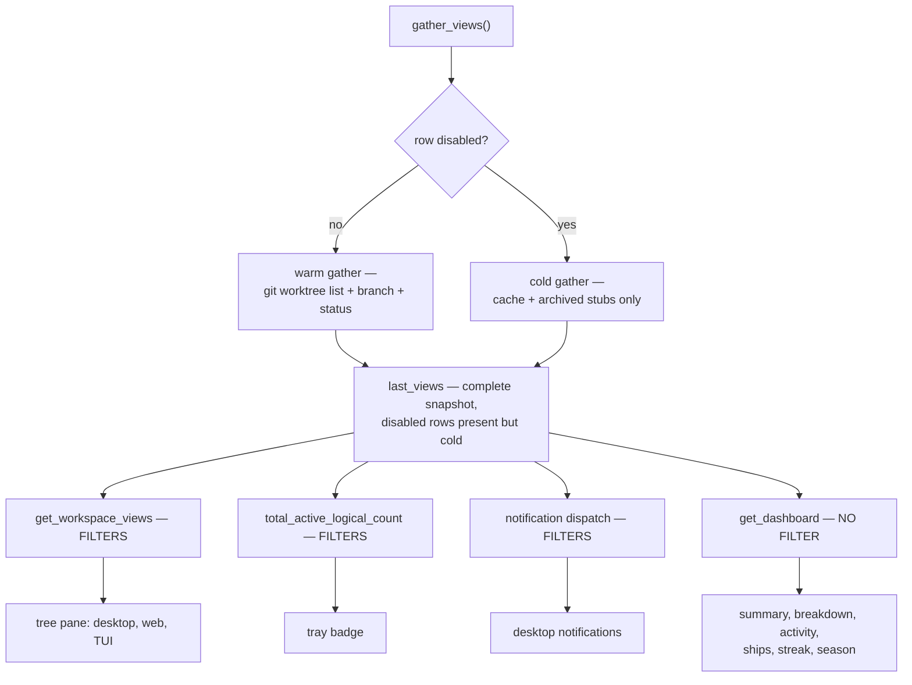

# Temporarily Disable Workspaces

## Why

A long-lived registry accumulates workspaces faster than it sheds them. Once a
dozen repositories are registered, the tree pane, the tray badge, and the
desktop notifications are all reporting on projects the user is not touching
this week — and the aggregated recompute is spending its time on them too. The
gather/compute split records the measured cost of that work: 12 repositories
and 17 worktrees cost 576 ms per full recompute before pooling and 179 ms after
(`crates/openspec-core/src/repo_view.rs`), essentially all of it `git worktree
list`, `git branch`, and `git status` subprocesses.

The existing escape hatch is unregistering, which is too destructive to use
casually: it cascades away every discovered worktree of the repository, drops
the presentation entry (display name and tint), and forfeits the workspace's
position in config order. Users need a reversible way to park a workspace,
not a way to delete it.

Crucially, "park" must not mean "erase". Two independent data provenances feed
the app, and only one of them should go quiet:

- **Live view state** — the tree, the tray badge, notifications, and the
  Dashboard's counters, all derived from the aggregated `last_views` snapshot.
- **Append-only history** — `activity.json` achievements, which are recorded in
  `WatcherManager` *before* the cache write and therefore upstream of every
  view, and which drive streaks, the contribution heatmap, season score, and
  career tier.

Parking a repository to reduce noise must never cost the user a streak day or a
season objective. That constraint, more than any other, shapes the design.

## What Changes

A top-level row — a repository group or a flat workspace — gains a **disabled**
flag, toggled from the Settings view and persisted in the presentation store.

A disabled row is **not removed** from the aggregated snapshot. It is instead
aggregated *cold*: built from the already-warm cache plus the archived-stub
directory read, skipping the entire git phase. Every field the Dashboard reads
(`active`, `archived`, task rollups, spec counts) comes from the cache and stays
accurate; every field it never reads (`default_branch`, `dirty`,
`dirty_worktrees`, `has_uncommitted_specs`, per-instance `branch`,
`is_default_branch`, `spec_commit_state`) is the git-derived material that gets
skipped.

The filter then lives at the *consumers*, not at the snapshot:

Because the tree filter lives inside the shared `get_workspace_views` command
rather than in each frontend, the desktop React tree, `specforge-web`, and
`specforge-tui` all inherit it with no frontend-specific work.

The filesystem watcher, the parsed cache, and the activity log keep running for
a disabled workspace. This is what makes the flag cheap to flip in both
directions: re-enabling is a scoped `refresh_aggregated_view_for(repo_id)`
against an already-warm cache, with no watcher lifecycle involved and no
re-parse. It is also what keeps history unbroken — achievements continue to be
recorded while a workspace is parked.

## Capabilities

### New Capabilities

_None._ The disable flag extends contracts that already have owners: the
presentation store, the Settings view, and the aggregated-view requirements all
live in `workspace-registry`; the badge and notification contracts live in
`tray-indicator`.

### Modified Capabilities

- `workspace-registry` — adds the disabled flag to the presentation store and
  its listing payload, adds the Settings toggle, and adds the cold-aggregation,
  tree-exclusion, continued-watching, and re-enable-freshness contracts.
- `tray-indicator` — the badge count and both desktop-notification requirements
  now exclude disabled top-level rows.
- `dashboard` — adds an explicit requirement that the Dashboard is *unaffected*
  by the disabled flag, so the deliberate asymmetry is not later "fixed".

## Impact

**Rust core** — `crates/openspec-core/src/presentation.rs` (a `disabled` field
on `PresentationEntry`, a dedicated read-modify-write setter, and an amended
`is_empty` so a disabled-only entry is not pruned on save);
`crates/openspec-core/src/repo_view.rs` (an `is_disabled` predicate threaded
through `gather_views`, a cold flag on `RepoGatherInput`, and a cold path in
`compute_repo_rows_pooled`); `crates/openspec-core/src/watcher.rs` (a disabled
set the manager can read, and the badge count filtered by it).

**Shell** — `crates/openspec-app/src/service.rs` (wiring and the re-enable
refresh); `crates/specforge/src/commands.rs` (the tree filter in
`get_workspace_views`, a dedicated `set_workspace_disabled` command, and the
`disabled` field joined into `list_workspaces`);
`crates/specforge/src/notifications.rs` (suppression for disabled rows).

**Frontend** — `src/types.ts` (hand-mirrored `disabled` on
`RegisteredWorkspace`), `src/api.ts`, `src/components/SettingsView.tsx` (the
per-row toggle).

**Deliberately unchanged.** The Dashboard, seasons, progress, and commit-garden
computations are untouched: a disabled workspace keeps contributing to summary
metrics, the per-repository breakdown, the activity chart, lifecycle
throughput, today's ships, streaks, the heatmap, season score, and career tier.
This is the point of the design, not an oversight — see the *Dashboard
Unaffected by Workspace Disable* requirement.

The workspace registry file (`workspaces.json`) is **not** touched: no new
field, no schema version, no migration. The flag lives entirely in
`presentation.json`, which preserves the registry's cross-version
read/write-compatibility guarantee.

The watcher and repo-monitor lifecycles are **not** touched. Disabling a
workspace does not tear down its filesystem watcher, does not drop its cache
entry, and does not stop achievement recording.

`crates/specforge-tui` and `crates/specforge-web` require no changes — both
consume the shared `get_workspace_views` path and inherit the filter — but both
are covered in verification.

Granularity is the top-level row only. Disabling an individual worktree of a
repository is out of scope; the presentation-key identity chosen here does not
foreclose it later.
