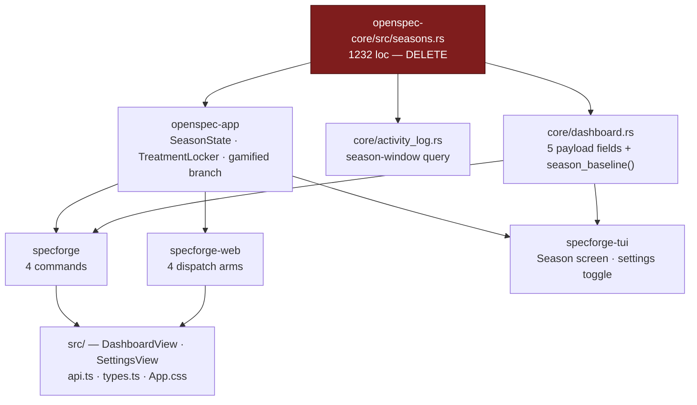
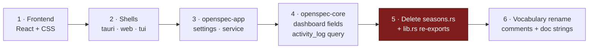

## Context

The gamified layer shipped behind `AppSettings::gamification_enabled`, a master switch that defaults to `false`. Everything characterful about the Dashboard — streak, heatmap, leaderboard, commit garden, ship confetti — is therefore invisible until a user finds a toggle in Settings, and the default experience is a bare analytics table.

The switch also gates two things that do not belong together. One half reads the record of work actually done (activity-log events and mined commits). The other half is an invented monthly game: a 30-tier battle pass with adaptively-paced completion totals, generated objectives, a treatment vault with rarity tiers, season recaps, and a locker of cosmetic badge finishes worn over the profile avatar. This change keeps the first half and deletes the second, along with the gate itself.

The blast radius spans every layer of the app. `seasons.rs` is the largest single module in the core, and the four IPC commands it backs are mirrored in three separate frontends.

## Goals / Non-Goals

**Goals:**

- Delete `gamification_enabled` and every read of it, so the surviving progress layer is unconditional in all three frontends.
- Delete the season / battle-pass system and the badge finishes permanently, including their persisted state.
- Leave the surviving surfaces — Today's Progress, streak, heatmap, per-author leaderboard, commit garden, celebrations — behaviourally identical to what they do today with the switch on.
- Land the vocabulary rename (`gamified` → `progress`) in the same change, so no stale concept survives the deletion.
- Keep the workspace compiling and the test suite green at every commit, so the change is reviewable in slices rather than as one 3000-line drop.

**Non-Goals:**

- Redesigning the Dashboard's layout, ordering, or visual language. Sections that survive keep their current position and styling; only the season/treatment blocks are excised.
- Preserving any user's unlocked treatments, equipped finish, or rollover bookmark. These are discarded.
- Changing the activity log's event kinds, its git backfill, the commit mining, the identity/roster resolution, or the tray and dock badges.
- Adding a replacement setting of any kind. The removal is not a relocation.

## Decisions

### Delete the career tier rather than salvaging it

`career_tier()` takes `AchievementTotals` and nothing else — no season window, no baseline, no ladder state. It could survive as a ~40-line `career.rs` with the `◆ <rank>` chip intact.

It is nonetheless deleted. It is an invented ladder over lifetime totals, which is the same category of thing as the battle pass, and it is the *only* remaining consumer of `seasons.rs`. Keeping it means keeping a scoring module, its threshold table, and its tests alive to feed one chip on the hero.

**Rejected — salvage into `crates/openspec-core/src/career.rs`:** would preserve a visible piece of user-facing standing at a genuinely small code cost. Rejected because it leaves the repo with a vestigial scoring file whose only justification is that it already exists, and because the user's framing was to remove invented progression, not to keep the subset that happens to be cheap. Deleting it lets the module go whole, which is the cleaner end state.

### Remove the gate rather than flipping its default

The smallest possible change achieving "included by default" is `gamification_enabled: bool` → default `true`.

Rejected in favour of deleting the field. A default-on switch is still a switch: it keeps the settings key, the getter/setter pair, four IPC commands, four web dispatch arms, a TUI toggle row, a React toggle, and — most expensively — every `if gamified { … }` branch in the render tree and the `if !enabled { return default }` guards in the service. The branches are the real cost, because each one is a second code path that has to keep working.

**Rejected — keep the flag, default it to `true`:** preserves an escape hatch for a user who wants the bare analytics view. Rejected because the spec now asserts the layer is unconditional (*Unconditional Progress Layer*), and a hidden-but-present flag would contradict its "no control disables the layer" scenario while leaving all the dual-path complexity in place.

### Peel outside-in, keeping the tree green

Two viable orders. Deleting `seasons.rs` and `pub mod seasons` first turns the compiler into a worklist: every consumer surfaces as an error. That is efficient but leaves the workspace red across the whole change, so nothing is committable or reviewable until the last error clears.

The chosen order runs the dependency graph in reverse — leaves first, core last — so `cargo check` passes at every step and each layer is its own commit.

By the time step 5 runs, `seasons.rs` has no callers left and the deletion is mechanical. Step 6 is deliberately last and touches no logic, so it can be reviewed as a pure rename.

**Rejected — delete the core module first and follow the compiler:** faster to *start* and guarantees nothing is missed, since the build cannot pass while a reference survives. Rejected because it produces a single unreviewable commit and forfeits the ability to run the test suite mid-change, which matters here precisely because the change is large and mostly deletion. The completeness guarantee is recovered cheaply at step 5, where the compiler still refuses to build if any consumer was overlooked.

### No settings migration

No type in the workspace uses `serde(deny_unknown_fields)`. An existing `settings.json` carrying `gamificationEnabled` and a populated `season` block therefore deserializes straight past both keys into the new `AppSettings`, and the next write — which serializes the whole struct — drops them. Unlocked treatments vanish silently, which is the intended outcome.

**Rejected — an explicit migration pass that strips the orphaned keys on load:** would leave the file visibly tidy immediately rather than at next write, and would give a place to log what was discarded. Rejected as pure cost: it adds a versioned-migration concept the settings file has never needed, to solve a problem serde already solves, for keys no code will ever read again.

### Delete the IPC commands rather than deprecating them

`get_gamification_enabled`, `set_gamification_enabled`, `set_equipped_treatment`, and `get_treatment_locker` are removed from the Tauri `invoke_handler` and the web dispatch table together.

**Rejected — retain them as no-op stubs:** would keep a stale browser tab holding an older `dist/` bundle from erroring after the desktop app updates. Rejected because the web server embeds the frontend bundle it serves (`RustEmbed` over `dist/`), so server and bundle always ship as one artifact and the skew window is a page refresh. The `web-ui` capability's mirror contract already specifies that an unknown command returns a structured "unsupported" error rather than crashing the stream, so the failure mode is defined.

### Rename the vocabulary in this change

With no complement left, "gamified layer" names nothing — there is no un-gamified layer to contrast with. The concept becomes the **progress layer** across requirement names, Rust doc comments, TypeScript type docs, and TUI module docs.

**Rejected — a follow-up rename change:** would keep this diff smaller and purely subtractive, which is easier to review. Rejected because the deletion is exactly when the word stops making sense; deferring guarantees an interval where the specs and the code describe a gate that no longer exists, and a rename change with no behavioural content tends never to get prioritised. Isolating it as the last commit (step 6 above) recovers most of the reviewability benefit.

### Rename requirements rather than modify them when a scenario must go

Five requirements across four capabilities need a scenario deleted — the season-window queries, the roster-does-not-affect-season-standing pairs, the season line in the disabled-workspace scenario, and the gamification-toggle live-update. `openspec archive` refuses a MODIFIED block that drops a scenario present in the current spec ("current spec contains scenario(s) not present in the modified block"), and it refuses a REMOVED+ADDED pair under the *same* name ("requirement present in multiple sections"). The only accepted shape is a genuine rename: REMOVE the old requirement, ADD a differently-named one. So *Bounded, Time-Bucketed Queries* → *Bounded, Per-Day Queries*, *Person-Colored Nodes* → *Person-Colored Graph Nodes*, *Per-Author Leaderboard for Shared Repositories* → *Per-Author Leaderboard*, *Dashboard Unaffected by Workspace Disable* → *Dashboard Includes Disabled Workspaces*, and *Settings Screen* → *Terminal Settings Screen*. The one prose cross-reference to a renamed requirement (from *Ship Selection Opens the Archive Browser*) is updated by an in-place MODIFIED block.

**Rejected — keep each requirement's name and retain the stale scenario headers verbatim:** the archive guard would pass with no renames at all, since it only checks that every current scenario name still appears. Rejected because it would leave scenarios called "Coloring does not affect season standing" and "Streak, heatmap, and season standing are unaffected" in specs for an app with no seasons — the guard would be satisfied by a lie. The guard exists to prevent *accidental* scenario loss; renaming is the intended way to express deliberate loss.

### Renumber the terminal screens contiguously

Removing the Season screen frees key `3`. Screens become Browse `1`, Dashboard `2`, Garden `3`, History `4`, Settings `5`.

The invariant the spec now carries is that the screen keys form a gapless run — for $n$ screens, every $k \in \{1, \dots, n\}$ is bound, and the rendered key legend agrees with the bindings.

**Rejected — leave key `3` unbound and keep Garden/History/Settings on `4`/`5`/`6`:** preserves the muscle memory of anyone already using the TUI. Rejected because a dead key in the middle of a numeric run reads as a bug rather than a deliberate gap, and the legend would have to either lie or display a hole. The TUI is new enough that the muscle-memory cost is small and paid once.

## Risks / Trade-offs

**Over-deleting the shared trailing-average helper, with no test to catch it** → `dashboard.rs`'s private `trailing_avg_centi()` / `commits_trailing_avg_centi()` back both the season entry baseline (going) and the Today's-Progress average comparison (staying). Deleting the public `season_baseline()` wrapper is correct; taking the private helpers with it silently breaks the hero's ▲/▼ indicators without any type error. The obvious mitigation — "keep the existing tests" — does not work: the *only* assertions on `tasks_avg_centi` / `changes_archived_avg_centi` / `commits_avg_centi` live inside `season_baseline_with_today_anchor_matches_the_live_tile`, a test of the very function being deleted, so the guard removes itself along with the risk it guards. *Mitigation:* task 7.1 adds a `compute_progress` test asserting those three fields directly **before** anything is deleted, and task 7.4 re-runs it afterwards. Without that ordering the suite goes green on a broken hero.

**The mutation gate lands on the rewritten service assembly** → `.cargo/mutants.toml` excludes all three shells but *not* `openspec-app`, so the collapsed dashboard-assembly branch in `service.rs` is in scope, and `cargo mutants --in-diff` gates on changed lines. Deleted lines carry no mutants, but the lines that survive the collapse do. *Mitigation:* run the in-diff sweep locally before pushing (`git diff $(git merge-base origin/master HEAD) HEAD > /tmp/sf.diff && cargo mutants --in-diff /tmp/sf.diff`) and add assertions for any survivor rather than excluding it; `tests/dashboard.rs` is the natural home since it already exercises the assembly end to end.

**Off-by-one in the TUI settings rows** → the gamification toggle is row 0 of three, and `SETTINGS_TOGGLE_COUNT` is what positions the Appearance control below them. Removing a row without decrementing the constant misplaces focus and scroll targets, and the render tests assert against row indices. (The neighbouring comment already reads "after the two toggles" while three exist, so the constant is a known trip hazard.) *Mitigation:* decrement `SETTINGS_TOGGLE_COUNT` in the same edit as the row removal, re-index the `render_tests.rs` assertions, and fix the stale comment while there.

**`cargo test` fails workspace-wide in a fresh worktree** → the Tauri crate's `generate_context!` and `specforge-web`'s `RustEmbed` both need `dist/`, which is gitignored, so a newly created worktree cannot build until the frontend is bundled. This will look like the change broke the build. *Mitigation:* run `bun run build` once in the worktree before the first `cargo test`; it is a precondition of the tree, not a symptom of the change.

**Grouped CSS selectors turn a deletion into a regression** → nothing catches an unreferenced CSS rule, but the larger hazard runs the other way: two rules mix dying and surviving selectors. `.finishes-item:focus-visible` and `.season-recap-close:focus-visible` are 2 of 15 selectors in the shared focus-ring rule at `App.css:2072-2088`; deleting that block strips `box-shadow: var(--shadow-focus)` from `.btn-primary`, `.split-pane-divider` and eleven others — a silent keyboard-accessibility regression no compiler, tsc pass, or test catches. The reduced-motion rule at `:3615-3622` has the same shape around `.season-tierup`. Conversely `@keyframes tierup-in` matches no class prefix and survives as dead CSS, so a "grep until zero hits" check can never actually pass. *Mitigation:* tasks 2.4/2.5 split whole-rule deletions from selector-level edits explicitly, task 2.6 greps `.tsx`/`.ts` and `App.css` separately rather than treating one grep as proof, and task 11.9 tabs through the running app to confirm focus rings survive.

**Users lose unlocked treatments with no warning** → anyone who had gamification on and earned finishes loses the locker and the equipped selection at the next settings write, with no dialog and no export. *Mitigation:* accepted deliberately — this is the intended outcome of a permanent removal, and preserving cosmetics for a system that no longer exists has no destination. Call it out in the release notes so the disappearance is documented rather than mysterious.

**Confetti and the commit garden become unconditional** → users who deliberately left the switch off get ship celebrations and a per-repo graph section they had opted out of. *Mitigation:* `prefers-reduced-motion` remains a full suppressor of the celebrations, which covers the accessibility case; the garden is bottom-of-page and below the analytics, so it does not displace anything. The residual preference case is the accepted cost of removing the gate.

**`openspec validate` is not proof the change can land** → validation passes on deltas that `openspec archive` rejects outright; the scenario-drop guard and the duplicate-section guard only run at archive time, which is *after* the whole implementation is done. A delta that looks green for the entire life of the change can abort on the last command. *Mitigation:* task 11.6 dry-runs the sync — copy `openspec/` to a scratch directory and run `openspec archive … --yes --no-validate` there — before committing, so the guard fires in seconds rather than at the end.

**A capability cannot be retired by a delta at all** → emptying a capability does not delete its spec file, and worse, `openspec archive` *aborts the entire change* with `Spec must have at least one requirement` once the rebuilt spec has none — so a `specs/seasons/` delta that removes all eleven requirements blocks the sync outright rather than leaving a stub. (The stub-survival behaviour only appears under `--no-validate`, which masks the abort.) This change therefore ships no seasons delta and deletes `openspec/specs/seasons/` directly during implementation; all three shapes were tested against a scratch copy. Separately, a delta's `## Purpose` section is written but never applied, so `terminal-ui` and `commit-garden` keep describing "the gamified layer" no matter what the deltas say. Both were verified by running archive on a scratch copy. *Mitigation:* group 10 makes the directory deletion and the two purpose paragraphs explicit archive-time tasks rather than assumed side effects.

**The lint gate fails after every local check passes** → `.github/workflows/ci.yml` runs *Lint (fmt + clippy)* first, with `-D warnings`. A deletion-heavy change strands unused imports, unused locals (`settings_arc`) and never-read fields (`season_scroll`) — all warnings, none surfaced by `cargo test` or `bun run build`. *Mitigation:* task 11.3 runs `cargo fmt --all -- --check` and `cargo clippy --workspace --all-targets -- -D warnings` locally as a verification step, and tasks 5.1 and 6.7 name the specific dead bindings so they are removed rather than discovered.

## Migration Plan

No data migration, no rollout gate, no feature flag. The orphaned `gamificationEnabled` and `season` keys are ignored on load and dropped on the next settings write.

Rollback is a git revert: nothing is written that an older build cannot read, because the change only ever *removes* keys from the settings file. A reverted build finds its keys absent, applies `#[serde(default)]`, and comes back up with gamification off and an empty locker — the shipped default. The only unrecoverable loss is treatment state, which is discarded by design.
