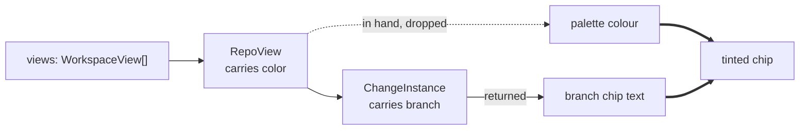

## Context

Two chips name the same branch of the same change, on screen at the same time. The tree's is tinted to the workspace's palette colour; the detail pane's is neutral.

The cause is visible in the stylesheet. `.identity-branch` and `.row-worktree` carry byte-identical appearance blocks — same family, size, line-height, ink, border colour, radius, padding — because the former was written by copying the latter. What the copy did not carry is the eight `.row-worktree--<colour>` modifiers defined immediately below it. The header therefore renders the neutral base and nothing else.

Everything needed to fix it is already in the detail pane. `DetailPane` receives `views: WorkspaceView[]`, and `branchForWorktree` already walks `views → kind:"repo" → active → instances` to find the instance whose `worktreePath` matches the render target's `workspace`. That walk passes straight through the `RepoView` that carries `color`, reads `instance.branch`, and discards everything else.



The constraint that shapes the rest of this design: whatever is done here must not leave the two chips able to drift apart again, because drifting apart is the entire defect.

## Goals / Non-Goals

**Goals:**

- The header's branch chip renders identically to the tree's chip for the same branch, at every palette colour and when none is configured.
- The chip's appearance has **one** definition, so a future change to either surface moves both.
- No backend work: no IPC shape change, no new command, no dependency.

**Non-Goals:**

- The "last changed" timestamp. It needs `read_artifact` to return a struct instead of a bare `String` across three frontends in the two mutation-gated crates, and it ships separately so this change stays frontend-only.
- Any visual change to the workspace tree. The tree is refactored to consume the shared class and must render byte-identically before and after.
- Tinting anything in the header other than the branch chip. The change name stays neutral; the tree's colour-anchoring of the *name* is a tree-row concern with a left rail and swatch the detail pane has no equivalent of.
- Unifying every monospace chip in the app. Only the two provably identical ones are merged.

## Decisions

### D1: One shared appearance class, not eight duplicated modifiers

The narrow fix is to write `.identity-branch--indigo … --purple` mirroring `.row-worktree--*`. That is eight new rules that must be kept in step with eight existing ones, by hand, forever.

The defect being fixed *is* a hand-copy that fell out of step. Repeating the mechanism to fix its symptom leaves the next tint change — a new palette colour, a contrast retune — able to land on one surface and not the other, silently, exactly as it did this time.

So the appearance block moves into a single class carrying the shared properties and the eight tints, and each site keeps only what differs. What differs is layout alone:

| | tree chip | header chip |
|---|---|---|
| appearance | *identical* | *identical* |
| sizing | `flex: 0 1 auto`, `min-width: 0` | `flex: 0 0 auto` |
| overflow | `hidden` + ellipsis + `nowrap` | none — the bar wraps |

The tree ellipsizes because a long branch competes with a change name in a dense row; the header holds its size because its row is allowed to wrap. Those are genuine per-site concerns and stay per-site.

*Rejected: duplicate the modifiers.* Cheaper by a few minutes and re-arms the trap that produced this change.

*Rejected: have `.identity-branch` reuse `.row-worktree`'s class name directly.* It would work, and it welds a detail-pane element to a class named for a tree row — the next person editing tree-row layout has no way to know the detail pane is downstream of it.

### D2: The shared class is a new vocabulary, not `.chip`

There is already a `.chip` base with `.chip--warn` / `.chip--muted` modifiers, and it looks like the obvious home. It is not:

```
.chip {  text-transform: uppercase;  letter-spacing: 0.05em;  font-size: var(--text-xs);  }
```

Uppercasing is correct for `DIVERGED` and **destructive** for a branch name, which is a case-sensitive identifier — `feat/Foo` and `feat/foo` are different refs, and a chip that renders both as `FEAT/FOO` is lying about a value the user may be about to type. The size tier differs too (`--text-xs` against the identifier chips' `--text-2xs`).

So `.chip` is the *status badge* vocabulary — short, symbolic, case-insensitive words — and the branch chip belongs to a distinct *verbatim identifier* vocabulary: monospace, case-preserved, rendered exactly as stored. These are two vocabularies that happen to share a border radius, and merging them would corrupt data to save a rule.

This is worth writing down precisely because the merge looks attractive from the stylesheet. A future reader who finds two chip base classes and "tidies" them into one reintroduces the uppercase bug.

*Rejected: fold into `.chip` and override `text-transform: none` at the branch sites.* The override is a standing admission that the base is wrong for this use, and any new identifier chip added later inherits uppercase by default and has to remember to opt out.

### D3: One ink variable both properties read

`.row-worktree--*` sets `color` and `border-color` to the same token, twice per rule, eight times over. Text and border are free to disagree there; nothing but care keeps them equal.

The obstacle to collapsing that is a detail worth stating, because it is exactly what the obvious fix gets wrong: **the neutral chip's border and text are deliberately different tokens** — `--border-strong` and `--text-muted` — while a *tinted* chip's are deliberately the same. So the mechanism has to unify the two properties when a tint is present and keep them apart when it is not.

`border: … solid currentColor` is the idiom already in this stylesheet (`.chip` uses it) and it handles the tinted case, but not the neutral one: it would drag the untinted border from `--border-strong` down to `--text-muted`, restyling a chip on both surfaces in a change that promises the tree renders identically. Guarding that means keeping an explicit `border-color` on the base and re-declaring `border-color: currentColor` in all eight modifiers — sixteen declarations, and the repetition D1 exists to remove.

A single custom property does both jobs at once:

```css
.ident-chip {
    color:  var(--ident-chip-ink, var(--text-muted));
    border: var(--border-width) solid var(--ident-chip-ink, var(--border-strong));
}
.ident-chip--indigo { --ident-chip-ink: var(--ws-text-indigo); }
```

Each tint is **one** declaration. When it is set, both properties resolve to the same value and cannot drift. When it is not, each property falls back to its *own* neutral — so the two-tokens-when-neutral, one-token-when-tinted behaviour is the mechanism itself rather than an exception carved around it.

*Rejected: `currentColor` on the modifiers with an explicit neutral base.* Correct, and it costs two declarations per tint plus a standing note explaining why the base overrides what the modifiers rely on.

*Rejected: `currentColor` everywhere including neutral.* Simplest of all, and it silently restyles the untinted chip on both surfaces.

### D4: Widen the existing lookup rather than add a second walk

`branchForWorktree(worktreePath, views)` returns `string | null`. The colour needs the same traversal, and running it twice would mean two functions that must agree about which instance matched.

It becomes one lookup returning the matched instance's branch together with its repository's palette colour, so the two values are resolved from a single match by construction and cannot disagree about which workspace the artifact came from.

The archived-change guard is unaffected and stays where it is. `isArchivedChangeId` suppresses the chip entirely for an archived change — because the worktree its artifact was read from routinely hosts *other* active changes whose branch was never the archived change's. Suppressing the chip suppresses the tint with it; there is no separate archived case for colour, and no opportunity for an archived change to be painted in a live workspace's colour.

*Rejected: a separate `colorForWorktree`.* Two walks over the same data that must return facts about the same instance, with nothing enforcing that they do.

### D5: The equivalence is specified as rendered output, not as shared code

The requirement says the two chips render identically — not that they share a class. A spec that named the implementation would be satisfied by two surfaces sharing a broken class, and would need rewriting the day the structure changes.

Stating it as observable output keeps the contract verifiable from the DOM on the browser loop (`specforge-serve` + built `dist/`), which is how UI changes are checked in this repo, and leaves D1 free to be revisited without touching the spec.

## Risks / Trade-offs

**The tree is refactored for a defect that is not in the tree.** → The tree's rules keep their exact computed appearance; only the source of those properties moves. The verification for this change explicitly includes a tree chip rendering unchanged, so a regression there fails the change rather than shipping as collateral.

**`--ws-text-*` contrast was tuned against a stated background, and the header is a different element.** → The tokens are documented as ≥4.6:1 on `--surface`, and `.detail-identity` sets `background: var(--surface)` literally. The guarantee transplants because the background is the same token, not a similar one — but this is the claim most worth confirming rather than assuming, since a later change to the bar's background would silently invalidate it.

**A tinted chip could read as a *status* signal rather than an identity one.** → `visual-identity → Outlined Chip Badges` reserves fills and glows for the sanctioned set and requires informational chips to stay outlined ink; the tinted chip remains outlined and transparent-backed, so it stays inside the informational vocabulary. It also already looks exactly this way in the tree, where users have it in view constantly — the header is adopting an established signal, not inventing one.

**The header now carries workspace colour with no rail or swatch beside it.** → In the tree the chip's tint is one of three co-located colour cues (rail, swatch, chip); in the header it is alone, so it carries more weight per pixel. That is the intended outcome — the header has no other way to say which workspace the artifact came from — but it means the tint is doing a job here it merely reinforces in the tree, and should be checked at a glance rather than only in the DOM.
