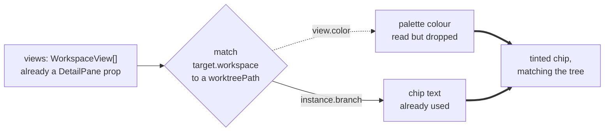

# Tint the Identity Header's Branch Chip

## Why

The detail pane's change-identity header shows the owning worktree's branch as an outlined chip in neutral ink, while the workspace tree shows the *same branch of the same change* as a chip tinted to the workspace's palette colour. Both are on screen at once, so one value renders two ways and the header reads as belonging to no workspace in particular.

This is not a deliberate contrast trade or a missing token — it is a stalled copy. `.identity-branch` was written by hand-copying `.row-worktree`'s appearance block (the two are byte-identical: same family, size, line-height, ink, border, radius, padding) and the copy stopped one rule short of the eight `.row-worktree--<colour>` tint modifiers that follow it. The colour the header needs is already in its own props and is discarded unread.

## What Changes

- The identity header's branch chip is **tinted to the owning workspace's palette colour** — text and border in a contrast-safe shade — matching the tree's chip for the same branch. A workspace with no configured palette colour keeps today's neutral chip.
- The colour is resolved by the walk that **already runs** to find the branch: `branchForWorktree` traverses `views → repo → active → instances` to match `target.workspace`, reaches the `RepoView` carrying `color`, and returns only `.branch`. It is generalized to surface both.
- The appearance block shared by the tree chip and the header chip is **lifted into one class**, with each site keeping only its own layout (the tree ellipsizes and shrinks; the header holds its size and wraps). The tint modifiers hang off the shared class, so both surfaces get them from one definition and the hand-copy that caused this cannot recur. The tree's rendered appearance is unchanged.

No new data crosses the IPC boundary and no command is added: every value the header needs is already resident in the frontend.

## Capabilities

### New Capabilities

_None._

### Modified Capabilities

- `spec-browser`: the *Change Identity Header in the Detail Pane* requirement gains the branch chip's colour contract — tinted to the owning workspace's palette colour, neutral when none is configured, and rendered identically to the tree's chip for the same branch, so the two surfaces cannot disagree about one value.

## Impact

**Code.** Frontend only:

- `src/App.css` — the shared identifier-chip appearance class plus its eight palette tints; `.row-worktree` and `.identity-branch` reduced to their layout differences.
- `src/changeIdentity.ts` — `branchForWorktree` generalized to return the matched instance's branch *and* its repository's palette colour from the single existing walk.
- `src/components/DetailPane.tsx` — `ChangeIdentityHeader` accepts the colour and emits the tint modifier alongside `identity-branch`.
- `src/components/WorkspaceTree.tsx` — adopts the shared class on the tree chip. Pure refactor; the tree renders identically before and after.
- `src/changeIdentity.test.ts` — covers the generalized lookup.

**Deliberately unchanged:**

- **No Rust, no IPC, no new command, no dependency.** `views` is already a `DetailPane` prop and already carries `RepoView.color`, so none of the four command-registration points (`api.ts`, `commands.rs`, `lib.rs`, `dispatch.rs`) is touched, and the mutation gate — scoped to `openspec-core` + `openspec-app` — is not in play.
- **The "last changed" timestamp is out of scope.** It requires `read_artifact` to return a struct rather than a bare `String` across all three frontends, in the two mutation-gated crates. It ships as its own change; this one carries no backend work and can land independently.
- **`.chip` is not the shared class.** It is the status-badge vocabulary — `text-transform: uppercase` and `letter-spacing`, correct for `DIVERGED` and destructive for a case-sensitive branch name. The identifier chip stays a separate vocabulary rather than being folded into it.
- **`.row-branch` is left alone.** The repository header row's chip uses the weaker `--border` deliberately, unlike the `--border-strong` shared by the two chips being unified. Pulling it in would change how a surface nobody complained about looks.
- **Where no chip renders today, none renders after.** A flat (non-git) workspace, an unknown branch, and an archived change each continue to show the change name alone; a tint cannot apply to a chip that does not exist.
