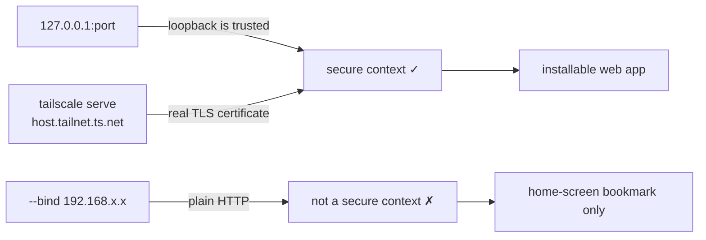
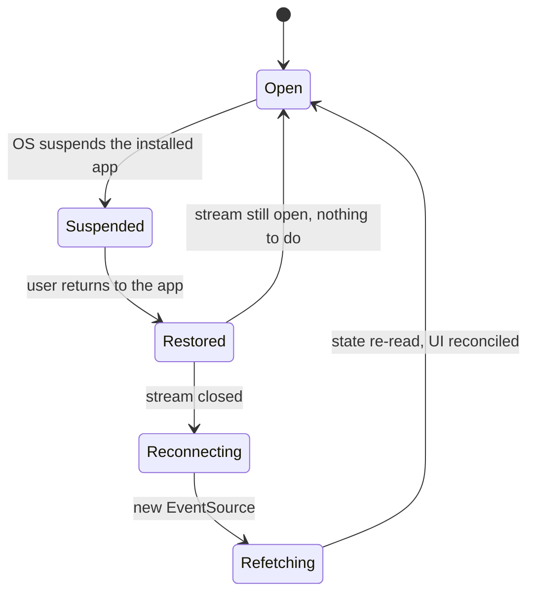

## Context

The served bundle currently carries no icon markup and no manifest, and `crates/specforge-web/src/assets.rs` answers every unmatched path with `index.html` so that client-side deep links survive a reload. That fallback is correct for routes and wrong for assets: a browser's unprompted `GET /favicon.ico` receives an HTML document under an image request.

Three facts constrain the design.

**The canonical illustration does not survive small sizes.** `product-identity` pins a single 1024×1024 opaque-square source at `crates/specforge/icons/app-icon.png` — a painterly forge scene with a stone frame, a gold anvil carrying a task-list glyph, a steel hammer and sparks. Downscaled to 32 px it is muddy but readable; at 16 px it collapses to a gold smear inside a taupe frame. The same spec already anticipates this, permitting a simplified small variant.

**Install viability depends on the access path.** A secure context is required for a real installed app, and the three ways the bundle is reached do not agree:

`tailscale serve` terminates TLS with a genuine certificate, which is what makes a phone install real rather than degraded. `touch-input` already treats tablets and phones as a designed-for surface, so this is the audience the capability exists for.

**The event stream cannot replay.** `crates/specforge-web/src/sse.rs` sets no `id()` on any frame and does not read `Last-Event-ID`; a lagging receiver is skipped with an explicit comment that the frontend re-reads current state on the next event it does receive. `src/api.ts` holds one module-level `EventSource` created once and never closed, with no lifecycle handling. In a long-lived browser tab this is invisible, because the tab stays alive and `EventSource` retries transient drops itself. An installed app is *suspended* wholesale by the OS, which is a different failure.

## Goals / Non-Goals

**Goals:**

- Every tab shows a recognisable SpecForge mark, legible at 16 px.
- The bundle installs from iOS Safari to the home screen with its own icon and its own window.
- One manifest works unchanged across every origin the bundle is served from.
- An installed app that has been suspended comes back showing live state, not silently stale state.
- Missing static assets answer honestly, without regressing client-side deep links.

**Non-Goals:**

- No service worker, no offline caching, no precaching of the shell.
- No new artwork: both icon sources are the existing illustration and a glyph traced from geometry already in the repository.
- No change to the trust boundary — bind resolution, the authority allowlist, the Tailscale login gate, and the absent host-open command are untouched.
- No attempt to make the plain-HTTP `--bind` path installable.
- No change to the Tauri desktop shell, where the new markup is inert.

## Decisions

### Two icon sources, split by size

The set is generated from two different origins: sizes at and below 32 px come from a hand-authored flat anvil glyph; 180 px and above are rasterizations of `app-icon.png`.

*Rejected — downscale the illustration for every size.* Direct inspection settles it: at 16 px the hammer, sparks and checklist are all gone and only a gold blob inside a frame remains. A favicon that reads as an anonymous smear is worse than the effort saved.

*Rejected — reuse `crates/specforge/icons/tray-icon.svg` directly.* It is the right complexity and the right size, but `tray-indicator` governs it as a macOS **template** image whose rasterizer debug-asserts that every output pixel is pure black plus alpha. Pointing the web at that file couples two capabilities with no reason to move together: a future colour or contrast change wanted by one would be forbidden by the other. The web glyph reuses the *geometry* as a separately authored file.

### `public/`, with committed derivatives

The generated files live in `public/` and are committed. Vite copies that directory verbatim into `dist/`, which `rust-embed` already embeds, so nothing about how assets are served changes.

*Rejected — import the icons as Vite assets.* Vite would hash the filenames, and both `/favicon.ico` and the manifest's icon `src` entries need stable, predictable paths; a browser probing `/favicon.ico` never consults the bundle graph.

*Rejected — generate at build time instead of committing.* `dist/` is gitignored, so nothing would be reviewable, and `cargo test` — which already fails workspace-wide until `dist/` exists — would gain a second, image-processing prerequisite.

*Rejected — a Rust route serving `crates/specforge/icons/`.* This adds a handler inside the trust boundary and a filesystem read at request time, in exchange for nothing the static path does not already provide.

### The manifest is origin-agnostic

`start_url` is `"."` and `scope` is `"/"`, both resolved against the document rather than written absolutely.

Let $O$ be the set of origins one build is served from:

$$O = \{\, \texttt{http://127.0.0.1}\!:\!p \;\mid\; p \in P \,\} \;\cup\; \{\, \texttt{https://}\,h\texttt{.}t\texttt{.ts.net} \,\}$$

where $P$ ranges over every port `SPECFORGE_WEB_PORT` may select. An absolute `start_url` $u_0$ is correct only on the single origin of $u_0$ and wrong on $|O| - 1$ others; a relative one is correct on all of $O$.

*Rejected — an absolute `start_url`.* It bakes in whichever origin the author happened to be using, and silently mis-scopes the install everywhere else — precisely the tailnet case this capability exists to serve.

### Reconnect and refetch, rather than resume

On the document being restored from a suspended or frozen state, the client checks the stream and, if it is no longer open, replaces it and then re-reads current state through the ordinary command surface.

The refetch is not optional. Because the stream carries no ids and the server buffers no history, a reconnected client has no way to learn what it missed while suspended — reconnecting alone would leave the UI on pre-suspension data until the next unrelated event happened to arrive.

*Rejected — `Last-Event-ID` replay.* It would require the server to hold event history. The broadcast channel is deliberately lossy and already drops lagging receivers on purpose; adding a replay buffer would reverse a deliberate design decision in the shared layer to serve one frontend's lifecycle.

*Rejected — recreate the stream on every visibility change.* Tab switching is frequent and cheap to observe; unconditionally tearing down a healthy stream would churn connections and refetch state for no reason. The `readyState` check makes the common case free.

### The fallback boundary is an explicit namespace, not an extension test

Static-asset requests are recognised by an explicit set — the bundle's own asset prefix plus a fixed list of well-known root files — and answer `404` when nothing matches. Every other unmatched path keeps the shell fallback.

*Rejected — treat any path containing a file extension as an asset.* Deep links are built from workspace and change identifiers, which may legitimately contain dots, and `web-ui`'s own link-handling requirement already discusses `.html` targets. An extension heuristic would convert a working deep link into a `404` the first time somebody named a change `v1.2`.

This boundary is worth having even once `/favicon.ico` exists, because older iOS probes several root-level `apple-touch-icon*` variants directly regardless of the link tags present.

### A separate maskable icon

The manifest declares a `maskable` icon in which the illustration is inset on a solid field, alongside the full-bleed `any` icons.

*Rejected — declare the full-bleed square as `maskable`.* Only the inner ~80% of a maskable icon is safe from cropping, and the stone frame runs edge to edge; a circular mask would slice its corners off.

*Rejected — ship no maskable icon.* An installer that finds none composites the square on its own light rounded-square backdrop, producing a visible frame-within-a-frame. iOS is indifferent either way, so this decision costs one generated file and buys correctness for anyone who installs on Android.

### Theme colour is split between meta and manifest

Browser chrome uses a pair of `theme-color` meta tags discriminated by `prefers-color-scheme`, taking the `--bg` values `visual-identity` already defines. The manifest, which holds only one value, uses the dark one for both `theme_color` and `background_color`.

*Rejected — the light value in the manifest.* `background_color` paints the launch screen before the bundle has booted. The icon sits on a dark field and the product skews dark, so a light launch screen is the more jarring of the two mismatches.

## Risks / Trade-offs

**The fallback boundary regresses a deep link** → The namespace is an allowlist, so no route can fall into it by accident; `a_deep_address_that_matches_no_bundled_asset_is_served_the_shell` and `reloading_at_a_deep_address_still_works` must stay green, and a new case covers a deep address containing a dot.

**The mutation gate does not cover this Rust change** → `.cargo/mutants.toml` scopes mutation testing to `openspec-core` and `openspec-app`, so a diff touching only `crates/specforge-web/` short-circuits the job and reports green in seconds without running anything. Green there means "not run". The `assets.rs` boundary must be carried by ordinary tests in `crates/specforge-web/tests/server.rs`, written as if no gate existed.

**Reconnect churn on a flapping connection** → The `readyState` check means a healthy stream is never replaced, and the refetch is single-flight so overlapping resumes collapse into one read.

**An installed iOS app has a storage jar separate from Safari** → Nothing to migrate today: authorization is a `Tailscale-User-Login` header injected by the proxy, not a cookie. The trade-off is latent rather than absent — any future browser-stored state would silently not carry across the install boundary, and this is recorded so it is not rediscovered as a bug.

**Icon derivatives drift from their sources** → Derivatives are committed and regenerable by a documented script, and `product-identity` is amended to name the authored web glyph as a non-derivative, so a regeneration run cannot mistake it for output to overwrite — the same protection the tray SVGs already have.

**The `--bind` LAN path cannot install properly** → Accepted and documented rather than fixed. Plain HTTP is not a secure context; `tailscale serve` is the supported route to a phone, and it is the one already built for that purpose.

**No service worker means no Android install prompt** → Accepted. Offline support for a UI whose content comes entirely from a live local server would be a stale-shell failure mode rather than a feature, and iOS home-screen install — the thing actually asked for — does not require one.
