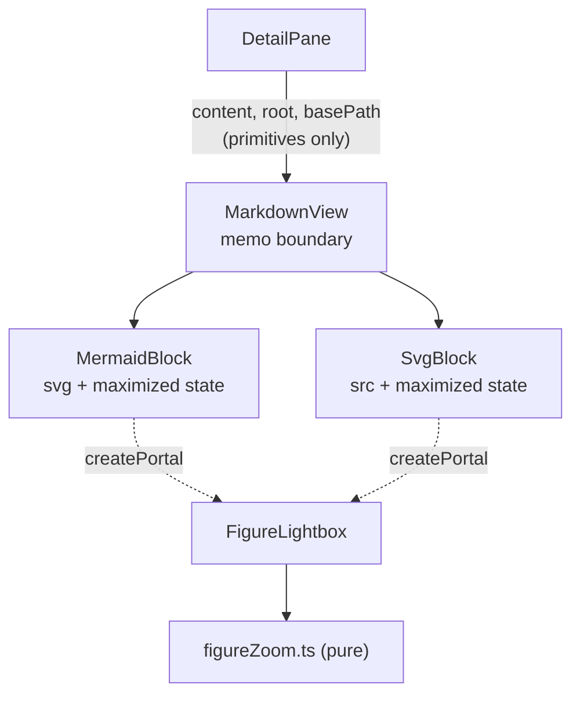
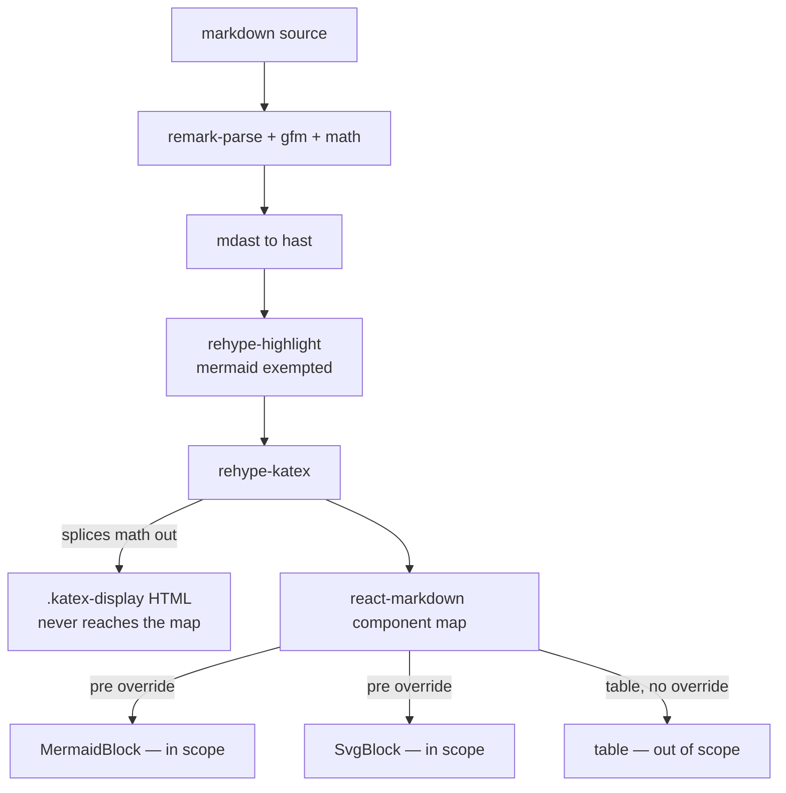

# Design — Maximize Diagrams and SVG Figures

## Context

`MermaidBlock` renders a `mermaid` fence by handing the source to Mermaid and injecting the returned SVG string into the live DOM. `SvgBlock` renders an `svg` fence by parsing, validating, rewriting, and serializing the body into a `data:` URI set as an `` source — never into the live DOM, which is what makes active content structurally impossible for that path. Both wrappers then cap their content at the pane's width.

The two paths therefore differ in exactly the way that matters for zooming: one holds **live vector nodes**, the other holds a **raster surface produced from a vector source**. Any zoom mechanism has to be correct for both, and the obvious mechanism is not.

Three further constraints shape the design, none of them visible from the feature description:

1. `MarkdownView` is memoized, and its memo is documented as *"a correctness prerequisite for the detail pane's equality guard rather than a spare optimization"* — with an explicit warning that adding an object, array, or callback prop would defeat the shallow comparison silently, with no error and no test failure.
2. The repository has **no component-test infrastructure**. All fifteen test files are pure-logic `.test.ts` modules; there is no jsdom, no happy-dom, no testing-library, and no `.test.tsx`.
3. A `src/`-only diff short-circuits the mutation gate, which is scoped to `openspec-core` and `openspec-app`. It reports green without running anything.

Together these mean the design is judged less on what the lightbox does than on **where its state lives** and **how much of it can be tested at all**.

## Goals / Non-Goals

**Goals**

- Make a downscaled figure readable, and a dense figure navigable.
- Keep the inline reading experience exactly as it is today.
- Keep the `svg` path's inertness guarantee intact — maximizing must not become a reason to inject a fence body into the live DOM.
- Put every non-trivial calculation somewhere `bun test` can reach it.
- Follow the active colour scheme while maximized, as the inline figure already does.

**Non-Goals**

- Deep-linking to a figure (*Decision 2*).
- Changing the inline presentation of figures (*Decision 5*).
- Covering display math or wide tables (*Decision 8*).
- Exporting, copying, or saving a figure from the lightbox.
- Editing diagram source. The viewer is read-only, per the *Read-Only Viewer* requirement.

## Decisions

### Decision 1 — The lightbox's state lives in the fence components, not hoisted

`MermaidBlock` and `SvgBlock` each own a local `maximized` boolean and render `FigureLightbox` through a portal when it is set. Nothing new crosses `MarkdownView`.

**Considered and rejected: hoist the state to `DetailPane` or `App`, passing a callback down through `MarkdownView`.** This is the conventional shape, and it is specifically forbidden here. `MarkdownView`'s memo comment states that every prop must stay a primitive or a stably-identified ref, and that adding a callback prop defeats the default shallow comparison *silently* — the failure mode is not a broken feature but a document that re-runs remark, rehype, every `MermaidBlock`, KaTeX, and the SVG gate on every tick of the header's relative-time label. No type enforces the constraint and no test would catch the regression.

Keeping the state local also makes the colour-scheme obligation fall out for free: `MermaidBlock` already re-renders its SVG when `useDarkScheme()` flips, because Mermaid bakes the palette into the SVG at render time. A lightbox rendered from that same state follows the scheme automatically, whereas a hoisted copy of the SVG string would go stale on a scheme change mid-view.

### Decision 2 — The maximized state is ambient, not addressable

Maximizing a figure does not form an Address, does not enter the URL, and does not create a history entry.

**Considered and rejected: a `figure` segment on the `artifact` Address, so a maximized figure can be linked.** This was the initial intent and it does not survive costing. Addressing a figure requires a per-figure identifier, and the identifier is where it fails — every candidate has a failure mode, and they differ in whether they fail *loudly* or *silently*:

| Scheme | figure added above, other section | figure added above, same section | heading renamed | figure body edited | figure moved |
|---|---|---|---|---|---|
| Fence ordinal | wrong figure | wrong figure | resolves | resolves | wrong figure |
| Heading + ordinal | resolves | wrong figure | not found | resolves | not found |
| Content hash | resolves | resolves | resolves | not found | resolves |

"Wrong figure" is worse than "not found": a stale link that opens a *different* diagram and looks correct is a defect the reader cannot detect, whereas a link that lands on the artifact without a lightbox degrades honestly. The content hash dominates on every axis but one — yet it is precisely the axis that matters in review, where the diagram is being actively edited.

There is also no existing machinery to build on. The *Section and Task Scroll Anchors* requirement is implemented with a `data-line` attribute carrying a source line number, consumed transiently by a tree click; no heading slugs are generated anywhere, and nothing intra-artifact has ever entered an Address.

The decisive argument is reversibility. Adding an optional `figure` field to the existing `artifact` variant later is purely additive — new paths encode the segment, existing paths decode unchanged, and the round-trip property holds. Deferring costs nothing and buys the chance to design the identifier after observing whether anyone links a figure rather than a section. Note also that an address-driven lightbox would have *required* exactly the callback prop that *Decision 1* forbids.

**Consequence — Back must still close the lightbox.** Without an Address there is no history entry to pop. This is handled by *Decision 7* rather than by an effect watching the address.

### Decision 3 — Zoom by layout size and pan by scrolling, not by CSS transform

Zoom sets the figure's rendered width; the surrounding container scrolls, and a drag maps to `scrollLeft` / `scrollTop`.

**Considered and rejected: `transform: scale(k)` on a wrapper.** This is the reflexive choice — compositor-cheap and smooth — and it is wrong for half the scope. An SVG inside an `` is rasterized by the browser at its *used layout size*; a CSS transform then magnifies that fixed raster. `SvgBlock` deliberately uses an `` to make active content structurally impossible, so the security posture and the blur are the same decision. The two paths degrade differently:

| Path | Content | Under `transform: scale()` | Under layout-size zoom |
|---|---|---|---|
| `MermaidBlock` | inline `<svg>` in the DOM | blurs during the gesture, re-rasterizes on settle | crisp throughout |
| `SvgBlock` | `` | blurs and **stays** blurred | crisp — the browser re-rasterizes at the new layout size |

Setting layout size is correct for both, unifies the two paths under one mechanism, and yields native momentum scrolling on touch as a side effect.

The cost is a real layout and repaint per zoom step rather than a compositor-only update. If a large graph proves janky under a continuous wheel gesture, the escape hatch is to transform during the gesture and commit to layout size on settle — deliberately not built up front, because it doubles the state and is unnecessary until measured.

### Decision 4 — The zoom arithmetic is a pure module

`src/components/figureZoom.ts` exports the calculations; `FigureLightbox.tsx` keeps only pointer plumbing, refs, and rendering.

**Considered and rejected: keep the arithmetic inline in the component, as most React codebases would.** With no component-test infrastructure in the repository and no mutation gate covering `src/`, inline arithmetic would ship with literally zero automated coverage. Extraction is not a stylistic preference here; it is the only mechanism by which any of this change is tested. It mirrors the division the repository already makes between `src/routing/codec.ts` — pure and heavily tested — and the components that call it.

Let $s$ be the scale, $\ell$ the container's scroll offset along an axis, $c$ the pointer's offset within the viewport along that axis, and $W_v, H_v, W_c, H_c$ the viewport and content extents with padding $p$.

The fit scale is the larger reduction the two axes demand:

$$s_{\text{fit}} = \min\left(\frac{W_v - 2p}{W_c},\ \frac{H_v - 2p}{H_c}\right)$$

Scale is clamped so that zooming out never goes below fit and zooming in stops at a fixed ceiling:

$$s \in \left[\min(s_{\text{fit}}, 1),\ s_{\max}\right], \qquad s_{\max} = 8$$

Cursor-anchored zoom holds the content point under the pointer stationary. The content coordinate under the pointer is $x = (\ell + c) / s$; requiring it to remain at $c$ after scaling to $s'$ gives the new scroll offset:

$$\ell' = \frac{s'}{s}\left(\ell + c\right) - c$$

A pinch supplies its factor from the ratio of pointer separations between frames:

$$f = \frac{\lVert p_1' - p_0' \rVert}{\lVert p_1 - p_0 \rVert}$$

Each of these is a total function of its inputs, and each is directly testable.

### Decision 5 — Inline presentation stays capped at the pane width

The `max-width: 100%` on both wrappers remains.

**Considered and rejected: remove the cap so figures render at natural size and the existing `overflow-x: auto` finally takes effect.** This is a two-line change that appears to address the root cause directly, and it was the initial inclination. It is the wrong default for a figure being read in prose: fitting the pane shows the diagram's *shape*, which is what a reader scanning an artifact wants, whereas natural size shows a fragment through a narrow window with the overall structure off-screen. It also nests a horizontally scrolling region inside flowing prose, which is awkward to operate and easy to trigger accidentally on a trackpad. The defect was never that figures fit — it is that fitting was a dead end. Supplying the escape hatch makes the existing default correct.

### Decision 6 — The lightbox is a native `<dialog>` opened with `showModal()`

**Considered and rejected: a portalled `
` overlay with a hand-rolled focus trap and a high `z-index`.** The native element supplies the top layer (immune to any stacking context in the app), a `::backdrop` pseudo-element, focus trapping, and inert background content — all of which would otherwise be hand-written and are easy to get subtly wrong.

One integration detail is not free. `App.tsx` installs an outermost document-level Escape handler that dismisses the Settings and Archive panes, guarded on `e.defaultPrevented`. The lightbox must call `preventDefault()` on its own Escape keydown so that handler stands down; otherwise a single Escape closes both the lightbox and the pane behind it. This is the same contract the Settings rename input already uses to consume Escape for its own abandon-edit behaviour.

### Decision 7 — `MarkdownView` is keyed on artifact identity

`DetailPane` renders `<MarkdownView>` with no `key`, and `react-markdown` does not key its own children, so React reconciles fence components by position and type. A `MermaidBlock` at the same index in a *different* artifact is reused with its state intact — a maximized lightbox would survive navigation and then display the newly loaded artifact's diagram.

**Considered and rejected: close the lightbox whenever the fence's `source` prop changes.** Keying at the call site is declarative and covers the whole subtree, rather than asking every figure component to police its own props for a condition that is really about navigation.

The memo is not weakened either, because a different artifact changes `content` anyway and the memo would not have short-circuited that render. This also supplies the Back-closes-the-lightbox behaviour that *Decision 2* deferred here — verified: with a figure maximized, Back navigates the artifact and the maximized view goes with it.

**Corrected during implementation.** This decision originally claimed the key would *separate* two cases — that navigation would remount while a same-artifact content edit reused the subtree, keeping a maximized figure open across a watcher reparse. Only the first half is true. `react-markdown` re-keys its own children on any content change, so every fence component remounts whenever the artifact's text changes at all, and per-fence state dies with it. Instrumenting the live DOM showed the tagged `MarkdownView` element surviving a watcher edit while the tagged figure element beneath it was replaced.

Keeping the view open across a reparse is therefore not a matter of keying at all: it would require identifying one figure within an artifact across an edit to that artifact — the per-figure identity *Decision 2* deliberately declined to build, failing in exactly the case that matters, since an edit is what changes the figure. The requirement was amended to match: a content change closes the maximized view rather than presenting superseded source.

The key is still worth keeping. It makes navigation's remount a guarantee of this codebase rather than a side effect of a dependency's internal keying, which is free to change and which no test of ours would catch if it did.

### Decision 8 — Scope is `mermaid` and `svg` only

**Considered and rejected: one general `FigureFrame` wrapping diagrams, images, display math, and wide tables.** Attractive as a unification, and it does not survive contact with the pipeline. `rehype-katex` matches `<pre><code class="language-math">` and the `$…$` / `$$…$$` nodes at the hast stage and splices them out *before* the component map exists, so math can never be intercepted the way the fences are; wrapping it would require a second attachment mechanism in the form of a rehype plugin running after `rehype-katex`.

The unification is also unwarranted on the merits. Math is not defective: `.katex-display` carries no `max-width`, so wide formulae already scroll at natural size. Tables are defective but want horizontal scroll and a sticky header row — zooming a table is not a meaningful operation. Only the two figure paths share both the defect and the remedy, and they already share a rendering contract.

## Risks / Trade-offs

**Touch gesture arbitration is the riskiest part.** Panning by container scroll wants `touch-action: pan-x pan-y`, while two-pointer pinch tracking wants `touch-action: none`; with native panning enabled the browser may begin a scroll on the first contact before the second lands, costing the pinch its opening frames. *Mitigation:* prototype both settings on a real touch device before fixing the requirement's wording, and prefer manual one-finger panning with `touch-action: none` if arbitration proves unreliable — losing momentum scrolling is a smaller regression than a pinch that intermittently fails to start.

**Layout-size zoom may jank on a large diagram.** Each step is a real layout and repaint rather than a compositor update. *Mitigation:* measure with the largest diagram available before optimizing; the transform-during-gesture-commit-on-settle hatch described in *Decision 3* remains available and changes no observable behaviour.

**The change lands with no gate.** The mutation workflow short-circuits on a `src/`-only diff and reports green in seconds without running. *Mitigation:* treat the `figureZoom.ts` tests as the actual gate, and cover the clamp boundaries, the fit computation on both limiting axes, and cursor-anchored zoom at the viewport edges — not only the happy path. The remainder is covered by the manual smoke walk in `tasks.md`, which is the only way the pointer plumbing is exercised at all.

**Mermaid's palette is baked in at render time.** A scheme flip re-runs `mermaid.render()`, which replaces the SVG string while the lightbox is open. *Mitigation:* the lightbox renders from the block's own state rather than a copy (*Decision 1*), so the new SVG flows through; the zoom and pan state is held separately and is deliberately preserved across the swap, so a scheme change does not reset the reader's position.

**A maximized figure can still exceed the window at fit scale** when the diagram's aspect ratio is extreme — a very wide, very short flowchart fits by width and leaves most of the viewport empty. *Mitigation:* accepted. Fit is defined as the minimum of both axis ratios, so the figure is always fully visible; the empty space is the honest consequence of the aspect ratio, and zoom is available immediately.
