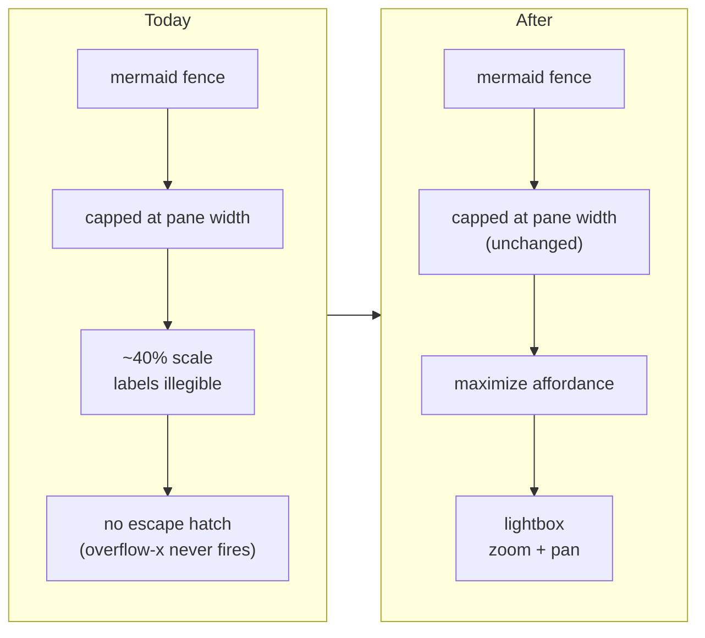

# Maximize Diagrams and SVG Figures in a Zoomable Lightbox

## Why

A wide diagram in a narrow detail pane is silently scaled down until its labels are unreadable, and nothing in the UI offers a way back.

The detail pane caps every rendered figure at the pane's width — `.markdown-view .mermaid-block > svg` and `.markdown-view .svg-block > img` both carry `max-width: 100%`. A fourteen-hundred-pixel flowchart in a six-hundred-pixel pane therefore renders at roughly forty percent scale. The `overflow-x: auto` sitting on both wrappers never fires, because content capped at its container's width cannot overflow it; the horizontal scroll that looks like an escape hatch is inert. The only recovery available today is to widen the window or hide both side panes with Cmd/Ctrl+B and Cmd/Ctrl+Alt+B — a workaround for a layout problem, not a way to read a diagram.

Even a figure that fits can be too dense to trace an edge through. Legibility and navigability are two distinct failures, and the pane offers no answer to either.

Display math is not affected: `.katex-display` was never given a `max-width`, so a wide formula already scrolls at its natural size. That asymmetry is the tell — the three rich-content forms disagree about what to do when content exceeds the pane, and only the two that render *figures* fail silently.

## What Changes

- **A maximize affordance on rendered figures.** Every successfully rendered `mermaid` diagram and `svg` image gains a corner control that opens it in a lightbox above the whole window. Fences that failed to render, and diagrams still in flight, carry no affordance.
- **A zoomable, pannable lightbox.** Wheel and pinch zoom anchored at the pointer, drag to pan, and explicit fit / actual-size / close controls. Escape and the backdrop dismiss it.
- **Inline presentation is unchanged.** A figure still fits the pane's width while reading; the lightbox is the escape hatch, not a replacement for the inline default.
- **The zoom arithmetic becomes a pure, tested module.** `src/components/figureZoom.ts` holds fit, clamp, cursor-anchored zoom, and pinch-ratio maths; the component keeps only pointer plumbing. The repository has no component-test infrastructure at all, so extraction is what makes this change testable.
- **A reconciliation fix.** `DetailPane` renders `MarkdownView` without a `key`, so React reuses fence components by position across a navigation to a different artifact. The maximized state would survive that navigation. Keying the view on artifact identity fixes the general class of stale-state bug, not only this instance.

Deliberately out of scope, each for its own reason:

- **Deep links to a figure.** Addressing one figure needs a per-figure identifier, and every candidate — fence ordinal, heading-plus-ordinal, content hash — trades a dead link for a link that silently opens the *wrong* figure, or vice versa. The apparatus is nearly the whole cost of the change and it stays purely additive later. See `design.md`, *Decision 2*.
- **Display math.** Already renders correctly at natural size and scrolls; it is also spliced out of the hast tree by `rehype-katex` before the component map runs, so it cannot be intercepted the same way and would cost a second attachment mechanism for no defect fixed.
- **Wide tables.** A real but different defect wanting a different fix — horizontal scroll and a sticky header row, not zoom.

## Capabilities

### New Capabilities

_None._

### Modified Capabilities

- `spec-browser` — adds the *Maximized Figure View* requirement covering the affordance, the lightbox surface, zoom and pan, dismissal, and colour-scheme fidelity while maximized. Amends *Mermaid Diagram Rendering* and *SVG Fence Rendering* so each states that a successfully rendered figure is maximizable and that a degraded one is not.

## Impact

Frontend only. No Rust, no IPC types, no `src/types.ts` mirror, no new dependency, and no change to the markdown the backend returns.

Touched:

- `src/components/figureZoom.ts` (new) and `src/components/figureZoom.test.ts` (new) — the pure zoom module and its `bun test` coverage.
- `src/components/FigureLightbox.tsx` (new) — the `<dialog>` surface, portal, and pointer plumbing.
- `src/components/MermaidBlock.tsx`, `src/components/SvgBlock.tsx` — the affordance and the local maximized state.
- `src/components/DetailPane.tsx` — one line, keying `MarkdownView` on artifact identity.
- `src/App.css` — the lightbox surface and the affordance.

Deliberately unchanged:

- **`MarkdownView.tsx` gains no props.** Its memo is a documented correctness prerequisite for the detail pane's equality guard, and adding a callback or object prop would defeat the shallow comparison silently — no error, no test failure, only a document that repaints on every relative-time tick. The lightbox therefore lives inside the fence components rather than being hoisted.
- **The inline `max-width: 100%` caps stay.** Removing them so figures scroll at natural size trades an illegible-but-whole diagram for a legible-but-fragmented one and nests a scroll region inside prose.
- **No Address, codec, or history work.** `src/routing/` is untouched.
- **`terminal-ui` is untouched.** It presents both fences as code text and has no figure to maximize.
- **`touch-input` needs no delta.** Its *Essential Controls Are Discoverable Without Hover* and *Interactive Targets Meet a Minimum Size on Coarse Pointers* requirements are already general enough to bind the new controls; the new requirement cross-references them rather than restating them.
- **The mutation gate will not cover this.** `.cargo/mutants.toml` scopes it to `openspec-core` and `openspec-app`, so a `src/`-only diff short-circuits it and reports green without running. Coverage here is `bun test` against the extracted module, not the gate.
