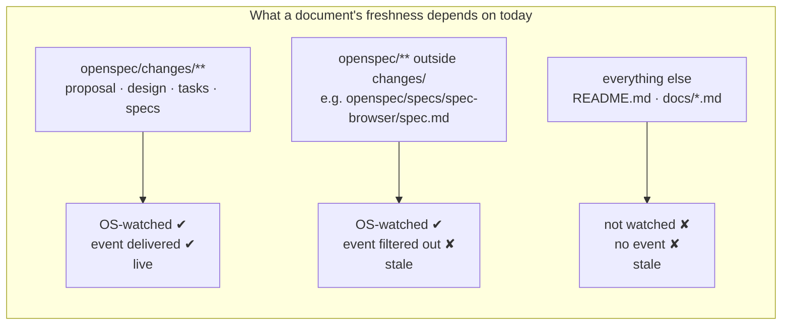
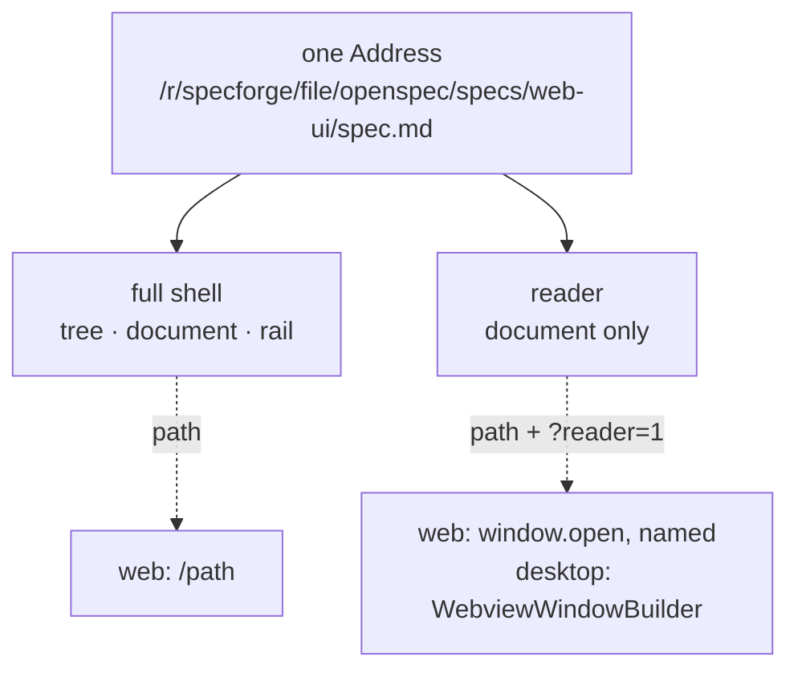

# Reader Windows for Workspace Documents

## Why

SpecForge has exactly one window, and therefore exactly one document at a time. Reading a capability spec means giving up the detail pane; comparing two of them is impossible; keeping a spec visible while working in another application is impossible. The tree selection is not just how a document is chosen — it is the only thing holding it on screen.

The odd part is that the *document itself* was never the obstacle. `MarkdownView` intercepts every anchor click: an external href is handed to the operating system through `open_artifact_link`, a workspace-relative file href opens in the default handler, and everything else — fragments, `javascript:`, `data:` — is rendered inert. Its own comment is explicit: *"Every anchor click is intercepted — no href class is [allowed to navigate]."* A rendered artifact is already a terminal surface that cannot move the application anywhere. What makes it captive is only the chrome wrapped around it — the tree, the commit rail, the footer.

So a window containing nothing but a rendered document is not a new mode to invent. It is the existing renderer with the navigation deleted.

The second reason is freshness, and here the app is already half-built for it. The watcher exists precisely so that a document being rewritten underneath the reader — by an agent, by an editor, by a `git checkout` — updates in place without touching anything. But that guarantee stops at a boundary nobody set deliberately: `WatcherManager::add_workspace` watches `<workspace>/openspec` recursively and then **filters delivered events down to `openspec/changes/`**. Three zones fall out, and only one of them is live:

The middle row is the sting: `openspec/specs/<capability>/spec.md` — the file most people would actually call *the spec* — sits inside the watched directory and still never updates. The evidence is already in the UI: `DetailPane` has no refresh control because it does not need one, and `FileBrowserView` ships a manual one because it does.

A window that exists to be parked on a second monitor and read while something else edits the file is worth very little if its contents are a snapshot. Detaching the document and keeping it fresh are the same feature.

## What Changes

- **Markdown files become addressable.** A new `file` variant on `Address` names one file beneath a browse root — `/w/<workspace>/file/<path…>` and `/r/<repo>/file/<path…>`. Today `Address`'s `files` variant names a browse *root*; the file selected inside `FileBrowserView` is local component state and cannot be linked, bookmarked, or handed to a window. `file` becomes a reserved segment at the change-id position, the first addition to the codec's closed vocabulary since it was written.

- **A reader window: one document, no navigation.** A chromeless surface carrying the document and its identity header, and nothing else — no tree, no commit rail, no footer, no quota pills, no Settings or Archive entry points. Dismissed with Cmd/Ctrl-W, with Escape, or with its own close control.

- **Two ways in, because one of them is invisible.** Cmd/Ctrl-clicking a row opens that row's document; a control in the document's own header opens whatever is being read. The control is not a convenience: a modifier chord cannot be discovered by looking, and a device with no hover generally has no modifier key either, so a gesture-only feature would be *unreachable* on a touch device rather than merely undiscovered. It therefore takes the same contract the figure-maximize affordance already has — keyboard-operable, visible at rest without hover, enlarged hit area on a coarse pointer (`touch-input`).

- **Reader-ness is a presentation mode, not an Address.** It is carried outside the Address entirely — a `reader` query parameter — so `encodeAddress`/`decodeAddress` stay pure and untouched, and the same address opens the full shell or a bare document depending only on how it was launched. The desktop shell's history adapter reads `window.location.pathname` and never sees the parameter; the served UI keeps a shareable URL that reopens the same reader.

- **A per-document filesystem watch.** A new `openspec-core` module holds a refcounted registry of open documents. Registering one watches the file's **parent directory**, non-recursively, filtered to that filename — not the file itself, because editors save by atomic rename, which unlinks the inode a file-level watch is bound to. A debounced batch emits a new `document-changed` event carrying the root and the relative path. Closing the last reader on a document drops its watch.

- **One document view behind three surfaces.** The fetch, the identity header, the markdown render and the freshness policy are extracted into a single component. `DetailPane`, the file browser's preview region, and the reader window all become thin users of it — so the file browser's preview stops being the one surface in the application that silently shows yesterday's bytes.

- **The macOS Window submenu gains Close.** Cmd-W does not exist today. One `Close Window` item serves both window kinds correctly without a special case: the main window's existing `CloseRequested` handler intercepts it and hides, per the tray-resident contract, while a reader window has no such handler and is destroyed.

Deliberately out of scope, each for its own reason:

- **Archived artifacts.** `ArchiveView` renders them through the detail pane with an `archive/<dir>`-prefixed change id, but the `archive` Address variant names a *listing*, not an artifact — there is no address to hand a window. Giving archived artifacts addresses is a `view-routing` change with its own design, and it stays purely additive later.
- **Per-worktree file addresses.** `/r/<repo>` is specified as the repository's main worktree, and a file address inherits that. `README.md` genuinely differs between worktrees in this project's own workflow, so this is a real limitation — but the instance segment already exists in the grammar and can be threaded through later without breaking any address minted now.
- **Popping out non-document surfaces.** The Dashboard, the Archive, the commit graph and Settings are all `Address` variants too, so the same mechanism would detach any of them. That is a different and much larger feature — multi-window SpecForge — wearing this one's clothes, and taking it now would spend the window budget on surfaces nobody asked to detach.
- **Per-document window geometry.** Tauri window labels are per-document, and `tauri-plugin-window-state` persists geometry per label, so per-document memory means an entry per file ever opened, keyed by an opaque hash, that is never collected. One shared reader geometry is both bounded and what document applications actually do for new windows.
- **The terminal frontend.** `specforge-tui` has no windows. It gains the shared document watch as an available primitive and uses none of it.
- **Editing.** The *Read-Only Viewer* requirement holds unchanged; a reader window is a second way to read, never a first way to write.

## Capabilities

### New Capabilities

- `reader-window` — the detached document window in the desktop and browser hosts: what it contains and what it omits, how it is launched, how a second launch for the same document is deduplicated to a focus, its title and titlebar treatment, its shared geometry, its dismissal paths, and its absence from the terminal frontend.
- `document-watch` — the per-document filesystem subscription shared by every document surface: registration and release keyed by browse root and relative path, refcounting across surfaces, parent-directory watching for atomic-rename durability, the `document-changed` event and payload, and the bound on how many watches may exist at once.

### Modified Capabilities

- `view-routing` — adds the `file` Address variant and its URL grammar under both scope prefixes, reserves `file` at the change-id position and records what that costs, and states that the reader presentation is carried outside the Address so the codec stays pure.
- `workspace-file-browser` — the selected file becomes addressable and openable in a reader window, and the preview region becomes push-fresh through a document watch. *Pull-Based Freshness* narrows from "no watcher for the browser" to "no watcher for the **listing**": enumeration stays pull-based and keeps its manual refresh control, which is what that requirement exists to protect.
- `spec-browser` — *Reactive Updates from Filesystem* generalises from the detail pane specifically to any surface rendering a document, so the same undisturbed-reader guarantees bind the reader window and the file browser's preview, and freshness stops depending on where in the workspace a document lies. The launch gesture itself is specified by `reader-window`, which owns the reader's contract end to end.
- `application-menu` — the Window submenu gains a Close item, specified to close the focused window through the framework's predefined close action so that the main window's hide-on-close behaviour and a reader window's destroy-on-close behaviour both follow from the existing window-event handling rather than from a menu-side branch.

## Impact

Cross-cutting: one new `openspec-core` module, one new event, one new Address variant, a refactor of two working views, and window plumbing in two of the three frontends.

Touched:

- `crates/openspec-core/src/document_watch.rs` (new) and `crates/openspec-core/tests/document_watch.rs` (new) — the refcounted registry, the parent-directory watch, and its tests.
- `crates/openspec-app/src/events.rs` — the `document-changed` name, payload, and envelope.
- `crates/openspec-app/src/service.rs` — `watch_document` / `unwatch_document` on `AppService`, alongside the existing `read_workspace_file`.
- `crates/specforge/src/commands.rs`, `crates/specforge/src/lib.rs` — the two watch commands plus `open_reader_window`, and their `generate_handler!` registrations.
- `crates/specforge/capabilities/` — a capability granting reader windows the permissions the main window has; `default.json` scopes to `"windows": ["main"]` today, so without this a reader window's frontend can invoke nothing.
- `crates/specforge/src/menu.rs` — the Close item in the Window submenu.
- `crates/specforge-web/src/dispatch.rs`, `crates/specforge-web/src/sse.rs` — the command arms and the `document-changed` stream arm.
- `src/routing/codec.ts`, `src/routing/resolve.ts`, `src/routing/address.ts` and their tests — the `file` variant.
- `src/components/DocumentView.tsx` (new) — the extracted fetch, header, render and freshness policy.
- `src/components/DetailPane.tsx`, `src/components/FileBrowserView.tsx` — rewired onto it.
- `src/components/ReaderRoot.tsx` (new), `src/main.tsx` — the chromeless mount selected by the `reader` query parameter.
- `src/api.ts`, `src/types.ts` — the wrappers, the event name, and the hand-mirrored payload type.
- `src/platform.ts` — `usesMacTitlebarChrome` becomes window-kind-aware.

Deliberately unchanged:

- **The read guard.** `read_workspace_file` already rejects absolute paths, parent-directory components, symlink escapes past the canonicalised root, non-`.md` extensions and oversized files, on top of a registry check on the root. A file address routes a caller-supplied relative path to exactly that guard, which is what it was written for — no second guard is added, and none is relaxed.
- **The web server's shell fallback.** *Deep-Link Durability of the Served Bundle* already forbids inferring the static-asset namespace from a file extension, expressly because addresses may contain dots. A path ending in `.md` is therefore already served the shell; no server work is required to deep-link a file address.
- **`WatcherManager`.** The document watch is an independent watcher with its own channel. Splicing document subscriptions into the existing debounce handler would reuse the OS watch for two of the three zones, but it would couple this change to the hot path that carries the recompute gate and self-write suppression, for a saving of one kernel watch descriptor per open reader.
- **`encodeAddress` / `decodeAddress` signatures.** The reader flag never enters them.
- **The main window.** Its Overlay titlebar, its hide-on-close behaviour, and its layout are untouched; a reader window is an addition beside it, never a reconfiguration of it.
- **`terminal-ui`.** No delta. It has no window to detach and no second surface to keep fresh.
