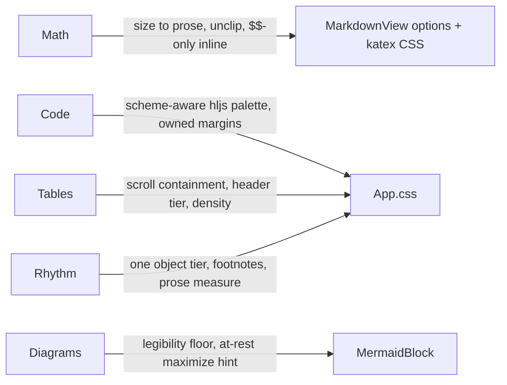

# Document Rendering Fidelity

## Why

A rendered-output audit of the document viewer (torture-test artifact exercised through `specforge-serve` in both schemes, cross-checked against computed styles) found four defects that actively damage reading — light-mode syntax colors at ~1.9:1 contrast, every display formula vertically clipped by its own scroll container, single-dollar math silently mangling ordinary prose, and wide diagrams scaled to ~5px labels — plus a cluster of fit-and-finish gaps (tables without overflow containment, inline math 21% larger than its line, five competing block-gap values of which two come from vendor/UA CSS, an unstyled footnotes section, a 112-character prose measure). Together they are the difference between a document surface that merely displays markdown and one that reads well.

## What Changes



- **Mathematics** — **BREAKING**: single-dollar `$…$` is no longer parsed as inline math; `$$…$$` (already inline when embedded in prose) and ```` ```math ```` fences become the only math delimiters, so prose like "costs $50 per seat and $60" can never again be eaten as a formula. Inline math is rendered at a size visually harmonized with surrounding prose (KaTeX's 1.21em default is overridden). Display math no longer clips its vertical overhang (summation limits, subscripts) and no longer grows spurious scrollbars.
- **Syntax highlighting** — the four literal hljs token colors (strings `#6cc77a`, numbers `#e0a85c`, keywords `#c98ce0`, types `#e07a5f`) gain scheme-aware definitions that clear 4.5:1 AA contrast on the code well in both light and dark.
- **Tables** — wide tables scroll horizontally within their own block instead of overhanging the content column (same containment contract code, math, and diagrams already honor); header cells get a distinct surface tier from the zebra stripe; table text drops to the metadata size so dense tables breathe.
- **Mermaid diagrams** — a legibility floor: a diagram whose fit-to-pane scale would push label text below legible size stops shrinking and scrolls horizontally within its block instead; on such a diagram the maximize affordance is visible at rest rather than hover-only.
- **Vertical rhythm** — code fences and display math get authored margins joining the existing 0.8em object tier (today they ride the UA default and vendor katex.css respectively); the footnotes section gets a separating rule, top margin, and reduced text size; prose blocks adopt a readable measure (~74ch) while block objects (tables, code, figures, display math) keep the full 880px column.

Deliberately deferred to their own future changes (cross-cutting concerns the audit also surfaced): workspace-relative images, which can never resolve on any transport and need a served-file endpoint plus asset-protocol work across crates, and raw-HTML handling (`<details>` renders as literal tag text), which is a security-posture decision interlocking with the viewer's strict link/KaTeX trust stance.

## Capabilities

### New Capabilities

_None._

### Modified Capabilities

- `spec-browser`: the *Mathematical Notation Rendering* requirement changes its delimiter contract (single-dollar dropped, prose-safety scenario added), gains size-harmonization and no-vertical-clipping obligations; the *Mermaid Diagram Rendering* requirement's too-wide-diagram scenario is replaced by the legibility floor; the *Maximized Figure View* requirement's affordance-reveal contract gains an at-rest visibility case for any figure rendered below its natural size (fit-scaled or floor-held, diagram or SVG image); a new *Wide Block Containment* requirement names the shared contract that no single block may widen or pan the document.
- `visual-identity`: the *Markdown Body Adopts the Type System* requirement is modified to a two-tier content column (880px object column, 70–80ch prose measure); three new requirements are added — *Markdown Block Rhythm* (authored two-tier block margins replacing the UA/vendor strays, footnote-section treatment), *Markdown Table Presentation* (distinct header surface tier, `--text-md` cell density), and *Syntax Highlight Palette* (scheme-aware token colors with an explicit AA floor; today they are literal hexes exempted from the token layer).

## Impact

- **Frontend only**: `src/App.css` (markdown renderer section, hljs palette), `src/components/MarkdownView.tsx` (remark-math options, katex CSS overrides, table wrapper component), `src/components/MermaidBlock.tsx` and `src/components/SvgBlock.tsx` (width floor measurement, reduced-figure affordance visibility). No Rust, IPC, or dependency changes; `openspec-core`/`openspec-app` untouched, so the mutation gate short-circuits and coverage comes from ordinary frontend verification (the browser loop: `specforge-serve` + registered scratch workspace).
- **Deliberately unchanged** (audit polish judged not worth their churn now): the heading-to-content gap continues to collapse against the following block's margin rather than being pinned, and list-item spacing keeps its current 0.15em; both can ride a later pass if the finished rhythm still reads uneven.
- All three markdown surfaces inherit the fixes automatically — detail pane, reader windows, and file-browser previews share `MarkdownView`.
- `specforge-tui` is unaffected: it presents math/mermaid source as plain text by contract.
- **BREAKING** for authored documents using `$…$` inline math (this repo's own artifacts included): they must migrate to `$$…$$`. A workspace grep during implementation catalogues affected files; the migration is mechanical.
