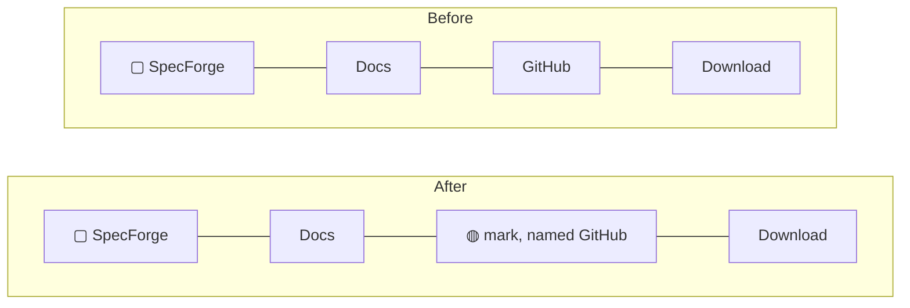

# Iconify the Header's GitHub Link

## Why

The site header's primary nav reads `Docs · GitHub · Download`, and nothing in it
distinguishes the one item that leaves the site. "GitHub" is presented as a peer of
"Docs" — a destination in SpecForge's own information architecture — when it is in
fact the only off-site link in the chrome. GitHub's own mark says "this goes to
GitHub" without spending a nav label to say it, and marks the departure that the
word never did.

The header also has almost no width left. Its own source records brand plus three
nav items at a 373px intrinsic width, with roughly 3px of measured slack at 390px —
the width most phones report — and `flex-wrap` standing by to catch the overflow by
doubling the header's height. Trading a word for a mark returns most of a nav
label's width to that budget.

## What Changes

- The header nav's `GitHub` text link becomes an **icon-only** link carrying
  GitHub's mark, with an accessible name of `GitHub` so it is announced exactly as
  the word was. Its `href`, position in the row, tab order and hover behaviour are
  unchanged.
- A `GitHubMark` component is added local to `site/src/Layout.tsx`, alongside the
  existing `SpecForgeMark`. It renders GitHub's official path verbatim, filled with
  `currentColor` — so the link keeps inheriting `--text-muted` and its
  `hover:text-[var(--text)]` exactly as the text did.
- The link's **hit area** is padded to meet WCAG 2.5.8's 24×24 minimum using
  offsetting negative margin, so its margin box — and therefore every measured gap
  in the header — is unchanged.
- The `marketing-site` spec gains a requirement covering off-site links in the
  header: that the repository link is marked as leaving the site and carries an
  accessible name. Nothing currently contracts the header nav's contents at all.
- Tests gain an **accessible-name** assertion. `routes.spec.ts` asserts the nav's
  GitHub `href` and never its text, so today the link could lose its name entirely
  and the suite would stay green — a theoretical gap while the link is a word, a
  real one once it is a glyph.

Everything else that links to GitHub stays prose. The footer's "MIT licensed —
source on GitHub", the hero's `View on GitHub` button, the docs' "latest release",
the downloads block's "Browse all releases", and the `OpenSpec` project link are
all either sentences, where a mid-sentence glyph reads as a typo, or links whose
subject is a release or a project rather than GitHub itself.

## Capabilities

### New Capabilities

_None._

### Modified Capabilities

- `marketing-site`: adds a requirement that the header's repository link is
  presented as an off-site affordance rather than a nav label, and that any control
  reduced to a glyph still carries a text alternative and a conformant hit area.

## Impact

Affected files:

- `site/src/Layout.tsx` — the nav anchor at the `REPO_URL` link, plus a new
  `GitHubMark` function beside `SpecForgeMark`.
- `site/e2e/tests/routes.spec.ts` — extend the header test to assert the link's
  accessible name, not only its `href`.
- `site/e2e/tests/layout.spec.ts` — assert the icon link's rendered hit area meets
  the 24×24 minimum, alongside the existing computed-style guards.
- `openspec/specs/marketing-site/spec.md` — via this change's delta spec.

Deliberately unchanged:

- **Site only — no Rust, no IPC, no `src/types.ts`.** No crate is touched, so the
  mutation gate is not in play.
- **No new dependency.** The mark is one inlined path, consistent with the
  dependency-free stance `src/components/icons.tsx` already takes for the desktop
  app. No icon library is added to `site/`, which keeps its own lockfile.
- **The desktop app's `src/components/icons.tsx` is neither modified nor shared.**
  `site/` is a deliberately isolated package with its own React resolution and a
  `tsconfig.json` rooted at `site/`; it cannot import from the app's `src/`. The
  new mark is a parallel one-off, not a second member of that icon set — and could
  not join it regardless, since that set is a 24×24 `stroke` system with
  `fill="none"` and GitHub's mark is a filled logo that must be used unmodified.
- **The `--text-muted` token is not retuned.** `Layout.tsx` records that its
  contrast ratios are the documented ones and that brightening it here would
  silently change the rest of the site. Any weight mismatch between the glyph and
  its text neighbours is resolved by sizing the mark, never by recolouring it.
- **The other five GitHub-linking surfaces keep their prose**, and no icon is
  introduced to the footer, the hero or the docs.
- **No route, sitemap, search-index or Open Graph change.** The nav's link set,
  order and targets are identical; only the label's rendering changes.
