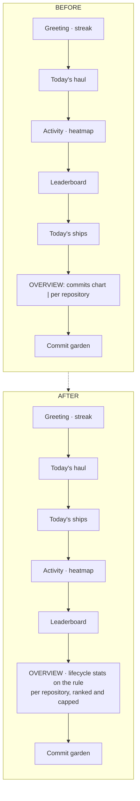

# Rework the Dashboard Overview Band

## Why

The Dashboard's Overview band is described in its own source as *"Demoted
analytics (existing snapshot, now below the progress band)"* — a layer left
untouched when the progress band landed above it. It has not been revisited
since, and it now carries three defects.

**The commits chart is a badly proportioned view of data shown better above it.**
`.dashboard-chart` is pinned at `height: 64px` while its columns are `flex: 1`,
so fourteen days in a half-width card render as bars wider than they are tall.
There is no baseline, no scale, no tick, and no emphasis on today, so the strip
cannot be read without hovering. Empty days collapse to a `min-height: 1px`
hairline, which reads as a broken axis rather than as a quiet day. And the card
leads with an unlabelled shape while every neighbouring card leads with a
number — the window's commit total is computed but used only for an aria-label.

**The per-repository breakdown is ordered by registration, not by relevance.**
It renders one row per top-level entry in tree order, so in a fourteen-repository
registry the two repositories with work in flight can sit twelfth and thirteenth,
below ten rows whose only content is an empty track. The card's height is
whatever the registry's size happens to be, and because `.dashboard-grid`
stretches both cells to the taller one, that height also dictates roughly two
hundred pixels of dead space inside the commits card beside it.

**Today's ships is buried.** The feed that answers *"what did I finish today"*
renders below the year-long heatmap and the leaderboard, beneath two surfaces
that answer slower questions.

Meanwhile the terminal frontend already resolved all three. `specforge-tui`
renders Summary → Ships today → Activity → Leaderboard: no commits chart, no
breakdown, and ships already above the heatmap. The desktop is the outlier.

## What Changes

The commits chart is removed and the Overview band is rebuilt around the
per-repository breakdown, which becomes a ranked, capped, full-width card. The
lifecycle figures move onto the band's divider rule. Today's ships is promoted
above the heatmap, converging the desktop's section order with the terminal's.

The breakdown is ordered by active changes descending, then archived changes
descending, then label — all three keys, so rows do not swap places between
refreshes on a tie. It renders at most five entries and summarises the rest in a
remainder line that states how many were withheld and whether any of them
carries active work. Rows with work in flight draw a bar whose length encodes
that count; rows without drop the bar entirely and dim to a label and an archived
count, so the card never shows a row of empty rectangles and the visual encoding
never disagrees with the sort key.

Truncation is presentational. The payload keeps every entry, because the page's
closing footnote sums it for the registry-wide archived total.

Deleting the chart removes the last consumer of the commit-bucket payload. The
`activity` field, `ActivityBucket`, `bucket_activity`, and `activity_dates_since`
go with it. The fourteen-day window constant survives — it also bounds the
lifecycle metrics — and its payload field is renamed to say so.

The chart was the only surface showing **every** author's commit volume: the
heatmap is scoped to the developer by `is_me`, whereas the chart's dates were
not filtered. That signal is deliberately dropped. The leaderboard keeps
per-author commit totals over a year and the commit garden keeps today's
per-author, per-repository detail; what is given up is the team's daily rhythm
over a two-week window, which no scenario in this capability asked for.

## Capabilities

### New Capabilities

_None._

### Modified Capabilities

- `dashboard` — removes the *Git-Mined Activity Chart* requirement outright;
  rewrites *Per-Repository Breakdown* as a ranked, capped presentation; gives
  *Change Lifecycle Metrics* the window definition the removed requirement
  owned, plus its new placement; drops the chart from the enumerated surfaces in
  *Graceful Degradation Without Git* and *Dashboard Includes Disabled
  Workspaces*; and adds a *Dashboard Section Order* requirement pinning the
  order both frontends now share.

## Impact

**Rust.** `crates/openspec-core/src/dashboard.rs` loses `ActivityBucket`,
`bucket_activity`, and the `activity` field of `DashboardData`, and renames
`activity_window_days` to `lifecycle_window_days`.
`crates/openspec-app/src/service.rs` loses `activity_dates_since` and the
`activity_cutoff` binding, and renames `DASHBOARD_ACTIVITY_WINDOW_DAYS` to
`DASHBOARD_LIFECYCLE_WINDOW_DAYS`; the constant's value and its use as the
lifecycle window are unchanged. Both crates are inside the mutation gate, so the
surviving ordering and capping logic needs assertions that fail when it breaks.

**Frontend.** `src/components/DashboardView.tsx` loses `ActivityChart` and
`buildAxis` and gains the ranking, the cap, and the two row shapes;
`src/types.ts` mirrors the payload changes. `src/App.css` loses
`.dashboard-grid`, `.dashboard-chart`, `.dashboard-chart--empty`,
`.dashboard-bar-col` and `.dashboard-bar` — `.dashboard-grid` has no other user
— and gains the quiet-row and remainder-line rules. The same React tree serves
both the Tauri shell and `specforge-web`, so one edit covers both.

**Spec text.** The capability's `## Purpose` paragraph enumerates "a git-mined
commits-per-day activity chart" and must lose that clause when these deltas are
synced.

**Deliberately unchanged.** `crates/specforge-tui` renders none of these
surfaces and is not touched. The lifecycle mining, its caching and its
invalidation are untouched: `activity_dates_since` was carved out of the walk
the heatmap already performs, so removing it changes no git invocation. Today's
ships keeps its quiet-day note rather than hiding when empty — the promotion
changes where the feed sits, not what it renders. The registry, the watcher, the
IPC command surface and the dashboard's refresh cadence are all unaffected.
