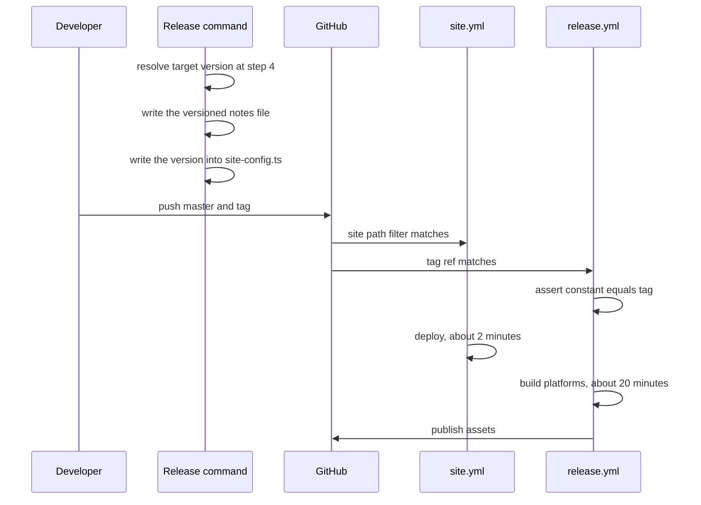

# Design

## Context

The landing page cannot offer a download. *Downloads link the latest release,
never a version* forbids any rendered page from naming a version, and every
release asset embeds one in its filename, so no asset URL can be constructed.
The download section therefore describes platforms instead of linking them, and
the space fills with bordered cards that look interactive and are not.

Three facts constrain how the version can reach the page, and each one has
already broken an earlier attempt at this change:

- `scripts/bump-version.ts` writes no files. It imports only
  `node:child_process`, reads the `v*` tag list, computes the next semantic
  version and creates an annotated tag. The version's single source of truth is
  the git tag; `package.json`, `Cargo.toml` and `tauri.conf.json` all carry a
  stale `0.1.0` that `.github/actions/stamp-version` rewrites inside the CI
  checkout and never commits back.
- GitHub does not create workflow runs from pushes authenticated with
  `GITHUB_TOKEN`. The repository has no personal access token — no workflow
  references the secrets context, and the only credential in use is
  `github.token`. Any design in which CI commits the version therefore never
  triggers `site.yml`.
- `site/e2e/tests/cookies.spec.ts` registers a request listener, waits for
  `networkidle` and asserts that no request leaves the origin. The site
  self-hosts its fonts to satisfy this, and the guard is cited as the reason the
  site ships no cookie banner and no privacy page. Fetching release metadata
  from the browser is therefore a disclosure change, not a test edit.

## Goals / Non-Goals

**Goals**

- A first-time visitor sees a working download for their platform without
  scrolling, on a 1440x900 viewport.
- Every control styled as a download performs one.
- The page states which release it is offering.
- A forgotten version bump fails loudly and quickly.

**Non-Goals**

- Reproducing the release's full artefact metadata on the site. File sizes,
  checksums and per-asset dates stay on the release page.
- Serving downloads from the site's own origin. Assets stay on GitHub.
- Restructuring the marketing sections below the download block.
- Adding a route. The full artefact list stays on `/`.

## Decisions

### The version travels in the release commit, written by the command

`/release` step 8 writes the resolved version into `site/src/site-config.ts`
and includes it in the release commit, which the developer pushes from their own
machine. That push matches `site.yml`'s `site/` path filter and deploys the site.



**Rejected: `release.yml` commits a version manifest.** The push would carry
`GITHUB_TOKEN`, so `site.yml` would never run. The commit lands, every job
reports success, and the deployed site stays frozen at whatever version was
current the last time a human touched `site/`. The failure is the steady state
on every release and is invisible. Repairing it needs a long-lived personal
access token, which the OIDC-only pipeline exists to avoid.

**Rejected: extend `bump-version.ts` to write the constant.** Step 8 commits
before invoking the bump script, because the script tags the commit that already
exists. A file written by the script would land after the commit — untracked by
it and untagged — which is exactly backwards. The script's file-free design is
also what makes it safe to run repeatedly.

**Rejected: resolve the version at build time from the git tag.** It removes the
constant, but `site.yml` does not run on tag pushes, so the value would only
refresh when something under `site/` changed. It also makes the deployed page a
function of git history rather than of tracked files, so rebuilding an old
commit would produce a different page.

### Freshness is asserted in `release.yml`, before the builds

A job asserts that the version in `site/src/site-config.ts` equals the tag being
released, with the leading `v` stripped, and runs ahead of the platform builds.

**Rejected: assert it in an end-to-end test.** The natural test imports the same
constant it is meant to check, so it cannot detect that the constant is wrong.
It is circular by construction.

**Rejected: assert it in `site.yml` instead.** A not-behind check there would
permit the deliberate ahead-window, but `site.yml` only runs when something
under `site/` is pushed — and a forgotten bump means nothing under `site/` was
pushed. The one case worth catching is the case in which the guard never runs.

**Rejected: leave it unguarded.** Today the page cannot be stale: the
latest-release URL resolves itself. Replacing a structural invariant with a step
in a markdown document, and adding no check, converts a page that cannot be
wrong into one that can be wrong indefinitely in the direction visitors notice.

### The hero shrinks; the block sits above the fold

Today's hero is about 965px tall. Deleting `.hero-platforms` recovers about
159px; a download block costs about 350px. Appending one therefore yields

$$h_{\text{hero}} \approx 965 - 159 + 350 = 1156 > 900$$

which puts the download controls below the fold on a 1440x900 laptop — the
original complaint, at reduced scale. The hero copy is shortened and the
screenshot column capped so the block clears the fold.

```svg
<svg xmlns="http://www.w3.org/2000/svg" viewBox="0 0 640 400" width="640" height="400">
  <rect x="0" y="0" width="640" height="400" fill="#0e1218"/>
  <rect x="0" y="0" width="640" height="28" fill="#161b23"/>
  <text x="14" y="19" fill="#f1f4f8" font-family="monospace" font-size="11">SpecForge</text>
  <text x="470" y="19" fill="#8e9aab" font-family="monospace" font-size="11">Docs  GitHub</text>
  <text x="14" y="58" fill="#dfa83a" font-family="monospace" font-size="9">A VISUAL COMPANION FOR SPEC-DRIVEN DEVELOPMENT</text>
  <text x="14" y="92" fill="#f1f4f8" font-family="sans-serif" font-size="26" font-weight="bold">Spec-driven work,</text>
  <text x="14" y="122" fill="#f1f4f8" font-family="sans-serif" font-size="26" font-weight="bold">in full view.</text>
  <text x="14" y="150" fill="#8e9aab" font-family="sans-serif" font-size="11">OpenSpec proposals, specs and tasks beside the Git graph.</text>
  <text x="14" y="166" fill="#8e9aab" font-family="sans-serif" font-size="11">Local, read-only, MIT.</text>
  <rect x="14" y="184" width="250" height="52" rx="6" fill="#dfa83a"/>
  <text x="28" y="206" fill="#161b23" font-family="sans-serif" font-size="13" font-weight="bold">Download for macOS</text>
  <text x="28" y="224" fill="#161b23" font-family="monospace" font-size="10">universal .dmg  ·  macOS 11.0+</text>
  <text x="14" y="252" fill="#8e9aab" font-family="sans-serif" font-size="10">Windows · Linux · all 12 files below</text>
  <text x="14" y="284" fill="#8e9aab" font-family="monospace" font-size="9">OR RUN IT WITHOUT DOWNLOADING</text>
  <rect x="14" y="294" width="250" height="34" rx="6" fill="#13171e" stroke="#38414f"/>
  <text x="28" y="316" fill="#f1f4f8" font-family="monospace" font-size="11">$ npx @avantmedia/specforge</text>
  <text x="14" y="346" fill="#8e9aab" font-family="sans-serif" font-size="10">Node 18+ · opens 127.0.0.1:4317</text>
  <rect x="330" y="46" width="296" height="210" rx="6" fill="#13171e" stroke="#2b323d"/>
  <text x="344" y="66" fill="#8e9aab" font-family="monospace" font-size="9">SELECTED CHANGE</text>
  <rect x="344" y="76" width="268" height="140" fill="#1b212b"/>
  <text x="412" y="150" fill="#4f5a6b" font-family="monospace" font-size="10">product screenshot</text>
  <text x="344" y="238" fill="#8e9aab" font-family="monospace" font-size="9">01 Workspace  02 Specs  03 Commits</text>
  <line x1="0" y1="372" x2="640" y2="372" stroke="#dfa83a" stroke-dasharray="4 4"/>
  <text x="14" y="388" fill="#dfa83a" font-family="monospace" font-size="9">fold at 1440x900</text>
</svg>
```

**Rejected: append a rail beneath the existing hero.** It is the smallest edit
and it fails its own arithmetic, as above.

### Every download-shaped control links an asset

The release publishes twelve assets. A block that names all twelve but links
three, routing the rest through the releases page behind identically-styled
controls, rebuilds the original complaint in better CSS. Controls that download
are buttons; controls that navigate are text links, visibly different.

**Rejected: three primary buttons plus nine tag-page hops.** The visitor cannot
tell which controls download until they click one.

### Platform detection is client-side, with a static fallback

The rendered HTML carries a generic download linking the releases page. On
hydration, `navigator` selects the matching platform and rewrites the control's
label and target to that platform's asset. No request is made, so *No cookies
and no analytics* is unaffected.

**Rejected: fetch the release from the GitHub API on load.** Deterministically
red against `cookies.spec.ts`, and it sends every visitor's address to GitHub on
a site that ships no privacy page precisely because it sends nothing anywhere.

**Rejected: no detection, three equal buttons.** Honest and simpler, but it
leaves the page with no single obvious action, which is what the change is for.

### File sizes are not rendered

Sizes would have to be baked at release time alongside the version, doubling the
data that can drift for a line of text the release page already carries.

## Risks / Trade-offs

- **The site advertises assets that do not yet exist, for about eighteen
  minutes after each release.** Accepted deliberately. Contained by ordering:
  the site deploys in roughly two minutes and the assets publish in roughly
  twenty, so the window is bounded by the build and closes without
  intervention.
- **A failed release leaves the site advertising a version that never
  published.** Accepted deliberately. Contained by the pipeline's existing
  publish gating — the release is not published at all, so the tag is either
  deleted and re-cut or superseded by a follow-up patch, and either path
  rewrites the constant on its next run.
- **Staleness becomes possible where it was previously impossible.** Mitigated
  by the `release.yml` assertion, which fails the release within seconds of a
  forgotten bump, before any platform build starts.
- **Asset filenames could change shape without the version changing.** The
  assertion compares versions, not filenames, so a renamed artefact would
  produce dead links that no check catches. Mitigated by deriving the site's
  filename patterns and the release notes footer from the same documented
  naming scheme, so the two move together; residual risk accepted.
- **Detection can mislabel an unusual user agent.** Mitigated by keeping every
  platform's asset one click away beneath the primary control, and by shipping
  the generic download in the server-rendered HTML so a wrong guess is a wrong
  label rather than a missing option.
