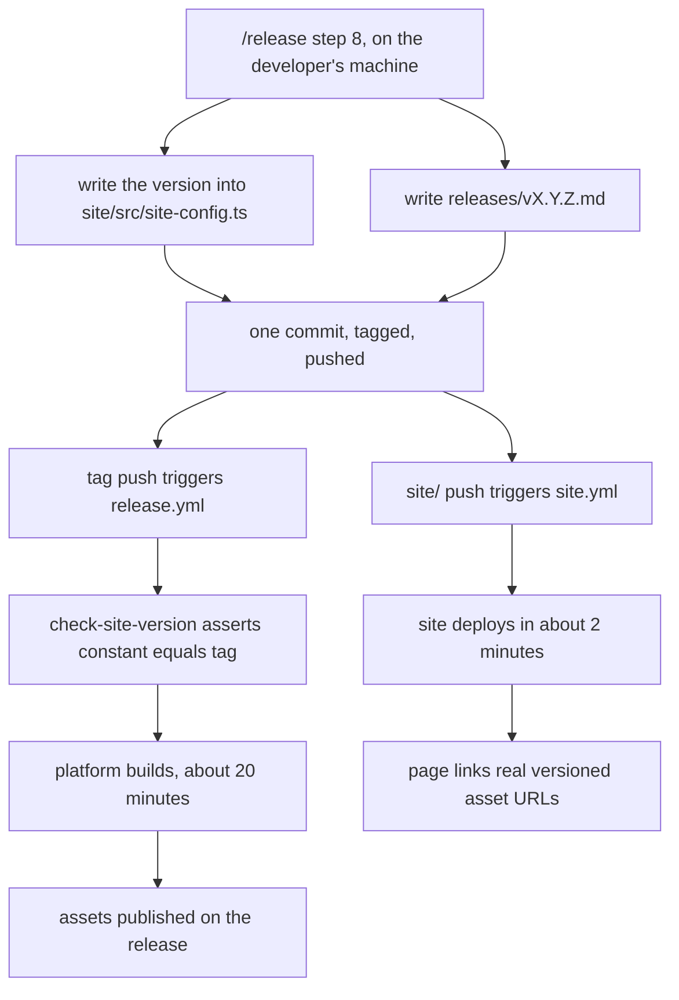

# Versioned Downloads Above the Fold

## Why

The landing page's primary call to action, "Get SpecForge", is an in-page anchor
to `#downloads` roughly four and a half screens below the fold. Nothing sets
`scroll-behavior: smooth`, so the page teleports — and what it teleports to
contains no download. `#downloads` offers a link to the repository's releases
page and three bordered cards that *describe* platforms without linking
anything.

Directly beneath the hero, `.hero-platforms` renders four bordered, uppercase,
monospaced cells — every visual signal of a segmented control — built from inert
`` elements. Its four cells are not even parallel: three name interfaces
and the fourth names an operating-system list. Readers try them and nothing
happens.

The page also repeats itself. The Desktop / Browser / Terminal triad renders
three times at three scroll depths, and `npx @avantmedia/specforge` renders
three times.

All of this follows from one requirement. *Downloads link the latest release,
never a version* forbids any rendered page from naming a version, and every
release asset filename embeds one — `SpecForge_0.21.0_universal.dmg`. A static
page that may not name a version therefore cannot link an asset, so the download
section describes downloads instead of offering them. The inert rectangles are
a symptom of that constraint, not a styling accident.

The constraint is now removable. `/release` already resolves the target version
at step 4 and writes it into `releases/<tag>.md` with every asset filename
substituted; it can write the same version into the site in the same commit.

## What Changes

The version reaches the deployed page through the release commit, pushed from
the developer's machine — never from CI. This matters: GitHub does not create
workflow runs from pushes authenticated with `GITHUB_TOKEN`, so a manifest
commit pushed by `release.yml` would land in git without ever triggering
`site.yml`, and the site would silently freeze until someone next touched
`site/`.

- The hero shrinks rather than grows. Appending a download block to today's
  ~965px hero would push it past ~1,100px, landing the buttons below the fold on
  a 1440x900 laptop and reproducing the original complaint at reduced scale.
- The hero gains a primary download control that links a real asset, labelled
  for the visitor's detected platform, plus the `npx` route as a co-equal second
  option. The "Get SpecForge" anchor button is deleted — a real download
  replaces it.
- `.hero-platforms` is deleted outright.
- The three inert `.download-card` elements are replaced by one list in which
  every row links an actual release asset.
- Every control that looks like a download performs one. Anything that merely
  navigates is styled as a link, not a button.
- `release.yml` gains a fast job asserting the site's constant equals the tag
  being released, placed before the platform builds so a forgotten bump fails in
  seconds rather than after twenty minutes.

Platform detection runs client-side against `navigator`, making no request. The
site already hydrates React on every route via `renderer/+onRenderClient.tsx`,
so this adds behaviour, not a runtime. With JavaScript disabled or the platform
unrecognised, the control degrades to a generic download linking the releases
page.

## Capabilities

### New Capabilities

_None._

### Modified Capabilities

- `marketing-site` — the prohibition on naming a version is retired and replaced
  by a requirement that the download block names the current release and links
  its assets; the download block moves above the fold; platform detection and
  its no-JavaScript degradation are specified.
- `release-command` — step 8 additionally writes the resolved version into the
  site's configuration and commits it alongside the notes file.
- `release-pipeline` — a new *Site Version Matches Tag* requirement, joining the
  existing bundle, TUI and serve version-matching requirements.

## Impact

Touched: `site/pages/index/+Page.tsx`, `site/src/site-config.ts`,
`site/src/styles.css`, `site/e2e/tests/downloads.spec.ts`,
`site/e2e/tests/landing.spec.ts`, `.github/workflows/release.yml`, and
`.claude/commands/release.md`.

Deliberately unchanged:

- **No Rust, no IPC, no `src/` frontend work.** This change is confined to
  `site/`, one workflow, and one command definition.
- **`scripts/bump-version.ts` is not touched.** It writes no files today — it
  reads git tags and creates an annotated tag — and it stays that way. The site
  constant is written by the `/release` command, not by the bump script.
- **No new route.** The full artefact list stays on `/`, so the nine-route
  *Product routes* requirement is untouched.
- **No third-party request.** The *No cookies and no analytics* requirement
  holds unchanged; detection reads `navigator` only, and release metadata is
  baked at build time rather than fetched.
- **`site.yml` keeps its triggers and gates.** The freshness assertion lives in
  `release.yml`, where it runs on every tag.
- **The `.surface-grid` product cards stay.** They describe the product rather
  than offering downloads, and are out of scope.

Two consequences are accepted deliberately. The site deploys in about two
minutes while the assets it advertises take about twenty, so its download links
return 404 for roughly eighteen minutes after each release. And if `release.yml`
fails, the site is left advertising a version that never published, and will not
self-correct.
