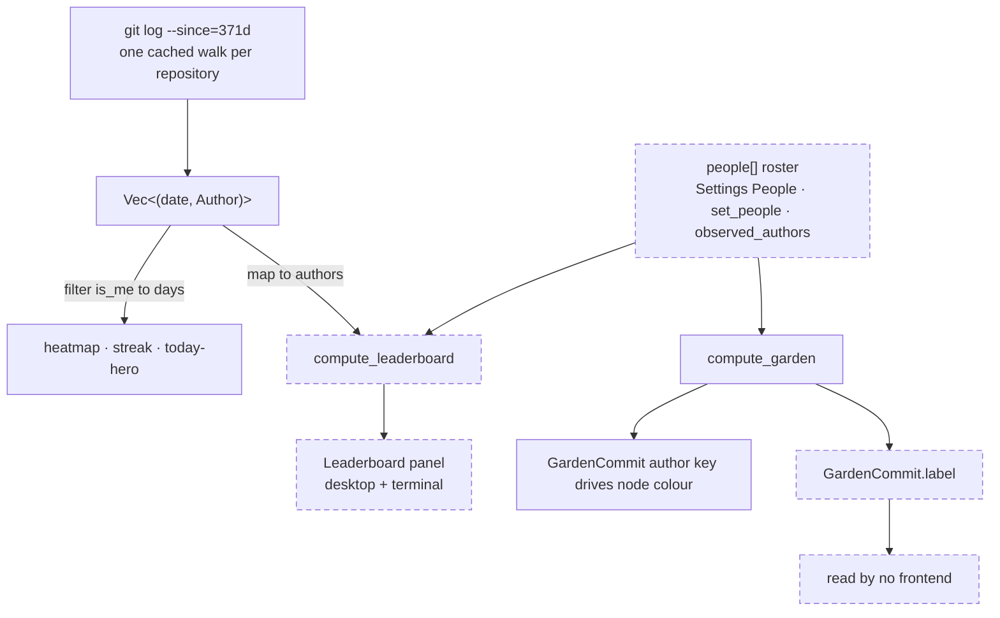

# Remove the Per-Author Leaderboard and the Named-People Roster

## Why

The Dashboard's per-author **leaderboard** ranks everyone who has touched a registered repository by shipped changes, completed tasks and commits over the last year. It is the only surface in SpecForge that scores people against one another, and it buys nothing: the app is a spec browser for the person sitting in front of it, the ranking informs no decision, and on a solo machine — which is most of them — it never renders at all, because a list of one is not a ranking.

Deleting the panel alone would leave the more interesting half standing. The **named-people roster** — the `Person` type, `roster_index`, `assign_identity`, a persisted `people` array, two IPC commands wired through four registration sites each, and a 70-line *People* section in Settings — exists to make that ranking read well. Its own help copy says so in as many words: "Name and merge other contributors on the leaderboard." Its only other consumer is the commit garden, and the garden barely uses it: `compute_garden` resolves each commit to a person and writes the roster name onto `GardenCommit.label` — and **nothing renders that field**. The desktop hover title shows the raw `c.author` (`src/components/CommitGarden.tsx:110`); the terminal reads only the attribution key for its colour hash (`crates/specforge-tui/src/ui.rs:868`). The `commit-garden` capability's own *Read-Only Graphs* requirement already says the hover surfaces "the commit's **author**", never a person name.

So once the leaderboard is gone, the whole roster apparatus survives to decide exactly one thing: which of today's commit nodes share a hue. That does not justify a Settings surface, a persisted field, and two commands. Keeping it would be keeping the leaderboard's plumbing without the leaderboard.

Both go, together.

## What Changes

- **The per-author leaderboard is removed.** `compute_leaderboard`, `LeaderboardEntry`, and the `DashboardData.leaderboard` field go from `openspec-core`; the `Leaderboard` React component and its `.leaderboard*` styles go from the desktop frontend; `leaderboard_lines` goes from the terminal frontend. The shared year-long `git log` walk that fed it **stays** — the heatmap, the streak and the today-hero are filters over those same `(date, author)` pairs.
- **The named-people roster is removed in full.** The `Person` struct, `roster_index` and `assign_identity` go from `openspec-core`; the `people` field, its `Default` initialiser and the `people()` / `set_people()` accessors go from `SettingsStore`; `AppService::observed_authors` and the `people` field of the `IdentityInfo` payload go from `openspec-app`; the `set_people` and `observed_authors` commands are unregistered from all four sites; and the Settings **People** section — `PersonCard`, the observed-authors assignment list, and the seven roster handlers — goes from the frontend.
- **The canonical developer identity is untouched.** `IdentityConfig`, `Author`, `is_me`, `normalized_key`, `event_is_me`, the display name and the alias list all stay, as do the `get_identity`, `set_display_name` and `set_identity_aliases` commands and the Settings **Identity** section. `IdentityInfo.candidates` — the "Detected git identities" suggestions — is backed by `detect_candidate_identities`, which reads `git config` and is a **different** source from the `observed_authors` commit-history walk being deleted; it survives unchanged.
- **The commit garden keeps its colours and loses its folding.** `compute_garden` drops its `people` parameter and `resolve()` drops its roster arm, falling back to you-precedence-then-raw-author-key. The developer's own nodes still carry the accent. A teammate who commits under two git identities now draws in two colours and counts as two in each plot's distinct-author caption — which is already exactly what an unrostered author gets today. Both frontends' captions are reworded from "N people" to "N authors" so the figure stays honest, and `GardenCommit.person_key` is renamed `author_key` (mirrored as `authorKey`) so the wire name matches the concept. This regression is accepted, and it is written into the spec as a stated contract rather than left as an implicit consequence.
- **`GardenCommit.label` goes with them.** The roster-resolved display name is computed, serialised over IPC and hand-mirrored in `src/types.ts`, and has **zero readers** anywhere — not in `src/`, not in any of the three frontend crates. Its deletion is caught by nothing: not `tsc`, not `cargo`, not a test. The only thing that makes it safe is that the Rust field and its TypeScript mirror are removed in the same commit.
- **No settings migration is required, and the loss is permanent.** No type in the workspace uses `serde(deny_unknown_fields)`, `SettingsStore::load` parses the file in one piece, and `save` serialises the whole struct — so a stored `"people"` array is ignored on load and dropped by the next write of any setting. Nothing new is needed. But every existing `settings.json` already carries a populated `people` array, and the first write after upgrade deletes it irrecoverably: a user who had named five teammates cannot get that roster back by downgrading. The trigger is broader than an identity edit — `AppSettings` also persists tree collapse/expand state and favourites, so merely expanding one tree node on first launch destroys the roster, and `save` is a bare whole-file `fs::write` with no backup. That is the accepted outcome, stated here rather than discovered; a `settings.json.bak` on first load-with-`people` would soften it and is deliberately not done, because the roster has no surviving consumer to restore it into.
- **After this change, nothing anywhere lets a user name another person.** Every non-you author is presented by their raw git identity, with no override, in all three frontends. This is the intended end state, not an oversight.
- **Removing `observed_authors` also removes a discovery path for *your own* unclaimed identities.** It walked commit history and returned every author that does not yet resolve as you — which is exactly where an old work email or a GitHub `noreply` address of your own showed up, since an unclaimed identity is by definition not `is_me`. The surviving `candidates` list reads `git config` per registered folder, so it only ever offers identities already configured somewhere. A user whose history spans `me@work` and `me@personal` with only the first in `git config` must now type the second from memory into the Identity section's free-form add form. The *Claiming an alias folds activity into the developer's counts* scenario still holds, but its discovery affordance is gone; accepted, because the alternative is keeping a commit-history walk and a Settings list to serve a case the free-form entry already covers.
- **`assign_identity` had no production caller at all.** It is exercised only by its own two unit tests; the frontend used a hand-written JavaScript mirror (`src/components/SettingsView.tsx:651`) that goes with the People section. It deletes with zero call-site fallout.

## Capabilities

### New Capabilities

_None._

### Modified Capabilities

- `dashboard`: **Per-Author Leaderboard** is removed outright. **Unconditional Progress Layer** drops the leaderboard from its membership list and drops "the leaderboard's more-than-one-author rule" from its per-surface conditions. **Personal Progress Frame** loses the sentence that justified its me-only scoping by deferring cross-author comparison to the leaderboard; it is replaced by a positive prohibition — the Dashboard SHALL NOT rank, score or otherwise order authors against one another — plus a new scenario, so that re-adding a ranking later is a spec violation rather than a gap. **Dashboard Section Order** drops the leaderboard from the fixed vertical order.
- `developer-identity`: half the capability retires. **Named People Roster** and **Single Identity Assignment with Canonical-Developer Precedence** are removed outright. **Manual Identity Entry** is modified to drop its "or any person on the roster" clause, keeping all three canonical-developer scenarios. The Purpose paragraph is rewritten to describe a single canonical developer and to state explicitly that no other person is named. Because `openspec archive` does not apply a delta's Purpose, that edit is made directly to `openspec/specs/**` in this change rather than deferred to a manual post-archive step no archive command would run.
- `commit-garden`: **Person-Colored Graph Nodes** is removed and re-added as **Author-Colored Graph Nodes**, rewritten around you-precedence-then-raw-author and stating the two-identities-two-colours consequence as a contract. Renamed rather than modified in place because it must drop the *Folded identities share one color* scenario, and `openspec archive` rejects a MODIFIED block that drops a scenario present in the current spec. Its *Coloring does not rewrite the log* scenario is re-pointed away from the roster, and a replacement scenario asserts that the developer's own aliases all share the accent. Because the deleted `developer-identity` requirement was the spec tree's only normative statement of you-precedence, this requirement re-anchors it. The Purpose is rewritten directly in `openspec/specs/**`, for the same reason.
- `terminal-ui`: the *Both frontends compute identical results* scenario of **In-Process Shared Application Service** stops asserting leaderboard parity and asserts garden parity instead. Note that **Progress Surfaces in the Terminal** never listed the leaderboard, which is why the terminal's `leaderboard_lines` was effectively unspecified.
- `activity-log`: Purpose only — the enumeration of Dashboard surfaces that read the log drops the leaderboard. Because that is the sole change and a delta's Purpose is not applied by archive, this capability ships **no delta file** — the edit is made directly to `openspec/specs/activity-log/spec.md` in this change.
- `document-width`: **An Unrecognised Reading Width Degrades to the Default** drops "the contributor roster" from its list of neighbouring preferences that must survive an unrecognised value. Easy to miss — it names the roster in prose only, and by the phrase "contributor roster" rather than "people". No scenario names it, and the backing test fixture (`crates/openspec-app/src/settings.rs:685`) carries no `people` key, so no test changes.

## Impact

**Rust core (`crates/openspec-core`)**

- `src/dashboard.rs` — delete `DashboardData.leaderboard` (36-40), `LeaderboardEntry` (42-55), `compute_leaderboard` and its doc (306-393), the `leaderboard: Vec::new()` initialiser (226), and the five contiguous leaderboard tests (1343-1456). The module-level `use crate::identity::{…}` at line 11 becomes **test-only** — move a narrowed `use crate::identity::{Author, IdentityConfig};` inside `mod tests`, or clippy's `-D warnings` fails on the non-test build. Keep the module-level `HashMap` import at line 16: `archived_at_by_dir` still uses it.
- `src/identity.rs` — delete `Person` (86-101), `impl Person` (103-121), `roster_index` (179-203), `assign_identity` (205-233), and the six roster tests plus their `person` helper (333-430). Narrow line 16 to `use std::collections::HashSet;`. The seven surviving tests above 333 are untouched.
- `src/garden.rs` — drop the `people` parameter from `compute_garden`, drop `resolve()`'s roster arm, delete `GardenCommit.label` (46-47), narrow the import at 19, and update the four in-file test call sites. The module doc (11-15) becomes **wrong**, not merely stale: it names the leaderboard as the reference implementation and `[roster_index]` becomes a broken intra-doc link.
- `src/lib.rs` — drop `compute_leaderboard`, `LeaderboardEntry`, `Person`, `roster_index` and `assign_identity` from the re-export lists (rustfmt will re-wrap them).
- `src/git.rs:1194` and `src/repo_cache.rs:16,141` — doc comments naming the leaderboard as a consumer of the commit walk.

**Application service (`crates/openspec-app`)**

- `src/service.rs` — delete `IdentityInfo.people` (102), the roster read in `identity_info` (1006), `observed_authors` and its doc (1019-1045), the roster reads in `commit_garden` (1101) and `dashboard` (1160), and the `commit_authors` collect plus the `data.leaderboard = …` assignment (1239-1241). Fix the `compute_garden` call at 1131. Narrow the imports at 16, 18 and 22. Five doc comments need rewording (92-97, 163-165, 1002-1003, 1155-1157, 1196-1199).
- `src/settings.rs` — delete the `people` field (29-34), its `Default` initialiser (260), and `people()` / `set_people()` (393-405); narrow the import at line 1. Edit the `DocumentWidth` doc at 107-109, which names the contributor roster. In `every_setter_round_trips_and_every_getter_reads_back`, delete only the roster arms (853-860, 883-886) — the test is the file's only mutation coverage for ~20 unrelated settings.
- `src/settings.rs` — **extend** `legacy_gamification_and_season_keys_are_ignored_and_dropped` (919-955) rather than adding a parallel test: add a `"people"` array to the fixture JSON, add a third `assert!(!raw.contains("people"))`, and rename it to cover all three legacy keys. No surviving `AppSettings` field serialises to a camelCase key containing the substring `people`, so the assertion is safe.
- `tests/dashboard.rs:181-183` — a doc comment naming the leaderboard.

**Tauri shell (`crates/specforge`)** — `src/commands.rs`: delete `set_people` (587-590) and `observed_authors` (592-600), drop `Person` from the import at 15 (keep `Author`, still used by `set_identity_aliases`). `src/lib.rs`: drop both entries from `generate_handler!` (315-316).

**Web server (`crates/specforge-web`)** — `src/dispatch.rs`: delete the `observed_authors` arm (174), the `set_people` arm (189-195), `struct PeopleArg` (415-419), and `Person` from the import at 18 (keep `Author` and `PaletteColor`).

**Terminal frontend (`crates/specforge-tui`)** — `src/ui.rs`: drop `LeaderboardEntry` from the import at 11, delete the `lines.extend(…)` at 698 while **keeping** the blank-line push at 696 (`leaderboard_lines` already returned an empty vec for solo history, so 696 was already the buffer's last line for most users), and delete `fn leaderboard_lines` (760-802) — leaving it behind is a `dead_code` failure under `-D warnings`. `src/theme.rs:240-242` and `src/render_tests.rs:102-103`: doc comments using roster vocabulary. `README.md:87-88`: the Dashboard bullet naming the leaderboard.

**Frontend (`src/`)** — `types.ts`: `DashboardData.leaderboard` (282-283), `GardenCommit.label` (308-309), `Person` (394-401), `IdentityInfo.people` (407), `LeaderboardEntry` (427-437). `api.ts`: `setPeople` (247-251), `observedAuthors` (252-257), the `Person` type import (25). `DashboardView.tsx`: the `Leaderboard` component (156-190), its call site (680), the type import (12). `SettingsView.tsx`: the People `<section>` (1018-1089), `PersonCard` (715-774), `assignIdentity` (651-661), `personLabel` (663-668), the `observed` state (851), the roster derivations (880-885), the seven handlers (908-935), three imports, the stranded doc comment (776-778), and the now-single-child fragment wrapper (937-938 / 1090-1091). `App.css`: `.person-card` / `.person-head` / `.person-head .settings-text-input` (2614-2629) and the `.leaderboard*` block (3749-3806).

**Marketing site (`site/`)** — the leaderboard paragraph on `docs/dashboard` (83-87); the garden's roster-attribution paragraph (69-73), which becomes **false** once folding stops; the people-roster paragraph on `docs/settings` (29-34) and that section's `heading="Identity and people"` → `"Identity"`; the roster cross-link on `docs/workspaces` (88-92). The `id="identity"` anchor **must not change** — three in-repo links plus any published one point at it, and one of them renders the visible text "Settings ▸ Identity", which settles the heading rename. Bump the three `modified` dates. A master push touching `site/**` publishes specforge.avantmedia.uk for real, so this copy is user-visible on merge.

**Deliberately NOT changed**

- `releases/*.md` — historical records of what shipped. All five leaderboard mentions (v0.5.0:7, v0.5.0:19, v0.6.0:9, v0.17.0:7, v0.17.0:38) stay true of those versions, and only the current release renders as HTML on the site. `openspec/changes/archive/` is left alone for the same reason.
- `README.md:232` and `.cargo/mutants.toml:27` — the mutant-count and survivor-cluster figures are a dated snapshot. No file either sentence names is deleted, so both remain literally true.
- `crates/openspec-app/src/service.rs:92-97` — the `IdentityInfo` doc's claim that the terminal frontend returns this payload is a **pre-existing** inaccuracy (`specforge-tui` never calls `identity_info`). Only the roster clause is edited here; fixing the rest would pull an unrelated correction into a deletion diff.
- `site/pages/docs/dashboard/+Page.tsx:77-82` — advertises "a commits-per-day activity chart" that `dashboard`'s *Analytics Band Composition* forbids. Pre-existing drift, sitting directly above a paragraph being deleted; out of scope, flagged so it is not silently folded in.
- The activity log's per-event authorship, its git backfill and its `%an` / `%ae` attribution. The leaderboard was one consumer, but the load-bearing one survives: a teammate's backfilled event must **not** count toward the developer's streak or heatmap.
- The commit-graph rail, the tray badge, notifications, the workspace registry, quota gauges, and the web server's trust boundary. No new event kinds, no git behaviour change, no schema migration.
