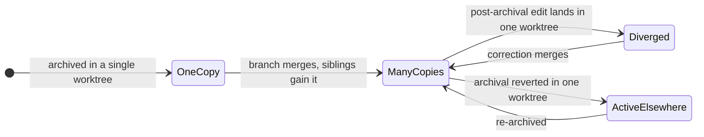
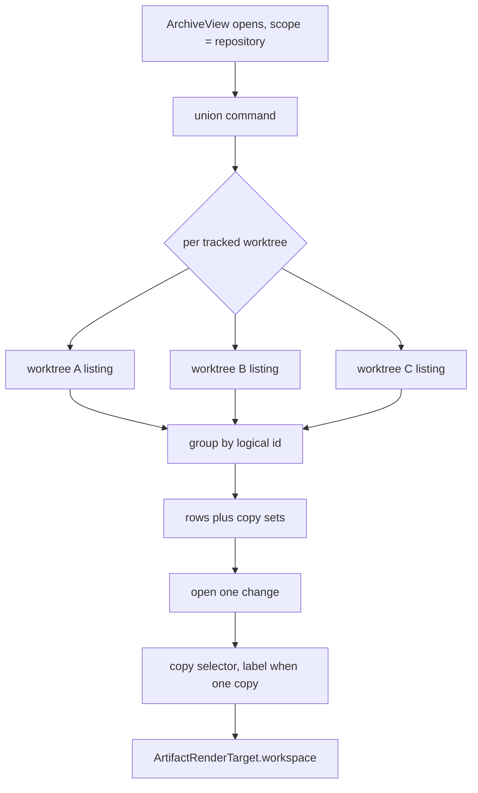

## Context

The Archive view renders one workspace's `openspec/changes/archive/` tree, chosen from a dropdown built from `list_workspaces`. That command filters the registry to `WorkspaceOrigin::UserRegistered`, so auto-discovered worktrees never reach it — while `ensure_registered_workspace`, which gates the actual reads, matches against **all** registry entries. The permission is already granted; only the listing withholds it.

Three properties of the real system shape every decision below, and each was verified against this repository's history rather than assumed:

- **The archive is read from the working tree, not from git.** `list_archived_changes` is a raw `fs::read_dir` and `read_artifact` ends in `tokio::fs::read_to_string`. Nothing requires `openspec/changes/archive/` to be tracked, and non-git roots are explicitly supported. So no argument from "the archive is committed" can establish that two worktrees hold identical bytes.
- **Archived content is near-immutable, but not immutable.** 114 of 116 archived directories were never touched after their archival commit. The two exceptions were same-day corrections to the record just written, each opening a window of roughly 39 minutes in which two worktrees held materially different text for the same dated directory — the same order of magnitude as the merge-lag window that motivates the feature.
- **Archival is reversible.** One change was archived and then un-archived by a revert. A logical change can therefore be *active* in one worktree while *archived* in another: neither identical nor absent, which a two-state model cannot express.

## Goals / Non-Goals

**Goals:**

- No archived change is unreachable from the Archive view because of which worktree holds it.
- The today's-ships deep link opens the change it names, including when that change lives only in a discovered worktree.
- One logical change is one row, whatever date prefix or worktree produced each copy.
- Reading a specific worktree's copy is possible without changing a global mode.
- De-duplication, provenance and ordering are testable by `cargo test` and reachable by the mutation gate.

**Non-Goals:**

- Promoting discovered worktrees to manageable rows. Settings keeps listing user-registered folders only; the disable toggle and display name stay keyed per repository group.
- Making the copy choice part of the Address. The workspace scope is not addressed today either, and the union removes the correctness pressure that would justify adding an axis to the codec.
- Diffing copies against each other, or rendering a merged view of two copies. Divergence is surfaced, never resolved.
- Any change to the watcher's aggregation hot path. The union is read on demand when the view opens, exactly as today's single listing is.
- Naming the read-from worktree's branch anywhere in the reader.

## Decisions

### D1. The union is computed in Rust, behind one new command

A repo-scoped operation in `openspec-app` fans out over the repository's tracked worktrees, calls the existing per-workspace listing on each, and returns de-duplicated rows carrying their copies. Authorization reuses `ensure_registered_repo`, which already exists and already accepts exactly the repositories the user registered.

*Rejected — fan out from the frontend.* `ArchivedChangeSummary` carries neither a workspace nor a worktree, so the frontend would have to invent a wrapper shape anyway; the de-duplication and ordering rules would live in TypeScript, invisible to `cargo test` and to the mutation gate that guards this repo's two core crates; and it costs N round-trips per view open. It also violates the standing rule that logic more than one frontend needs belongs in `openspec-app`, not in a frontend.

### D2. De-duplicate on the bare logical id, not the dated directory name

Let $C$ be the copies found across worktrees, each $c = (w, d)$ for worktree $w$ and dated directory $d$. Rows are the equivalence classes of

$$ c_1 \sim c_2 \iff \mathrm{logical}(d_1) = \mathrm{logical}(d_2) $$

where $\mathrm{logical}$ strips exactly one leading `YYYY-MM-DD-`. Each row keeps its full copy set, because $(w, d)$ — not the logical id — is what addresses a read.

*Rejected — key on the dated directory name.* It is what the aggregation path already produces, so it costs nothing, but it does not unify: the date prefix records the day `openspec archive` ran **in that worktree**, so two worktrees archiving the same change on different days yield two rows, which is precisely the duplication a union exists to remove. It also cannot join an archived copy to a still-active instance elsewhere.

*Consequence to handle:* the strip is a single anchored match by design, so a change whose own id begins with a date-shaped prefix round-trips only when stripped exactly once. The row must carry both forms rather than re-deriving one from the other.

### D3. A per-change copy selector, not a global worktree dropdown and not a passive label

The listing scope becomes the repository. Choosing which worktree's copy to read happens **inside** an opened change, and binds only that reader.

*Rejected — a second global dropdown (repo → worktree).* Because the archive is committed in this project, worktrees hold near-identical archives; a global switch would mostly toggle between three copies of the same long list, and would still force a mode change to read the one change that exists in only one worktree.

*Rejected — a passive provenance label.* This was the initial recommendation and it fails on the very case that justifies the feature: a union row whose change exists only in worktree B cannot be rendered while a single view-level workspace drives the render target. A label would surface the row and then send the user back to a global control to read it. The control must bind `ArtifactRenderTarget.workspace`. It renders as a plain non-interactive label when the copy set has one element, which is the common case — that is a rendering rule, not a different design.

### D4. Copies are labelled by workspace, never by branch

`archive-browser` requires that the read-from worktree's branch is not shown anywhere in the reader, because that worktree routinely hosts other, active changes whose branch was never the archived change's. The codebase's usual instance label *is* the branch name, so this is an easy rule to break by reflex.

*Rejected — branch names.* They read better and match the tree pane, but they would violate an existing scenario and re-introduce the exact false attribution that requirement was written to prevent. Amending that requirement was considered and rejected as unrelated scope: the constraint is sound, and workspace names satisfy the need.

### D5. Fix `build_repo_view`'s active/archived keying in this change

Active instances are keyed on the bare id and archived ones on the dated directory name, so they never share a `by_name` key. `[stale]` is therefore unreachable for any dated archive directory, and the requirement's only test passes solely because its fixture writes undated directories.

*Rejected — split it into its own change.* Tempting, because the defect is visible in the tree pane rather than the Archive view. But it is the same defect D2 resolves: two identity schemes for one logical change. Fixing the union's identity while leaving the aggregator's mismatched would leave the codebase with two answers to "is this the same change", and the union's ability to join an archived copy to an active sibling depends on the aggregator's answer. The two halves remain separable if this change proves too large to land at once.

### D6. The copy selection uses new state, not the existing `selectedUri`

`ArchiveView`'s dropdown `onChange` clears the open change and the filter, and the listing effect is keyed on `selectedUri`. Reusing that variable for a copy switch would close the change being read and refetch the whole listing on every switch.

*Rejected — reuse `selectedUri`.* Fewer variables, but it conflates "which scope am I listing" with "which copy am I reading", which are now genuinely different questions with different lifetimes.

### D7. Surface divergence; never assert sameness

Copies can differ, with no commit involved. `archived_artifact_status` already reaches per-copy metadata, so the selector marks copies that differ rather than implying they are interchangeable.

*Rejected — assert copies are identical and pick one silently.* This was the original premise and it is false: it fails on uncommitted edits, on worktrees parked inside a post-archival correction window, and entirely on workspaces that do not commit their archive.

## Risks / Trade-offs

- **Content divergence between copies is real but rare (2 of 116 directories, ~39-minute windows)** → Never claim copies are identical. Make every copy openable and mark differing ones, so a user who lands mid-window sees the discrepancy rather than a silently chosen copy.

- **The fan-out cost grows with the number of tracked worktrees, and this project's workflow creates one per change** → Keep it on demand and off the aggregation path, exactly as the current listing is: nothing runs while the view is closed. The per-worktree unit is a directory listing plus a heading-only read, which is what the existing requirement already bounds it to.

- **De-duplication reduces two rows to one and could hide a genuinely distinct change** → The equivalence is on the logical id, which is the change's own identity; the row retains and displays every copy it collapsed, so nothing becomes unreachable — only un-duplicated.

- **The `[stale]` fix changes an aggregation-path key that other consumers read** → `git::change_lifecycle` and the dashboard's ships join both key on the dated name today and have working tests; touch them together, and re-point the divergence fixtures at **dated** directories so the tests stop passing for the wrong reason.

- **Mutation testing gates changed lines in both crates, and whole-function replacement makes a green gate on a comparator or sort key look like ordering coverage when it is not** → Write adversarial tie fixtures for the de-duplication key and the copy ordering deliberately, rather than trusting the gate to demand them.

- **Reversing the pooling ban is a real requirement reversal, not a clarification** → Amend the requirement explicitly with its reason recorded, so the constraint reads as superseded rather than forgotten. The old behaviour survives as the one-worktree case.

- **The premise generalizes past this repo: other workspaces may not commit their archive at all** → Derive nothing from tracked-ness. The implementation reads the filesystem per worktree, which is correct for a gitignored archive, an uncommitted edit, and a non-git root alike.
