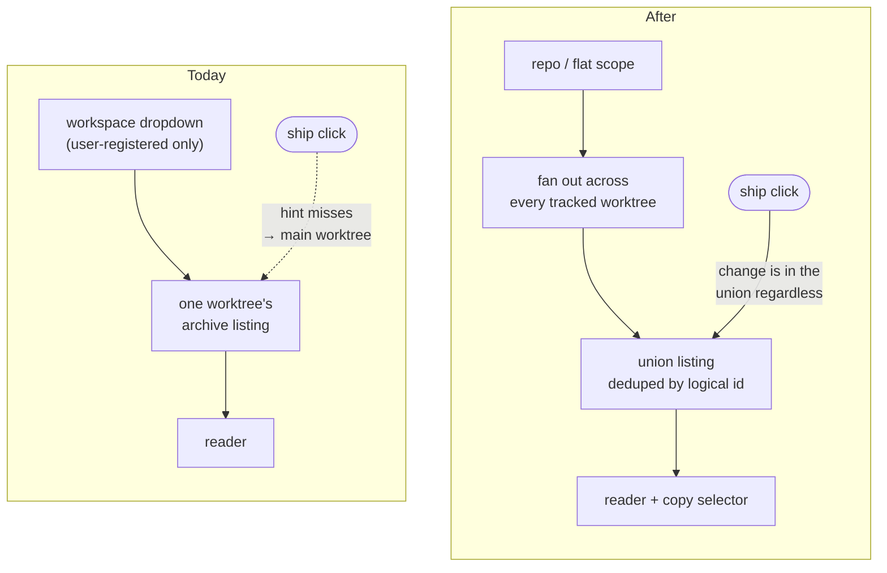

# Browse the Archive Across a Repository's Worktrees

## Why

The Archive browser scopes to one workspace at a time, and it builds its dropdown from `list_workspaces`, which returns only **user-registered** folders. Every worktree SpecForge auto-discovers is therefore unreachable from the Archive view — including every `.claude/worktrees/*` this project's own workflow creates. The backend already permits those reads (`ensure_registered_workspace` matches against *all* registry entries, and `archive-browser`'s confinement requirement already says "registered **or registry-discovered**"), so the capability exists and only the frontend's sight of it is missing.

The consequence is not cosmetic. This repo archives a change from inside its own feature worktree and merges afterwards, so between those two moments the archived change exists in exactly one worktree — and that worktree is the one the Archive browser cannot select. The Dashboard's today's-ships feed links straight into this gap: `dashboard` requires that selecting a ship opens the Archive browser with the change pre-selected, but for a change archived in a discovered worktree the link resolves to the repository's main worktree, whose archive does not contain it, and the pre-selection is silently dropped.

## What Changes

The Archive view stops being a per-workspace surface and becomes a per-**repository** one: one union listing over every tracked worktree, de-duplicated by logical change id, with the worktree choice demoted from a global mode to a per-change detail.

- **A union archive listing per repository.** A new application-layer operation fans out across every tracked worktree of a repository (user-registered *and* discovered), reads each one's archive listing, and returns one row per **logical change id**, carrying the set of copies that produced it. De-duplication, provenance and ordering live in Rust so `cargo test` covers them and all three frontends share one answer.

- **Logical id, not dated directory name, is the de-duplication identity.** The aggregation path keys archived changes on the raw dated directory name (`list_archived_stubs`), while `list_archived_summaries` returns the bare id. Two worktrees that archive the same change on different days produce `2026-06-04-foo` and `2026-06-05-foo`; only the bare id collapses them into the single row a union implies. Each row keeps the `(worktree, dated directory)` pairs it collapsed, because that pair is what addresses a read.

- **A per-change copy selector replaces the global worktree switch.** Opening a change that exists in several worktrees offers a control that re-points **only that reader** at another copy. It renders as a plain label when the change exists in one worktree, which is the common case. This is a selector rather than a decorative provenance badge because the case it exists for — a change present in exactly one non-main worktree — is unreadable unless the reader is actually bound to that worktree.

- **The selector's labels name workspaces, never branches.** `archive-browser` forbids showing the read-from worktree's branch anywhere in the reader, for a reason recorded at `src/changeIdentity.ts:104-116`: the host worktree's branch is routinely not the archived change's. Copies are labelled by workspace display name or worktree basename.

- **BUG — the today's-ships deep link into a discovered worktree is dead.** `worktreeForHint` inverts a ship's `worktreeHint` against active instances (missing, because the change is archived) and then against the registered listing (missing, because the worktree is `Discovered`), so it falls back to the main worktree; `ArchiveView` then discards the selection entirely, because its validity effect snaps any URI absent from `workspaces` back to `workspaces[0]`. The union framing dissolves this: the change is in the listing whatever worktree holds it, and the hint degrades from *correctness-critical* to *which copy opens first*.

- **BUG — the `[stale]` divergence label can never fire against a real archive.** `build_repo_view` keys **active** instances on the bare change id and **archived** ones on the dated directory name, so the two never share a `by_name` key and `spec-browser`'s *Per-Instance Divergence Label* cannot produce `[stale]` for any dated archive directory. Its only test passes because the fixture writes *undated* directories (`archive/foo`); `git::change_lifecycle` splits the same way, and `dashboard.rs` documents working around it. This is the same logical-identity defect the union's de-duplication has to solve, which is why it is fixed here rather than separately — though the two halves are separable if this change proves too large.

- **BUG — archive-read confinement is untested for discovered worktrees.** The existing test covers registered versus outsider only. The union depends on discovered worktrees being readable, so that behaviour is pinned rather than left as an accident that a future tightening could remove.

- **BREAKING (spec-level, not user-facing):** `archive-browser`'s ban on pooling archived changes across workspaces is reversed. Nothing that exists today stops working — the previous behaviour is the degenerate one-worktree case of the new one.

## Capabilities

### New Capabilities

_None._

### Modified Capabilities

- `archive-browser`: the view scopes to a repository rather than a single workspace; the pooling ban is replaced by a union listing de-duplicated on logical change id; a per-change copy selector is added, labelled by workspace and explicitly not by branch; the confinement requirement gains a scenario for registry-discovered worktrees.
- `dashboard`: the today's-ships requirement that selecting a ship opens the Archive browser with the change pre-selected gains a scenario covering a change archived in a discovered worktree — the case that silently fails today.
- `spec-browser`: *Per-Instance Divergence Label* gains a scenario pinning `[stale]` against a **dated** archive directory, which is the form that occurs in practice and the form the current implementation cannot detect.

`view-routing` is deliberately **not** modified. Its *Addressable Viewing State* and *Workspace Identity Is a Registry Slug* requirements already name "a workspace **or repository**", and `worktreeHint` is an implementation detail of archive-address resolution that no requirement mentions. Its contract does weaken — from choosing the workspace an archive listing is read from, to choosing which copy of an already-listed change opens first — but that is a code change under an unchanged requirement, recorded in Impact rather than as a spec delta.

## Impact

**Rust.** `crates/openspec-core/src/types.rs` (new union row and copy shapes), `parser.rs` (logical-id keyed listing), `repo_view.rs` (`build_repo_view`'s active/archived keying, and the `StaleVsArchived` fixtures that currently hide the defect), `crates/openspec-app/src/service.rs` (the repo-scoped union operation, authorized through the existing `ensure_registered_repo`, plus the discovered-worktree confinement test).

**IPC.** One new command, which per `src/CLAUDE.md` means four registration points: `src/api.ts`, `crates/specforge/src/commands.rs`, `crates/specforge/src/lib.rs`, and `crates/specforge-web/src/dispatch.rs`. Missing the fourth fails only at runtime in the browser.

**Frontend.** `src/types.ts` (hand-mirrored shapes), `src/components/ArchiveView.tsx` (scope state split into "which repository to list" and "which copy this open change renders from" — these must be **separate** state, because the existing dropdown's `onChange` clears the open change and refetches the listing), `src/routing/resolve.ts` (`worktreeForHint`), and `src/App.css`.

**Deliberately unchanged.** The watcher and its aggregation hot path — the union is read on demand when the view opens, exactly as the current listing is, and no archived change is parsed during aggregation. Workspace registration and the Settings list keep returning user-registered folders only; discovered worktrees remain unmanageable by design and are not promoted. `specforge-tui` has no Archive browser and gains none. `specforge-web` needs no frontend work beyond the dispatch arm, since it serves the same bundle. No new dependencies.

**Gate.** `openspec-core` and `openspec-app` are mutation-tested on changed lines, so the de-duplication key, the copy ordering and the active/archived join each need assertions that actually kill mutants — a comparator or sort key passing the gate is not ordering coverage, so adversarial tie fixtures are required rather than assumed.
