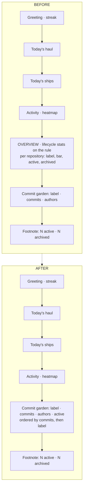

# Fold the Analytics Band into the Commit Garden

## Why

The Overview band was rebuilt two days ago (`2026-09-04-rework-dashboard-overview`).
That change asked whether the per-repository breakdown was *well presented* and
answered it thoroughly: ranked by three keys, capped at five, bars only on rows
with work in flight, quiet rows dimmed, lifecycle figures moved onto the divider
rule. It did not ask the prior question — whether the breakdown earns a place on
the Dashboard at all.

Audited against the rest of the surface, it does not. Every datum the band
renders, and where else the Dashboard already answers it:

| Band datum | Already answered by |
|---|---|
| per-repository active count | the footnote's registry-wide `N active`, which this decomposes; the tree pane, continuously and per row |
| per-repository archived count | the footnote's registry-wide `N archived`, which this decomposes |
| per-repository label | the commit garden's plot caption, and the tree pane |
| the proportional bar | nothing — it exists only to make five adjacent rows comparable |
| the cap, the remainder line, the tracks | nothing — chrome that exists only to support the decomposition |
| `archivedInWindow`, the window, `avgTimeToArchive` | nothing — genuinely unique |

So the band is a decomposition of two totals the Dashboard already prints,
plus three unique figures, carried by a section heading, a divider rule, a panel
heading, a five-row cap, a remainder line and roughly a hundred and thirty lines
of component and helper code. The decomposition answers "which repository holds
my work" — a question the workspace tree answers continuously, and better,
because it is not capped at five.

The three unique figures are windowed lifecycle statistics: how many changes were
archived in the last fourteen days, and the mean time from a change's creation
commit to its archival commit. They are aggregate trend figures on a surface whose
every other element answers *today* or *right now*. Nothing on the Dashboard acts
on them, and no requirement in this capability depends on their being displayed.

Meanwhile the commit garden directly below already renders one row per
top-level entry, labelled with the same display name, computed from the same
registry — and it is the section that actually answers "what moved, where,
today". The two surfaces are the same subject split across a divider.

This continues the arc the last two changes began: the rework removed the
commits chart, `remove-leaderboard-and-roster` removed the leaderboard, and this
removes the band those two left behind.

## What Changes

The analytics band is removed and the commit garden becomes the Dashboard's only
per-repository surface. The garden's plot caption gains the entry's active-change
count, preserving the one piece of the breakdown worth keeping.

The lifecycle **figures** go; the lifecycle **mining** stays. The two are easy to
conflate. `assemble` mines each repository's lifecycles once and uses them twice:
for the metrics, and to date each entry in today's ships feed
(`dashboard.rs:183`). Removing the metrics removes `lifecycle_metrics`, the
`LifecycleMetrics` payload, the `lifecycle_window_days` field and the
`DASHBOARD_LIFECYCLE_WINDOW_DAYS` constant that fed it — but not the mining, the
per-repository cache invalidation, the concurrent-derivation collapsing, or the
retry-on-failure distinction. Those keep the ships feed's `archived <time>`
stamps working and are untouched.

`repo_breakdowns` likewise survives as a data source with no presentation. The
footnote's registry-wide archived total is a reduction over it
(`DashboardView.tsx:511`), and the requirement being removed already licensed
exactly this: *"Withholding entries is a presentation concern. The Dashboard's
underlying cross-workspace data SHALL retain every top-level item."* What it
loses is its three-key ordering, which had no consumer other than the rows now
being deleted.

Removing the breakdown exposes a latent defect in the garden. The garden renders
plots in registry order with **no tiebreak** — `service.rs` maps `views` straight
through — so two plots can trade places between refreshes. That flaw is currently
masked by sitting beneath a rigorously sorted neighbour; once the garden is the
only per-repository list on screen, nothing catches it. The garden therefore gains
a deterministic order — today's commit count descending, then label ascending —
the same defect the breakdown's three-key sort was written to prevent.

The Dashboard gets shortest exactly where it currently feels most padded. On a
busy day the change saves a section heading, a divider rule, a panel heading and
five rows. On a **quiet** day, where the band renders a rule, a heading, up to
five rows and a remainder line to say almost nothing, the garden simply omits
itself and all of it goes.

## Capabilities

### New Capabilities

_None._

### Modified Capabilities

- `dashboard` — removes *Analytics Band Composition* and *Per-Repository
  Breakdown* outright; replaces *Change Lifecycle Metrics* with *Change Lifecycle
  Mining*, which keeps the derivation, caching, invalidation and concurrency
  guarantees and drops the presented metrics and the window; folds the surviving
  "retain every top-level item" clause into *Cross-Workspace Summary Metrics*;
  drops the band from *Dashboard Section Order*; drops the breakdown and the
  metrics from the enumerated surfaces in *Graceful Degradation Without Git* and
  *Dashboard Includes Disabled Workspaces*; and re-anchors the two cross-
  references that named the removed requirements, in *Personal Progress Frame*
  and in the heatmap's day-breakdown scenario.

- `commit-garden` — *Per-Workspace Commit Graphs at the Dashboard Bottom* loses
  its "below the analytics overview" anchor and has its one-plot-per-entry
  scenario corrected, which contradicted *Dormant and Degraded States*; adds
  *Deterministic Plot Order* and *Plot Caption*, the latter specifying the
  caption the *Author-Colored Graph Nodes* requirement already referred to
  without defining, now including the active-change count.

## Impact

**Rust.** `crates/openspec-core/src/dashboard.rs` loses `lifecycle_metrics`,
the `LifecycleMetrics` type, and the `lifecycle` and `lifecycle_window_days`
fields of `DashboardData`; `assemble` loses its `window_days` parameter.
`repo_breakdowns` keeps its vector and loses its sort. `crates/openspec-core/src/garden.rs`
gains an `active_count` field on `WorkspaceGarden`. `crates/openspec-app/src/service.rs`
loses `DASHBOARD_LIFECYCLE_WINDOW_DAYS`, which has no other consumer, and fills
`active_count` beside `plant.label` from the view it already holds; the garden's
plots are sorted before return. Both crates are inside the mutation gate, so the
new ordering and the new field need assertions that fail when they break — and
the deleted functions' tests go with them rather than being left to pass
vacuously.

**Frontend.** `src/components/DashboardView.tsx` loses the whole
`.dashboard-analytics` block — the rule, the divider, the lifecycle span and the
`Per repository` panel — along with `formatDuration`'s last caller if it has no
other, and the `capBreakdown` / `barPercent` / `maxShownActive` / `remainder`
bindings; `totalArchived` keeps its reduction over `repos`.
`src/components/repoBreakdown.ts` and `repoBreakdown.test.ts` are deleted
outright. `src/components/CommitGarden.tsx` extends the caption.
`src/types.ts` mirrors the payload changes. `src/App.css` loses
`.dashboard-analytics`, `.dashboard-analytics-rule`, `.dashboard-analytics-divider`,
`.dashboard-analytics .dashboard-panel`, `.dashboard-lifecycle` and its two
descendant rules, and the nine `.dashboard-breakdown*` rules. `.dashboard-panel`
and `.dashboard-panel-title` stay — today's ships uses both. The same React tree
serves the Tauri shell and `specforge-web`, so one edit covers both.

**Spec text.** The `dashboard` capability's `## Purpose` paragraph enumerates
"a per-repository breakdown, change-lifecycle throughput and time-to-archive"
and must lose both clauses when these deltas are synced. The `commit-garden`
purpose is unaffected.

**Deliberately unchanged.** `crates/specforge-tui` renders neither the breakdown
nor the lifecycle figures — its dashboard pane is Summary → Ships today →
Activity — so it is not touched, and *Dashboard Section Order*'s cross-frontend
clause still holds. *Unconditional Progress Layer* is untouched: the band was
never part of the progress layer and the garden, which is, stays unconditional.
The developer-scoped `in_flight` tile and the registry-wide caption count remain
two different figures under one word, "active" — an asymmetry that exists today
between the same tile and the breakdown, carried forward rather than introduced.
The watcher, the registry, the IPC command surface and the Dashboard's refresh
cadence are all unaffected.
