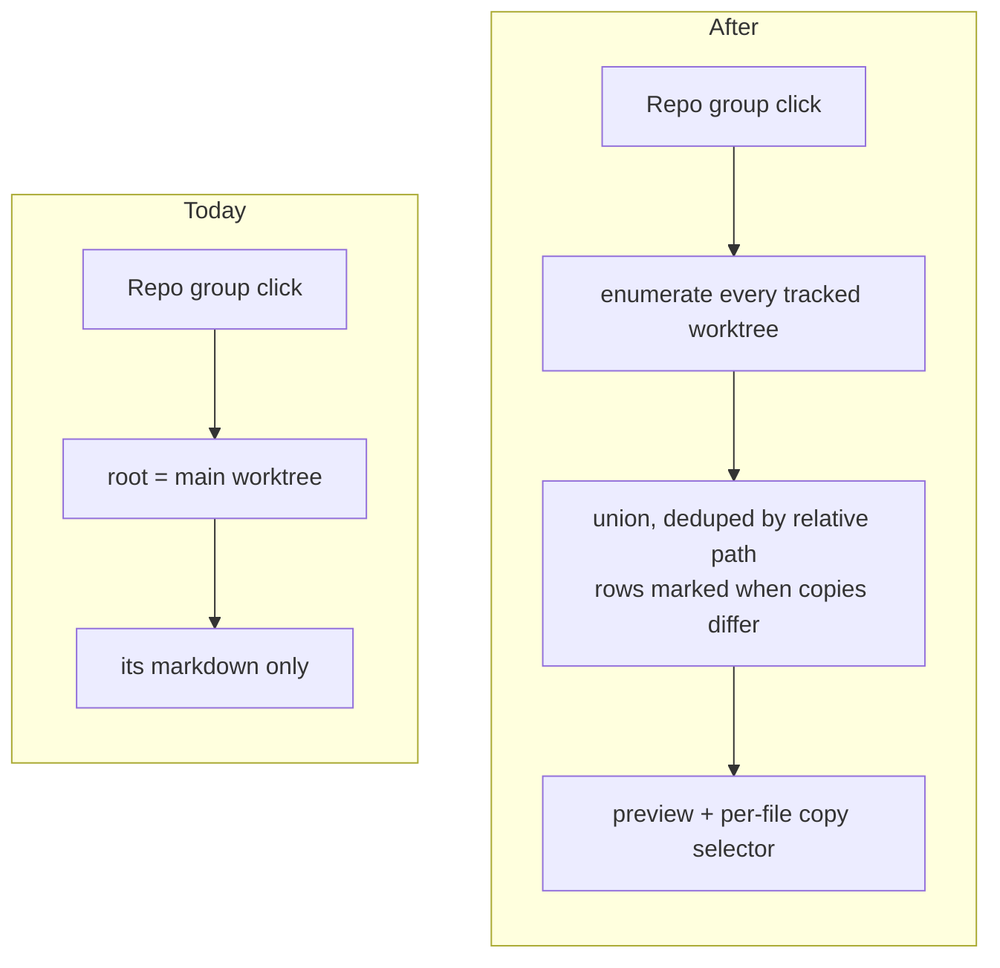

# Browse a Repository's Files Across Its Worktrees

## Why

The file browser shows one worktree's markdown and calls it the repository's. Clicking a Repo group roots the browser at the repository's **main worktree**, so a document that lives only in a feature worktree — a design note written this morning, a draft that has never been committed — is invisible, and the only way to read it is to register that worktree as its own top-level row.

This is the same gap the Archive view had, in the same place. The backend already permits the read: `ensure_browse_root` accepts any path inside a registered repository, and `Browsing Is Confined to Registered Workspaces` already says a root may be "a registered (or registry-discovered) workspace [or] a path inside a registered repository". Only the frontend never offers it — `App.tsx` and `resolve.ts` hardcode `view.mainWorktree` at four sites.

Where this differs from the archive is that **divergence is the normal case, not a rare one**. Archived directories were byte-identical across worktrees 114 times out of 116, so the archive's copy control renders as a plain label almost always. Every worktree here sits on a different branch, so a file that exists in several copies will usually differ between them — which makes the copy control load-bearing rather than incidental, and makes it worth saying on the row itself which files disagree.

## What Changes

The browse root for a Repo group stops being one worktree and becomes the repository, pooled across every tracked worktree of it and de-duplicated on the **root-relative path**.

- **A union listing per repository.** Each tracked worktree is enumerated exactly as one is today — `git ls-files --cached --others --exclude-standard` through the shared chokepoint — and the results are pooled into one path set. Untracked-but-not-ignored files keep being included, per worktree, so an uncommitted draft in any worktree is reachable.

- **The folder tree marks files whose copies differ.** A path present in several worktrees with differing content SHALL say so on its row. In the archive this would have been noise; here it is the most useful thing the tree can tell you, because it names exactly where your branches have drifted.

- **A per-file copy selector, not a global worktree switch.** Choosing which worktree's copy the preview renders happens on the opened file and binds only that preview — the same shape as `archive-browser`'s *Copy Selection Within an Opened Archived Change*. It renders as a plain label when a file exists in one worktree.

- **The address is unchanged, deliberately.** `view-routing` reserves the file-address grammar and forbids a worktree instance segment so the codec can decode from a closed vocabulary with no registry data. Following the archive's model **keeps that intact**: the copy choice is view-local, exactly as the Archive view's scope selector is. Only the neighbouring sentence — that a repository-scoped file address names the main worktree — softens to naming the repository and opening a default copy.

- **Relative links resolve inside the copy being read.** `Preview Link Handling` makes the browse root both the resolution base and the containment root. With copies from several worktrees that root is no longer fixed, so it becomes the **selected copy's** worktree. Getting this wrong would let a link in a file previewed from one worktree resolve into another, which is a containment question rather than a cosmetic one.

- **BREAKING (spec-level, not user-facing):** a Repo group's browse root is a repository rather than its main worktree. Nothing that works today stops working — a repository with one tracked worktree is the degenerate case of the new behaviour.

## Capabilities

### New Capabilities

_None._

### Modified Capabilities

- `workspace-file-browser`: the Repo-group browse root becomes the repository; enumeration runs per tracked worktree and unions; the derived tree marks paths whose copies differ; a per-file copy selector binds the preview; relative-link containment follows the selected copy; freshness and addressability are restated against the pooled root.
- `view-routing`: *File Addresses* stops naming the repository's main worktree and names the repository, resolving to a default copy. The reserved `file` segment and the prohibition on a worktree instance segment are **unchanged** — this change deliberately does not extend the grammar.

## Impact

**Rust.** Likely none for authorization — `ensure_browse_root` already accepts any path inside a registered repository. `crates/openspec-app/src/service.rs` gains a repo-scoped enumeration that fans out over the registry's worktrees for that repository and unions the results, mirroring `list_archived_rows`; `crates/openspec-core` gains the pure grouping and the divergence determination.

**IPC.** One new command, which per `src/CLAUDE.md` means four registration points: `src/api.ts`, `crates/specforge/src/commands.rs`, `crates/specforge/src/lib.rs`, `crates/specforge-web/src/dispatch.rs`. Any new type crossing the boundary is hand-mirrored in `src/types.ts` — and, per the guard proposed in `fix-ipc-wire-shape-mismatches`, a struct variant needs `rename_all_fields`.

**Frontend.** `src/components/FileBrowserView.tsx` (union tree, divergence marker, copy selector), `src/App.tsx` and `src/routing/resolve.ts` (the four `mainWorktree` sites), `src/types.ts`, `src/App.css`.

**Deliberately unchanged.** The refusal to watch a workspace-sized tree: the listing stays pull-based, and pooling multiplies what a refresh costs rather than changing when it happens. The document watch on the previewed file is per-file and unaffected. The address grammar. Flat workspaces, which have exactly one root and behave as they do today. `specforge-tui` has no file browser.

**Cost.** One `git ls-files` per tracked worktree per refresh — 661 markdown files in this repository today. That is *cheaper per worktree* than the archive union, which also reads a heading from each entry.

**Depends on nothing, but note:** `fix-ipc-wire-shape-mismatches` is in flight and touches `src/types.ts`. Whichever lands second will want a rebase.
