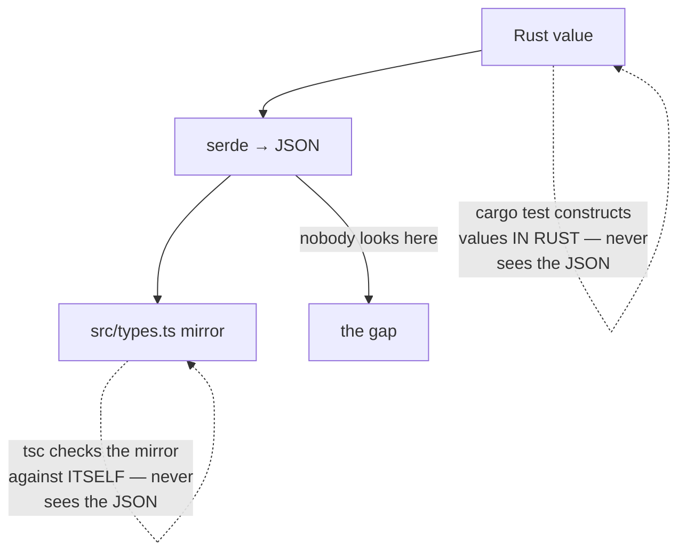

## Context

Rust types crossing the IPC boundary use `#[serde(rename_all = "camelCase")]` and are hand-mirrored in `src/types.ts`. There is no codegen, and — this is the load-bearing part — **no existing check can observe the two disagreeing**:



`cargo test` builds values in Rust and asserts on Rust. `tsc` checks TypeScript against TypeScript. `bun test` uses hand-written fixtures shaped like the mirror. The mutation gate mutates Rust and runs Rust tests. Every gate is green while the wire is wrong, and the only thing that notices is a user clicking the feature.

The trap itself is a serde subtlety: `rename_all` on an **enum** renames variants, while `rename_all_fields` (serde ≥ 1.0.184) renames the fields *inside* struct variants. On a plain struct, `rename_all` does rename fields — which is why the mistake is so easy: the same attribute name means two different things depending on what it is attached to.

It has now fired twice. `ArchiveScope::Repo { repo_id }` broke every repository-scoped archive listing at runtime. `WorkspaceView::Flat`'s `display_name` has been silently dropping flat workspaces' display names.

## Goals / Non-Goals

**Goals:**

- A flat workspace's display name reaches the frontend.
- The class of defect becomes *detectable* — a future mismatch fails a test rather than shipping.
- The guard costs nothing to maintain and covers types that do not exist yet.

**Non-Goals:**

- Introducing codegen or a schema-sharing mechanism between Rust and TypeScript. That is a much larger change with its own trade-offs; the guard here makes the hand-mirroring safe rather than replacing it.
- Fixing the unrelated defects the audit surfaced (split event channels, missing dispatch arms, dead exports). They are recorded in the proposal so they are not lost.
- Renaming anything in `src/types.ts`. The mirror is correct; Rust is wrong.

## Decisions

### D1. Fix the Rust side, never the TypeScript side

`src/types.ts` declares `displayName`. The alternative — changing the mirror to `display_name` — would also make the feature work, and is wrong: it would make one field of one variant inconsistent with the camelCase convention every other IPC key follows, and would spread snake_case into the frontend.

*Rejected — edit the mirror.* Cheaper by one character and actively harmful: the convention is what makes the remaining ~200 hand-mirrored fields reviewable at a glance.

### D2. `rename_all_fields` on the enum, not `rename` on the field

```rust
#[serde(tag = "kind", rename_all = "camelCase", rename_all_fields = "camelCase")]
```

*Rejected — `#[serde(rename = "displayName")]` on the field.* It fixes today's field and leaves the trap armed: the next multi-word field added to `Flat` silently reintroduces the bug. The enum-wide attribute is the same size and closes the variant permanently.

### D3. The guard observes real serialized output, recursively

A test serializes representative values of the types the frontend reads, walks the resulting `serde_json::Value` **recursively**, and fails on any object key containing `_`.

*Rejected — scan the source for enums missing `rename_all_fields`.* It only catches the shape of mistake we already know, is defeated by any construct it does not parse, and asserts about text rather than behaviour.

*Rejected — a golden-file snapshot per type.* It would catch this and everything else, but every legitimate field addition churns a fixture, so the snapshots rot into noise that gets regenerated without being read.

*Rejected — assert on one type's key set.* That is what a regression test for *this* bug looks like, and it is worth having, but it cannot catch the next type. The recursive walk generalises at no extra cost, because the invariant is uniform: every IPC key is camelCase, so no key ever contains an underscore.

The walk must descend into arrays and nested objects, since a correctly-renamed outer struct can contain a wrongly-renamed inner one — the failure mode the mechanical check exists to catch.

### D4. Fix `CacheEvent` too, and say why it is not a bug

`CacheEvent` has the identical defect and does not currently cross the boundary, because the shell translates each variant into an explicit payload. Applying the attribute is one word and removes a loaded trap.

*Rejected — leave it, since it is not a live bug.* The next person to serialize a `CacheEvent` gets snake_case with no warning, and the audit that found it will not be re-run. Recording "correct today, for a reason that is not obvious" in a comment is worth more than the diff.

*Also rejected — add it to the guard's roots.* It is deliberately excluded, because including it would assert a contract the type does not have. If it ever does cross the wire, it joins the roots then.

## Risks / Trade-offs

- **A representative value can under-cover: a field only present on a variant the fixture omits is never serialized, so the guard never sees it** → Build the fixtures to exercise every variant and populate every `Option` with `Some`, and say so in the test, since a `None` field is skipped or emitted as `null` without revealing its key. This is the guard's real limit and it should be visible to whoever extends it.

- **`_` is a blunt predicate — a legitimate key could contain an underscore** → No IPC key does today, and none should: the convention is camelCase without exception. If a genuine exception ever arrives, the test fails loudly and the exception gets named explicitly, which is the correct outcome rather than a silent pass.

- **Fixing `CacheEvent` changes a serialized shape nothing reads, so the change is invisible to tests** → That is precisely why it is not in the guard's roots and why the mutation gate cannot cover it. It is justified in a comment as trap-removal, not as a behaviour change; if it were behaviour, it would need a test.

- **The mutation gate covers `openspec-core`, and a bare attribute edit is not a mutable line** → The regression test asserts the emitted key set for `WorkspaceView::Flat` directly, so the fix is covered by a test that fails without it — verified by reverting the attribute, not assumed.
