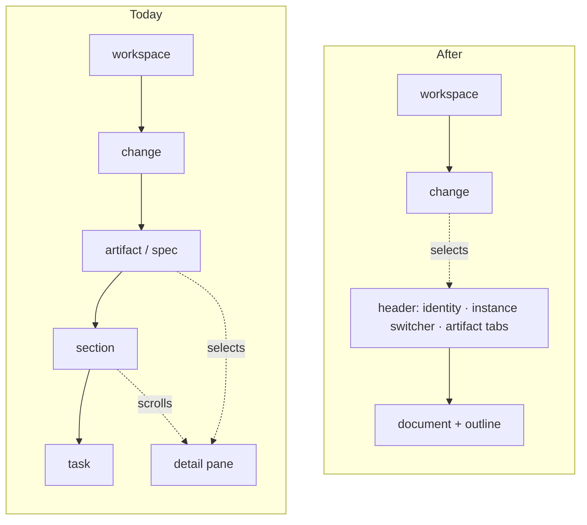

# Flatten the Sidebar and Move Artifact Navigation into the Header

## Why

The sidebar is a five-level tree: workspace, change, artifact, section, task. It was built for completeness, and completeness is what makes it heavy. One change routinely occupies eleven rows before its neighbour is visible, most of them naming things the reader is not looking for right now — the Specs folder, a capability, the Tasks folder, its sections.

The application already has two surfaces that navigate the same data without any of that depth. The **Archive reader** opens a change and then switches artifacts with a tab strip built from what exists on disk, with a worktree copy selector above it. The **terminal frontend**'s Browse screen is a flat workspace/change tree beside a detail pane with artifact tabs, and its tree has no section or task nodes at all. Three frontends read one service, and the live desktop tree is the only one that disagrees with the other two about where artifact navigation lives.

The depth also carries a disproportionate share of the `spec-browser` capability. Roughly a dozen of its forty-two requirements exist only to manage a deep tree: default expansion, persisted collapse overrides, the no-first-sight rule, auto-collapse of completed task groups, completion glyphs on section rows, presence treatment on artifact rows, progress on the Tasks node, leaf-task rendering, and five-level roving keyboard focus. Before 1.0 that surface is worth shrinking rather than polishing.

Routing already agrees with the move. An artifact address is a scope, a change id, an artifact kind and an optional capability — exactly what a tab strip selects. Sections and tasks were never addressable; they are a transient reveal, and the tree's reveal handle is the single thing `App.tsx` reaches into the tree for.

## What Changes

The sidebar becomes a two-level list. Everything below the change row moves into the detail pane's header, which grows from an identity line into the change's navigation, and the one thing the tree offered that no header can — an outline of the document — becomes a document feature beside the prose column.

- **The tree stops at the change.** A top-level row (repository group or flat workspace) contains its active changes and nothing beneath them. The change row keeps every mark it carries today — title and directory name, branch chip, progress meter, modification time, working-tree status, divergence label, favourite toggle, completion glyph — because none of it depended on depth. Clicking a change selects it and opens its first present artifact; the artifact, section and task node kinds cease to exist.

- **A change living in several worktrees is one row.** The disclosure parent with one child per instance is replaced by a single row carrying an instance count, and the instance is chosen in the header. This is the archive's copy-selection model applied to live changes, and it retires the singleton flattening-and-promotion rule, the instance row chrome and the active-instance indicator as tree concerns.

- **The header carries the change's navigation.** Below the identity line (`spec-browser`: *Change Identity Header in the Detail Pane*) the header gains an **instance switcher**, rendered only when the change has more than one rendered instance and naming each by worktree with its branch chip and divergence label, and an **artifact tab strip** offering Proposal, Design, Tasks and one tab per capability spec — only those present on disk, exactly as the archive reader already does. The Tasks tab carries the progress meter the Tasks tree node carried. Tabs are keyboard-operable as a tab list with Left and Right, mirroring the terminal frontend's artifact tabs. Selecting a tab is a navigation: it writes the same artifact address a tree click writes today, so history, deep links and reader windows are unchanged.

- **The archive reader shares that header.** Today it stacks its own header, a copy row and a tab strip above the detail pane's identity line. It becomes the same header in a read-only variant: no branch chip (unchanged policy), the copy selector standing where the instance switcher stands, and a back control. One consequence is deliberate: the archive identity is now flush with the top of the pane, so it takes the same macOS titlebar clearance the live header takes, reversing the sentence in *Read-Only Artifact Navigation* that exempted it.

- **A document outline replaces section and task nodes.** The shared document view gains an outline built from the rendered document's headings, placed beside the prose column and hidden when the pane has no room beside it — the `full` reading-width rung, a narrow reader window, a narrow pane. For a tasks document each heading shows its section's done count, taken from the section model the aggregation already parses, so the tree's per-section progress survives; individual task lines are reached by scrolling within their section, not from the outline. Activating an entry scrolls the document by the source line the renderer already stamps on every block, so the existing anchor path is reused. Because the outline needs heading anchors, fragment-only links — inert today, "reserved for future in-app navigation" — become live within the document they appear in.

- **The outline appears in reader windows.** The reader window surface forbids anything that navigates to another document; an outline navigates within the one document the window shows and does not violate that, but the spec is silent on it and will say so explicitly.

- **Retired outright.** Section and task scroll anchors as tree behaviour; default expansion of tree nodes; persisted collapse state and its override sets; the no-first-sight auto-expansion rule; auto-collapse of completed task groups; the section-row completion glyph; artifact-row presence treatment; Tasks-node progress; leaf-task completion rendering. Keyboard navigation of the tree is rewritten for two levels.

- **Routing grammar is unchanged.** No address gains or loses a segment. *Navigation Reveal Is Transient* simplifies: revealing an address means expanding its workspace row and selecting its change row, and with no persisted collapse sets there is nothing a reveal could accidentally write. The selection union `TreeSelection` shrinks from nine variants to three, which also removes the silent `default: return null` the frontend guide warns about in `scrollAnchorForSelection`.

- **BREAKING (spec-level, user-visible):** a user can no longer jump to a specific task line from the sidebar, and the tree's per-row collapse memory is discarded. Both are replaced by the outline and by a tree shallow enough not to need memory.

## Capabilities

### New Capabilities

- `document-outline`: a heading-derived outline of the document on every shared reading surface — the detail pane, the file-browser preview and reader windows — placed beside the prose column, hidden when there is no room beside it, showing per-section progress for a tasks document, and scrolling by source line. Owns the rule that makes fragment links live within a document.

### Modified Capabilities

- `spec-browser`: *Workspace Tree Hierarchy* becomes two levels with a single row per logical change; *Change Identity Header in the Detail Pane* is extended with the instance switcher and the artifact tab strip; *Workspace Tree Keyboard Navigation* is rewritten for two levels plus a tab list; *Link Handling in Rendered Artifacts* stops declaring fragment links inert. Retired: *Section and Task Scroll Anchors*, *Default Expansion of Tree Nodes*, *User Collapse State Persists Across Sessions*, *Tree Expansion Has No First-Sight Auto-Expansion Effect*, *Auto-Collapse of Completed Task Groups*, *Completed Section Row Shows a Completion Glyph*, *Artifact Row Presence Treatment*, *Tasks Artifact Node Progress*, *Leaf-Task Completion Rendering*, *Singleton Logical-Change Flattening and Promotion*, *Instance Row Chrome*, *Active-Instance Indicator*; *Per-Instance Divergence Label* moves from the instance row to the instance switcher.
- `archive-browser`: *Read-Only Artifact Navigation* renders through the shared header rather than its own chrome; the titlebar-clearance exemption is reversed; the copy selector is the shared instance switcher in its read-only form.
- `reader-window`: *Reader Window Surface* states that within-document navigation — the outline and fragment links — is permitted, and that the outline is subject to the same hide-when-narrow rule as the pane.
- `view-routing`: *Navigation Reveal Is Transient* is restated against a tree with no persisted collapse sets and a reveal that stops at the change row.

`terminal-ui` is unchanged: it already has this shape and is the model for it.

## Impact

**Frontend only.** No Rust changes and no new IPC: artifact presence and per-section task counts already cross the boundary in `ChangeData`, and the instance switcher reads the same `ChangeInstance` list the tree renders today. The desktop app and the served web UI change together because they are one bundle.

- `src/components/WorkspaceTree.tsx` (2,109 lines) loses the artifact, spec, section, task and instance node components, the collapse persistence, the default-expansion logic and most of the keyboard model. What remains is a two-level list.
- `src/types.ts`: `TreeSelection` shrinks to workspace, repository and change variants.
- `src/App.tsx`: `scrollAnchorForSelection`, `repoIdForSelection` and `renderTargetForSelection` lose their deep arms; `addressToNodePath` and the reveal effect simplify; the artifact tab strip and instance switcher write addresses through the existing `go`.
- `src/components/DetailPane.tsx`: the identity header grows the instance switcher and tab strip and gains a read-only variant for the archive.
- `src/components/ArchiveView.tsx`: drops its own header, copy row and tab strip in favour of the shared header.
- `src/components/DocumentView.tsx` and `MarkdownView.tsx`: heading collection for the outline, fragment-link activation, outline placement beside the column.
- `src/App.css`: tree depth styles retire; header and outline styles arrive.
- `src/routing/resolve.ts` and its tests: node-path derivation stops below the change.

**Persisted state.** The stored collapse and expand override sets in settings become unread. They are left in place and ignored rather than migrated, per the same tolerance `document-width` shows an unrecognised value.

**Testing.** This diff touches no gated crate, so the mutation job short-circuits green. Coverage comes from TypeScript tests: the flattened row model, tab derivation from artifact presence, outline derivation from headings with per-section progress, the narrow-pane hide rule, and the shrunken selection switches.

**Deliberately unchanged.** The address grammar and codec. The workspace file browser, which a top-level row still opens. The commit rail. The dashboard's ship links, which already resolve to an artifact address. Favourite ordering and identity. Working-tree status indicators, which live on rows that survive. The terminal frontend.

**No change is in flight** at the time of writing, so nothing needs a rebase.
