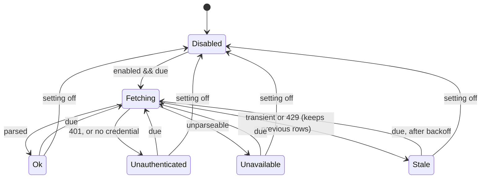
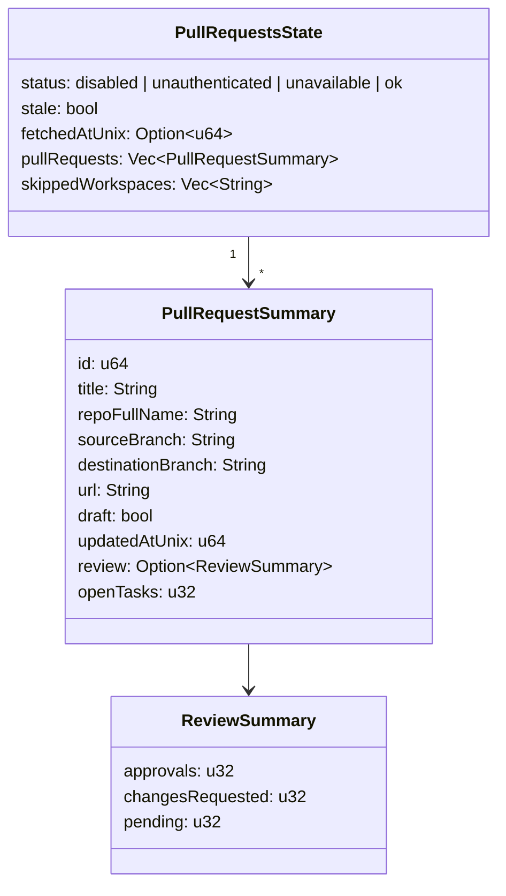

## Context

The application has two opt-in network features today, the Claude and ChatGPT usage-quota gauges, and they set the pattern this change follows: a `std::thread` poll loop in `openspec-app` that re-reads an enabled flag every two seconds, refreshes on a floored interval, honours `Retry-After`, keeps the last snapshot on a transient failure, and announces a changed snapshot with a payload-less `CacheEvent` that every frontend maps to a re-read. `usage_http.rs` holds the one blocking GET both pollers share, built on `ureq` 3 with `http_status_as_error(false)` so a 429's header stays readable.

There is no panel system. `App.tsx` places the sidebar's contents and the commit rail by hand inside a three-slot `SplitPane`; the quota pills are the nearest thing to a data widget living in a side pane. Pane *visibility* is `localStorage` view state by spec; the reading width is the precedent for a layout preference that is an application setting with a dedicated change event on both transports.

Settings are one plaintext JSON file in the shared config directory, loaded in one piece with a fall-back to complete defaults when the parse fails — which is why `DocumentWidth` carries a hand-written tolerant `Deserialize`. There is no keyring dependency. Every setting has its own get/set command pair, registered in four places (`api.ts`, `commands.rs`, `lib.rs`, `dispatch.rs`), and the browser skin is the same bundle served over HTTP, reachable over loopback, a trusted Tailscale name, or an explicitly requested non-loopback bind.

The artifex CLI's `pr mine` is the reference implementation of the fetch: it is GET-only, resolves the account's UUID from `GET /user`, enumerates `GET /user/workspaces`, lists `GET /workspaces/{ws}/pullrequests/{uuid}` per workspace with the `fields=+values.participants,+values.reviewers` partial-response parameter (each `+` URL-encoded, or it decodes as a space and matches nothing), skips a workspace answering 403 or 404, and merges newest-updated first. Its review summary excludes the author's own approval and counts pending reviewers from `reviewers[]` against `participants[]`.

## Goals / Non-Goals

**Goals:**

- A read-only list of the configured account's open, authored pull requests across every workspace it belongs to, refreshed in the background and rendered in a side-pane slot the user chooses.
- Credentials configured in-app, stored with the other settings, never readable back through any command on any transport.
- The same posture the quota pollers have: off by default, no network while off, one request chain per interval, backoff on 429, stale-not-blank on transient failure, defensive parsing.
- The pure parts — URL building, classification, parsing, review summary, merge, position deserialize, URL check — separable and tested, so the mutation gate on `openspec-app` has assertions to catch.
- Desktop and browser skin at parity from one bundle; the terminal's settings mirror kept complete.

**Non-Goals:**

- Pull-request actions of any kind; a "needs my review" list; build and conflict signals; matching PR branches to worktrees; a keyring; a fifth pane or a new pane-visibility toggle; a terminal-frontend list; concurrency across workspaces.

## Decisions

### D1. The poller is a twin of `quota.rs`, in `openspec-app`

`crates/openspec-app/src/bitbucket.rs` holds a `PullRequestsHandle(Arc<Mutex<PullRequestsState>>)`, a `run_poller` that wakes every `TICK` (2 s), re-reads `settings.bitbucket_enabled()`, refreshes every `max(refresh_secs, MIN_REFRESH_SECS)` with `MIN_REFRESH_SECS = 60` and a default of 120, defers on 429 by `Retry-After` or 300 s, and emits `CacheEvent::PullRequestsUpdated` only when the snapshot changed. `spawn_poller` runs it on a plain `std::thread`, so the Tauri runtime and the standalone web server start it the same way the quota pollers are started.



*Rejected — fetch from the webview with `fetch()`.* The CSP is `null`, so it would work, but the token would live in JavaScript, the browser skin would need its own copy of the recipe, and the terminal and the standalone server would have no path to the data at all. The architecture rule is that anything stateful more than one frontend needs lives in `openspec-app`.

*Rejected — an async client (`reqwest`).* Already in the lock file transitively, but it drags an async HTTP stack into a crate that is deliberately runtime-agnostic. The blocking `ureq` poller is the established shape.

### D2. Credentials in `settings.json`, write-only, env-overridable

`AppSettings` gains a `bitbucket: BitbucketConfig { enabled, username, api_token, refresh_secs, panel_position }`, all `#[serde(default)]`. `SettingsStore` exposes `bitbucket_enabled()`, `bitbucket_panel_position()`, `bitbucket_refresh_secs()`, a `bitbucket_credentials()` that is `pub(crate)` and consulted only by the poller, and a public `bitbucket_config_view()` returning `BitbucketConfigView { enabled, username, token_set: bool, refresh_secs, panel_position }` — the only shape any command returns. `set_bitbucket_credentials(username, api_token)` replaces both; an empty token clears it.

Resolution order in the poller: `BITBUCKET_USERNAME` + `BITBUCKET_API_TOKEN` from the environment when both are set, else the stored pair, else *Unauthenticated*. The environment names are the artifex ones, so one shell profile serves both tools.

The token travels only in a `Authorization: Basic base64(username:token)` header to `https://api.bitbucket.org/2.0/…`, is never formatted into a log line, and `proxy(None)` is kept so it never routes through an ambient proxy.

*Rejected — an OS keyring.* A new dependency, a macOS Keychain prompt on every launch, and no secret service on the headless Linux boxes `specforge-serve` runs on. The Claude quota feature already reads a plaintext credentials file; storing one in the user-only config directory is the same class of exposure the settings file already carries.

*Rejected — environment variables only, as artifex does.* A Dock-launched desktop app never sees a shell profile, so the feature would be unconfigurable on the desktop.

*Rejected — a getter that returns the token so the Settings field can be pre-filled.* Every getter is served over `/api/invoke`; on a Tailscale or non-loopback bind that is a token read for anyone who can reach the page. The field shows a placeholder when `token_set` is true and is replaced, never edited.

### D3. The fetch recipe is artifex's, sequential, capped per workspace

Three GETs in order, all through a widened `usage_http::get` that accepts an `Authorization` value:

$$\text{requests per refresh} = 2 + W$$

where $W$ is the number of workspaces the account belongs to, because each workspace is fetched as one page of `pagelen=50` and the list is not paginated further. The workspace listing itself is requested at `pagelen=100` and its `next` link is followed, bounded to five pages and only back to the official API, so the enumeration is complete for any realistic account; BitBucket's default page of ten would otherwise silently truncate it. BitBucket's per-user hourly budget is far above $60 \cdot (2 + W)$, so the floor alone keeps the poller safe.

Per-workspace URL: `/workspaces/{ws}/pullrequests/{uuid}?state=OPEN&sort=-updated_on&pagelen=50&fields=%2Bvalues.participants%2C%2Bvalues.reviewers%2C…`. `build_pull_requests_url` is a pure function that percent-encodes through `percent-encoding` (already a dependency) and has a test asserting the literal `%2B`. A workspace answering 403 or 404 is added to `skipped_workspaces` by slug and the rest continue; a 401 anywhere, or a 403 on `/user` or `/user/workspaces` (the token exists but lacks the account or workspace-membership read scope — the common misconfiguration, which the reference implementation also singles out), makes the whole snapshot *Unauthenticated*; any other non-2xx or a transport error makes it *Stale* (or *Unavailable* when there is nothing to keep).

The account identity is `uuid` when present, else `account_id`, as artifex resolves it, and is re-resolved on every refresh rather than cached, so a changed credential takes effect at the next refresh without a restart.

*Rejected — concurrency across workspaces.* Four threads for a list that is typically one to three workspaces, inside a poller that already runs off the UI thread; sequential is simpler and its ordering is deterministic for tests.

*Rejected — draining every page.* `pr mine` has `--limit` for the same reason; a panel showing 50 open authored PRs per workspace is already past what it is for.

### D4. The snapshot is a flat, pre-summarised row list



The review summary is computed in Rust by a port of artifex's `summarizeReview` — a pure function over the raw participants and reviewers that excludes the author's own approval and matches accounts by `account_id`, falling back to `uuid` — and is `None` when the response carried no `participants`, so "unknown" stays distinct from "none". `updated_on` is parsed to epoch seconds with the `chrono` path `quota.rs` already uses, so each frontend renders a relative time without re-parsing. Rows are merged across workspaces and sorted by `updated_at_unix` descending in a pure `merge_newest_first`.

Both structs are `#[serde(rename_all = "camelCase")]` and join `wire_shape.rs`'s roots with every `Option` populated.

*Rejected — passing raw BitBucket objects through.* It would put the summarising logic in TypeScript, outside the mutation gate, and would ship `participants` arrays the panel never renders.

### D5. `CacheEvent::PullRequestsUpdated`, not a reused or direct-emitted event

The poller holds a `WatcherManager` clone and nothing else — no Tauri handle, no SSE channel — so, like the quota pollers, it announces through the cache stream. The new variant maps to `pull-requests-updated` in `event_envelope`, carries no payload, and the frontend re-reads through `get_my_pull_requests`.

*Rejected — reuse `QuotaUpdated`.* The two quota pills would re-fetch on every PR refresh and the panel on every quota refresh, and the name would lie.

*Rejected — a direct emit on the document-width pattern.* That pattern exists for events raised by a *command*, which has the transport in hand. A background thread does not.

The cost is the one `crates/CLAUDE.md` warns about: every exhaustive `CacheEvent` match in three frontends — the forwarder, tray badge and glyph updaters, notifications, the TUI's `select!` — grows an arm that says what it ignores.

### D6. Position is a setting with a dedicated change event

`PanelPosition { LeftTop, LeftBottom, RightTop, RightBottom }`, `rename_all = "kebab-case"`, default `LeftBottom`, with the same hand-written tolerant `Deserialize` as `DocumentWidth` so an unknown value degrades to the default rather than resetting every other setting. `set_bitbucket_panel_position` persists and then emits `pull-request-panel-moved` with `{ position }` — `app.emit` on the desktop, the app-event channel on the web — so a second window or a connected browser re-seats the panel without reopening.

*Rejected — `localStorage`, like pane visibility.* The user asked for the position in the configuration; the reading width shows that a layout preference belongs in settings when it should follow the user between the desktop and the browser skin. Visibility stays where it is: this change does not move it.

*Rejected — a `{ side, edge }` pair.* Two fields for four values; a single enum mirrors into `src/types.ts` as one union and into the Settings control as one segmented choice.

### D7. Four insertion points, one component, bounded height

`App.tsx` renders `<PullRequestPanel />` at exactly one of four JSX positions chosen by the position it holds in state: above the workspace tree, between the tree and the Archive entrypoint, above the `GraphRail`, or below it. In the far pane the rail's column becomes a flex column so the rail keeps absorbing the remaining height. The panel renders nothing while the snapshot is *disabled*, so a disabled feature leaves the layout byte-identical to today.

The panel is a `<section>` with a header button (title, open count, a chevron) and a list with `max-height` bounded to a fraction of the pane and `overflow: auto`, so the sidebar footer entrypoints and the quota strips stay reachable at every viewport height they are reachable at today (`spec-browser`: *Master-Detail Layout*). Collapsed-or-expanded is per-viewer `localStorage` state — it is the same class as pane visibility, and a collapsed panel keeps its one-line header so the count is still visible.

```svg
<svg viewBox="0 0 560 260" xmlns="http://www.w3.org/2000/svg" font-family="system-ui" font-size="11">
  <rect x="8" y="8" width="150" height="244" rx="6" fill="none" stroke="currentColor"/>
  <text x="16" y="26">Dashboard</text>
  <rect x="14" y="34" width="138" height="18" rx="3" fill="none" stroke="currentColor" stroke-dasharray="3 2"/>
  <text x="20" y="47" opacity="0.6">left-top</text>
  <rect x="14" y="58" width="138" height="96" rx="3" fill="none" stroke="currentColor" opacity="0.4"/>
  <text x="20" y="72" opacity="0.6">workspace tree</text>
  <rect x="14" y="160" width="138" height="34" rx="3" fill="none" stroke="currentColor"/>
  <text x="20" y="173">▾ Pull requests · 3</text>
  <text x="20" y="187" opacity="0.6">left-bottom (default)</text>
  <text x="16" y="212">Archive · Settings</text>
  <text x="16" y="228" opacity="0.6">quota strips</text>
  <rect x="170" y="8" width="230" height="244" rx="6" fill="none" stroke="currentColor" opacity="0.4"/>
  <text x="250" y="130" opacity="0.6">detail pane</text>
  <rect x="412" y="8" width="140" height="244" rx="6" fill="none" stroke="currentColor"/>
  <rect x="418" y="16" width="128" height="18" rx="3" fill="none" stroke="currentColor" stroke-dasharray="3 2"/>
  <text x="424" y="29" opacity="0.6">right-top</text>
  <rect x="418" y="40" width="128" height="170" rx="3" fill="none" stroke="currentColor" opacity="0.4"/>
  <text x="424" y="54" opacity="0.6">commit rail</text>
  <rect x="418" y="216" width="128" height="18" rx="3" fill="none" stroke="currentColor" stroke-dasharray="3 2"/>
  <text x="424" y="229" opacity="0.6">right-bottom</text>
</svg>
```

*Rejected — a fifth `SplitPane` slot or its own pane.* A new pane needs its own divider, toggle, restore affordance, keyboard binding, View-menu item and width persistence; the panel is a list of a handful of rows.

*Rejected — a position-agnostic "dock" registry.* One component in four places is the whole requirement; a registry is a framework for a second panel that does not exist.

### D8. Opening a pull request never grants a general open-URL capability

On the desktop, `open_pull_request { url }` is a Tauri command whose service half, `AppService::open_pull_request`, refuses any URL that is not the `url` of a row in the *current* snapshot, then hands it to `tauri-plugin-opener`'s Rust API. The frontend gains no way to open an arbitrary URL, which is the same line `open_artifact_link` holds. The command has **no** arm in `dispatch.rs`: the web transport must not expose an operation that opens a URL on the serving host (`web-ui`: *Link Handling in the Browser Skin*). In the browser skin a row is an anchor with `target="_blank" rel="noopener noreferrer"`, the rule rendered markdown links already follow.

*Rejected — reuse `open_artifact_link`.* It resolves an href against a workspace root and classifies it; a PR URL has no root and would be an external link smuggled through the artifact path.

### D9. The terminal frontend gets the toggle and nothing else

`SETTINGS_TOGGLE_COUNT` becomes 3; the row reads and writes `bitbucket.enabled` through the shared store like the two quota toggles. The terminal does not spawn the poller and renders no list, and the spec says so, so the omission is never "fixed" by reflex. The toggle acts on the shared settings file, which the desktop and the standalone server read at launch.

*Rejected — leave the terminal untouched.* Its Settings screen is specified as the complete set of toggles the shared settings carry; a third shared toggle missing from it would be the first divergence.

*Rejected — a terminal list screen.* Deferred; it needs its own `Model` field, `Msg`, screen and key bindings and is worth its own change once the desktop panel has settled.

### D10. `usage_http` grows an authorization parameter rather than a sibling module

`usage_http::get(url)` becomes `get(url, auth: Auth)` where `Auth` is `Bearer(&str) | Basic { username, token }`; the two quota callers pass `Bearer`. `classify` is extended so 403 and 404 can be told apart from other transient statuses by the caller that needs to (`Verdict::Forbidden`, `Verdict::NotFound`), while the quota pollers keep treating both as transient. The `base64` crate gains a direct edge in `openspec-app`'s `Cargo.toml`; it is already resolved in `Cargo.lock`.

*Rejected — a `bitbucket_http.rs` twin.* The module note explains that `usage_http` exists precisely so the ureq-3 status posture lives once.

## Risks / Trade-offs

- **The token is plaintext at rest** → the settings file lives in the user-only config directory beside a plaintext Claude credentials file the app already reads; no command returns it; it is never logged; an operator who wants it out of the file uses the environment override.
- **A credential set from the browser skin travels over HTTP once** → on loopback and Tailscale that is local or encrypted; on an explicit non-loopback bind it is the trade the operator already made, and the Settings section says so in one sentence.
- **BitBucket changes a response shape** → the parser is defensive: a missing field yields `None`/zero, an unparseable body yields *Unavailable*, never a panic; tests pin both.
- **An `+` in `fields` reaches the wire unencoded and the review cell silently reads "none"** → the URL builder is pure and a test asserts `%2B`; `review` is `Option` so a missing `participants` renders as "unknown", not zero.
- **A rate-limit storm from a tiny interval** → `MIN_REFRESH_SECS = 60` floors the setting; 429 defers by `Retry-After` or 300 s; requests per refresh is $2 + W$.
- **The panel pushes the sidebar footer off a short viewport** → bounded `max-height` with internal scroll, verified in the smoke by checking the Settings entrypoint's bounding box at a short viewport with 20 rows.
- **A new `CacheEvent` variant silently falls into a wildcard somewhere** → the arms are enumerated in tasks; `cargo build` fails on any exhaustive match that was not updated, and the frontend guide's rule against wildcards applies.
- **The mutation gate flags the poller loop** → the loop is thin and delegates to pure functions; anything left as a survivor is excluded with a written reason in `.cargo/mutants.toml`, as the quota pollers' loops are.
