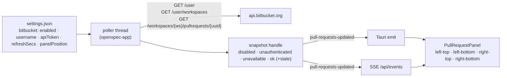

# BitBucket Pull-Request Panel in the Sidebar

## Why

SpecForge shows every change a developer has in flight, in every worktree, but not the pull requests that ship them. Today "which of my PRs are open, and which of them need me?" is answered in a terminal (`af bb pr mine` in the artifex CLI) or in a BitBucket browser tab, neither of which sits beside the tree of changes the PRs are for. The artifex implementation already proves the read-only recipe — resolve the account, enumerate its workspaces, list its authored pull requests per workspace with review state folded into the same response — so what remains is to bring that list into the window where the work lives.

## What Changes

A new opt-in **BitBucket pull requests** feature: a background poller in the headless app layer that lists the pull requests the configured account authored across every workspace it belongs to, and a compact panel that renders them in one of four slots at the top or bottom of either side pane. Which slot is a persisted setting, alongside the API credentials and the refresh interval.

- **Opt-in, off by default.** A `bitbucket.enabled` setting gates everything: while it is off no credential is read and no request is made, the same posture the two usage-quota pollers already hold. Enabling starts the poller; disabling stops it and removes the panel within one poller tick.

- **Credentials live in the application settings, write-only.** The username (or email) and a BitBucket-specific API token are stored in the same settings file every frontend shares. No command returns the token: the configuration getter reports only whether one is set, so a browser skin reachable over Tailscale can never read it back. `BITBUCKET_USERNAME` / `BITBUCKET_API_TOKEN` environment variables override the stored pair, so a headless `specforge-serve` can run without touching the settings UI. The Settings copy says plainly that a Jira or Confluence token will not work against BitBucket Cloud, and links to where a BitBucket token is minted.

- **One read-only fetch recipe, ported from artifex.** `GET /user` for the account, `GET /user/workspaces` for its workspaces, then `GET /workspaces/{ws}/pullrequests/{uuid}` per workspace with `state=OPEN`, `sort=-updated_on` and the `fields` partial-response parameter that adds `participants` and `reviewers` back to the list response. A workspace the token cannot read (403 or 404) is skipped and named in the snapshot; every other failure degrades the snapshot rather than blanking it. The removed `/pullrequests/{user}` endpoint is never called.

- **Review state comes free; merge signals do not, and are out of scope.** Each row shows approvals (excluding the author's own), changes requested, reviewers who have not responded, and the open-task count — all from the list response. Build statuses and conflicts, which cost two extra requests per PR, are deliberately not fetched.

- **The panel.** A collapsible section with a heading, the open count, and one row per pull request: repository, title, source and destination branch, the review cell, open tasks, a draft marker, and a relative updated time. Newest-updated first. Activating a row opens the PR's web page — through the desktop opener on the desktop, in a new opener-isolated tab in the browser skin. When the account is unauthenticated, when BitBucket is unavailable, and when the list is empty, the panel says so in one quiet line; a snapshot served after a transient failure is shown de-emphasised as stale. The panel's height is bounded and it scrolls internally, so the sidebar footer entrypoints and the quota strips stay on screen at every viewport height they are reachable at today.

- **Panel position is a setting, not view state.** `panelPosition` is one of `left-top`, `left-bottom`, `right-top`, `right-bottom`; the default is `left-bottom`, between the workspace tree and the Archive entrypoint. It is chosen in Settings, persists across restarts, applies in both the desktop and the browser skin, and a change reaches windows already open through a dedicated event, exactly as the reading width does. A panel placed in a side pane hides and shows with that pane. Collapsed-or-expanded is per-viewer view state, like pane visibility.

- **A new cache event, `pull-requests-updated`.** Payload-less like `quota-updated`; the frontend re-reads the snapshot through `get_my_pull_requests`. Because it is a `CacheEvent` variant, every exhaustive consumer of that stream in three frontends grows an explicit arm.

- **Terminal frontend: the toggle, not the panel.** The TUI's Settings screen gains a third toggle row for the opt-in so the terminal's settings mirror stays complete, but the terminal neither starts the poller nor renders a list. That is a deliberate deferral, recorded in the spec.

## Capabilities

### New Capabilities

- `bitbucket-pull-requests`: the opt-in feature end to end — the setting and its credentials, the read-only fetch recipe and the review-state summary, polling with caching and backoff, the snapshot and its event, the panel's rows and states, the position setting and its delivery, how a pull request is opened on each transport, and the privacy posture.

### Modified Capabilities

- `spec-browser`: adds *Side Panes Host the Pull-Request Panel* — the four slots, the bounded height that keeps the sidebar footer reachable, and the rule that a slotted panel hides with its pane.
- `terminal-ui`: *Terminal Settings Screen* gains the BitBucket pull-requests opt-in as a third toggle row, with the explicit statement that the terminal does not poll or render the list.

## Impact

**Cross-cutting: two library crates, three frontends, one bundle.**

- `crates/openspec-core/src/watcher.rs`: `CacheEvent::PullRequestsUpdated`. Every exhaustive match over `CacheEvent` — the Tauri forwarder, the tray badge and glyph updaters, the notification dispatcher, the TUI's `select!` mapping, `event_envelope` — gains an arm; no wildcard.
- `crates/openspec-app/src/settings.rs`: a `bitbucket: BitbucketConfig` block (`enabled`, `username`, `api_token`, `refresh_secs`, `panel_position`) with the tolerant-deserialize treatment `DocumentWidth` has, and accessors that never hand the token to a caller outside the poller.
- `crates/openspec-app/src/bitbucket.rs` (new): the request recipe, the defensive parser, the review summary, the merge-and-sort, and the poller — modelled line for line on `quota.rs`, with the pure parts separable so the mutation gate has assertions to catch. `usage_http.rs` is widened to carry a Basic `Authorization` header and a query string.
- `crates/openspec-app/src/events.rs`: `pull-requests-updated` (from the cache stream) and `pull-request-panel-moved` (direct emit, carries the position, both transports).
- `crates/openspec-app/src/service.rs`: the handle, `spawn_bitbucket_poller`, `my_pull_requests`, and the snapshot-scoped URL check `open_pull_request` relies on.
- `crates/openspec-app/tests/wire_shape.rs`: the new snapshot and config roots.
- `crates/specforge/src/commands.rs`, `lib.rs`: `get_bitbucket_config`, `set_bitbucket_enabled`, `set_bitbucket_credentials`, `set_bitbucket_panel_position`, `get_my_pull_requests`, and the desktop-only `open_pull_request`; the poller is spawned beside the quota pollers.
- `crates/specforge-web/src/dispatch.rs`, `sse.rs`, `main.rs`: arms for every command **except** `open_pull_request`, which the web transport must not expose (`web-ui`: *Link Handling in the Browser Skin*); the position event on the app-event channel; the poller spawned in the standalone server.
- `crates/specforge-tui/src/app.rs`, `ui.rs`: `SETTINGS_TOGGLE_COUNT` becomes 3 and the toggle row is rendered and handled.
- `src/types.ts`, `src/api.ts`: the mirrored shapes, the six wrappers, the two event names.
- `src/components/PullRequestPanel.tsx` (new), `src/App.tsx`, `src/components/GraphRail.tsx`, `src/components/SettingsView.tsx`, `src/App.css`: the panel, its four insertion points, the Settings section, and the styles.
- `crates/openspec-app/Cargo.toml`: a direct edge to `base64` (already in `Cargo.lock` transitively) for the Basic credential.
- `crates/CLAUDE.md`: the sentence naming the quota pollers as the app's only runtime network calls becomes untrue and is corrected.

**Persisted state.** A settings file written by this version carries a `bitbucket` block; an older version ignores it and drops it on its next write, the accepted trade `document-width` records. A file without the block loads with the feature off.

**Testing.** Both gated crates change, so the mutation job runs. The URL builder (including the encoded `+` in `fields`), the status classifier, the response parser, the review summary, the cross-workspace merge, the position enum's tolerant deserialize and the snapshot-scoped URL check are pure functions with their own tests. The panel's row model and state rendering are covered by TypeScript tests.

**Deliberately unchanged.** No pull-request *actions* (approve, merge, comment) — the feature is read-only on every transport. No "needs my review" list. No build or conflict signals. No matching of a PR's branch to a worktree in the tree, although the snapshot carries the source branch so a later change can. No new pane or pane-visibility toggle: the panel lives inside the two side panes that exist. No keyring: the token is stored as the settings file stores everything else. No change to the address grammar, the commit rail's data, the dashboard, or the reader windows.
