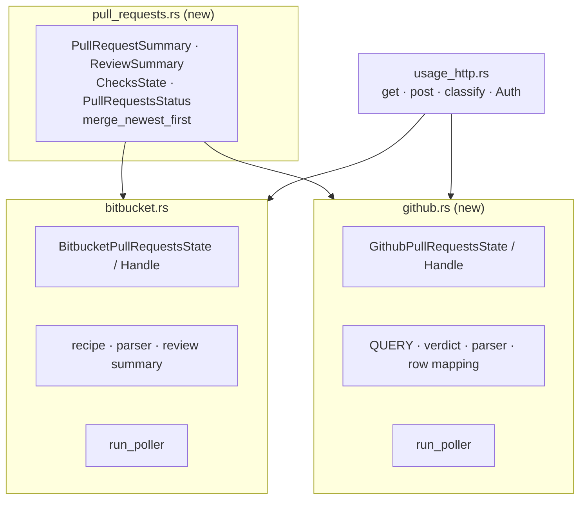
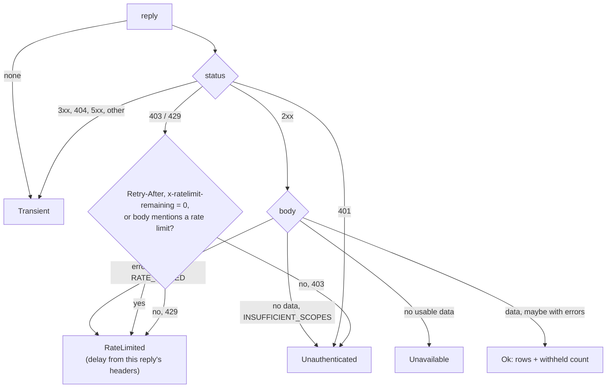
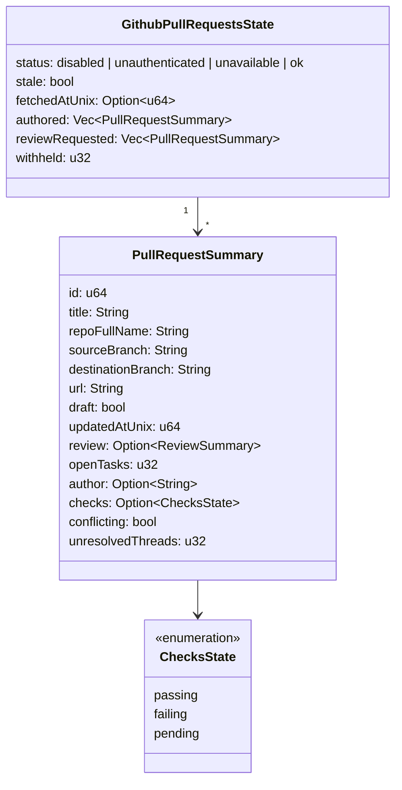

## Context

The BitBucket pull-request panel (archived as `2026-09-22-bitbucket-pull-requests-panel`) established the whole shape this change reuses: a `std::thread` poller in `openspec-app` that re-reads an enabled flag every two seconds, refreshes on a floored interval, backs off on 429, keeps stale rows on a transient failure, and announces a changed snapshot through a payload-less `CacheEvent`; a write-only credential in `settings.json` with an environment override; a snapshot-scoped `open_pull_request` on the desktop and an opener-isolated anchor in the browser skin; one `PullRequestPanel` component placed at one of four JSX insertion points by a persisted `PanelPosition`.

Most of that is already provider-neutral. `usage_http` carries `Auth::Bearer`; the panel's row model, relative time, collapse persistence and states never mention BitBucket beyond three message strings; `PanelPosition` lives in `settings.rs`, not in `bitbucket.rs`. What is BitBucket-bound is the fetch recipe, the parser, the settings block, and a handful of names — the event `pull-requests-updated`, the getter `get_my_pull_requests`, `CacheEvent::PullRequestsUpdated`, `PullRequestsState` — that say "pull requests" and mean BitBucket.

The codebase has a precedent for a second provider of the same kind of feature: `chatgpt_quota.rs` is a deliberate structural twin of `quota.rs`, not a shared abstraction, because only the ~50-line poll loop was genuinely common. The user chose twin panels over one merged panel for the same reason: two independent features, each with its own switch, credential and slot.

GitHub's API was probed against a live account before writing this. One GraphQL request returned the viewer's open authored pull requests and the open pull requests awaiting the viewer's review, each with review decisions, outstanding review requests, the latest commit's check rollup, mergeability and review threads, at a cost of **4** points of the **5,000**-point hourly GraphQL budget. The same probe showed two behaviours the design must absorb: mergeability read `UNKNOWN` on first request and `MERGEABLE` on the next (GitHub computes it lazily), and the review-requested row's author was the Copilot coding agent, a bot.

## Goals / Non-Goals

**Goals:**

- A read-only GitHub panel listing the viewer's open authored pull requests and those awaiting their review, with checks, conflicts and unresolved conversations, refreshed in the background with one request.
- The BitBucket feature's posture unchanged in kind: off by default, no network while off, write-only credential, stale-not-blank, defensive parsing, no general open-URL capability, no web `open_pull_request`.
- The two panels independent in switch, credential, position and collapse state, yet sharing the component, the row type and the open command.
- Names that are honest about their provider.
- The workspace tree and the commit graph never squeezed to nothing by stacked panels, without weakening the footer-visibility promise.
- Pure, separately tested functions for everything the mutation gate can reach: query constant, token resolution, verdict, parser, row mapping, merge, state transitions.

**Non-Goals:**

- Pull-request actions; GitHub Enterprise Server or `ghe.com`; OAuth device flow; live borrowing of the GitHub CLI's login; pagination beyond 50 per list; matching pull requests to worktrees (the follow-up change `link-pull-requests-to-worktrees`); a shared poller abstraction; a terminal list; any change to BitBucket's fetch recipe.

## Decisions

### D1. `github.rs` is a structural twin of `bitbucket.rs`; the row types move to `pull_requests.rs`



`github.rs` carries its own constants (`TICK`, `MIN_REFRESH_SECS = 60`, default 120, `DEFAULT_BACKOFF_SECS = 300`), `resolve_token`, `FetchResult`, `next_state`, `degrade_to_stale`, `is_news`, `refresh_due`, `run_poller`, `spawn_poller`, mirroring BitBucket's names so a reader who knows one knows the other. The row types every frontend renders move to a neutral `pull_requests.rs` so neither provider module owns the other's wire shape.

*Rejected — a `PullRequestProvider` trait with one generic poller.* The loop is the only common part; the failure classification (GitHub reads rate limits from headers and bodies), the snapshot (one list vs. two plus a withheld count) and the credential (a pair vs. a single token with a two-variable fallback) all differ, which is exactly the `chatgpt_quota.rs` finding. A trait would move 60 lines and add an abstraction the mutation gate must also cover.

*Rejected — GitHub support inside `bitbucket.rs`.* The module's name would lie, and every BitBucket test would sit beside GitHub branches.

### D2. One compile-time constant GraphQL query, sent by `POST`

```graphql
fragment Row on PullRequest {
  number title url isDraft updatedAt
  author { login }
  repository { nameWithOwner isArchived }
  headRefName baseRefName mergeable
  reviewRequests(first: 20) { totalCount }
  latestOpinionatedReviews(first: 20) { nodes { state author { login } } }
  reviewThreads(first: 100) { nodes { isResolved } }
  commits(last: 1) { nodes { commit { statusCheckRollup { state } } } }
}
query SpecForgePullRequests {
  viewer {
    pullRequests(states: OPEN, first: 50, orderBy: { field: UPDATED_AT, direction: DESC }) { nodes { ...Row } }
  }
  reviewRequested: search(query: "is:pr is:open archived:false review-requested:@me sort:updated-desc", type: ISSUE, first: 50) {
    nodes { ...Row }
  }
}
```

`const QUERY: &str` holds it verbatim; the request body is `{"query": QUERY}` serialised by `serde_json`, with no `variables`. A unit test asserts the constant starts with `fragment`/`query`, contains no `mutation` or `subscription`, and that the serialised body is identical across calls. Authored rows come from `viewer.pullRequests`, not from search, so they suffer no search-index lag; that connection has no archived qualifier, so archived repositories are filtered in the parser via `repository.isArchived`. There is no viewer field for review requests, so they come from search, where `review-requested:@me` includes team requests — what GitHub's own "Review requests" tab shows — and `archived:false` excludes archived repositories server-side.

$$\text{points per hour} = \frac{3600}{\text{interval}} \cdot 4 = \frac{3600}{120} \cdot 4 = 120 \ll 5000$$

*Rejected — REST.* `GET /search/issues` returns neither branches nor review state; each row would need its pull, reviews and check-runs endpoints, $$1 + 3N$$ requests per refresh, against the search API's separate 30-per-minute limit.

*Rejected — GraphQL variables.* Nothing varies; a query with no runtime input cannot be steered, and "byte-identical on every refresh" is a testable property.

### D3. `usage_http::post` beside `get`, with redirects off

`post(url, auth) -> RequestBuilder<WithBody>` carries the posture `get` carries — 15 s timeout, `http_status_as_error(false)`, `proxy(None)`, the `Authorization` header built only inside `Auth` — plus `max_redirects(0)`, so a 3xx comes back as a reply and is classified transient rather than followed. ureq 3 already drops the `Authorization` header on a redirect by default; turning redirects off as well means the request, its body and its credential only ever go to the one URL the spec names, and a POST is never re-sent somewhere else. The GitHub `send` adds `Content-Type: application/json`, `Accept: application/json` and the `SpecForge/<version>` `User-Agent` GitHub requires, and calls `.send(body)` with the serialised string.

*Rejected — ureq's `json` feature.* A new feature edge for one call whose body is a fixed string.

*Rejected — a `github_http.rs`.* `usage_http` exists so the ureq-3 status posture lives once; its module note already names every poller that relies on it and gains one line.

### D4. A GitHub verdict layered over `classify`, and a body check



`send` reads a `RateHeaders { retry_after, remaining, reset }` off **every** reply, and the body of every 2xx, 403 and 429 reply, because GitHub reports a GraphQL primary-limit hit as a 200 with the error in the body and the exhausted headers beside it, and a secondary limit as a 403 or 429 whose only signal may be its message. Two pure functions then decide:

- `rate_limit_delay(&RateHeaders, now_unix) -> Option<u64>` — `Retry-After`, else — only when `x-ratelimit-remaining` is `0` — $$\max(\text{reset} - \text{now}, 0)$$, else `None` so the loop's 300 s default applies. Used by every rate-limited outcome, whatever its status. GitHub attaches a reset to every reply, including a secondary-limit 403 whose primary quota is untouched; that reset dates the primary window, and honouring it would stall the panel for up to an hour where GitHub asks for a retry after a minute or so. `backoff` caps whatever results at one hour (the primary window's length), which is also what keeps a hostile `Retry-After: 18446744073709551615` from overflowing `Instant + Duration` and panicking the loop — a latent fault the BitBucket twin shared and now shares the fix for.
- `github_verdict(status, &RateHeaders, body, now_unix) -> FetchResult` — calls `usage_http::classify` for the status and refines it: a 403 or 429 with a rate-limit header, or whose body mentions a rate limit (case-insensitively, primary or secondary), is `RateLimited`; any other 403 is `Unauthenticated`; a 2xx is handed to `parse_response(body, &RateHeaders, now_unix)`, which returns `RateLimited` for a body error of type `RATE_LIMITED`, `Unauthenticated` for no data with an `INSUFFICIENT_SCOPES` error, `Unavailable` for no data otherwise, and `Ok` with rows and the withheld count when there is data.

`classify` itself is untouched, so the quota pollers and BitBucket keep their mapping.

A `data` object accompanied by `errors` is read: a `null` entry in either `nodes` array is dropped and counted in `withheld`. This is deliberately independent of the error messages, whose wording (for example, single-sign-on enforcement) is GitHub's to change.

*Rejected — teaching `classify` about rate-limit headers.* The BitBucket poller maps a 403 on its account resources to a credential problem by design; changing the shared verdict would silently shift that.

### D5. The widened row and the two-list snapshot



| Row field | GitHub source |
|---|---|
| `id` | `number` |
| `repoFullName` | `repository.nameWithOwner` |
| `sourceBranch` / `destinationBranch` | `headRefName` / `baseRefName` |
| `url` | `url`, kept only when it begins with `https://github.com/` |
| `updatedAtUnix` | `updatedAt`, RFC 3339, via the `chrono` path the other pollers use |
| `review.approvals` / `.changesRequested` | `latestOpinionatedReviews` in `APPROVED` / `CHANGES_REQUESTED`, excluding the author's login |
| `review.pending` | `reviewRequests.totalCount` |
| `checks` | `commits.nodes[0].commit.statusCheckRollup.state`: `SUCCESS` passing; `FAILURE`, `ERROR` failing; `PENDING`, `EXPECTED` pending; null none |
| `conflicting` | `mergeable == "CONFLICTING"` |
| `unresolvedThreads` | `reviewThreads.nodes` with `isResolved == false` |
| `author` | `author.login`, `None` for a deleted account |
| `openTasks` | always `0` (GitHub has no tasks) |

BitBucket rows set the four new fields to `None`, `None`, `false`, `0`, which the panel renders as nothing. A review-requested row whose `url` is already an authored row's is dropped, so a web URL is unique within the snapshot. Both lists are sorted with the shared stable `merge_newest_first`.

*Rejected — a separate `GithubPullRequestSummary`.* The panel would need two row renderers and the tested row model would fork.

*Rejected — carrying unresolved conversations in `openTasks`.* A BitBucket task is an explicit to-do; a GitHub thread is a conversation. One field meaning two things by provider is the naming lie D7 removes elsewhere.

*Rejected — `conflicting: Option<bool>` with `UNKNOWN` as `None`.* The probe showed `UNKNOWN` is the normal first read; a tri-state would flash "unknown" on every fresh row. Only the positive, known signal is worth a marker.

### D6. Token: stored, write-only, `GH_TOKEN` then `GITHUB_TOKEN`

`AppSettings` gains `github: GithubConfig { enabled, token: Option<String>, refresh_secs, panel_position }`, all defaulted — `refresh_secs` through `#[serde(default = "default_github_refresh_secs")]` (120), as BitBucket's is, since a bare `#[serde(default)]` would load a block missing the key at 0 — with `panel_position` reusing `PanelPosition`'s tolerant `Deserialize`, and a hand-written `Debug` that prints `token_set` rather than the token. `SettingsStore` exposes `github_enabled()`, `set_github_enabled()`, `github_refresh_secs()`, `github_panel_position()`, `set_github_panel_position()`, `set_github_token()` (trimmed; empty clears), a `pub(crate) github_token()` read only by the poller, and `github_config_view() -> GithubConfigView { enabled, token_set, refresh_secs, panel_position }`.

`resolve_token(env, stored)` is pure: `GH_TOKEN` if non-empty, else `GITHUB_TOKEN` if non-empty, else the stored token — the GitHub CLI's own precedence, so one shell profile serves both. The token travels as `Auth::Bearer`.

The Settings section links to `https://github.com/settings/personal-access-tokens/new` (fine-grained: Pull requests, Checks and Commit statuses read, plus the automatic Metadata read) and `https://github.com/settings/tokens/new` (classic: `repo`, and `read:org` for team review requests), and shows `gh auth token` as a copyable hint.

*Rejected — reading the GitHub CLI's login live.* A Dock-launched app gets launchd's `PATH`, which does not contain Homebrew's `gh`; the app repairs no `PATH`. Reading `gh`'s keychain item instead couples SpecForge to another tool's storage format.

*Rejected — a one-shot "import from gh" button.* Same path-probing problem, and in the browser skin it would read a credential off the serving host at a remote viewer's request. The copyable hint gives the same result with the user in the loop.

*Rejected — OAuth device flow.* It needs a registered OAuth app, token refresh and a sign-in UI; worth its own change if the token paste proves to be friction.

### D7. Provider names on everything provider-specific

| Before | After |
|---|---|
| `CacheEvent::PullRequestsUpdated` | `CacheEvent::BitbucketPullRequestsUpdated` (+ new `GithubPullRequestsUpdated`) |
| event `pull-requests-updated` | `bitbucket-pull-requests-updated` (+ new `github-pull-requests-updated`) |
| command `get_my_pull_requests` | `get_bitbucket_pull_requests` (+ new `get_github_pull_requests`) |
| `AppService::my_pull_requests` | `bitbucket_pull_requests` (+ new `github_pull_requests`) |
| `PullRequestsState` / `PullRequestsHandle` | `BitbucketPullRequestsState` / `BitbucketPullRequestsHandle` |
| `getMyPullRequests` / `onPullRequestsUpdated` | `getBitbucketPullRequests` / `onBitbucketPullRequestsUpdated` |
| `PanelMovedPayload { position }` | `PanelMovedPayload { provider, position }` |

`pull-request-panel-moved` stays one event: it is raised by a command that knows its provider, and a listener re-seats whichever panel the payload names. `open_pull_request` stays one command (D10).

*Rejected — keep the old names.* A reader of `pull-requests-updated` would reasonably expect it to cover GitHub; the repository's naming discipline exists to prevent exactly that.

*Rejected — keep the old names as aliases.* A permanent second name for an API a few weeks old, with no known consumer outside the bundled frontend, which moves in the same change.

### D8. One panel component, a provider adapter, pure section model

`PullRequestPanel` takes `provider: "bitbucket" | "github"`. A small adapter per provider supplies the getter, the event subscription, the header title ("BitBucket pull requests" / "GitHub pull requests", ellipsised when the pane is narrow), the messages, the collapse key (`specforge.pullRequestsCollapsed` unchanged for BitBucket, so existing collapse state survives; `specforge.githubPullRequestsCollapsed` for GitHub) and a pure `panelSections(snapshot)`: BitBucket yields one untitled section; GitHub yields "Yours" and "To review", dropping an empty one. The header shows one count for BitBucket and `authored · to review` for GitHub. The `<section>`'s `aria-label` names the provider, so two panels are two distinct landmarks.

The body stays **one scroll container**: the element that is the panel's direct flex child keeps today's `.pull-request-list` rules — `min-height: 0; overflow-y: auto; max-height: 40vh` — and the GitHub section headings and their row lists sit inside it, with no height cap of their own. A squeezed panel therefore still scrolls rather than clipping rows, and one panel never reaches two caps' worth of height.

The component also reports whether it is rendering anything through an `onPresenceChange(present: boolean)` prop, called when its snapshot moves into or out of the disabled state, so `App.tsx` knows which panes hold a panel (D9).

```svg
<svg viewBox="0 0 300 190" xmlns="http://www.w3.org/2000/svg" font-family="system-ui" font-size="11">
  <rect x="4" y="4" width="292" height="182" rx="6" fill="none" stroke="currentColor"/>
  <text x="14" y="22">▾ GitHub pull requests</text>
  <text x="236" y="22" opacity="0.7">1 · 1</text>
  <line x1="4" y1="30" x2="296" y2="30" stroke="currentColor" opacity="0.3"/>
  <text x="14" y="46" opacity="0.6" font-size="10">YOURS</text>
  <text x="14" y="62" opacity="0.7">acme/website</text>
  <text x="178" y="62" opacity="0.7">Draft</text>
  <text x="250" y="62" opacity="0.6">2mo</text>
  <text x="14" y="76">Replace the landing-page hero</text>
  <text x="14" y="90" opacity="0.7">new-hero → main</text>
  <text x="150" y="90" opacity="0.7">✓0 ✗0 ○0</text>
  <circle cx="220" cy="87" r="4" fill="currentColor"/>
  <text x="14" y="112" opacity="0.6" font-size="10">TO REVIEW</text>
  <text x="14" y="128" opacity="0.7">acme/api · copilot-swe-agent</text>
  <text x="250" y="128" opacity="0.6">3d</text>
  <text x="14" y="142">Add a rate-limit middleware</text>
  <text x="14" y="156" opacity="0.7">copilot/rate-limit → main</text>
  <text x="150" y="156" opacity="0.7">✓0 ✗0 ○1</text>
  <rect x="206" y="147" width="54" height="13" rx="3" fill="none" stroke="currentColor"/>
  <text x="211" y="157" font-size="9">Conflicts</text>
  <text x="14" y="176" opacity="0.5" font-size="10">checks dot · conflicts chip · conversations count when non-zero</text>
</svg>
```

The checks indicator is a small dot with `--passing` / `--failing` / `--pending` modifiers whose `title` and `aria-label` say the state in words; the conflict marker reuses the Draft chip's shape; unresolved conversations use a new `CommentIcon` from `./icons` beside the count, in the place the task count occupies. `panelSections`, `checksLabel`, `headerCounts` and `panelHeaderTitle(provider, snapshot)` (which carries the withheld line) are exported and unit-tested beside the existing row-model tests.

*Rejected — a `GithubPullRequestPanel` copy.* 300 lines duplicated for a header count and a section split.

### D9. Eight insertion points, stacking order, and a reserve by flex weight

`App.tsx` holds two positions, seeded from `getBitbucketConfig()` and `getGithubConfig()` and updated from `pull-request-panel-moved` by `payload.provider`, and two presence flags set by each panel's `onPresenceChange` (D8). Each of the four slots renders `bitbucket` then `github` when their positions match, so a shared slot stacks in a fixed order. The rail's flex-column wrapper appears when either panel is *positioned* in a rail slot, as today; the reserve applies only where a panel is *present*. Positions alone cannot decide it: on a default install both features are off and both positions are `left-bottom`, and that layout must stay byte-identical.

The modifier goes on the two elements that take the reserve, both of which `App.tsx` renders itself: `.sidebar-tree--reserve` on the `.sidebar-tree` div while a present panel sits in a sidebar slot, and `.rail-column-graph--reserve` on the `.rail-column-graph` div while a present panel sits in a rail slot. `.split-pane-left` belongs to `SplitPane.tsx`, which is not touched.

The reserve is expressed with flex weights rather than a minimum height. When the pane is short of space, flexbox takes the shortfall from each shrinkable item in proportion to its shrink factor times its basis, freezes an item that reaches its minimum, and redistributes the rest:

$$\text{share}_i = \text{shortfall} \cdot \frac{s_i \, b_i}{\sum_j s_j \, b_j}$$

Under the modifier, `.sidebar-tree` (and `.rail-column-graph`) become `flex: 1 1 20vh; min-height: 0`, and the panels become `flex: 0 1000 auto; min-height: 0`. With $$s_{\text{panel}} = 1000$$ against $$s_{\text{tree}} = 1$$ the tree's share of the shortfall while any panel can still shrink is roughly $$\frac{b_{\text{tree}}}{1000 \cdot \sum b_{\text{panel}}}$$ of it — measured at under 0.2 px in the smoke — so the panels yield first; once every panel is frozen at zero, the tree is the only shrinkable item left and takes the whole remaining shortfall, down to zero, so the footer entrypoints and quota strips — which do not shrink below their content — stay visible at every height they did before. A frozen panel is clipped whole, header included; that is the spec's "yielding is not collapsing". Without the modifier nothing in the pane but the panels can shrink (the tree's basis is 0 and the footer does not go below its content), so the panels' weight changes nothing there, and a pane with no present panel lays out as today.

**Why the tree's factor must stay ≥ 1.** The first implementation gave the tree a factor of $$10^{-5}$$ and left the panels at 1. It held the reserve, but at the shortest heights it pushed the footer off screen: when the factors of the items still able to shrink sum to less than one, flexbox distributes only that fraction of the shortfall (CSS Flexbox §9.7, "resolve the flexible lengths", step 4b) and the rest overflows. With every panel frozen, the tree alone carried $$10^{-5}$$ of the remaining shortfall. The browser smoke caught it at a 260 px pane; the weights above were then measured from 879 px down to 150 px with the footer inside the pane throughout.

Stacked panels need one hairline between them in every slot, not only the rail: today `.sidebar-header-button + .pull-request-panel` and `.rail-column > .pull-request-panel:first-child` assume a single panel, so a `.pull-request-panel + .pull-request-panel` rule sets the second panel's top border and suppresses a doubled one.

*Rejected — `min-height: 20vh` on the tree.* A hard minimum never yields, so at the shortest heights it would push the footer off screen and break the *Master-Detail Layout* promise.

*Rejected — one height cap shared by stacked panels.* The user chose that each panel keeps its own cap; the reserve protects the tree without touching the caps.

*Rejected — `:has(.pull-request-panel)` instead of a modifier class.* Older WebKitGTK builds on Linux lack `:has()`, and the presence flags already say the same thing.

*Rejected — keying the reserve on positions.* It would apply the reserve on every default install, where both features are off at `left-bottom`.

### D10. One `open_pull_request` over both snapshots

`AppService::open_pull_request(url)` accepts `url` when it is non-empty and equals the `url` of a row in `bitbucket.get().pull_requests`, `github.get().authored` or `github.get().review_requested`. The desktop command and the web transport's refusal are unchanged.

*Rejected — `open_github_pull_request`.* Identical semantics, another registration in four places, and a second command the web dispatch must remember not to expose.

### D11. The terminal gets a fourth toggle

`SETTINGS_TOGGLE_COUNT` becomes 4; the row reads and writes `github.enabled` through the shared store. The terminal spawns no GitHub poller.

*Rejected — leaving it out.* The terminal's Settings screen is specified as the complete set of shared toggles.

## Risks / Trade-offs

- **A classic token with `repo` can write** → SpecForge sends only the constant query, and a test pins that it contains no mutation; the Settings copy says so and recommends a fine-grained token where one owner suffices.
- **The shape of single-sign-on withholding is unconfirmed** → the parser counts `null` entries whatever the error text says, and a fixture pins that shape; confirming against an organisation with SAML enforcement is an open question below.
- **GitHub's rate-limit signalling changes** → `github_verdict` is pure and tested per branch; anything unrecognised is transient, never a credential problem, and the 300 s default applies.
- **Mergeability is computed lazily** → only `CONFLICTING` shows a marker, so the normal first-read `UNKNOWN` never flickers one.
- **More than 100 review threads undercount** → accepted; a pull request with that many conversations is already visibly in trouble.
- **Search-index lag on review requests** → seconds to a minute, below the two-minute cadence.
- **A fine-grained token without Checks or Commit statuses read** → the rollup comes back null (or withheld), which renders as no checks indicator, not as an error.
- **The renames break an external `/api/invoke` caller of `get_my_pull_requests`** → none is known; the release notes name the rename, and a dispatch test pins that the old name is unknown.
- **Both panels default to `left-bottom`** → intentional, so a newly enabled panel is visible without hunting; the reserve keeps the tree usable, and the smoke measures it at 800 px.
- **BitBucket-only users see the reserve too** → a small, intended improvement: the one-panel layout could also starve the tree on short windows.
- **The token is plaintext at rest** → the same class of exposure as the BitBucket token and the Claude credentials file; the environment override keeps it out of the file.
- **The mutation gate flags the poller loop** → the loop delegates to pure functions; survivors in its timing lines are excluded in `.cargo/mutants.toml` with a written reason, as BitBucket's are.

## Migration Plan

Additive settings: a file without a `github` block loads with the feature off; an older SpecForge drops the block on its next write. The renames ship atomically with the bundled frontend in one release, so no window ever sees a mixed pair; the release notes list them. Rollback is a revert: BitBucket's settings block is untouched, and its collapse key is unchanged.

## Open Questions

- What exactly does GitHub return for results withheld by single-sign-on enforcement in `viewer.pullRequests` and `search` — `null` nodes with `FORBIDDEN` errors, or silently shorter lists? The design handles the first and cannot see the second; confirm with a token not authorised for such an organisation, and if lists are silently shortened, consider reading the `X-GitHub-SSO` response header.
- If team review requests prove noisy, should the query switch to `user-review-requested:@me`, which lists direct requests only?
