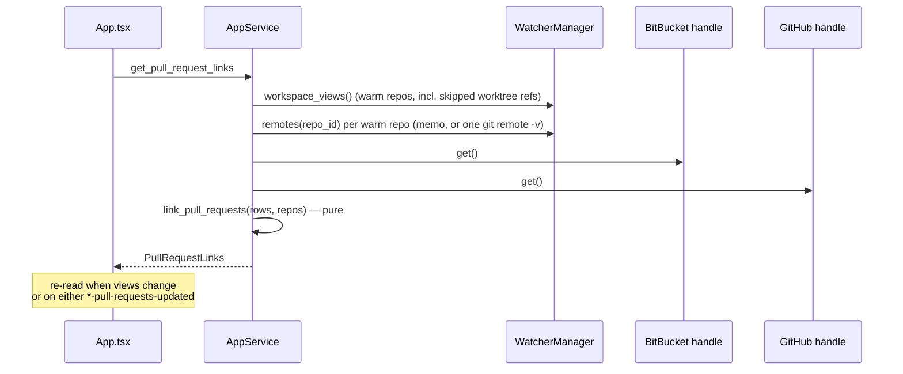
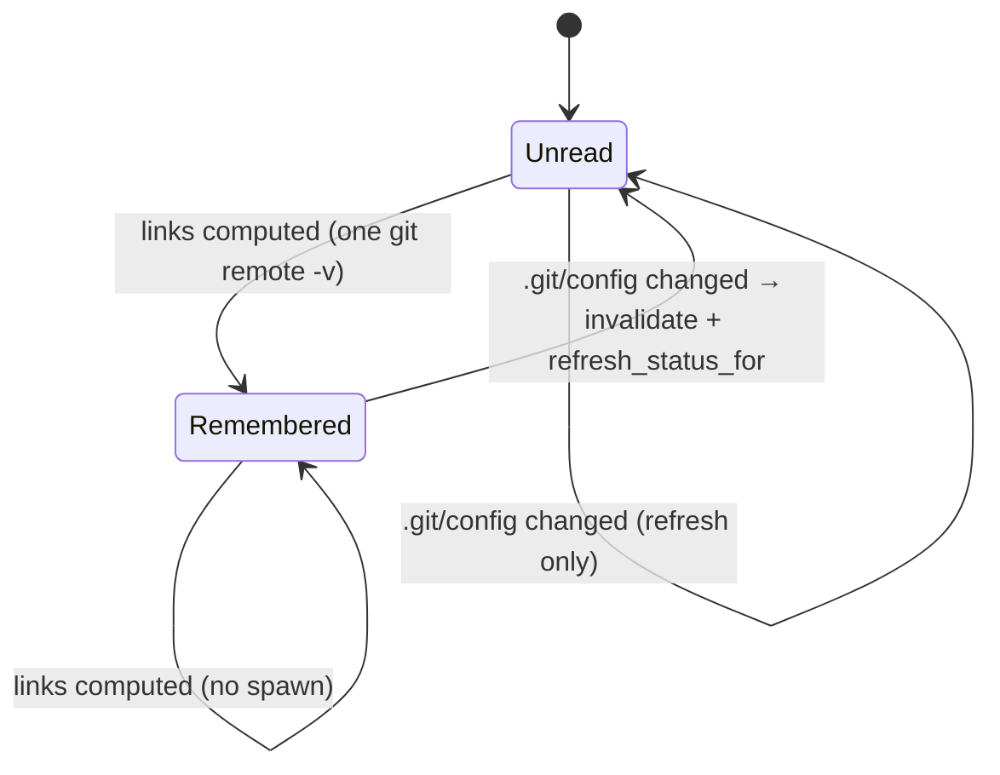
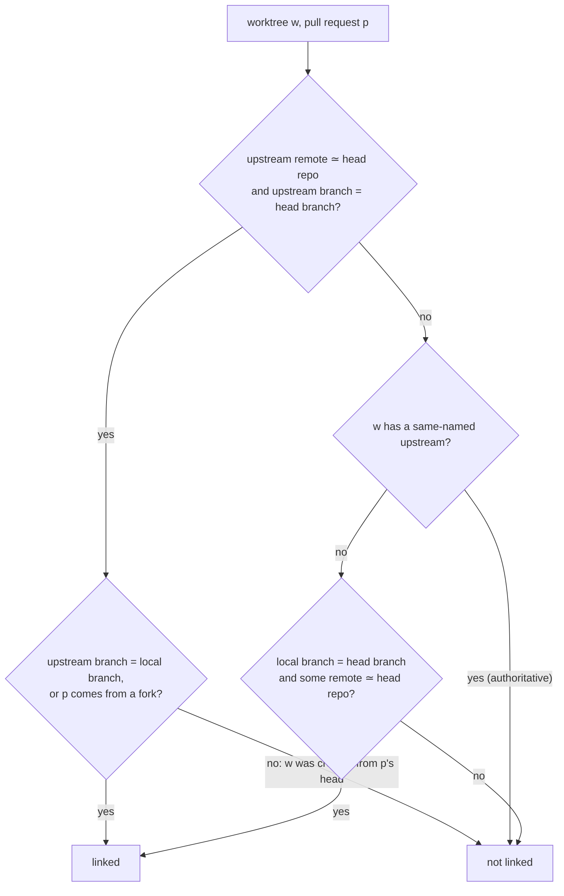
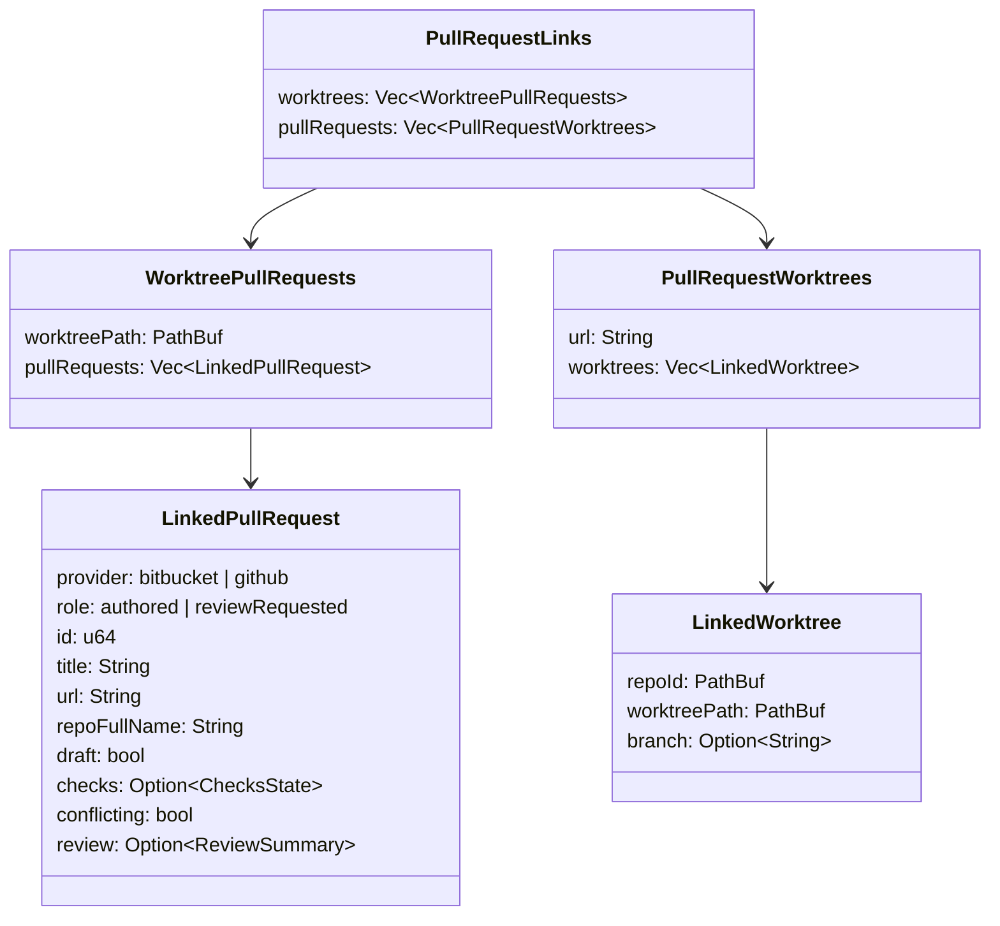
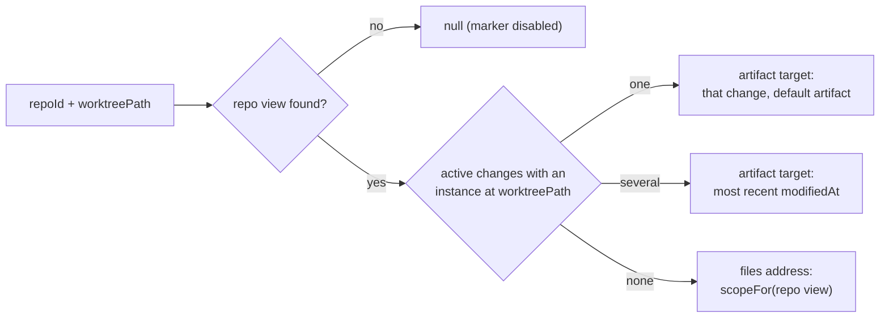

## Context

This change assumes `github-pull-requests-panel` has been applied and archived: the shared `PullRequestSummary` lives in `crates/openspec-app/src/pull_requests.rs`, `github.rs` exists with its constant query, and the BitBucket names carry the provider.

What SpecForge knows today, and where:

- **Worktrees and branches.** `git::worktree_list` discovers worktrees; the per-worktree `git status --porcelain=v2 --branch` behind `worktree_branch_and_status` yields each worktree's branch. `parse_status_porcelain_v2` reads `# branch.head` and explicitly ignores `# branch.upstream`, which the same invocation already prints. Internally `WorktreeSnapshot` holds the branch of **every** tracked worktree, but `build_repo_view` drops it: on the wire a branch reaches the frontend only through a `ChangeInstance`, so a worktree hosting no active change is a bare path in `RepoView.worktrees`. The registry tracks only worktrees with an `openspec/` directory.
- **Remotes.** Nothing reads a remote URL. A private `remotes()` lists remote *names* for commit-log decoration. `RepoMonitor` is installed for **every** registered repository, disabled or not, and has no view of the disabled flag; it classifies a change to `.git/config` *or* to anything under `refs/remotes/origin/` as the `default_branch` concern, and on that concern re-runs `git::default_branch` and invalidates the identity cache — emitting nothing.
- **The view cache has a contract.** `WatcherManager::workspace_views()` returns the cached `last_views`; a caller that emits `CacheEvent::Updated` must refresh that cache first, or subscribers re-read a stale snapshot. `refresh_status_for(&RepoId)` does both — a repo-scoped recompute through the aggregation that already keeps disabled repositories cold, then one `Updated` carrier.
- **Git invocations are counted.** `git_command` records every spawn in `invocation_log`; tests filter that log by arguments, and disabled ("cold") repositories must spawn none.
- **Joins happen in `openspec-app`.** `workspace_views()` joins presentation onto the watcher's views; `dashboard()` joins four sources. The pull-request pollers keep their snapshots in handles on `AppService`.
- **Navigation.** There is no worktree-level address. A change in a chosen worktree is reached through `goToArtifact(worktreePath, changeId, tab)` → `renderTargetToAddress`; the fallback for a repository is its pooled file browser. An address never contains a host path.
- **Controls.** A pull-request row is one `<button>` (desktop) or `<a>` (browser skin), so nothing interactive can live inside it. The header's change name is a copy control that shares a flex row with the non-focusable branch chip. The instance switcher's options are buttons; `SwitcherOption` is built both by `instanceOptions` and by `src/archiveCopies.ts`. A tree row's only nested control is the favorite star, by spec.

## Goals / Non-Goals

**Goals:**

- Link pull requests from both providers to tracked worktrees by a rule that is right for the common cases — pushed with or without tracking, checked-out forks, SSH aliases — and never links a local branch to a fork's same-named one, or a feature worktree to the shared branch it was created from.
- Show the link both ways: a pull-request chip in the change header and a marker in the instance switcher; a worktree marker on the pull-request row that navigates to the change.
- Add no network request, no credential and no new `CacheEvent` variant; read each warm repository's remotes once and remember them; never spawn anything for a disabled repository.
- Keep the matching logic in `openspec-app` and the URL parser in `openspec-core`, as pure, tested functions under the mutation gate.

**Non-Goals:**

- Tree-row markers; a worktree-level address; tracking worktrees without `openspec/`; reading `~/.ssh/config`; linking a renamed local branch to a same-repository pull request; a terminal surface; any change to the pollers' fetches beyond one head-repository field each.

## Decisions

### D1. Join in `openspec-app`, on read, as its own snapshot



`AppService::pull_request_links()` reads the two snapshots and the current views, asks the watcher for each warm repository's remotes, and calls the pure `pull_request_links::link_pull_requests`. The frontend holds the result in one hook in `App.tsx` and passes it to the detail pane and both panels.

*Rejected — join into `workspace_views()`, like presentation.* It would re-fetch the whole tree on every pull-request refresh, and it still would not give the panels their per-row worktrees, since a worktree without an active change has no place in the view payload.

*Rejected — join in TypeScript.* The frontend lacks the branch of change-less worktrees and every remote, and logic there sits outside the mutation gate.

*Rejected — a background recompute thread with its own `CacheEvent`.* The inputs already announce themselves: views re-read on repository events, snapshots announce their own updates. Re-reading a derived value when its inputs change needs no new variant in six matches.

### D2. Remotes read lazily on the warm path, remembered, forgotten on a config change

`git::remote_urls(&RepoId) -> Vec<Remote { name, url }>` runs `git --git-dir <common> remote -v` through `git_command` (so it is WSL-routed and counted) and keeps the `(fetch)` lines. `WatcherManager::remotes(&RepoId)` returns the memoised list, running `remote_urls` on a miss — on the model of the git-identity cache, with the same generation counter so an invalidation racing a read cannot re-install a stale list. The only caller is `pull_request_links()`, which only visits repositories present in `workspace_views()`, and disabled repositories are filtered out of those. A disabled repository therefore never reaches the reader.

`RepoMonitor` gains a `remotes` concern, classified on `path == config_path` only — not on `refs/remotes/origin/*`, which every fetch, pull and push touches. On that concern it calls `watcher.invalidate_remotes(&repo_id)` and then `watcher.refresh_status_for(&repo_id)`. The refresh honours the view-cache contract — recompute, then announce — and is what re-reads upstreams set through configuration alone (`git branch -u`, `git push -u`); for a disabled repository it goes through the cold aggregation and spawns nothing. The frontend re-fetches views on the announcement, which re-reads the links, which re-reads the remotes.



*Rejected — reading remotes when the monitor starts.* The monitor is installed for disabled repositories too and cannot tell them apart; it already spawns `git::default_branch` for them. A lazy reader on the warm path needs no disabled predicate and no re-enable trigger.

*Rejected — emitting `Updated` straight from the monitor.* `workspace_views()` would still return the pre-change cache; the contract on `WatcherManager::emit` exists to prevent exactly that.

*Rejected — reusing the `default_branch` concern.* It fires on every remote-tracking ref update, which would re-read remotes and refresh status on every fetch.

*Rejected — parsing `.git/config` directly.* It misses `include`/`includeIf` and `insteadOf` rewrites, which `git remote -v` applies.

*Rejected — `git remote get-url` per remote.* One spawn per remote instead of one per repository.

### D3. Upstreams from the status already read; split against remote names in the app

`parse_status_porcelain_v2` returns a `BranchState { head, upstream }` — `upstream` the raw `# branch.upstream` value — instead of the bare head, and `WorktreeSnapshot` carries it. Splitting `origin/mirror/feature` needs the remote names, since a remote name may contain `/`; the pure `split_upstream(raw, remote_names)` in `pull_request_links.rs` takes the longest remote name followed by `/`. A local upstream (`.`) matches no remote and yields none.

*Rejected — `git for-each-ref --format=%(upstream:remotename)` per repository.* It resolves the split exactly, but costs a spawn the status call makes unnecessary.

### D4. Worktree refs ride on `RepoView`, unserialised; remotes do not

`RepoView` gains `#[serde(default, skip_serializing)] worktree_refs: Vec<WorktreeRef { path, branch, upstream }>` for every tracked worktree, filled in `build_repo_view` from the `WorktreeSnapshot`s it already receives — the same attributes as the existing skipped `archived` and `disabled`. `WorktreeRef` derives what `RepoView` derives (`Serialize`, `Deserialize`, `Clone`, `Debug`, `PartialEq`, `Eq`). Remotes stay out of the view: they are read live from the watcher (D2), so a remote change never waits on a view recompute to be visible.

*Rejected — a separate `WatcherManager::worktree_facts()`.* A second walk over the same snapshots, kept in step with view assembly by hand.

*Rejected — serialising the refs.* No frontend consumer. Adding a skipped field still touches every `RepoView` literal in tests; each gains `worktree_refs: Vec::new()`.

### D5. Parsing a remote URL to an identity

`git::parse_remote_url(url) -> Option<RemoteIdentity { transport, host, path }>` is pure and lives in `openspec-core` beside the reader:

| Form | Example | Transport | Host | Path |
|---|---|---|---|---|
| scp-like | `git@github.com:Acme/Api.git` | SSH | `github.com` | `acme/api` |
| `ssh://` | `ssh://git@github.com:22/acme/api` | SSH | `github.com` | `acme/api` |
| `https://` | `https://user@bitbucket.org/acme/api/` | HTTPS | `bitbucket.org` | `acme/api` |
| alias | `git@github-work:acme/api.git` | SSH | `github-work` | `acme/api` |
| local | `/srv/git/api.git`, `file://…` | — | — | — |

Host and path are lower-cased; a trailing `.git` and `/` are dropped; a path that is not exactly two segments has no identity.

### D6. The matching rule, and the two false positives it is shaped against

$$\text{linked}(w,p) \iff \big(u_w \ne \varnothing \wedge \iota(u_w.\text{remote}) \simeq H_p \wedge u_w.\text{branch} = b_p \wedge (u_w.\text{branch} = \beta_w \vee H_p \ne B_p)\big) \vee \big(\beta_w = b_p \wedge (u_w = \varnothing \vee u_w.\text{branch} \ne \beta_w) \wedge \exists r \in R: r \simeq H_p\big)$$



The two false positives:

1. **A fork's same-named branch.** A contributor's pull request from their fork's `main` into `acme/api` must not link the maintainer's own `main` worktree. The branch-name rule therefore compares only against the head repository, and a same-named upstream (`main` tracking `origin/main`) is authoritative: it already says where the branch lives.
2. **The branch a worktree was created from.** `git worktree add -b feature ../wt origin/develop` sets `feature`'s upstream to `origin/develop` (`branch.autoSetupMerge` defaults on). A plain upstream rule would link every such feature worktree to the open `develop → main` release pull request. The upstream rule therefore requires a same-named upstream, or a pull request from another repository — the case where a checked-out fork's local branch is legitimately named differently.

The cost is one case that no longer links: a same-repository pull request checked out under a different local name (`wip` tracking `origin/feature`). It is rare, deliberate, and stated as a non-goal.

The host rule treats `github.com`/`ssh.github.com` and `bitbucket.org`/`altssh.bitbucket.org` as known. An SSH remote on any other host is taken to be an alias and matches on path alone; an HTTPS remote on another host — GitLab, an enterprise server — never agrees. The remaining false positive, the same `owner/name` on both providers reached through an alias, requires a developer to host the same-named repository on both.

`link_pull_requests(rows, repos) -> PullRequestLinks` evaluates every pair — both inputs are small (at most 150 rows; worktrees in the tens) — and orders results as the spec states: main worktrees first, then by path.

*Rejected — matching on branch name and destination repository.* Simpler, and wrong for forks in exactly case 1.

*Rejected — an unrestricted upstream rule.* Wrong in exactly case 2, on every gitflow repository.

*Rejected — reading `~/.ssh/config` to resolve aliases.* It reaches outside the repository into the user's SSH setup, and `Include`/`Match` blocks make faithful resolution a project of its own.

### D7. The links snapshot on the wire



Pull requests are keyed by web URL: the providers' URLs never collide, and `github-pull-requests-panel` already drops a review-requested row that duplicates an authored one, so a URL is unique across both snapshots. A row without a URL links nothing. Paths cross IPC as `ChangeInstance.worktreePath` already does; the frontend never puts them in an address.

`get_pull_request_links` is served on both transports: it reads in-memory state (plus, at most, one local `git remote -v` per warm repository) and has no host-side effect, unlike `open_pull_request`.

### D8. The header chip, the switcher marker, and the restructured row

- **Header.** `DetailPane` receives the links; `ChangeHeader` renders `PullRequestChip`s as siblings after the branch chip — never inside `CopyableIdentity` — up to two, then a passive `+N`. On the desktop a chip is a `<button>` calling `openPullRequest(url)`; in the browser skin an `<a target="_blank" rel="noopener noreferrer">`. It reuses the panel's checks dot, conflict chip and draft treatment, in neutral ink.
- **Switcher.** `SwitcherOption` (`src/changeNavigation.ts`) gains `pullRequests: number[]`; `instanceOptions` fills it and `src/archiveCopies.ts` sets it to `[]` (the read-only form shows no marker); `SwitcherControl` renders a passive `#n` / `+N` span and folds the numbers into the control's accessible name.
- **Row.** Each `<li>` becomes a two-column grid: the existing row control, unchanged, and — when linked — a sibling `<button className="pull-request-worktree">` showing the branch or basename. The marker's handler is supplied by `App.tsx`.

```svg
<svg viewBox="0 0 300 70" xmlns="http://www.w3.org/2000/svg" font-family="system-ui" font-size="11">
  <rect x="4" y="4" width="226" height="62" rx="4" fill="none" stroke="currentColor"/>
  <text x="12" y="20" opacity="0.7">acme/api</text>
  <text x="12" y="36">Add a rate-limit middleware</text>
  <text x="12" y="54" opacity="0.7">rate-limit → main   ✓1 ✗0 ○0</text>
  <rect x="236" y="22" width="60" height="26" rx="4" fill="none" stroke="currentColor"/>
  <text x="244" y="39">⤷ rate-limit</text>
  <text x="60" y="20" opacity="0.5" font-size="9">row control: opens the PR</text>
  <text x="228" y="62" opacity="0.5" font-size="9">marker: opens the worktree</text>
</svg>
```

*Rejected — a clickable marker inside the row's `<button>`/`<a>`.* Interactive content inside interactive content is invalid HTML and unreachable by keyboard.

*Rejected — making the switcher marker a control.* The option is already a button; a nested control would be invalid, and switching instance is what the option is for.

### D9. Where the marker lands

`src/pullRequestLinks.ts` exports a pure `worktreeDestination(views, repoId, worktreePath)`:



`App.tsx` turns an artifact target into navigation through the existing `goToArtifact` (which adds the instance token) and a files destination through `go`. The function is unit-tested with `bun test`.

*Rejected — a new worktree-level address.* It would need a grammar segment, cold-load resolution and history rules, all to serve a fallback the repository file browser already covers.

## Risks / Trade-offs

- **Spawn accounting** → the existing spawn-count tests filter by arguments (`status`, `config`, log formats) and do not see `remote -v`; a dedicated test pins that links computed twice spawn one `remote -v`, that a disabled repository spawns none even after its config changes, and that a fetch spawns none.
- **A config change now refreshes status** → one repo-scoped `git status` sweep per `.git/config` write, which git performs on `branch -u`, `push -u`, `remote set-url` and branch creation with tracking — rare next to the index writes that already trigger the same sweep.
- **The `.git/config` watch did not survive git's rename-on-write on Linux** → git replaces `config` (and `HEAD`, `packed-refs`, `index`) by renaming `<name>.lock` over it, and an inotify watch on the file follows the replaced inode, so a per-file watch goes deaf after the first rewrite. The monitor therefore watches the git dir itself, non-recursively, and classifies by path as before; the lock-file churn the directory watch now also sees classifies to no concern. `logs/HEAD` keeps its own file watch, since git appends to it in place. This fixes default-branch refresh on Linux too. Linux CI runs the two-round `set-url` test that pins it.
- **A contributor's worktree created from their fork's branch links to a pull request from that branch** → in a clone whose `origin` is the contributor's fork, `git worktree add -b fix ../wt origin/main` tracks `origin/main`; an open pull request from the fork's `main` into the parent then satisfies the upstream rule's from-fork allowance (`H_p ≠ B_p`), which exists so a checked-out fork branch under another local name links. It is case 2 seen from the fork side, and the spec accepts it: opening a pull request from a fork's default branch is uncommon, and removing the allowance breaks the legitimate case.
- **`gh pr checkout` of a fork's pull request does not link** → for a fork, `gh` records the head repository's URL as `branch.<name>.remote` instead of adding a named remote, so the branch has no resolvable upstream and no remote agrees with the head repository. Adding the fork as a named remote (`gh repo fork`'s default, or `git remote add`) makes it link. A same-repository `gh pr checkout` tracks `origin` and links normally.
- **An SSH alias for one provider shadows the other** → accepted as described in D6; HTTPS remotes on other hosts never agree.
- **Nested remote names split ambiguously** → the longest-prefix rule picks the most specific; git discourages such names and the case is tested.
- **A same-repository pull request checked out under another name does not link** → the price of excluding case 2; a non-goal.
- **A branch switch links a beat late** → the link follows the status refresh that already announces the branch change, typically within a second.
- **Several active changes in one worktree** → the marker lands on the most recently modified; the header chip still appears on every change in that worktree, so the others are one click away.
- **Two clones of the same repository** → both link; main worktrees first, then path order; the tooltip names both.
- **Worktrees without `openspec/` are untracked** → a pull request checked out only there does not link; widening registry tracking changes spawn budgets and tree contents.
- **Frontend logic outside the mutation gate** → kept to `worktreeDestination` and rendering; the matching rule, the URL parser and the upstream split are Rust and gated.

## Migration Plan

No persisted state changes. `RepoView`'s wire shape is unchanged; the new field is skipped. `PullRequestSummary` gains `sourceRepoFullName`, an additive wire key, and GitHub's constant query gains one field, so its query-constant test is updated in the same commit. Rollback is a revert.

## Open Questions

- Should the tree's change row show a passive pull-request marker too? It is where a worktree's branch chip already sits, but it needs a delta to *Two-Line Sole-Change-Row Layout* and is left for a follow-up once the header chip has been lived with.
