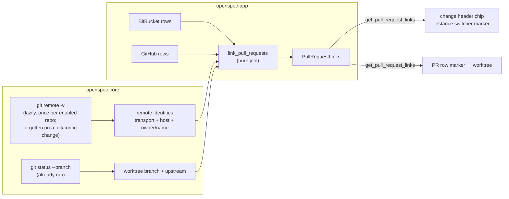

# Link Pull Requests to the Worktrees They Come From

## Why

SpecForge knows every worktree a developer has checked out and, since the BitBucket and GitHub panels, every pull request they have open or are asked to review — but it never connects the two. The change a developer is reading has no hint that its branch already has a pull request with failing checks, and a pull request in the panel has no way back to the worktree where its change lives. Both answers are already on the machine; this change joins them.

## What Changes

A local, read-only join between the pull-request snapshots and the repositories SpecForge tracks, shown in both directions: a pull-request chip on the change header (and a marker in its instance switcher), and a worktree marker on each linked pull-request row that navigates to the change in that worktree. It needs no network and no new credential.

- **Remote identities, read lazily.** The first time links are computed for a repository that is not disabled, its remotes are read with one `git remote -v` — the URLs as git resolves them, `insteadOf` rewrites included — parsed to a transport, host and `owner/name`, and remembered. A disabled repository never reaches the reader. A change to the repository's `.git/config` (and only that — not the ref updates every fetch makes) forgets the remembered remotes and refreshes the repository's status through the existing announce path, so a changed remote, and an upstream set by `git branch -u` or `git push -u`, take effect without a restart.

- **Upstreams for free.** The per-worktree `git status --porcelain=v2 --branch` SpecForge already runs reports the branch's upstream; it is recorded instead of discarded. No additional git invocation.

- **Rows name their head repository.** BitBucket rows gain the source repository (`source.repository.full_name`) and GitHub rows the head repository (`headRepository.nameWithOwner`), so a pull request from a fork is matched against the fork.

- **One matching rule, shaped against two false positives.** A worktree links to a pull request when its upstream is the pull request's head branch on a remote pointing at the head repository — provided the upstream has the worktree branch's own name, or the pull request comes from a fork — or, when it has no same-named upstream, when its branch has the head branch's name and some remote points at the head repository. So a maintainer's `main` never links to a contributor's fork `main`, and a feature worktree created from `develop` never links to the `develop → main` release pull request. Known hosts must agree; an SSH remote on an unrecognised host (an alias) matches on `owner/name` alone. Links are many-to-many and ordered deterministically.

- **A links snapshot, joined on read.** `get_pull_request_links` returns, per worktree, the pull requests linked to it, and per pull request, the worktrees linked to it — computed in `openspec-app` from the current snapshots, repository data and remembered remotes, on both transports. Frontends re-read it when the workspace views or either pull-request snapshot change.

- **Worktree to pull request.** The change header shows a chip per linked pull request after the branch chip — `#number` with its draft, checks and conflict signals — which opens the pull request exactly as a panel row does. Each instance in the instance switcher carries a passive `#number` marker.

- **Pull request to worktree.** A linked row in either panel gains a marker beside it, naming the worktree, that navigates to the change in that worktree: its default artifact when the worktree hosts one active change, the most recently modified one's when it hosts several, and the repository's file browser when it hosts none.

## Capabilities

### New Capabilities

- `pull-request-worktree-links`: remote identities and when they are read, recorded upstreams, the head repository on pull-request rows, the matching rule, the links snapshot and its freshness, and the pull-request row's worktree marker and where it navigates.

### Modified Capabilities

- `spec-browser`: adds *Pull-Request Chip in the Change Header* and *Pull-Request Marker in the Instance Switcher*. The identity row, the switcher and the tree are otherwise unchanged.

## Impact

**Depends on `github-pull-requests-panel`** — its shared `pull_requests.rs` row type, its `github.rs`, its URL de-duplication and its renames. Apply after that change is archived.

- `crates/openspec-core/src/git.rs`: `remote_urls(&RepoId)` (one `git remote -v`, through `git_command`, WSL-routed like every other call) and a pure `parse_remote_url`; `parse_status_porcelain_v2` records `# branch.upstream`.
- `crates/openspec-core/src/watcher.rs`: `WatcherManager::remotes(&RepoId)` — a memo with a generation guard on the git-identity cache's model — and `invalidate_remotes(&RepoId)`.
- `crates/openspec-core/src/repo_monitor.rs`: a `remotes` concern classified on `.git/config` only, which invalidates the memo and calls `refresh_status_for`. No new `CacheEvent` variant.
- `crates/openspec-core/src/repo_view.rs`: `WorktreeSnapshot` carries the upstream; `RepoView` gains one `#[serde(default, skip_serializing)]` field, every tracked worktree's branch and upstream. The wire shape is unchanged.
- `crates/openspec-app/src/pull_request_links.rs` (new): the pure join, upstream splitting and host rule. `pull_requests.rs` gains `source_repo_full_name`; `bitbucket.rs` and `github.rs` fill it (GitHub's constant query gains `headRepository { nameWithOwner }`).
- `crates/openspec-app/src/service.rs`: `pull_request_links()`.
- `crates/openspec-app/tests/wire_shape.rs`: the links snapshot and the row's new key.
- `crates/specforge/src/commands.rs`, `lib.rs`, `crates/specforge-web/src/dispatch.rs`: `get_pull_request_links` on both transports (a read with no host effect).
- `src/types.ts`, `src/api.ts`, `src/pullRequestLinks.ts` (new, pure destination logic), `src/App.tsx`, `src/components/DetailPane.tsx`, `src/changeNavigation.ts`, `src/archiveCopies.ts`, `src/components/PullRequestPanel.tsx`, `src/App.css`: the hook, the header chip, the switcher marker, the restructured row with its marker.
- Tests: a dedicated spawn test — links computed twice spawn one `remote -v`; a disabled repository spawns none, even after a config rewrite; a fetch spawns none. The existing spawn-count assertions filter by other arguments and are unaffected.

**Deliberately unchanged.** No network request and no credential: the join reads only data SpecForge already holds, plus one local `git remote -v` per enabled repository. No marker on workspace-tree rows — the tree's favorite toggle stays its only nested control; a passive tree marker can follow separately. No worktree-level address: navigation lands on a change or on the repository's file browser. No tracking of worktrees without an `openspec/` directory. No linking of a same-repository pull request checked out under a different local branch name. No reading of `~/.ssh/config`. No change to the pull-request panels' fetch recipes beyond the one head-repository field each. No TUI surface.
